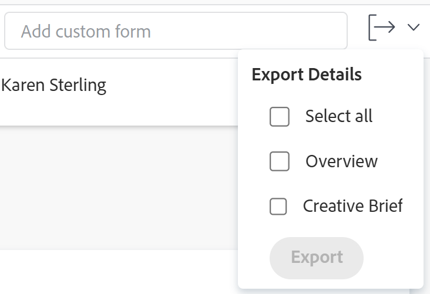

# Exporter les formulaires personnalisés et les détails des objets

<!--Audited: 10/2025-->

Vous pouvez exporter la vue d’ensemble et les informations sur les formulaires personnalisés depuis la section Détails d’un objet vers un fichier PDF. Vous pouvez ensuite imprimer ou partager le PDF avec d’autres utilisateurs et utilisatrices.

Cette fonctionnalité est prise en charge pour les objets suivants :

* Projets
* Tâches
* Problèmes
* Portfolio
* Programmes

<!--
* Billing records
 
After you open a billing record on a project, you can use the Details area to attach a custom form to the record and fill it out. You can also export billing record information from the Details area.
 </li>
  -->

>[!NOTE]
>
>Les champs de la section Détails que votre administrateur ou administratrice Workfront ou de groupes a supprimés à l’aide d’un modèle de mise en page ne s’affichent pas.

## Conditions d’accès

+++ Développez pour afficher les exigences d’accès aux fonctionnalités de cet article.

<table style="table-layout:auto"> 
 <col> 
 <col> 
 <tbody> 
  <tr> 
   <td role="rowheader"> 
Package Adobe Workfront
 </td> 
   <td>Tous</td> 
  </tr> 
  <tr> 
   <td role="rowheader"> 
Licence Adobe Workfront
 </td> 
   <td>
Pour les problèmes :

   <ul><li>
Contributeur ou version ultérieure
</li>
   <li>
Demandeur ou supérieur
 </li></ul>
   
Pour les projets et les tâches :

   <ul><li>
Léger ou supérieur
</li>
   <li>
Réviseur ou supérieur
</li></ul>
    </td> 
  </tr> 
  <tr> 
   <td role="rowheader">Configurations des niveaux d’accès</td> 
   <td> 
Affichage ou niveau supérieur pour les projets, les tâches et les événements
  </td> 
  </tr> 
  <tr> 
   <td role="rowheader"> 
Autorisations d’objet
 </td> 
   <td> 
Autorisations d’affichage ou supérieures pour le projet, la tâche ou le problème dont vous souhaitez exporter le formulaire
 </td> 
  </tr> 
 </tbody> 
</table>

Pour plus d’informations, voir [Conditions d’accès requises dans la documentation Workfront](/help/quicksilver/administration-and-setup/add-users/access-levels-and-object-permissions/access-level-requirements-in-documentation.md).

+++

<!--Old:
<table style="table-layout:auto"> 
 <col> 
 <col> 
 <tbody> 
  <tr> 
   <td role="rowheader"> 
Adobe Workfront plan*
 </td> 
   <td>Any</td> 
  </tr> 
  <tr> 
   <td role="rowheader"> 
Adobe Workfront license*
 </td> 
   <td> 
Request or higher for issues
 
Review or higher for projects and tasks
 </td> 
  </tr> 
  <tr data-mc-conditions=""> 
   <td role="rowheader"><strong>Access level configurations*</strong> </td> 
   <td> 
View or higher for Projects, Tasks, and Issues
 
Note: If you still don't have access, ask your Workfront administrator if they set additional restrictions in your access level. For information on how a Workfront administrator can change your access level, see <a href="../../administration-and-setup/add-users/configure-and-grant-access/create-modify-access-levels.md" class="MCXref xref">Create or modify custom access levels</a>.
 </td> 
  </tr> 
  <tr data-mc-conditions=""> 
   <td role="rowheader"> 
Object permissions
 </td> 
   <td> 
View or higher permissions to the project, task, or issue whose form you want to export
 
For information on requesting additional access, see <a href="../../workfront-basics/grant-and-request-access-to-objects/request-access.md" class="MCXref xref">Request access to objects </a>.
 </td> 
  </tr> 
 </tbody> 
</table>-->

## Conditions préalables

Avant de commencer :

1. Un formulaire personnalisé doit avoir été créé pour un objet spécifique à partir duquel vous souhaitez l’exporter.
1. Le formulaire personnalisé doit être joint à l’objet.

   Ou

   Vous devez disposer des droits d’accès appropriés pour joindre un formulaire personnalisé et modifier les informations contenues dans le formulaire.

Pour plus d’informations sur la création de formulaires personnalisés, voir [Créer un formulaire personnalisé](/help/quicksilver/administration-and-setup/customize-workfront/create-manage-custom-forms/form-designer/design-a-form/design-a-form.md).

Pour plus d’informations sur l’association de formulaires à des objets, consultez [Ajouter un formulaire personnalisé à un objet](../../workfront-basics/work-with-custom-forms/add-a-custom-form-to-an-object.md).

## Exporter des informations depuis la section Détails

L’exportation d’informations depuis la section Détails d’un objet est identique pour tous les objets dans lesquels cette fonctionnalité est prise en charge.

1. Accédez à un projet, une tâche, un portfolio, un programme ou un problème pour lequel vous disposez au moins des autorisations Affichage.
1. Cliquez sur l’**élément « Détails »** dans le panneau de gauche, par exemple **Détails de la tâche**.
1. (Facultatif) Si aucun formulaire personnalisé n’est joint à l’objet, commencez à saisir le nom d’un formulaire personnalisé dans le champ **Ajouter un formulaire personnalisé**, puis cliquez dessus lorsqu’il apparaît dans la liste.

   Vous pouvez ajouter jusqu’à 10 formulaires.

1. (Facultatif) Mettez à jour les informations dans la section Détails, puis cliquez sur **Enregistrer les modifications**.
1. Cliquez sur le menu déroulant **Exporter** dans le coin supérieur droit, sélectionnez **Vue d’ensemble** ou les formulaires à exporter, puis cliquez sur **Exporter**.

   Vous pouvez également sélectionner **Tout sélectionner** si vous souhaitez exporter la zone Vue d’ensemble et tous les formulaires personnalisés.

   

   >[!TIP]
   >
   >Les scénarios suivants sont possibles :
   >
   >   * Lorsque votre administrateur ou administratrice de groupes ou Workfront désélectionne tous les champs de la zone Vue d’ensemble et que des formulaires personnalisés sont joints à l’objet, la section Vue d’ensemble ne s’affiche pas.
   >   * Lorsque votre administrateur ou administratrice de groupes ou Workfront désélectionne tous les champs de la zone Vue d’ensemble et qu’aucun formulaire personnalisé n’est joint à l’objet, le menu déroulant Exporter n’est pas visible.
   >   * Si aucun formulaire personnalisé n’est joint à l’objet, vous pouvez uniquement exporter la zone Vue d’ensemble.
   >   * Les champs personnalisés qui se trouvent derrière une logique et ne sont pas visibles sur le formulaire ne sont pas exportés. Pour plus d’informations sur l’ajout d’une logique à un formulaire personnalisé, voir [Ajouter des règles de logique aux formulaires et champs personnalisés](/help/quicksilver/administration-and-setup/customize-workfront/create-manage-custom-forms/form-designer/design-a-form/display-skip-logic-form-designer.md).

   Un fichier PDF est produit et téléchargé sur votre ordinateur. Le fichier PDF contient les informations suivantes :

   * Le nom de l’objet auquel le formulaire est associé.
   * Le nom de l’utilisateur ou de l’utilisatrice qui a exporté le PDF.
   * La date et l’heure de production du PDF.
   * Le nom des formulaires que vous avez exportés.
   * Les informations des champs renseignés sur le formulaire.
