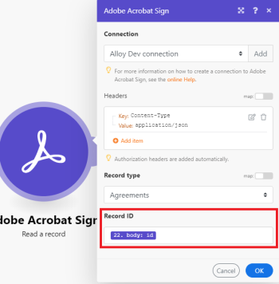

# Modules [!DNL Adobe Acrobat Sign]

Avec les modules [!DNL Adobe Acrobat Sign], vous pouvez démarrer un scénario [!DNL Adobe Workfront Fusion] basé sur les événements de votre compte [!DNL Adobe Acrobat Sign], créer, lire ou mettre à jour des accords et d’autres enregistrements, rechercher des enregistrements à l’aide de critères que vous définissez et télécharger des documents.

## Conditions d’accès

Pour utiliser les fonctionnalités décrites dans cet article, vous devez disposer des éléments suivants :

<table style="table-layout:auto"> 
 <col> 
 <col> 
 <tbody> 
  <tr> 
   <td role="rowheader">[!DNL Adobe Workfront] forfait*</td>
  <td> 
[!UICONTROL Pro] ou un forfait supérieur
 </td>
  </tr> 
  <tr data-mc-conditions=""> 
   <td role="rowheader">[!DNL Adobe Workfront] licence*</td>
   <td> 
[!UICONTROL Plan], [!UICONTROL Work]
 </td> 
  </tr> 
  <tr> 
   <td role="rowheader">[!DNL Adobe Workfront Fusion] licence**</td> 
   <td>
   
Exigences de licence actuelle : aucune exigence de licence [!DNL Workfront Fusion]

   
Ou

   
Exigence de licence héritée : [!UICONTROL [!DNL Workfront Fusion] for Work Automation and Integration] 

   </td>  
  </tr> 
  <tr> 
   <td role="rowheader">Produit</td> 
   <td>
   
Exigences du produit actuel : si vous disposez du forfait [!DNL Adobe Workfront] [!UICONTROL Select] ou [!UICONTROL Prime], votre entreprise doit acheter [!DNL Adobe Workfront Fusion] et [!DNL Adobe Workfront] pour utiliser les fonctionnalités décrites dans cet article. [!DNL Workfront Fusion] est inclus dans le forfait [!DNL Workfront] [!UICONTROL Ultimate].

   
Ou

   
Exigences du produit hérité : votre entreprise doit acheter [!DNL Adobe Workfront Fusion] et [!DNL Adobe Workfront] pour utiliser les fonctionnalités décrites dans cet article.

   </td> 
  </tr> 
 </tbody> 
</table>

Pour connaître la formule, le type de licence ou l’accès dont vous disposez, contactez vote administrateur ou administratrice [!DNL Workfront].

Pour plus d’informations sur les licences [!DNL Adobe Workfront Fusion], consultez les [[!DNL Adobe Workfront Fusion] licences](../../workfront-fusion/get-started/license-automation-vs-integration.md).

## [!DNL Adobe Acrobat Sign] recommandations d’utilisation du connecteur

L’application [!DNL Adobe Sign] rend l’automatisation des processus d’entreprise eSignature dans [!DNL Fusion] beaucoup plus facile et puissant.

Les nouveaux utilisateurs de [!DNL Adobe Sign] doivent prêter une attention particulière à certaines des contraintes liées à la mise à jour des accords. Les accords ne sont généralement pas modifiés une fois démarrés. Nous recommandons aux nouveaux utilisateurs de [!DNL Adobe Sign] de se concentrer sur la création de nouveaux accords à l’aide du module de création des accords. Cela rendra les [!DNL Fusion] automatisations plus faciles et fonctionnera mieux avec [!DNL Adobe Sign].

[!DNL Adobe Sign] accords ont besoin d’un champ de travail. Il existe certaines options pour ce faire, mais le plus simple et le plus courant est de télécharger un document transitoire, puis de mapper ce document à votre accord.

## Modules [!DNL Adobe Acrobat Sign] et leurs champs

Lorsque vous configurez des modules [!DNL Adobe Acrobat Sign], [!DNL Workfront Fusion] affiche les champs répertoriés ci-dessous. Des champs [!DNL Adobe Acrobat Sign] supplémentaires peuvent également s’afficher, en fonction des facteurs tels que votre niveau d’accès dans l’application ou le service. Un titre en gras dans un module indique un champ obligatoire.

Si le bouton de mappage situé au-dessus d’un champ ou d’une fonction s’affiche, vous pouvez l’utiliser pour définir des variables et des fonctions pour ce champ. Pour plus d’informations, consultez [Mapper les informations d’un module à un autre dans  [!DNL Adobe Workfront Fusion]](../../workfront-fusion/mapping/map-information-between-modules.md).

* [Déclencheurs](#triggers)
* [Actions](#actions)
* [Recherches](#searches)

### Déclencheurs

<!--
* [Watch for agreements](#watch-for-agreements) 
* [Watch for events](#watch-for-events)
-->

+++ **[!UICONTROL Surveiller les accords]**

Ce module de déclenchement lance un scénario lorsqu’un accord est créé ou mis à jour.

<table style="table-layout:auto"> 
 <col> 
 <col> 
 <tbody> 
  <tr> 
   <td role="rowheader">[!UICONTROL Connection]</td> 
<td>Pour obtenir des instructions sur la connexion de votre compte [!DNL Adobe Acrobat Sign] à [!DNL Workfront Fusion], voir <a href="../../workfront-fusion/connections/connect-to-fusion-general.md" class="MCXref xref">Création d'une connexion à [!DNL Adobe Workfront Fusion] - Instructions de base</a></td>  </tr> 
  <tr> 
   <td role="rowheader">[!UICONTROL Filter]</td> 
   <td>Indiquez si vous souhaitez rechercher de nouveaux enregistrements, des enregistrements mis à jour ou les deux.</td> 
  </tr> 
  <tr> 
   <td role="rowheader">[!UICONTROL Type d’enregistrement] </td> 
   <td>Sélectionnez le type d’enregistrement que vous souhaitez voir pour l’enregistrement.</td> 
  </tr> 
  <tr> 
   <td role="rowheader">[!UICONTROL Rechercher du texte]</td> 
   <td> 
Saisissez les termes à rechercher. Le module renvoie les enregistrements qui incluent ces termes sous la forme de valeurs de champ.
 
Pour plus d’informations sur la recherche de champs dans [!DNL Adobe Acrobat Sign], voir "Fonctionnement de la recherche de texte" dans <a href="https://helpx.adobe.com/sign/using/adobesign-search-users-agreements.html#HowSearchWorks">Recherche Adobe Sign - Fonctionnement</a>.
 </td> 
  </tr> 
  <tr> 
   <td role="rowheader">[!UICONTROL Nombre maximal de contrats renvoyés]</td> 
   <td> 
Saisissez ou mappez le nombre maximal d’enregistrements que le module doit renvoyer pour chaque cycle d’exécution du scénario.
 </td> 
  </tr> 
 </tbody> 
</table>

+++

+++ **[!UICONTROL Surveiller les événements]**

Ce module de déclenchement lance un scénario lorsqu’un événement que vous sélectionnez se produit.

<table style="table-layout:auto"> 
 <col> 
 <col> 
 <tbody> 
  <tr> 
   <td role="rowheader">[!UICONTROL Webhook]</td> 
   <td>Sélectionnez le webhook que vous souhaitez utiliser ou cliquez sur <b>[!UICONTROL Ajouter]</b> et renseignez les champs suivants.</td> 
  </tr> 
  <tr> 
   <td role="rowheader">[!UICONTROL Webhook name]</td> 
   <td> 
Saisissez le nom du webhook.
 </td> 
  </tr> 
  <tr> 
   <td role="rowheader">[!UICONTROL Connection]</td> 
   <td> 
Pour obtenir des instructions sur la connexion de votre compte [!DNL Adobe Acrobat Sign] à [!DNL Workfront Fusion], voir <a href="../../workfront-fusion/connections/connect-to-fusion-general.md" class="MCXref xref">Création d'une connexion à [!DNL Adobe Workfront Fusion] - Instructions de base</a>
 </td> 
  </tr> 
  <tr> 
   <td role="rowheader">Portées [!UICONTROL]</td> 
   <td> 
    <ul> 
     <li> 
[!UICONTROL Compte]
 </li> 
     <li> 
[!UICONTROL Group]
 </li> 
     <li> 
[!UICONTROL User]
 </li> 
     <li> 
[!UICONTROL Resource]
 
Si vous sélectionnez [!UICONTROL Resource], saisissez l’ID de ressource et le type de ressource.
 </li> 
    </ul> </td> 
  </tr> 
  <tr> 
   <td role="rowheader">[!UICONTROL Niveau de ressource]</td> 
   <td> 
Sélectionnez le type de ressource à regarder.
 
    <ul> 
     <li> 
[!UICONTROL Accords]
 </li> 
     <li> 
[!UICONTROL Widgets]
 </li> 
     <li> 
[!UICONTROL Megasignes]
 </li> 
     <li> 
[!UICONTROL Documents de bibliothèque]
 </li> 
    </ul> </td> 
  </tr> 
  <tr> 
   <td role="rowheader">[!UICONTROL Événements d’abonnement Webhook]</td> 
   <td>Sélectionnez les événements [!DNL Adobe Sign] que le module doit surveiller.</td> 
  </tr> 
  <tr> 
   <td role="rowheader">[!UICONTROL Nom d’affichage de l’application]</td> 
   <td>Nom d’affichage de l’application par laquelle le webhook est créé.</td> 
  </tr> 
  <tr> 
   <td role="rowheader">[!UICONTROL Nom de l’application]</td> 
   <td>Nom d’affichage de l’application par laquelle le webhook est créé.</td> 
  </tr> 
  <tr> 
   <td role="rowheader">[!UICONTROL Emails de notification de problème]</td> 
   <td> 
Ce paramètre fonctionne uniquement pour les comptes d’administrateur.
 
Pour chaque adresse électronique à laquelle vous souhaitez envoyer des courriers électroniques de notification de problème, cliquez sur <b>[!UICONTROL Ajouter]</b> et saisissez l’adresse électronique.
 </td> 
  </tr> 
  <tr> 
   <td role="rowheader">[!UICONTROL Paramètres conditionnels de l’accord]</td> 
   <td>Si vous souhaitez ajouter des paramètres conditionnels, sélectionnez <b>[!UICONTROL Oui]</b> sur le type d’enregistrement auquel vous souhaitez ajouter des paramètres, puis sélectionnez <b>[!UICONTROL Oui]</b> sur les paramètres que vous souhaitez activer.</td> 
  </tr> 
 </tbody> 
</table>

+++

### Actions

<!--
* [Create a record](#create-a-record) 
* [Create an agreement](#create-an-agreement) 
* [Create related records](#create-related-records) 
* [Custom API Call](#custom-api-call) 
* [List records](#list-records) 
* [Read a record](#read-a-record) 
* [Read related records](#read-related-records) 
* [Update a record](#update-a-record) 
* [Update related record](#update-related-record) 
* [Upload document](#upload-document)
-->

+++ **[!UICONTROL Créer un enregistrement]**

Ce module d&#39;action crée un nouvel enregistrement du type sélectionné.

<table style="table-layout:auto"> 
 <col> 
 <col> 
 <tbody> 
  <tr> 
   <td role="rowheader">[!UICONTROL Connection]</td> 
   <td>Pour obtenir des instructions sur la connexion de votre compte [!DNL Adobe Acrobat Sign] à [!DNL Workfront Fusion], voir <a href="../../workfront-fusion/connections/connect-to-fusion-general.md" class="MCXref xref">Création d'une connexion à [!DNL Adobe Workfront Fusion] - Instructions de base</a></td> 
  </tr> 
  <tr> 
   <td role="rowheader">[!UICONTROL Headers]</td> 
   <td>Ajoutez les en-têtes de la requête sous la forme d’un objet JSON standard. Par exemple : <code>{"Content-type":"application/json"}</code></td> 
  </tr> 
  <tr> 
   <td role="rowheader">[!UICONTROL Type d’enregistrement]</td> 
   <td> 
Sélectionnez le type d’enregistrement que vous souhaitez créer.
 
    <ul> 
     <li> 
<b>[!UICONTROL Group]</b> 
 </li> 
     <li> 
<b>[!UICONTROL Document de bibliothèque]</b> 
 </li> 
     <li> 
<b>[!UICONTROL User]</b> 
 </li> 
     <li> 
<b>[!UICONTROL Formulaire Web] ([!UICONTROL Widget])</b> 
 </li> 
    </ul> </td> 
  </tr> 
  <tr> 
   <td role="rowheader">[!UICONTROL Informations sur le groupe]</td> 
   <td> 
Saisissez ou mappez le [!UICONTROL Name] et l’[!UICONTROL ID] du groupe, puis indiquez si ce groupe est le groupe par défaut du compte.
 </td> 
  </tr> 
  <tr> 
   <td role="rowheader">[!UICONTROL Informations sur le document de la bibliothèque]</td> 
   <td> 
Renseignez les champs suivants :
 
    <ul> 
     <li> 
<b>[!UICONTROL Fichiers à envoyer]</b> 
 
Pour chaque fichier à ajouter, cliquez sur <b>[!UICONTROL Ajouter un élément]</b> et renseignez les champs.
 
      <ul> 
       <li><b>[!UICONTROL ID de document transitoire]</b> 
Saisissez l’identifiant du document transitoire.
 </li> 
       <li> 
<b>[!UICONTROL Transfert de fichier URL]</b> 
 
Renseignez les champs suivants :
 
        <ul> 
         <li> 
<b>[!UICONTROL Mime-Type]</b> 
 
Saisissez le type MIME du fichier d’origine. Les types MIME (Multipurpose Internet Mail Extension) sont des étiquettes qui permettent aux logiciels d’identifier différents types de données partagées sur Internet. Les serveurs Web et les navigateurs utilisent le type MIME pour déterminer ce qui doit être fait avec un fichier. Par exemple, un fichier avec le type MIME <code>text/html</code> sera traité dans un navigateur différemment d’un fichier avec le type MIME <code>image/jpeg</code>.
 </li> 
         <li> 
<b>[!UICONTROL Name]</b> 
 
Saisissez le nom du fichier.
 </li> 
         <li> 
<b>[!UICONTROL URL]</b> 
 
Saisissez l’URL du fichier que vous souhaitez envoyer.
 </li> 
        </ul> </li> 
       <li> 
<b>[!UICONTROL Notarize]</b> 
 
Indiquez si ce document doit être notarié.
 </li> 
      </ul> </li> 
     <li> 
<b>[!UICONTROL Nom du modèle de bibliothèque]</b> 
 
Saisissez ou mappez le nom du modèle de bibliothèque.
 </li> 
     <li> 
<b>[!UICONTROL Mode de partage]</b> 
 
Indiquez qui doit avoir accès au document de bibliothèque.
 </li> 
     <li> 
<b>[!UICONTROL État du document de bibliothèque]</b> 
 
Indiquez si le document est à l’état de création ou s’il est actif.
 </li> 
     <li> 
<b>[!UICONTROL Type de modèle de bibliothèque]</b> 
 
Pour chaque type de modèle de bibliothèque à utiliser, cliquez sur <b>[!UICONTROL Ajouter un élément]</b> et sélectionnez le type de modèle.
 </li> 
     <li> 
<b>[!UICONTROL Date du dernier événement]</b> 
 
Entrez la dernière date à laquelle un événement s’est produit dans le document de bibliothèque.
 
Pour consulter la liste des formats de date et d’heure pris en charge, voir la section <a href="../../workfront-fusion/mapping/type-coercion.md" class="MCXref xref">Coercition de type dans [!DNL Adobe Workfront Fusion]</a>.
 </li> 
     <li> 
<b>[!UICONTROL État du document de bibliothèque]</b> 
 
Sélectionnez l’état du document de bibliothèque.
 </li> 
    </ul> </td> 
  </tr> 
  <tr> 
   <td role="rowheader">[!UICONTROL Informations sur l’utilisateur]</td> 
   <td> 
Renseignez les champs suivants :
 
    <ul> 
     <li> 
<b>[!UICONTROL Email]</b> 
 
Saisissez l’adresse électronique de l’utilisateur.
 </li> 
     <li> 
<b>[!UICONTROL Est administrateur de compte]</b> 
 
Cochez cette option si l’utilisateur créé est un administrateur de compte.
 </li> 
     <li> 
<b>[!UICONTROL User ID]</b> 
 
Saisissez l’identifiant unique de l’utilisateur.
 </li> 
     <li> 
<b>[!UICONTROL ID de compte]</b> 
 
Saisissez l’identifiant unique du compte [!DNL Adobe Acrobat Sign] associé à cet utilisateur.
 </li> 
     <li> 
<b>[!UICONTROL Prénom]</b> 
 
Saisissez le prénom de l’utilisateur.
 </li> 
     <li> 
<b>[!UICONTROL Nom]</b> 
 
Saisissez le nom de l’utilisateur.
 </li> 
     <li> 
<b>[!UICONTROL Entreprise]</b> 
 
Saisissez le nom de la société de l’utilisateur.
 </li> 
     <li> 
<b>[!UICONTROL Initiales]</b> 
 
Saisissez les initiales de l’utilisateur.
 </li> 
     <li> 
<b>[!UICONTROL Locale]</b> 
 
Saisissez les paramètres régionaux de l’utilisateur. Cela détermine la langue de l’interface utilisateur. 
 </li> 
     <li> 
<b>[!UICONTROL Phone]</b> 
 
Saisissez le numéro de téléphone de l’utilisateur.
 </li> 
     <li> 
<b>ID de groupe de Principal</b> 
 
Entrez le groupe auquel le nouvel utilisateur est ajouté. Si rien n’est saisi, l’utilisateur est ajouté au groupe par défaut du compte.
 </li> 
     <li> 
<b>[!UICONTROL Titre de la tâche]</b> 
 
Saisissez le titre de la tâche de l’utilisateur.
 </li> 
    </ul> </td> 
  </tr> 
  <tr> 
   <td role="rowheader">[!UICONTROL Informations sur les formulaires Web]</td> 
   <td> 
Renseignez les champs suivants :
 
    <ul> 
     <li> 
<b>[!UICONTROL Informations sur le fichier]</b> 
 
Pour chaque fichier à ajouter au formulaire web, cliquez sur Ajouter et renseignez les champs suivants :
 
      <ul> 
       <li> 
[!UICONTROL Type de fichier]
 
[!UICONTROL Document]
 </li> 
       <li> 
[!UICONTROL Document transitoire]
 </li> 
       <li> 
[!UICONTROL Informations sur le fichier URL]
 </li> 
      </ul> </li> 
     <li> 
<b>[!UICONTROL Nom du formulaire Web]</b> 
 
Saisissez le nom du formulaire web. Ce nom est utilisé pour identifier le formulaire web dans des endroits tels que des emails et des sites web.
 </li> 
     <li> 
<b>[!UICONTROL État du formulaire Web]</b> 
 
Sélectionnez l’état dans lequel le nouveau formulaire web doit être créé.
 </li> 
     <li> 
<b>[!UICONTROL Informations sur l’ensemble des participants au formulaire web]</b> 
 
      <ul> 
       <li> 
<b>[!UICONTROL Information du membre]</b> 
 
Pour chaque membre à ajouter à l’ensemble de participants, cliquez sur <b>[!UICONTROL Ajouter un élément]</b>. 
 
        <ul> 
         <li> 
<b>[!UICONTROL Email]</b> 
 
Laissez cette option vide.
 </li> 
         <li> 
<b>[!UICONTROL Option de sécurité]</b> 
 
Si vous souhaitez ajouter une option de sécurité pour l’authentification de cet utilisateur, sélectionnez <b>[!UICONTROL Oui]</b>, puis sélectionnez l’option de sécurité et renseignez les champs requis.
 </li> 
        </ul> </li> 
       <li> 
<b>[!UICONTROL Rôle]</b> 
 
Sélectionnez le rôle. Tous les membres de ce jeu de participants partagent le rôle .
 </li> 
      </ul> </li> 
     <li> 
<b>[!UICONTROL Groupe de participants supplémentaires du formulaire Web]</b> 
 
      <ul> 
       <li> 
<b>[!UICONTROL Information du membre]</b> 
 
Pour chaque membre à ajouter à l’ensemble de participants, cliquez sur <b>[!UICONTROL Ajouter un élément]</b>.
 
        <ul> 
         <li> 
<b>[!UICONTROL Email]</b> 
 
Laissez cette option vide.
 </li> 
         <li> 
<b>[!UICONTROL Option de sécurité]</b> 
 
Si vous souhaitez ajouter une option de sécurité pour l’authentification de cet utilisateur, sélectionnez <b>[!UICONTROL Oui]</b>, puis sélectionnez l’option de sécurité et renseignez les champs requis.
 </li> 
        </ul> </li> 
       <li> 
<b>[!UICONTROL Rôle]</b> 
 </li> 
       <li> 
<b>[!UICONTROL ID de participant au formulaire web] </b> 
 
Saisissez l'identifiant du participant au formulaire web.
 </li> 
       <li> 
<b>[!UICONTROL Ordre]</b> 
 
Indiquez l’ordre dans lequel ce jeu de participants doit interagir avec le formulaire web. Par exemple, le groupe de participants dont la valeur de commande est 1 doit commencer par, 2 suivre, etc. Les numéros de commande doivent commencer par un, et n’ont pas de trous dans la série. 
 </li> 
       <li> 
<b>[!UICONTROL Informations sur l’ensemble des participants du fournisseur]</b> 
 
Si le participant est inconnu, indiquez si le fournisseur doit fournir des détails au participant et saisissez un message avec les détails dont vous avez besoin pour le participant inconnu.
 </li> 
      </ul> </li> 
     <li> 
<b>[!UICONTROL Information sur l’échec de l’authentification]</b> 
 
Si vous souhaitez fournir une page d’échec ou d’erreur pour vos utilisateurs, sélectionnez <b>[!UICONTROL Oui]</b>, puis renseignez les champs suivants :
 
      <ul> 
       <li> 
<b>[!UICONTROL URL]</b> 
 
Saisissez l’URL de la page d’erreur.
 </li> 
       <li> 
<b>[!UICONTROL Déframe]</b> 
 
Activez cette option si vous souhaitez que la page d’erreur apparaisse dans le formulaire web.
 </li> 
       <li> 
<b>[!UICONTROL Délai]</b> 
 
Saisissez le délai, en secondes, avant que l’utilisateur ne soit redirigé vers la page d’erreur.
 </li> 
      </ul> </li> 
     <li> 
<b>[!UICONTROL CC info]</b> 
 
Pour chaque adresse électronique à laquelle vous souhaitez recevoir un courrier électronique lorsque l’accord final sur le formulaire web est signé, cliquez sur <b>[!UICONTROL Ajouter un élément]</b> et saisissez l’adresse électronique.
 </li> 
     <li> 
<b>[!UICONTROL Information d’achèvement]</b> 
 
Si vous souhaitez fournir une page de succès à vos utilisateurs, sélectionnez <b>[!UICONTROL Oui]</b>, puis renseignez les champs suivants :
 
      <ul> 
       <li> 
<b>[!UICONTROL URL]</b> 
 
Saisissez l’URL de la page de succès.
 </li> 
       <li> 
<b>[!UICONTROL Déframe]</b> 
 
Activez cette option si vous souhaitez que la page de succès apparaisse dans le formulaire web.
 </li> 
       <li> 
<b>[!UICONTROL Délai]</b> 
 
Saisissez le délai, en secondes, avant que l’utilisateur ne soit redirigé vers la page de succès.
 </li> 
      </ul> </li> 
     <li> 
<b>[!UICONTROL ID de groupe]</b> 
 
Saisissez l'identifiant du groupe auquel appartient le formulaire web. Si rien n’est renseigné, le formulaire web appartient au groupe principal de l’utilisateur du compte.
 </li> 
     <li> 
<b>[!UICONTROL Date du dernier événement]</b> 
 
Saisissez la date du dernier événement survenu dans le formulaire web. Utilisez le format <code>yyyy-MM-dd'T'HH:mm:ssZ</code>.
 </li> 
     <li> 
<b>[!UICONTROL Locale]</b> 
 
Saisissez les paramètres régionaux de l’utilisateur. Cela détermine la langue de l’interface utilisateur. 
 </li> 
     <li> 
<b>[!UICONTROL Option de sécurité]n</b> 
 
Saisissez le mot de passe utilisé pour protéger le document. Vous devez communiquer ce mot de passe séparément aux parties concernées.
 </li> 
     <li> 
<b>[!UICONTROL Information de mise en valeur]</b> 
 
Si votre compte est configuré pour le coffre-fort de documents et que vous avez la possibilité d’activer par accord, vous pouvez activer cette option pour valider ce contrat.
 </li> 
    </ul> </td> 
  </tr> 
 </tbody> 
</table>

+++

+++ **[!UICONTROL Créer un accord]**

Ce module d’action crée un accord, l’envoie pour signature et renvoie l’ID de l’accord.

>[!NOTE]
>
>Nous vous recommandons de télécharger le document pour le signer en tant que document transitoire, puis de le mapper au champ [!UICONTROL Fichier à envoyer] dans le module [!UICONTROL Créer un accord] . Pour obtenir un exemple, reportez-vous à la section &quot;Téléchargement de document&quot; de cet article.

<table style="table-layout:auto"> 
 <col> 
 <col> 
 <tbody> 
  <tr> 
   <td role="rowheader">[!UICONTROL Connection]</td> 
<td>Pour obtenir des instructions sur la connexion de votre compte [!DNL Adobe Acrobat Sign] à [!DNL Workfront Fusion], voir <a href="../../workfront-fusion/connections/connect-to-fusion-general.md" class="MCXref xref">Création d'une connexion à [!DNL Adobe Workfront Fusion] - Instructions de base</a></td>  </tr> 
  <tr> 
   <td role="rowheader">[!UICONTROL Headers]</td> 
   <td>Ajoutez les en-têtes de la requête sous la forme d’un objet JSON standard. Par exemple : <code>{"Content-type":"application/json"}</code></td> 
  </tr> 
  <tr> 
   <td role="rowheader">[!UICONTROL Fichiers à envoyer]</td> 
   <td> 
Pour chaque élément que vous souhaitez inclure dans l’accord, cliquez sur <b>[!UICONTROL Ajouter un élément]</b> et renseignez les champs suivants :
 
    <ul> 
     <li> 
<b>[!UICONTROL Type de fichier]</b> 
 
      <ul> 
       <li> 
<b>[!UICONTROL Document]</b> 
 
Renseignez les champs suivants :
 
        <ul> 
         <li> 
<b>[!UICONTROL Date de création]</b> 
 
Saisissez ou mappez la date de création du document au format <code>yyyy-MM-dd'T'HH:mm:ssZ</code>. Par exemple, <code>2016-02-25T18:46:19Z</code> représente l’heure UTC.
 </li> 
         <li> 
<b>[!UICONTROL ID]</b> 
 
Saisissez ou mappez l’identifiant du document.
 </li> 
         <li> 
<b>[!UICONTROL Étiquette]</b> 
 
Saisissez ou mappez un libellé unique pour le fichier. Dans le cas d’un workflow personnalisé, un fichier est mappé à l’élément de fichier correspondant dans la définition du workflow. Cela doit être spécifié dans le cas d’une demande de création d’accord de workflow personnalisée.
 </li> 
         <li> 
<b>[!UICONTROL Nombre de pages]</b> 
 
Saisissez ou mappez le nombre de pages dans le document.
 </li> 
         <li> 
<b>[!UICONTROL Mime-Type]</b> 
 
Saisissez ou mappez le type MIME du fichier d’origine. Les types MIME (Multipurpose Internet Mail Extension) sont des étiquettes qui permettent aux logiciels d’identifier différents types de données partagées sur Internet. Les serveurs Web et les navigateurs utilisent le type MIME pour déterminer ce qui doit être fait avec un fichier. Par exemple, un fichier avec le type MIME <code>text/html</code> sera traité dans un navigateur différemment d’un fichier avec le type MIME <code>image/jpeg</code>.
 </li> 
         <li> 
<b>[!UICONTROL Name]</b> 
 
Saisissez ou mappez un nom pour le document. 
 </li> 
        </ul> </li> 
       <li> 
<b>[!UICONTROL ID de document de bibliothèque]</b> 
 
Saisissez l’ID du document de bibliothèque.
 </li> 
       <li> 
<b>[!UICONTROL ID de document transitoire]</b> 
 
Saisissez l’identifiant du document transitoire.
 </li> 
       <li> 
<b>[!UICONTROL Transfert de fichier URL]</b> 
 
Renseignez les champs suivants :
 
        <ul> 
         <li> 
<b>[!UICONTROL Mime-Type]</b> 
 
Saisissez le type MIME du fichier d’origine. Les types MIME (Multipurpose Internet Mail Extension) sont des étiquettes qui permettent aux logiciels d’identifier différents types de données partagées sur Internet. Les serveurs Web et les navigateurs utilisent le type MIME pour déterminer ce qui doit être fait avec un fichier. Par exemple, un fichier avec le type MIME <code>text/html</code> sera traité dans un navigateur différemment d’un fichier avec le type MIME <code>image/jpeg</code>.
 </li> 
         <li> 
<b>[!UICONTROL Name]</b> 
 
Saisissez le nom du fichier.
 </li> 
         <li> 
<b>[!UICONTROL URL]</b> 
 
Saisissez l’URL du fichier que vous souhaitez envoyer.
 </li> 
        </ul> </li> 
      </ul> </li> 
     <li> 
<b>[!UICONTROL Étiquette]</b> 
 
Saisissez le libellé du fichier.
 </li> 
     <li> 
<b>[!UICONTROL Notarize]</b> 
 
Activez cette option pour indiquer que le fichier doit être notarié.
 </li> 
    </ul> </td> 
  </tr> 
  <tr> 
   <td role="rowheader">[!UICONTROL Nom de l’accord]</td> 
   <td>Saisissez le nom du nouvel accord. Ce nom est utilisé pour identifier l'accord dans des lieux tels que les emails et les sites web.</td> 
  </tr> 
  <tr> 
   <td role="rowheader">[!UICONTROL Le participant définit les informations]</td> 
   <td> 
Pour chaque jeu de participants à ajouter, cliquez sur <b>[!UICONTROL Ajouter un élément]</b> et renseignez les champs suivants.
 
    <ul> 
     <li> 
<b>[!UICONTROL Members]</b> 
 
Pour chaque personne que vous souhaitez ajouter à l’ensemble de participants, cliquez sur <b>[!UICONTROL Ajouter un élément]</b> et saisissez l’adresse électronique de la personne.
 </li> 
     <li> 
<b>[!UICONTROL Ordre]</b> 
 
Indiquez l’ordre dans lequel ce jeu de participants doit signer le contrat. Par exemple, le groupe de participants dont la valeur de commande est 1 doit signer en premier, 2 doit signer ensuite, etc. Les numéros de commande doivent commencer par un, et n’ont pas de trous dans la série. 
 </li> 
     <li> 
<b>[!UICONTROL Rôle]</b> 
 
Sélectionnez un rôle pour ce jeu de participants. Tous les participants à l’ensemble reçoivent ce rôle.
 </li> 
     <li> 
<b>[!UICONTROL ID]</b> 
 
Saisissez ou mappez l’identifiant de ce jeu de participants.
 </li> 
     <li> 
<b>[!UICONTROL Étiquette]</b> 
 
Saisissez ou mappez un libellé unique pour le jeu de participants. Pour les workflows personnalisés, le libellé spécifié dans le jeu de participation doit le mapper à l’étape de participation dans le workflow personnalisé.
 </li> 
     <li> 
<b>[!UICONTROL Name]</b> 
 
Saisissez un nom pour le jeu de participants. Ce nom doit être unique dans le contrat.
 </li> 
     <li> 
<b>[!UICONTROL Message Privé]</b> 
 
Saisissez ou mappez un message pour ce jeu de participants. Tous les participants au jeu reçoivent ce message.
 </li> 
     <li> 
<b>[!UICONTROL Pages visibles]</b> 
 
Si la visibilité limitée du document est activée pour cet accord, spécifiez les fichiers visibles pour cet ensemble de participants. 
 </li> 
    </ul> </td> 
  </tr> 
  <tr> 
   <td role="rowheader">[!UICONTROL Type de signature]</td> 
   <td> 
Sélectionnez le type de signature requis par le contrat.
 
    <ul> 
     <li> 
<b>[!UICONTROL E-sign]</b> 
 
La convention doit être signée par voie électronique.
 </li> 
     <li> 
<b>[!UICONTROL Written]</b> 
 
L'accord doit être signé à la main, et l'accord signé doit être scanné et téléchargé.
 </li> 
    </ul> </td> 
  </tr> 
  <tr> 
   <td role="rowheader">[!UICONTROL State]</td> 
   <td> 
Sélectionnez un état pour ce contrat.
 
    <ul> 
     <li> 
<b>[!UICONTROL Création]</b> 
 
Vous pouvez toujours modifier ou ajouter des champs à ce contrat.
 </li> 
     <li> 
<b>[!UICONTROL Draft]</b> 
 
Vous pouvez créer cet accord de manière incrémentielle avant de l’envoyer.
 </li> 
     <li> 
<b>[!UICONTROL En cours]</b> 
 
Cet accord sera envoyé immédiatement.
 </li> 
    </ul> </td> 
  </tr> 
  <tr> 
   <td role="rowheader">[!UICONTROL CC]</td> 
   <td> 
Vous pouvez envoyer cet accord à des parties intéressées qui n’ont pas besoin de le signer, telles que les parties prenantes. Ils reçoivent un courrier électronique au début du processus de signature et un autre à la réception de la signature finale. Ils reçoivent également une copie PDF de la convention. 
 
Pour chaque personne que vous souhaitez utiliser CC sur cet accord, cliquez sur <b>[!UICONTROL Ajouter un élément]</b> et renseignez les champs suivants :
 
    <ul> 
     <li> 
<b>[!UICONTROL Email]</b> 
 
Saisissez ou mappez l’adresse électronique que vous souhaitez utiliser pour CC dans le contrat.
 </li> 
     <li> 
<b>[!UICONTROL Étiquette]</b> 
 
Saisissez ou mappez un libellé pour cette adresse email, comme indiqué dans la description du workflow.
 </li> 
     <li> 
<b>[!UICONTROL Pages visibles]</b> 
 </li> 
     <li> 
Si la visibilité limitée du document est activée pour cet accord, spécifiez les fichiers visibles pour cet ensemble de participants. 
 </li> 
    </ul> </td> 
  </tr> 
  <tr> 
   <td role="rowheader">[!UICONTROL Option de courrier électronique]</td> 
   <td> 
Pour chaque type d'email, indiquez si ce type d'email est envoyé à tous les participants ou pas.
 
    <ul> 
     <li> 
<b>[!UICONTROL Courriers électroniques de fin]</b> 
 
Envoyez un email lorsque cet accord est terminé, annulé, expiré ou rejeté.
 </li> 
     <li> 
<b>[!UICONTROL Emails en vol]</b> 
 
Envoyé un email lorsque cet accord est délégué ou remplacé.
 </li> 
     <li> 
<b>[!UICONTROL Courriers électroniques de lancement d’un accord]</b> 
 
Envoyez un email lorsque cet accord est créé ou lorsqu’une action sur celui-ci est demandée.
 </li> 
    </ul> </td> 
  </tr> 
  <tr> 
   <td role="rowheader">[!UICONTROL External ID]</td> 
   <td> 
Saisissez ou mappez un identifiant pour ce contrat. Vous pouvez le spécifier lors de la création de l'accord et l'utiliser pour localiser l'accord dans des modules ou requêtes ultérieurs.
 
Remarque : La valeur d’ID externe est visible par tous les participants via l’API. Elle ne doit donc pas être utilisée pour contenir un jeton sensible.
 </td> 
  </tr> 
  <tr> 
   <td role="rowheader">[!UICONTROL Fusionner les informations du champ]</td> 
   <td> 
Pour chaque champ de l’accord pour lequel vous souhaitez définir une valeur par défaut, cliquez sur <b>[!UICONTROL Ajouter un élément]</b> et saisissez la valeur par défaut et le nom du champ.
 
Les valeurs seront présentées aux signataires pour les champs modifiables. Pour les champs en lecture seule, les valeurs fournies ne seront pas modifiables pendant le processus de signature.
 </td> 
  </tr> 
  <tr> 
   <td role="rowheader">[!UICONTROL Informations sur le message]</td> 
   <td> 
Renseignez les champs suivants :
 
    <ul> 
     <li> 
<b>[!UICONTROL Rendez-Vous]</b> 
 
Saisissez ou tracez une date et une heure proposées pour la nomination afin de certifier cet accord.
 </li> 
     <li> 
<b>[!UICONTROL Remarque]</b> 
 
Saisissez ou mappez les notes que vous souhaitez inclure à propos de la session notaire.
 </li> 
     <li> 
<b>[!UICONTROL paiement]</b> 
 
Indiquez si le notaire est payé par le signataire ou par l’expéditeur de l’accord.
 </li> 
     <li> 
<b>[!UICONTROL Type de notaire]</b> 
 
Sélectionner le type de notaire
 
      <ul> 
       <li> 
[!UICONTROL Provider nott]
 
Le notaire est fourni par le prestataire du notaire.
 </li> 
       <li> 
[!UICONTROL BYON notary]
 
Le notaire est fourni par le client.
 </li> 
      </ul> </li> 
    </ul> </td> 
  </tr> 
  <tr> 
   <td role="rowheader">[!UICONTROL Option de signature Post]</td> 
   <td> 
Indiquez si vous souhaitez que les signataires soient dirigés vers une page de succès une fois le contrat signé. Si vous sélectionnez <b>[!UICONTROL Oui]</b>, renseignez les champs suivants :
 
    <ul> 
     <li> 
<b>[!UICONTROL Délai de redirection]</b> 
 
Saisissez ou mappez un nombre représentant le nombre de secondes avant que le signataire ne soit redirigé vers la page de succès. Si cette valeur est supérieure à 0, l’utilisateur voit d’abord le message de succès [!DNL Adobe Sign] standard, puis, après un délai, il est redirigé vers votre page de succès.
 </li> 
     <li> 
<b>[!UICONTROL URL de redirection]</b> 
 
Entrez ou mappez une URL accessible au public à laquelle l’utilisateur sera envoyé une fois le processus de signature terminé.
 </li> 
    </ul> </td> 
  </tr> 
  <tr> 
   <td role="rowheader">[!UICONTROL Option de sécurité]</td> 
   <td> 
Saisissez ou mappez le mot de passe secondaire qui sera utilisé pour protéger le document du PDF. 
 
Important : [!DNL Adobe Sign] ne partagera jamais ce mot de passe. Vous devez donc le communiquer séparément aux parties concernées.
 </td> 
  </tr> 
  <tr> 
   <td role="rowheader">[!UICONTROL Informations sur la mise en valeur]</td> 
   <td>Si votre compte est configuré pour le coffre-fort de documents et que vous avez la possibilité d’activer par accord, vous pouvez activer cette option pour valider ce contrat.</td> 
  </tr> 
 </tbody> 
</table>

+++

+++ **[!UICONTROL Créer des enregistrements connexes]**

Ce module d&#39;action crée des enregistrements liés à un module que vous sélectionnez.

<table style="table-layout:auto"> 
 <col> 
 <col> 
 <tbody> 
  <tr> 
   <td role="rowheader">[!UICONTROL Connection]</td> 
   <td> 
Pour obtenir des instructions sur la connexion de votre compte [!DNL Adobe Acrobat Sign] à [!DNL Workfront Fusion], voir <a href="../../workfront-fusion/connections/connect-to-fusion-general.md" class="MCXref xref">Création d'une connexion à [!DNL Adobe Workfront Fusion] - Instructions de base</a>
 </td> 
  </tr> 
  <tr> 
   <td role="rowheader">[!UICONTROL Headers]</td> 
   <td> 
Ajoutez les en-têtes de la requête sous la forme d’un objet JSON standard.
 
Par exemple, <code>{"Content-type":"application/json"}</code>
 
[!DNL Workfront Fusion] ajoute automatiquement des en-têtes d’autorisation.
 </td> 
  </tr> 
  <tr> 
   <td role="rowheader">[!UICONTROL Type d’enregistrement]</td> 
   <td>Sélectionnez le type d’enregistrement de l’enregistrement d’origine auquel vous souhaitez associer les enregistrements créés.</td> 
  </tr> 
  <tr> 
   <td role="rowheader">[!UICONTROL Agreement]/[!UICONTROL Library Document]/[!UICONTROL User]/[!UICONTROL Widget ID]</td> 
   <td>Saisissez ou mappez l’identifiant de l’objet avec lequel vous souhaitez associer l’enregistrement créé.</td> 
  </tr> 
  <tr> 
   <td role="rowheader">[!UICONTROL Champ lié à un accord]</td> 
   <td> 
Sélectionnez le type de champ associé à créer.
 
    <ul> 
     <li> 
<b>[!UICONTROL Champs de formulaire]</b> 
 
Saisissez l’ identifiant du modèle contenant les champs que vous souhaitez créer.
 </li> 
     <li> 
<b>[!UICONTROL Reminders]</b> 
 
Renseignez les champs suivants :
 
      <ul> 
       <li> 
<b>[!UICONTROL ID de participant du destinataire]</b> 
 
Pour chaque participant auquel vous souhaitez recevoir un rappel, cliquez sur [!UICONTROL Ajouter un élément], puis saisissez l’identifiant du participant.
 </li> 
       <li> 
<b>[!UICONTROL Status]</b> 
 
Pour les nouveaux enregistrements, l’état doit être [!UICONTROL Active].
 </li> 
       <li> 
<b>[!UICONTROL Premier délai de rappel]</b> 
 
Saisissez le délai en heures avant l'envoi du premier rappel. La valeur minimale autorisée est de 1 heure et la valeur maximale ne peut pas être supérieure à la différence entre la création du contrat et le délai d’expiration en heures. Si ce délai n'est pas défini, le premier rappel sera basé sur la fréquence.
 </li> 
       <li> 
<b>[!UICONTROL Fréquence de rappel]</b> 
 
Définissez la fréquence d'envoi du rappel. Si aucune fréquence n’est fournie, le rappel est envoyé une seule fois.
 </li> 
       <li> 
<b>[!UICONTROL Date du dernier envoi]</b> 
 
Ce champ est défini par le système.
 </li> 
       <li> 
<b>[!UICONTROL Date d’envoi suivante]</b> 
 
Ce champ doit être vide ou défini sur [!UICONTROL ONCE].
 </li> 
       <li> 
<b>[!UICONTROL Remarque]</b> 
 
Saisissez une note à inclure dans le rappel. Cela est utile pour indiquer au participant pourquoi sa participation est requise.
 </li> 
       <li> 
<b>[!UICONTROL Démarrer le compteur de rappel à partir de]</b> 
 
Indiquez si le rappel est envoyé en fonction du moment où l'accord est créé lorsqu'il devient disponible.
 </li> 
      </ul> </li> 
     <li> 
<b>[!UICONTROL Rapport Identité du signataire]</b> 
 
Saisissez le mot de passe utilisé pour protéger le document du PDF.
 </li> 
     <li> 
<b>[!UICONTROL Views]</b> 
 
Renseignez les champs suivants
 
      <ul> 
       <li> 
<b>[!UICONTROL Name]</b> 
 
Sélectionnez le nom de la vue que vous souhaitez créer.
 </li> 
       <li> 
<b>[!UICONTROL Utilisateur de connexion automatique]</b> 
 
Sélectionnez <b>[!UICONTROL Oui]</b> pour connecter automatiquement l’utilisateur à l’URL renvoyée.
 </li> 
       <li> 
<b>[!UICONTROL Parent D’Image]</b> 
 
Saisissez ou mappez une liste séparée par des virgules d’URL de domaine parent dans laquelle les URL renvoyées peuvent être encadrées. Si rien n’est indiqué, les pages [!DNL Adobe Acrobat Sign] ne sont pas visibles dans l’iframe.
 </li> 
       <li> 
<b>[!UICONTROL Locale]</b> 
 
Saisissez la langue dans laquelle vous souhaitez créer la vue. 
 </li> 
       <li> 
<b>[!UICONTROL Aucun indicateur Chrome]</b> 
 
Sélectionnez <b>[!UICONTROL Oui]</b> pour afficher la page incorporée sans en-tête ou pied de page de navigation.
 </li> 
       <li> 
<b>[!UICONTROL Peut modifier des fichiers]</b> 
 
Sélectionnez <b>[!UICONTROL Oui]</b> si vous souhaitez que la section de chargement de fichier soit modifiée en ajoutant ou en supprimant des fichiers. Ce n'est pas un mécanisme de contrôle d'accès. La valeur par défaut est [!UICONTROL Oui].
 </li> 
       <li> 
<b>[!UICONTROL Document de bibliothèque]</b> 
 
Sélectionnez <b>[!UICONTROL Oui]</b> si vous souhaitez que les liens du document de bibliothèque soient visibles. La valeur par défaut est [!UICONTROL Oui].
 </li> 
       <li> 
<b>[!UICONTROL Fichier local]</b> 
 
Sélectionnez <b>[!UICONTROL Oui]</b> si vous souhaitez que le bouton de téléchargement de fichier local s’affiche. La valeur par défaut est [!UICONTROL Oui].
 </li> 
       <li> 
<b>[!UICONTROL Connecteurs Web]</b> 
 
Sélectionnez <b>[!UICONTROL Oui]</b> si vous souhaitez que les liens joignent des documents provenant de sources web apparaissent. La valeur par défaut est Oui.
 </li> 
       <li> 
<b>[!UICONTROL L Aperçu sélectionné]</b> 
 
Sélectionnez <b>[!UICONTROL Oui]</b> pour définir la page Composer sur le mode Création.
 </li> 
      </ul> </li> 
     <li> 
<b>[!UICONTROL Partage de membres]</b> 
 
Pour chaque membre avec lequel vous souhaitez partager l’accord, cliquez sur <b>[!UICONTROL Ajouter un élément]</b> et saisissez l’adresse électronique du membre ainsi qu’un message à son intention.
 </li> 
     <li> 
[!UICONTROL Déléguer l’ensemble de participants]
 
      <ul> 
       <li> 
<b>[!UICONTROL Identifiant de jeu de participants]</b> 
 
Saisissez l'identifiant de l'ensemble de participants.
 </li> 
       <li> 
<b>[!UICONTROL Information du membre]</b> 
 
Pour chaque membre à ajouter, cliquez sur [!UICONTROL Ajouter un élément] et saisissez l’adresse électronique et les informations de téléphone du membre.
 </li> 
       <li> 
<b>[!UICONTROL Message Privé]</b> 
 
Saisissez un message. Tous les membres de l’ensemble de participants reçoivent ce message.
 </li> 
      </ul> </li> 
    </ul> </td> 
  </tr> 
  <tr> 
   <td role="rowheader">[!UICONTROL Informations sur la vue de la bibliothèque]</td> 
   <td> 
Renseignez les champs suivants :
 
    <ul> 
     <li> 
<b>[!UICONTROL Name]</b> 
 
Saisissez le nom du modèle de bibliothèque. Ce nom est utilisé dans les emails et les sites web.
 </li> 
     <li> 
<b>[!UICONTROL Utilisateur de connexion automatique]</b> 
 
Sélectionnez <b>[!UICONTROL Oui]</b> pour connecter automatiquement l’utilisateur à l’URL renvoyée.
 </li> 
     <li> 
<b>[!UICONTROL Frame parent]</b> 
 
Saisissez ou mappez une liste séparée par des virgules d’URL de domaine parent dans laquelle les URL renvoyées peuvent être encadrées. Si rien n’est indiqué, les pages [!DNL Adobe Acrobat Sign] ne sont pas visibles dans l’iframe.
 </li> 
     <li> 
<b>[!UICONTROL Locale]</b> 
 
Saisissez la langue dans laquelle vous souhaitez créer la vue. 
 </li> 
     <li> 
<b>[!UICONTROL Aucun indicateur Chrome]</b> 
 
Sélectionnez <b>[!UICONTROL Oui]</b> pour afficher la page incorporée sans en-tête ou pied de page de navigation.
 </li> 
     <li> 
<b>[!UICONTROL Envoyer la configuration de vue]</b> 
 
Sélectionnez <b>[!UICONTROL Oui]</b> si vous souhaitez configurer la vue [!UICONTROL Envoyer], puis renseignez les champs suivants.
 
      <ul> 
       <li> 
<b>[!UICONTROL Nom de l’accord]</b> 
 
Saisissez ou mappez le nom de l’accord pour le document de bibliothèque sur la page de composition.
 </li> 
       <li> 
<b>[!UICONTROL Peut modifier des fichiers]</b> 
 
Sélectionnez <b>[!UICONTROL Oui]</b> si vous souhaitez que la section de chargement de fichier soit modifiée en ajoutant ou en supprimant des fichiers. Ce n'est pas un mécanisme de contrôle d'accès. La valeur par défaut est [!UICONTROL Oui].
 </li> 
       <li> 
<b>[!UICONTROL Fichier local]</b> 
 
Sélectionnez <b>[!UICONTROL Oui]</b> si vous souhaitez que les liens du document de bibliothèque soient visibles. La valeur par défaut est [!UICONTROL Oui].
 </li> 
       <li> 
<b>[!UICONTROL Connecteurs Web]</b> 
 
Sélectionnez <b>[!UICONTROL Oui]</b> si vous souhaitez que les liens joignent des documents provenant de sources web apparaissent. La valeur par défaut est [!UICONTROL Oui].
 </li> 
       <li> 
<b>L’aperçu est sélectionné</b> 
 
Sélectionnez <b>[!UICONTROL Oui]</b> pour définir la page Composer sur le mode Création.
 </li> 
      </ul> 
 
 </li> 
    </ul> </td> 
  </tr> 
  <tr> 
   <td role="rowheader">[!UICONTROL Informations sur la vue de l’utilisateur]</td> 
   <td> 
Renseignez les champs suivants :
 
    <ul> 
     <li> 
<b>[!UICONTROL Name]</b> 
 
Sélectionnez le nom de la vue utilisateur demandée.
 </li> 
     <li> 
<b>[!UICONTROL Utilisateur de connexion automatique]</b> 
 
Sélectionnez <b>[!UICONTROL Oui]</b> pour connecter automatiquement l’utilisateur. Sélectionnez <b>[!UICONTROL No]</b> pour exiger des informations d’identification. La valeur par défaut est [!UICONTROL Non].
 </li> 
     <li> 
<b>[!UICONTROL Frame parent]</b> 
 
Saisissez ou mappez une liste séparée par des virgules d’URL de domaine parent dans laquelle les URL renvoyées peuvent être encadrées. Si rien n’est indiqué, les pages [!DNL Adobe Acrobat Sign] ne sont pas visibles dans l’iframe.
 </li> 
     <li> 
<b>Aucun indicateur Chrome</b> 
 
Sélectionnez <b>[!UICONTROL Oui]</b> pour afficher la page incorporée sans en-tête ou pied de page de navigation.
 </li> 
    </ul> </td> 
  </tr> 
  <tr> 
   <td role="rowheader">[!UICONTROL Champs liés au widget]</td> 
   <td> 
Sélectionnez l’enregistrement associé que vous souhaitez créer.
 
    <ul> 
     <li> 
[!UICONTROL Views]
 
Renseignez les champs suivants.
 
      <ul> 
       <li> 
<b>[!UICONTROL Name]</b> 
 
Sélectionnez le nom de la vue de formulaire web demandée.
 </li> 
       <li> 
<b>[!UICONTROL Utilisateur de connexion automatique]</b> 
 
Sélectionnez <b>[!UICONTROL Oui]</b> pour connecter automatiquement l’utilisateur. Sélectionnez <b>[!UICONTROL No]</b> pour exiger des informations d’identification. La valeur par défaut est [!UICONTROL Non].
 </li> 
       <li> 
<b>[!UICONTROL Frame parent]</b> 
 
Saisissez ou mappez une liste séparée par des virgules d’URL de domaine parent dans laquelle les URL renvoyées peuvent être encadrées. Si rien n’est indiqué, les pages [!DNL Adobe Acrobat Sign] ne sont pas visibles dans l’iframe.
 </li> 
       <li> 
<b>[!UICONTROL Locale]</b> 
 
Saisissez la langue dans laquelle vous souhaitez créer la vue. 
 </li> 
       <li> 
<b>[!UICONTROL Aucun indicateur Chrome]</b> 
 
Sélectionnez <b>[!UICONTROL Oui]</b> pour afficher la page incorporée sans en-tête ou pied de page de navigation.
 </li> 
       <li> 
[!UICONTROL Configuration de la vue de signature personnalisée]
 
Si vous souhaitez configurer une vue de signature personnalisée, sélectionnez <b>[!UICONTROL Oui]</b> et renseignez les champs suivants :
 
        <ul> 
         <li> 
<b>[!UICONTROL Email]</b> 
 
Saisissez l’adresse électronique de la personne qui reçoit le formulaire web nouvellement créé.
 </li> 
         <li> 
<b>[!UICONTROL Comment]</b> 
 
Saisissez un commentaire décrivant comment l’appelant API a établi l’identité du signataire. Ces informations apparaissent dans le journal d’audit [!DNL Adobe Acrobat Sign].
 </li> 
         <li> 
<b>[!UICONTROL Expiration]</b> 
 
Saisissez une date d'expiration pour la personnalisation de ce formulaire web. 
 
Pour consulter la liste des formats de date et d’heure pris en charge, voir la section <a href="../../workfront-fusion/mapping/type-coercion.md" class="MCXref xref" data-mc-variable-override="">Coercition de type dans [!DNL Adobe Workfront Fusion]</a>.
 </li> 
         <li> 
<b>[!UICONTROL Réutilisable]</b> 
 
Sélectionnez <b>[!UICONTROL Oui]</b> si vous souhaitez que le signataire prévu puisse signer le formulaire plusieurs fois.
 </li> 
        </ul> </li> 
      </ul> </li> 
     <li> 
<b>[!UICONTROL Partage de membres]</b> 
 
Pour chaque membre avec lequel vous souhaitez partager l’accord, cliquez sur <b>[!UICONTROL Ajouter un élément]</b> et saisissez l’adresse électronique du membre ainsi qu’un message à son intention.
 </li> 
    </ul> </td> 
  </tr> 
 </tbody> 
</table>

+++

+++ **[!UICONTROL Appel API personnalisé]**
Ce module vous permet d’effectuer un appel API personnalisé.

<table style="table-layout:auto"> 
 <col> 
 <col> 
 <tbody> 
  <tr> 
   <td role="rowheader">[!UICONTROL Connection]</td> 
   <td> 
Pour obtenir des instructions sur la connexion de votre compte [!DNL Adobe Acrobat Sign] à [!DNL Workfront Fusion], voir <a href="../../workfront-fusion/connections/connect-to-fusion-general.md" class="MCXref xref">Création d'une connexion à [!DNL Adobe Workfront Fusion] - Instructions de base</a>
 </td> 
  </tr> 
  <tr> 
   <td role="rowheader"> 
[!UICONTROL URL]
 </td> 
   <td> 
Saisissez un chemin relatif à <code>https://api.[region].adobesign.com/api/rest/v6/</code>
 
Remarque : Pour obtenir la liste des points de terminaison disponibles, reportez-vous à la référence de l’API [!DNL Adobe Sign].
 </td> 
  </tr> 
  <tr> 
   <td role="rowheader"> 
[!UICONTROL Method]
 </td> 
   <td> 
Sélectionnez la méthode de requête HTTP dont vous avez besoin pour configurer l’appel API. Pour plus d’informations, voir <a href="../../workfront-fusion/modules/http-request-methods.md" class="MCXref xref" data-mc-variable-override="">Méthodes de requête HTTP dans [!DNL Adobe Workfront Fusion]</a>.
 </td> 
  </tr> 
  <tr> 
   <td role="rowheader">[!UICONTROL Headers]</td> 
   <td> 
Ajoutez les en-têtes de la requête sous la forme d’un objet JSON standard.
 
Par exemple, <code>{"Content-type":"application/json"}</code>
 
[!DNL Workfront Fusion] ajoute automatiquement des en-têtes d’autorisation.
 </td> 
  </tr> 
  <tr> 
   <td role="rowheader">[!UICONTROL Query String] </td> 
   <td> 
Saisissez la chaîne de requête.
 </td> 
  </tr> 
  <tr> 
   <td role="rowheader">[!UICONTROL Body]</td> 
   <td> 
Ajoutez le contenu du corps de l’appel API sous la forme d’un objet JSON standard.
 
Remarque :  
lors de l’utilisation d’instructions conditionnelles telles que <code>if</code> dans votre JSON, placez les guillemets en dehors de l’instruction conditionnelle.
 
     
Example: </b>"> 
      
  
 
     
 
 </td> 
  </tr> 
  <tr> 
   <td role="rowheader">[!UICONTROL Télécharger un document transitoire]</td> 
   <td> 
Si vous souhaitez télécharger un document transitoire, saisissez le fichier source du document à télécharger.
 
Sélectionnez un fichier source à partir d’un module précédent ou mappez le nom et les données du fichier source.
 </td> 
  </tr> 
 </tbody> 
</table>

+++

+++ **[!UICONTROL Répertorier les enregistrements]**

Ce module d’action répertorie tous les enregistrements du type sélectionné auxquels le compte a accès.

<table style="table-layout:auto"> 
 <col> 
 <col> 
 <tbody> 
  <tr> 
   <td role="rowheader">[!UICONTROL Connection]</td> 
   <td> 
Pour obtenir des instructions sur la connexion de votre compte [!DNL Adobe Acrobat Sign] à [!DNL Workfront Fusion], voir <a href="../../workfront-fusion/connections/connect-to-fusion-general.md" class="MCXref xref">Création d'une connexion à [!DNL Adobe Workfront Fusion] - Instructions de base</a>
 </td> 
  </tr> 
  <tr> 
   <td role="rowheader">[!UICONTROL Headers]</td> 
   <td> 
Ajoutez les en-têtes de la requête sous la forme d’un objet JSON standard.
 
Par exemple, <code>{"Content-type":"application/json"}</code>
 
[!DNL Workfront Fusion] ajoute automatiquement des en-têtes d’autorisation.
 </td> 
  </tr> 
  <tr> 
   <td role="rowheader">[!UICONTROL Type d’enregistrement]</td> 
   <td>Sélectionnez le type d’enregistrement pour lequel vous souhaitez récupérer les enregistrements associés.</td> 
  </tr> 
  <tr> 
   <td role="rowheader">[!UICONTROL Locale]</td> 
   <td> 
Saisissez les paramètres régionaux de l’utilisateur. Cela détermine la langue de l’interface utilisateur. 
 </td> 
  </tr> 
  <tr> 
   <td role="rowheader">[!UICONTROL External ID]</td> 
   <td>Saisissez ou mappez l’ ID externe (un ID attribué en dehors de [!DNL Adobe Acrobat Sign]) pour les accords que vous souhaitez renvoyer.</td> 
  </tr> 
  <tr> 
   <td role="rowheader">[!UICONTROL ID de groupe]</td> 
   <td>Saisissez l'identifiant du groupe associé aux enregistrements que vous souhaitez lister.</td> 
  </tr> 
  <tr> 
   <td role="rowheader">[!UICONTROL Afficher masqué (enregistrements)]</td> 
   <td>Activez cette option si vous souhaitez inclure des enregistrements masqués dans vos résultats.</td> 
  </tr> 
  <tr> 
   <td role="rowheader">[!UICONTROL Curseur] / [!UICONTROL Index de démarrage]</td> 
   <td> 
Saisissez le numéro du premier enregistrement que le module doit renvoyer. 
 
Remarque : Ce champ est combiné avec le champ [!UICONTROL Nombre maximum d’enregistrements renvoyés] pour la pagination. Par exemple, si le [!UICONTROL Nombre maximal d’événements renvoyés] est de 100 et que l’[!UICONTROL Index de démarrage] est de 101, le module renvoie des enregistrements 101 à 200, ou la deuxième page de résultats.
 </td> 
  </tr> 
  <tr> 
   <td role="rowheader">[!UICONTROL Nombre maximal d’enregistrements renvoyés]</td> 
   <td> 
Saisissez ou mappez le nombre maximal d’enregistrements que le module doit [agir] au cours de chaque cycle d’exécution de scénario.
 
Remarque : Ce champ est associé au champ [!UICONTROL Curseur] ou [!UICONTROL Index de démarrage] pour la pagination. Par exemple, si le [!UICONTROL Nombre maximal d’événements renvoyés] est de 100 et que l’[!UICONTROL Index de démarrage] est de 101, le module renvoie des enregistrements 101 à 200, ou la deuxième page de résultats.
 </td> 
  </tr> 
  <tr> 
   <td role="rowheader">[!UICONTROL URL de domaine parent]</td> 
   <td> 
Saisissez ou mappez une liste séparée par des virgules d’URL de domaine parent dans laquelle les URL renvoyées peuvent être encadrées. Si rien n’est indiqué, les pages [!DNL Adobe Acrobat Sign] ne sont pas visibles dans l’iframe.
 </td> 
  </tr> 
 </tbody> 
</table>

+++

+++ **[!UICONTROL Lire un enregistrement]**

Ce module d’action récupère les informations d’un seul enregistrement.

<table style="table-layout:auto"> 
 <col> 
 <col> 
 <tbody> 
  <tr> 
   <td role="rowheader">[!UICONTROL Connection]</td> 
   <td> 
Pour obtenir des instructions sur la connexion de votre compte [!DNL Adobe Acrobat Sign] à [!DNL Workfront Fusion], voir <a href="../../workfront-fusion/connections/connect-to-fusion-general.md" class="MCXref xref">Création d'une connexion à [!DNL Adobe Workfront Fusion] - Instructions de base</a>
 </td> 
  </tr> 
  <tr> 
   <td role="rowheader">[!UICONTROL Headers]</td> 
   <td> 
Ajoutez les en-têtes de la requête sous la forme d’un objet JSON standard.
 
Par exemple, <code>{"Content-type":"application/json"}</code>
 
[!DNL Workfront Fusion] ajoute automatiquement des en-têtes d’autorisation.
 </td> 
  </tr> 
  <tr> 
   <td role="rowheader">[!UICONTROL Type d’enregistrement]</td> 
   <td>Sélectionnez le type d’enregistrement pour lequel vous souhaitez récupérer les enregistrements associés.</td> 
  </tr> 
  <tr> 
   <td role="rowheader">[!UICONTROL Record ID]</td> 
   <td>Saisissez ou mappez l’identifiant de l’enregistrement que vous souhaitez récupérer.</td> 
  </tr> 
 </tbody> 
</table>

+++

+++ **[!UICONTROL Lire les enregistrements connexes]**

Lisez des informations supplémentaires relatives à un seul enregistrement.

<table style="table-layout:auto"> 
 <col> 
 <col> 
 <tbody> 
  <tr> 
   <td role="rowheader">[!UICONTROL Connection]</td> 
   <td> 
Pour obtenir des instructions sur la connexion de votre compte [!DNL Adobe Acrobat Sign] à [!DNL Workfront Fusion], voir <a href="../../workfront-fusion/connections/connect-to-fusion-general.md" class="MCXref xref">Création d'une connexion à [!DNL Adobe Workfront Fusion] - Instructions de base</a>
 </td> 
  </tr> 
  <tr> 
   <td role="rowheader">[!UICONTROL Headers]</td> 
   <td> 
Ajoutez les en-têtes de la requête sous la forme d’un objet JSON standard.
 
Par exemple, <code>{"Content-type":"application/json"}</code>
 
[!DNL Workfront Fusion] ajoute automatiquement des en-têtes d’autorisation.
 </td> 
  </tr> 
  <tr> 
   <td role="rowheader">[!UICONTROL Type d’enregistrement]</td> 
   <td>Sélectionnez le type d’enregistrement pour lequel vous souhaitez récupérer les enregistrements associés.</td> 
  </tr> 
  <tr> 
   <td role="rowheader">[!UICONTROL ID d’enregistrement] (exemple : [!UICONTROL ID de compte])</td> 
   <td>Saisissez ou mappez l’identifiant de l’enregistrement pour lequel vous souhaitez récupérer les enregistrements associés.</td> 
  </tr> 
  <tr> 
   <td role="rowheader">[!UICONTROL Autres champs]</td> 
   <td>Renseignez des champs spécifiques en fonction du type d'enregistrement et des champs associés.</td> 
  </tr> 
 </tbody> 
</table>

+++

+++ **[!UICONTROL Mettre à jour un enregistrement]**

Ce module d’action met à jour un seul enregistrement dans [!DNL Adobe Acrobat Sign].

>[!IMPORTANT]
>
>* En règle générale, si vous prévoyez des modifications substantielles d&#39;un accord, nous vous recommandons de créer un nouvel accord plutôt que de le mettre à jour.
>* Certaines mises à jour comportent des champs obligatoires. Lorsque vous configurez votre mise à jour, veillez à renseigner tous les champs requis. Les champs obligatoires sont en gras dans les modules [!DNL Workfront Fusion].
>

<table style="table-layout:auto"> 
 <col> 
 <col> 
 <tbody> 
  <tr> 
   <td role="rowheader">[!UICONTROL Connection]</td> 
   <td> 
Pour obtenir des instructions sur la connexion de votre compte [!DNL Adobe Acrobat Sign] à [!DNL Workfront Fusion], voir <a href="../../workfront-fusion/connections/connect-to-fusion-general.md" class="MCXref xref">Création d'une connexion à [!DNL Adobe Workfront Fusion] - Instructions de base</a>
 </td> 
  </tr> 
  <tr> 
   <td role="rowheader">[!UICONTROL Headers]</td> 
   <td> 
Ajoutez les en-têtes de la requête sous la forme d’un objet JSON standard.
 
Par exemple, <code>{"Content-type":"application/json"}</code>
 
[!DNL Workfront Fusion] ajoute automatiquement des en-têtes d’autorisation.
 </td> 
  </tr> 
  <tr> 
   <td role="rowheader">[!UICONTROL Record ID] </td> 
   <td>Saisissez ou mappez l’identifiant de l’enregistrement que vous souhaitez mettre à jour.</td> 
  </tr> 
  <tr> 
   <td role="rowheader">[!UICONTROL Type d’enregistrement]</td> 
   <td>Sélectionnez le type d’enregistrement que vous souhaitez mettre à jour.</td> 
  </tr> 
  <tr> 
   <td role="rowheader">[!UICONTROL Autres champs]</td> 
   <td> 
Renseignez des champs spécifiques en fonction du type d'enregistrement et des champs associés.
 
    <ul> 
     <li> 
<b>[!UICONTROL Agreement]</b> 
 
En règle générale, si vous prévoyez des modifications substantielles d'un accord, nous vous recommandons de créer un nouvel accord plutôt que de le mettre à jour.
 </li> 
     <li> 
<b>[!UICONTROL Document de bibliothèque]</b> 
 
Sélectionnez les champs à mettre à jour, puis renseignez les champs sélectionnés :
 
      <ul> 
       <li> 
<b>[!UICONTROL Status]</b> 
 
Sélectionnez le nouvel état du document de bibliothèque.
 </li> 
       <li> 
<b>[!UICONTROL Name]</b> 
 
Saisissez ou mappez le nom du modèle de bibliothèque.
 </li> 
       <li> 
<b>[!UICONTROL Mode de partage]</b> 
 
Indiquez qui doit avoir accès au document de bibliothèque.
 </li> 
       <li> 
<b>[!UICONTROL Type de modèle de bibliothèque]</b> 
 
Pour chaque type de modèle de bibliothèque à utiliser, cliquez sur <b>[!UICONTROL Ajouter un élément]</b> et sélectionnez le type de modèle.
 </li> 
      </ul> </li> 
     <li> 
<b>[!UICONTROL User]</b> 
 
Sélectionnez les champs à mettre à jour, puis renseignez les champs sélectionnés :
 
      <ul> 
       <li> 
<b>[!UICONTROL Prénom]</b> 
 
Saisissez le prénom de l’utilisateur.
 </li> 
       <li> 
<b>[!UICONTROL Nom]</b> 
 
Saisissez le nom de l’utilisateur.
 </li> 
       <li> 
<b>[!UICONTROL Entreprise]</b> 
 
Saisissez le nom de la société de l’utilisateur.
 </li> 
       <li> 
<b>[!UICONTROL Phone]</b> 
 
Saisissez le numéro de téléphone de l’utilisateur.
 </li> 
       <li> 
<b>[!UICONTROL ID de groupe de Principal]</b> 
 
Entrez le groupe auquel le nouvel utilisateur est ajouté. Si rien n’est saisi, l’utilisateur est ajouté au groupe par défaut du compte.
 </li> 
       <li> 
<b>[!UICONTROL Titre de la tâche]</b> 
 
Saisissez le titre de la tâche de l’utilisateur.
 </li> 
      </ul> </li> 
     <li> 
<b>[!UICONTROL Formulaire Web] ([!UICONTROL widget])</b> 
 
Renseignez des champs spécifiques en fonction du type d'enregistrement et des champs associés.
 </li> 
    </ul> </td> 
  </tr> 
 </tbody> 
</table>

+++

+++ **[!UICONTROL Mise à jour de l’enregistrement associé]**

Ce module d’action met à jour les enregistrements liés à un objet spécifique.

>[!IMPORTANT]
>
>* En règle générale, si vous prévoyez des modifications substantielles d&#39;un accord, nous vous recommandons de créer un nouvel accord plutôt que de le mettre à jour.
>* Certaines mises à jour comportent des champs obligatoires. Lorsque vous configurez votre mise à jour, veillez à renseigner tous les champs requis. Les champs obligatoires sont en gras dans les modules [!DNL Workfront Fusion].
>

<table style="table-layout:auto"> 
 <col> 
 <col> 
 <tbody> 
  <tr> 
   <td role="rowheader">[!UICONTROL Connection]</td> 
   <td> 
Pour obtenir des instructions sur la connexion de votre compte [!DNL Adobe Acrobat Sign] à [!DNL Workfront Fusion], voir <a href="../../workfront-fusion/connections/connect-to-fusion-general.md" class="MCXref xref">Création d'une connexion à [!DNL Adobe Workfront Fusion] - Instructions de base</a>
 </td> 
  </tr> 
  <tr> 
   <td role="rowheader">[!UICONTROL Headers]</td> 
   <td> 
Ajoutez les en-têtes de la requête sous la forme d’un objet JSON standard.
 
Par exemple, <code>{"Content-type":"application/json"}</code>
 
[!DNL Workfront Fusion] ajoute automatiquement des en-têtes d’autorisation.
 </td> 
  </tr> 
  <tr> 
   <td role="rowheader">[!UICONTROL Type d’enregistrement]</td> 
   <td>Sélectionnez le type d’enregistrement de l’enregistrement auquel les champs associés sont associés.</td> 
  </tr> 
  <tr> 
   <td role="rowheader">[!UICONTROL Agreement]/[!UICONTROL Library Document]/[!UICONTROL User]/[!UICONTROL Widget ID]</td> 
   <td>Saisissez ou mappez l’identifiant de l’objet avec lequel vous souhaitez associer l’enregistrement créé.</td> 
  </tr> 
  <tr> 
   <td role="rowheader">[!UICONTROL Autres champs]</td> 
   <td> 
Renseignez des champs spécifiques en fonction du type d'enregistrement et des champs associés.
 
    <ul> 
     <li> 
<b>[!UICONTROL Agreement]</b> 
 
En règle générale, si vous prévoyez des modifications substantielles d'un accord, nous vous recommandons de créer un nouvel accord plutôt que de le mettre à jour.
 </li> 
     <li> 
<b>[!UICONTROL Document de bibliothèque]</b> 
 
Sélectionnez les champs à mettre à jour, puis renseignez les champs sélectionnés :
 
      <ul> 
       <li> 
<b>[!UICONTROL State]</b> 
 
Sélectionnez le nouvel état du document de bibliothèque.
 </li> 
       <li> 
<b>[!UICONTROL Remarque]</b> 
 
Saisissez ou mappez le texte de la note.
 </li> 
       <li> 
<b>[!UICONTROL Visibilité]</b> 
 
Indiquez si le document de bibliothèque s’affiche ou s’affiche.
 </li> 
      </ul> </li> 
     <li> 
<b>[!UICONTROL User]</b> 
 
Sélectionnez les champs à mettre à jour, puis renseignez les champs sélectionnés :
 
      <ul> 
       <li> 
<b>[!UICONTROL Liste d’informations du groupe]</b> 
 
Renseignez les champs suivants :
 
        <ul> 
         <li> 
<b>[!UICONTROL Status]</b> 
 
Sélectionnez le nouvel état de l’utilisateur.
 </li> 
         <li> 
<b>[!UICONTROL ID]</b> 
 
Saisissez l’identifiant unique du groupe.
 </li> 
         <li> 
<b>[!UICONTROL Est administrateur de groupe]</b> 
 
Sélectionnez <b>[!UICONTROL Oui]</b> pour faire de cet utilisateur un administrateur de groupe.
 </li> 
         <li> 
<b>Est un groupe principal</b> 
 
Sélectionnez <b>[!UICONTROL Oui]</b> pour mettre à jour ce groupe au groupe principal de l’utilisateur.
 </li> 
         <li> 
<b>[!UICONTROL Date de création]</b> 
 
Saisissez la date de création du groupe.
 
Pour obtenir la liste des formats de date et d’heure pris en charge, voir <a href="../../workfront-fusion/mapping/type-coercion.md" class="MCXref xref" data-mc-variable-override="">Contrainte de type dans [!UICONTROL Adobe Workfront Fusion]</a>.
 </li> 
         <li> 
<b>[!UICONTROL Name]</b> 
 
Saisissez ou mappez le nom du groupe.
 </li> 
         <li> 
<b>[!UICONTROL Création de document de bibliothèque visible]</b> 
 
Ces paramètres déterminent si l’utilisateur peut créer des documents de bibliothèque.
 
          <ul> 
           <li> 
[!UICONTROL Value]
 
Autoriser
 </li> 
           <li> 
[!UICONTROL Hérité]
 
Hériter du paramètre de groupe du groupe ou du compte
 </li> 
          </ul> </li> 
         <li> 
<b>[!UICONTROL Envoi limité aux workflows]{1</b> 
 
Ces paramètres déterminent si l’utilisateur peut créer des contrats uniquement à l’aide de workflows.
 
          <ul> 
           <li> 
[!UICONTROL Value]
 
Autoriser
 </li> 
           <li> 
[!UICONTROL Hérité]
 
Hériter du paramètre de groupe du groupe ou du compte
 </li> 
          </ul> </li> 
         <li> 
<b>[!UICONTROL L L’utilisateur peut envoyer]</b> 
 
          <ul> 
           <li> 
[!UICONTROL Value]
 
Autoriser
 </li> 
           <li> 
[!UICONTROL Hérité]
 
Hériter du paramètre de groupe du groupe ou du compte
 </li> 
          </ul> </li> 
        </ul> </li> 
      </ul> 
      <ul> 
       <li> 
<b>[!UICONTROL State]</b> 
 
Sélectionnez le nouvel état de l’utilisateur, puis saisissez un commentaire expliquant pourquoi vous souhaitez activer ou désactiver l’utilisateur.
 </li> 
       <li> 
<b>[!UICONTROL Locale]</b> 
 
Saisissez les paramètres régionaux de l’utilisateur. Cela détermine la langue de l’interface utilisateur. 
 </li> 
      </ul> </li> 
     <li> 
<b>[!UICONTROL Formulaire Web] ([!UICONTROL widget])</b> 
 
Renseignez des champs spécifiques en fonction du type d'enregistrement et des champs associés.
 </li> 
    </ul> </td> 
  </tr> 
 </tbody> 
</table>

+++

+++ **[!UICONTROL Télécharger le document]**

Téléchargez un document transitoire. Un document transitoire est disponible pendant 7 jours après son téléchargement.

>[!NOTE]
>
>Nous vous recommandons de télécharger le document pour le signer en tant que document transitoire, puis de le mapper au champ Fichier à envoyer dans le module Créer un accord .

<table style="table-layout:auto"> 
 <col> 
 <col> 
 <tbody> 
  <tr> 
   <td role="rowheader">[!UICONTROL Connection]</td> 
   <td> 
Pour obtenir des instructions sur la connexion de votre compte [!DNL Adobe Acrobat Sign] à [!DNL Workfront Fusion], voir <a href="../../workfront-fusion/connections/connect-to-fusion-general.md" class="MCXref xref">Création d'une connexion à [!DNL Adobe Workfront Fusion] - Instructions de base</a>
 </td> 
  </tr> 
  <tr> 
   <td role="rowheader">[!UICONTROL Headers]</td> 
   <td> 
Ajoutez les en-têtes de la requête sous la forme d’un objet JSON standard.
 
Par exemple, <code>{"Content-type":"application/json"}</code>
 
[!DNL Workfront Fusion] ajoute automatiquement des en-têtes d’autorisation.
 </td> 
  </tr> 
  <tr> 
   <td role="rowheader">[!UICONTROL Record ID]</td> 
   <td>Saisissez ou mappez l'identifiant de l'enregistrement que vous souhaitez mettre à jour.</td> 
  </tr> 
  <tr> 
   <td role="rowheader">[!UICONTROL MIME type]</td> 
   <td>Saisissez le type MIME du fichier d’origine. Les types MIME (Multipurpose Internet Mail Extension) sont des étiquettes qui permettent aux logiciels d’identifier différents types de données partagées sur Internet. Les serveurs Web et les navigateurs utilisent le type MIME pour déterminer ce qui doit être fait avec un fichier. Par exemple, un fichier avec le type MIME <code>text/html</code> sera traité dans un navigateur différemment d’un fichier avec le type MIME <code>image/jpeg</code>.</td> 
  </tr> 
 </tbody> 
</table>

**Exemple :** Dans ce processus, le document à signer (précédemment téléchargé depuis Workfront) est téléchargé en tant que document transitoire.

Le module [!UICONTROL Télécharger le document] donne au document un [!DNL Adobe Acrobat Sign] ID qui peut être référencé dans des modules ultérieurs. Lorsque l&#39;accord est créé, l&#39;ID du document téléchargé est inclus dans le champ [!UICONTROL Fichiers à envoyer].

+++

### Recherches

+++ **[!UICONTROL Contrats de recherche]**

Ce module de recherche recherche recherche des accords en fonction des critères que vous fournissez.

<table style="table-layout:auto"> 
 <col> 
 <col> 
 <tbody> 
  <tr> 
   <td role="rowheader">[!UICONTROL Connection]</td> 
   <td> 
Pour obtenir des instructions sur la connexion de votre compte [!DNL Adobe Acrobat Sign] à [!DNL Workfront Fusion], voir <a href="../../workfront-fusion/connections/connect-to-fusion-general.md" class="MCXref xref">Création d'une connexion à [!DNL Adobe Workfront Fusion] - Instructions de base</a>
 </td> 
  </tr> 
  <tr> 
   <td role="rowheader">[!UICONTROL Headers]</td> 
   <td> 
Ajoutez les en-têtes de la requête sous la forme d’un objet JSON standard.
 
Par exemple, <code>{"Content-type":"application/json"}</code>
 </td> 
  </tr> 
  <tr> 
   <td role="rowheader">[!UICONTROL Filtre de texte]</td> 
   <td> 
Recherchez du texte dans les métadonnées de l’accord. 
 
    <ul> 
     <li> 
<b>[!UICONTROL Rechercher du texte]</b> 
 
Saisissez le texte que vous souhaitez trouver dans les métadonnées du contrat. Chaque mot est traité comme un élément de texte distinct. 
 </li> 
     <li> 
<b>[!UICONTROL Rechercher du texte dans]</b> 
 
Sélectionnez les champs de métadonnées dans lesquels vous souhaitez trouver du texte. Si vous ne sélectionnez rien, les modules recherchent toutes les métadonnées.
 </li> 
    </ul> 
Le module renvoie tout accord contenant le texte saisi dans l’un des champs sélectionnés. Exemple : la saisie de "campagne de printemps" et la sélection des options Titre et Remarque renvoie tous les accords avec les mots "printemps" ou "campagne" dans Titre ou Remarque.
 
Pour plus d’informations sur la recherche de champs dans [!DNL Adobe Acrobat Sign], voir "Fonctionnement de la recherche de texte" dans <a href="https://helpx.adobe.com/sign/using/adobesign-search-users-agreements.html#HowSearchWorks">[!DNL Adobe Sign] Recherche - Fonctionnement</a>.
 </td> 
  </tr> 
  <tr> 
   <td role="rowheader">[!UICONTROL Date de création]</td> 
   <td>Sélectionnez des dates. Le module renvoie uniquement les enregistrements dont la date de création correspond à ce critère.</td> 
  </tr> 
  <tr> 
   <td role="rowheader">[!UICONTROL Date d’expiration]</td> 
   <td>Sélectionnez des dates. Le module renvoie uniquement les enregistrements dont la date d’expiration correspond à ce critère.</td> 
  </tr> 
  <tr> 
   <td role="rowheader"> 
[!UICONTROL Date de modification]
 </td> 
   <td>Sélectionnez des dates. Le module renvoie uniquement les enregistrements dont la date de modification correspond à ce critère.</td> 
  </tr> 
  <tr> 
   <td role="rowheader">[!UICONTROL External ID]</td> 
   <td> 
 L’identifiant externe est un identifiant attribué par l’expéditeur à l’accord qui peut être de n’importe quelle forme, mais généralement sous la forme "&lt;groupID&gt;:&lt;ID&gt;".
 
Pour chaque ID externe à ajouter, cliquez sur <b>[!UICONTROL Ajouter]</b> et saisissez ou mappez l’ID externe.
 </td> 
  </tr> 
  <tr> 
   <td role="rowheader">[!UICONTROL ID de groupe]</td> 
   <td> 
L’identifiant de groupe est un identifiant attribué lors de la création du groupe.
 
Pour chaque ID externe à ajouter, cliquez sur <b>[!UICONTROL Ajouter]</b> et saisissez ou mappez l’ID externe.
 </td> 
  </tr> 
  <tr> 
   <td role="rowheader">[!UICONTROL ID de ressource]</td> 
   <td> 
Il s’agit de l’identifiant attribué à l’accord spécifique. 
 
Pour chaque ID externe à ajouter, cliquez sur <b>[!UICONTROL Ajouter]</b> et saisissez ou mappez l’ID externe.
 </td> 
  </tr> 
  <tr> 
   <td role="rowheader">[!UICONTROL Parent ID]</td> 
   <td> 
Il s’agit de l’identifiant attribué à l’objet parent du contrat. 
 
Pour chaque ID externe à ajouter, cliquez sur <b>[!UICONTROL Ajouter]</b> et saisissez ou mappez l’ID externe.
 </td> 
  </tr> 
  <tr> 
   <td role="rowheader">[!UICONTROL Courriel du participant]</td> 
   <td> 
Adresse électronique d’un participant. 
 
Pour chaque ID externe à ajouter, cliquez sur <b>[!UICONTROL Ajouter]</b> et saisissez ou mappez l’ID externe.
 </td> 
  </tr> 
  <tr> 
   <td role="rowheader">[!UICONTROL Role]</td> 
   <td>Sélectionnez les rôles que vous souhaitez que les résultats renvoyés incluent.</td> 
  </tr> 
  <tr> 
   <td role="rowheader">[!UICONTROL Trier par]</td> 
   <td>Si vous souhaitez que le module trie les résultats, sélectionnez le champ en fonction duquel vous souhaitez trier les résultats.</td> 
  </tr> 
  <tr> 
   <td role="rowheader">[!UICONTROL Ordre de tri]r</td> 
   <td>Si vous souhaitez que le module trie les résultats, choisissez si vous souhaitez trier par ordre croissant ou décroissant.</td> 
  </tr> 
  <tr> 
   <td role="rowheader">[!UICONTROL Status]</td> 
   <td>Sélectionnez les états que vous souhaitez que les résultats renvoyés incluent.</td> 
  </tr> 
  <tr> 
   <td role="rowheader">[!UICONTROL Type]</td> 
   <td>Sélectionnez les types d’accords que vous souhaitez que les résultats renvoyés incluent.</td> 
  </tr> 
  <tr> 
   <td role="rowheader">[!UICONTROL Sous-types]</td> 
   <td>Sélectionnez les sous-types de contrat que vous souhaitez que les résultats renvoyés incluent. Seuls les contrats de modèle de bibliothèque comportent des sous-types.</td> 
  </tr> 
  <tr> 
   <td role="rowheader">[!UICONTROL User ID]</td> 
   <td> 
Identifiant utilisateur de l’utilisateur avec lequel le contrat est partagé.
 
Pour chaque ID utilisateur à ajouter, cliquez sur <b>[!UICONTROL Ajouter]</b> et saisissez ou mappez l’ID utilisateur.
 </td> 
  </tr> 
  <tr> 
   <td role="rowheader">[!UICONTROL Visibilité]</td> 
   <td>Sélectionnez le niveau de visibilité que vous souhaitez que les résultats renvoyés incluent.</td> 
  </tr> 
  <tr> 
   <td role="rowheader">[!UICONTROL Index de démarrage]</td> 
   <td> 
Saisissez la position du premier résultat que vous souhaitez renvoyer. Combinez cette opération avec le [!UICONTROL nombre maximal de résultats renvoyés] pour paginer les résultats.
 
Exemple : si vous renvoyez 100 résultats à la fois, saisissez 100 pour renvoyer les résultats 100 à 200.
 </td> 
  </tr> 
  <tr> 
   <td role="rowheader">[!UICONTROL Maximum number of returned results]</td> 
   <td> 
Saisissez ou mappez le nombre maximal d’enregistrements que le module doit [agir] au cours de chaque cycle d’exécution de scénario.
 </td> 
  </tr> 
 </tbody> 
</table>

+++
