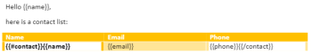

# Modules [!DNL Microsoft Word Template]

Dans un scénario [!DNL Adobe Workfront Fusion], vous pouvez automatiser les workflows qui utilisent [!DNL Microsoft Word Templates] et les connecter à plusieurs applications et services tiers.

Si vous avez besoin d’instructions sur la création d’un scénario, voir [Créer un scénario dans  [!DNL Adobe Workfront Fusion]](../../workfront-fusion/scenarios/create-a-scenario.md).

Pour plus d’informations sur les modules, consultez [Modules dans  [!DNL Adobe Workfront Fusion]](../../workfront-fusion/modules/modules.md).

## Conditions d’accès

Pour utiliser les fonctionnalités décrites dans cet article, vous devez disposer des éléments suivants :

<table style="table-layout:auto"> 
 <col> 
 <col> 
 <tbody> 
  <tr> 
   <td role="rowheader">[!DNL Adobe Workfront] forfait*</td>
  <td> <p>[!UICONTROL Pro] ou un forfait supérieur</p> </td>
  </tr> 
  <tr data-mc-conditions=""> 
   <td role="rowheader">[!DNL Adobe Workfront] licence*</td>
   <td> <p>[!UICONTROL Plan], [!UICONTROL Work]</p> </td> 
  </tr> 
  <tr> 
   <td role="rowheader">[!DNL Adobe Workfront Fusion] licence**</td> 
   <td> <p>[!UICONTROL [!DNL Workfront Fusion] for Work Automation and Integration] </p> </td> 
  </tr> 
  <tr> 
   <td role="rowheader">Produit</td> 
   <td>Votre entreprise doit acheter [!DNL Adobe Workfront Fusion] ainsi que [!DNL Adobe Workfront] pour utiliser la fonctionnalité décrite dans cet article.</td> 
  </tr> <!--
   <tr data-mc-conditions="QuicksilverOrClassic.Draft mode"> 
    <td role="rowheader">Access level configurations*</td> 
    <td> 
      <p data-mc-conditions="QuicksilverOrClassic.Draft mode">You must be a Workfront Fusion administrator for your organization.</p>
     --> <!--
      <p data-mc-conditions="QuicksilverOrClassic.Draft mode">You must be a Workfront Fusion administrator for your team.</p>
     --> </td> 
   </tr>
 </tbody> 
</table>

Pour connaître la formule, le type de licence ou l’accès dont vous disposez, contactez vote administrateur ou administratrice [!DNL Workfront].

Pour plus d’informations sur les licences [!DNL Adobe Workfront Fusion], consultez les [[!DNL Adobe Workfront Fusion] licences](../../workfront-fusion/get-started/license-automation-vs-integration.md).

## Conditions préalables

Pour utiliser [!DNL Miscrosoft Word Templates] avec [!DNL Adobe Workfront Fusion], il est nécessaire d&#39;avoir un compte [!DNL Office 365]. Vous pouvez en créer un à l’adresse www.office.com.


## Connexion du service [!DNL Office] à [!DNL Workfront Fusion]

Pour plus d’informations sur la connexion de votre compte [!DNL Office] à [!UICONTROL Workfront Fusion], voir [Création d’une connexion à [!UICONTROL Adobe Workfront Fusion] - Instructions de base](../../workfront-fusion/connections/connect-to-fusion-general.md)

>[!NOTE]
>
>Certaines applications Microsoft utilisent la même connexion, qui est liée à des autorisations utilisateur individuelles. Par conséquent, lors de la création d’une connexion, l’écran de consentement des autorisations affiche les autorisations qui ont été accordées à la connexion de cet utilisateur, en plus des nouvelles autorisations nécessaires à l’application actuelle.
>
>Par exemple, si un utilisateur dispose d’autorisations &quot;Lecture de tableau&quot; accordées via le connecteur Excel, puis crée une connexion dans le connecteur Outlook pour lire les emails, l’écran de consentement des autorisations affiche à la fois l’autorisation &quot;Lecture de tableau&quot; déjà accordée et l’autorisation &quot;Ecriture d’email&quot; nouvellement requise.

## Utilisation de [!DNL Microsoft Word Templates] modules

Vous pouvez utiliser un module [!DNL Microsoft Word Template] pour fusionner des données de plusieurs services Web dans un document [!DNL Microsoft Word].

Par exemple, vous pouvez utiliser ce modèle [!DNL Microsoft Word] :



Pour créer ce document :


## À propos des balises de valeur

Un modèle [!DNL Microsoft Word] est un document [!DNL Microsoft Word] normal (fichier .docx) avec des balises spéciales dans son texte qui déterminent où et comment fusionner ou remplir des données. Il existe trois types de balises :

* [Balise de valeur simple](#simple-value-tag)
* [Balise de condition](#condition-tag)
* [Balise de boucle](#loop-tag)

### Balise de valeur simple {#simple-value-tag}

Une balise de valeur simple est simplement remplacée par une valeur correspondante. Le nom de la balise correspond à la valeur du champ [!UICONTROL Clé], qui est placée à l’intérieur d’accolades doubles ; par exemple,


<pre>{{name}}</pre>


.

**Exemple :** Pour créer un document qui indique &quot;Bonjour, Pierrot !&quot;, vous pouvez utiliser un module [!DNL Microsoft Word Template] pour créer le modèle suivant :

<pre>&gt; Bonjour {{name}} !</pre>

Pour ce faire, vous devez configurer le module comme suit :


### Balise de condition {#condition-tag}

Vous pouvez utiliser une balise de condition pour renvoyer à la ligne le texte qui doit être rendu uniquement lorsque certaines conditions sont remplies. Pour renvoyer le texte à la ligne, placez-le entre les balises de condition d’ouverture et de fermeture, telles que &quot;hasPhone&quot; si la condition indique si les données incluent ou non un numéro de téléphone. Le nom d’une balise d’ouverture est précédé d’un signe de hachage #, le nom d’une balise de fermeture est précédé d’une barre oblique /, comme illustré dans l’exemple ci-dessous.

**Exemple :** Pour produire un document qui comprend le numéro de téléphone d’un client si les données d’entrée incluent un numéro de téléphone, mais aucune adresse électronique, vous pouvez utiliser un module [!DNL Microsoft Word Template] et créer le modèle suivant :
<pre>&gt; {{#hasPhone}}Phone : {{phone}} {/hasPhone}}</pre><pre>&gt; {{#hasEmail}}E-mail : {{email}} {/hasEmail}}</pre>Pour ce faire, vous devez configurer le module comme suit :


Dans le document, le numéro de téléphone se présente comme suit :
<pre>&gt; Téléphone : 4445551234</pre>

### Balise de boucle {#loop-tag}

Vous pouvez utiliser une balise de boucle, également appelée balise de section, pour répéter une section de texte. Entourez le texte en le plaçant entre les balises de boucle d’ouverture et de fermeture. Le nom d’une balise d’ouverture est précédé d’un signe de hachage # ; le nom d’une balise de fermeture est précédé d’une barre oblique /.

* [Balise de boucle avec remplissage d’un module de document](#loop-tag-with-fill-out-a-document-module)
  <!-- [Loop tag with Fill a document with a batch of data module](#loop-tag-with-fill-a-document-with-a-batch-of-data-module)-->

#### Balise de boucle avec remplissage d’un module de document {#loop-tag-with-fill-out-a-document-module}

**Exemple :** Pour produire un document qui répertorie le nom et le numéro de téléphone de chaque contact dans une liste de clients, vous pouvez utiliser un module [!DNL Microsoft Word Template] et créer le modèle suivant :

<pre>&gt; {{#contact}</pre><pre>&gt;     {{name}}, {{phone}}</pre><pre>&gt; {{/contact}</pre>

Pour ce faire, vous devez configurer le module comme suit :


Le module crée le document suivant :

```
> Jan Toman, 4445551234
> Eduard Salo, 4445552345
```

<!--

#### Loop tag with Fill a document with a batch of data module {#loop-tag-with-fill-a-document-with-a-batch-of-data-module}

**Example:** You can export Google contacts into a table that you create using loop tags.

The first module loads the template. The next module retrieves all contacts from the group you specify in [!DNL Google Contacts]. The aggregator module aggregates all values retrieved from Google Contacts and merges them into the template. And the last module saves the filled template to the desired location.


You could use this scenario with the following template:


To do this, you would set up the module as follows:


The module would create the following document:


-->

## Modules [!DNL Microsoft Word Template]

Ces modules ne nécessitent pas de connexion.

* [Remplissage d’un document](#fill-out-a-document)
* [Remplir un document avec un lot de données](#fill-a-document-with-a-batch-of-data)

### [!UICONTROL Remplissage d’un document] {#fill-out-a-document}

Ce module du transformateur permet de remplir un document avec les données que vous indiquez. Il peut être utilisé avec des balises de valeurs simples, des balises conditionnelles ou des balises de boucle.

<table style="table-layout:auto"> 
 <col> 
 <col> 
 <tbody> 
  <tr> 
   <td role="rowheader">[!UICONTROL Délimiteur de début du texte remplacé]</td> 
   <td> <p>Saisissez le ou les caractères que vous souhaitez marquer au début du texte remplacé. </p> <p class="example" data-mc-autonum="<b>Example: </b>"><span class="autonumber"><span><b>Exemple : </b></span></span>Entrez <code>[[</code> si vous souhaitez remplacer un texte similaire à celui-ci : <code>[[replace_me]]</code></p> </td> 
  </tr> 
  <tr> 
   <td role="rowheader"> <p>[!UICONTROL Délimiteur de fin du texte remplacé]</p> </td> 
   <td> <p>Saisissez le ou les caractères que vous souhaitez marquer la fin du texte remplacé. </p> <p class="example" data-mc-autonum="<b>Example: </b>"><span class="autonumber"><span><b>Exemple : </b></span></span>Entrez <code>]]</code> si vous souhaitez remplacer un texte similaire à celui-ci : <code>[[replace_me]]</code></p> </td> 
  </tr> 
  <tr> 
   <td role="rowheader">[!UICONTROL Source file]</td> 
   <td> <p> Mappez le fichier que vous souhaitez charger à partir du module précédent (par exemple, HTTP &gt; Obtenir un fichier ou un Dropbox &gt; Obtenir un module de fichier). Vous pouvez également saisir le fichier de données manuellement.</p> </td> 
  </tr> 
  <tr> 
   <td role="rowheader">[!UICONTROL Nom du fichier rempli]</td> 
   <td>Saisissez un nom de fichier (extension incluse) pour le fichier de sortie cible.</td> 
  </tr> 
  <tr> 
   <td role="rowheader">[!UICONTROL Source de données]</td> 
   <td> <p>Sélectionnez une option pour indiquer si les données que vous utilisez proviennent d’un formulaire ou d’une collecte de données brutes (données informatiques non traitées).</p> </td> 
  </tr> 
  <tr> 
   <td role="rowheader">[!UICONTROL Values]</td> 
   <td> <p>Il doit s’agir d’un tableau de collections dans lequel :</p> 
    <ul> 
     <li>Chaque collection correspond à une entrée de données et contient un élément . <code>entry</code></li> 
     <li>L'élément <code>entry </code> contient une collection du <code>key </code>et <code>value</code></li> 
     <li>L’élément <code>key </code> contient le nom de la balise.</li> 
     <li>item <code>value </code> contient la valeur de la balise</li> 
    </ul> 
    <p>Pour ajouter une entrée :</p>
    <ol> 
     <li> Cliquez sur <b>[!UICONTROL Ajouter un élément]</b>. </li> 
     <li>Sélectionnez le type de valeur de l’entrée.</li> 
     <li>Ajoutez le nom et la valeur. Pour plus d’informations, voir l’exemple du type de valeur choisi dans cet article. 
      <ul> 
       <li><a href="#simple-value-tag" class="MCXref xref">Balise de valeur simple</a></li> 
       <li><a href="#condition-tag" class="MCXref xref">Balise de condition</a></li> 
       <li><a href="#loop-tag" class="MCXref xref">Balise de boucle</a></li> 
      </ul></li> 
    </ol> </td> 
  </tr> 
 </tbody> 
</table>

### [!UICONTROL Remplir un document avec un lot de données] {#fill-a-document-with-a-batch-of-data}

Ce module d’agrégation est utile si vos entrées de données sont des lots distincts. Avec ce module, vous pouvez facilement configurer la structure requise pour le champ Valeur et mapper les éléments à chaque élément de valeur. Contrairement au module Remplir un document , le champ Valeurs du module Remplir un document avec un lot de données n’autorise qu’une seule entrée contenant des variables.

Vous pouvez également utiliser ce module si vos entrées de données sont fournies sous forme de tableau, en utilisant le module *Itérateur* pour transformer le contenu du tableau en une série de lots.

Les valeurs réelles sont créées et renseignées pour chaque lot entrant. Le modèle est généré une fois tous les lots d’entrée traités.

Ce module d&#39;agrégation est particulièrement utile pour créer des listes ou des rapports.

<table style="table-layout:auto"> 
 <col> 
 <col> 
 <tbody> 
  <tr> 
   <td role="rowheader">[!UICONTROL Source Module]</td> 
   <td>Sélectionnez le module qui est la source de votre texte.</td> 
  </tr> 
  <tr> 
   <td role="rowheader">[!UICONTROL Délimiteur de début du texte remplacé]</td> 
   <td> <p>Saisissez le ou les caractères que vous souhaitez marquer au début du texte remplacé. </p> <p class="example" data-mc-autonum="<b>Example: </b>"><span class="autonumber"><span><b>Exemple : </b></span></span>Entrez <code>[[</code> si vous souhaitez remplacer un texte similaire à celui-ci : <code>[[replace_me]]</code></p> </td> 
  </tr> 
  <tr> 
   <td role="rowheader"> <p>[!UICONTROL Délimiteur de fin du texte remplacé]</p> </td> 
   <td> <p>Saisissez le ou les caractères que vous souhaitez marquer la fin du texte remplacé. </p> <p class="example" data-mc-autonum="<b>Example: </b>"><span class="autonumber"><span><b>Exemple : </b></span></span>Entrez <code>]]</code> si vous souhaitez remplacer un texte similaire à celui-ci : <code>[[replace_me]]</code></p> </td> 
  </tr> 
  <tr> 
   <td role="rowheader">Groupe [!UICONTROL par]</td> 
   <td> Définissez une expression contenant un ou plusieurs éléments mappés. Les données agrégées sont séparées sous Groupes avec la même valeur d’expression. Chaque groupe génère en tant que lot distinct contenant une clé avec l’expression évaluée et le texte agrégé. Ce faisant, vous pouvez utiliser la clé comme filtre dans les modules suivants.</td> 
  </tr> 
  <tr> 
   <td role="rowheader">[!UICONTROL Arrêter le traitement après une agrégation vide]</td> 
   <td>Activez cette option pour arrêter le traitement lorsqu’une agrégation ne contient aucun lot.</td> 
  </tr> 
  <tr> 
   <td role="rowheader">[!UICONTROL Source file]</td> 
   <td> <p> Mappez le fichier que vous souhaitez charger à partir du module précédent (par exemple, HTTP &gt; Obtenir un fichier ou un Dropbox &gt; Obtenir un module de fichier). Vous pouvez également saisir le fichier de données manuellement.</p> </td> 
  </tr> 
  <tr> 
   <td role="rowheader">[!UICONTROL Nom du fichier rempli]</td> 
   <td>Saisissez un nom de fichier (extension incluse) pour le fichier de sortie cible.</td> 
  </tr> 
  <tr> 
   <td role="rowheader">[!UICONTROL Source de données]</td> 
   <td> <p>Sélectionnez une option pour indiquer si les données que vous utilisez proviennent d’un formulaire ou d’une collecte de données brutes (données informatiques non traitées).</p> </td> 
  </tr> 
  <tr> 
   <td role="rowheader">[!UICONTROL Values]</td> 
   <td> <p>Il doit s’agir d’un tableau de collections dans lequel :</p> 
    <ul> 
     <li>Chaque collection correspond à une entrée de données et contient un élément . <code>entry</code></li> 
     <li>L'élément <code>entry </code> contient une collection du <code>key </code>et <code>value</code></li> 
     <li>L’élément <code>key </code> contient le nom de la balise.</li> 
     <li>item <code>value </code> contient la valeur de la balise</li> 
    </ul> 
    <p>Pour ajouter une entrée :</p>
    <ol> 
     <li> Cliquez sur <b>[!UICONTROL Ajouter un élément]</b>. </li> 
     <li>Sélectionnez le type de valeur de l’entrée.</li> 
     <li>Ajoutez le nom et la valeur. Pour plus d’informations, voir l’exemple du type de valeur choisi dans cet article. 
      <ul> 
       <li><a href="#simple-value-tag" class="MCXref xref">Balise de valeur simple</a></li> 
       <li><a href="#condition-tag" class="MCXref xref">Balise de condition</a></li> 
       <li><a href="#loop-tag" class="MCXref xref">Balise de boucle</a></li> 
      </ul></li> 
    </ol> </td> 
  </tr> 
 </tbody> 
</table>
