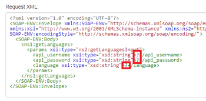

# [!UICONTROL SOAP] module

Vous pouvez utiliser la variable [!UICONTROL SOAP] pour se connecter à [!UICONTROL SOAP] API dans [!UICONTROL Adobe Workfront Fusion].

## Conditions d’accès

Pour utiliser les fonctionnalités décrites dans cet article, vous devez disposer des éléments suivants :

<table style="table-layout:auto"> 
 <col> 
 <col> 
 <tbody> 
  <tr> 
   <td role="rowheader">[!DNL Adobe Workfront] forfait*</td>
  <td> <p>[!UICONTROL Pro] ou un forfait supérieur</p> </td>
  </tr> 
  <tr data-mc-conditions=""> 
   <td role="rowheader">[!DNL Adobe Workfront] licence*</td>
   <td> <p>[!UICONTROL Plan], [!UICONTROL Work]</p> </td> 
  </tr> 
  <tr> 
   <td role="rowheader">[!DNL Adobe Workfront Fusion] licence**</td> 
   <td>
   <p>Exigences de licence actuelle : aucune exigence de licence [!DNL Workfront Fusion]</p>
   <p>Ou</p>
   <p>Exigences de licence héritées : [!UICONTROL [!DNL Workfront Fusion] pour l’automatisation et l’intégration du travail] </p>
   </td> 
  </tr> 
  <tr> 
   <td role="rowheader">Produit</td> 
   <td>
   <p>Exigences du produit actuel : si vous disposez du forfait [!DNL Adobe Workfront] [!UICONTROL Select] ou [!UICONTROL Prime], votre entreprise doit acheter [!DNL Adobe Workfront Fusion] et [!DNL Adobe Workfront] pour utiliser les fonctionnalités décrites dans cet article. [!DNL Workfront Fusion] est inclus dans le forfait [!DNL Workfront] [!UICONTROL Ultimate].</p>
   <p>Ou</p>
   <p>Exigences du produit hérité : votre entreprise doit acheter [!DNL Adobe Workfront Fusion] et [!DNL Adobe Workfront] pour utiliser les fonctionnalités décrites dans cet article.</p>
   </td> 
  </tr> 
 </tbody> 
</table>

Pour connaître la formule, le type de licence ou l’accès dont vous disposez, contactez vote administrateur ou administratrice [!DNL Workfront].

Pour plus d’informations sur les licences [!DNL Adobe Workfront Fusion], consultez les [[!DNL Adobe Workfront Fusion] licences](../../workfront-fusion/get-started/license-automation-vs-integration.md).

## Limites de la variable [!UICONTROL SOAP] module

>[!NOTE]
>
>Les redirections sont désactivées pendant le chargement WDSL. Il s’agit d’une fonctionnalité de sécurité, mais cela peut signifier que les redirections non vérifiées sont bloquées lors de l’exécution du module.

La variable [!UICONTROL SOAP] module est actuellement en version bêta et ne prend pas en charge :

* Redéfinir les éléments
* Restrictions des chiffres de la fraction
* Restrictions relatives aux chiffres totaux
* Restrictions relatives aux espaces blancs
* Plusieurs parties dans les messages d’entrée et de sortie. Seuls les messages en une seule partie sont pris en charge
* Eléments de schéma XML personnalisés définis à l’aide des [[!UICONTROL SOAP] Encodage](https://schemas.xmlsoap.org) schémas et éléments.

>[!INFO]
>
>**Exemple :**
>  
>Les éléments suivants ne seraient pas correctement reconnus par [!UICONTROL Workfront Fusion]:
>
>```
><complexType name="ArrayOfFloat">
>     <complexContent>
>           <restriction base="soapenc:Array">
>                 <attribute ref="soapenc:arrayType"
>                       wsdl:arrayType="xsd:integer[]"/>
>           </restriction>
>     </complexContent>
></complexType>
>```
>
>Cet exemple inclut la variable `soapenc:Array`, `soapenc:arrayType` et `wsdl:arrayType` les références qui ne sont pas encore prises en charge dans [!UICONTROL Workfront Fusion].

## Solution

Si la variable [!UICONTROL SOAP] Le module refuse de traiter le fichier WSDL ou renvoie diverses erreurs dans la configuration du module. Vous pouvez essayer d&#39;utiliser l&#39;extension **[!UICONTROL HTTP] > [!UICONTROL Effectuer une requête]** module à la place :

1. Dans [!DNL Workfront Fusion], créez un scénario.
1. Insérez la méthode **[!UICONTROL HTTP] > [!UICONTROL Effectuer une requête]** dans le scénario.
1. Ouvrez la configuration du module et renseignez les champs suivants :

   <table style="table-layout:auto"> 
    <col> 
    <col> 
    <tbody> 
     <tr> 
      <td role="rowheader">[!UICONTROL Method]</td> 
      <td> <p>[!UICONTROL POST]</p> </td> 
     </tr> 
     <tr data-mc-conditions=""> 
      <td role="rowheader">[!UICONTROL Type de corps]</td> 
      <td> <p>[!UICONTROL Raw]</p> </td> [!UICONTROL ]
     </tr> 
     <tr> 
      <td role="rowheader">[!UICONTROL Type de contenu]</td> 
      <td> <p>[!UICONTROL XML (application/xml)]</p> </td> 
     </tr> 
     <tr> 
      <td role="rowheader">[!UICONTROL Réponse d’analyse]</td> 
      <td>[!UICONTROL activé]</td> 
     </tr> 
    </tbody> 
   </table>

   

1. Ouvrez une nouvelle fenêtre ou un nouvel onglet du navigateur Web.
1. Collez l’URL WSDL dans la barre d’adresse du navigateur Web et récupérez le fichier XML.

   L’URL WSDL se termine généralement par `?wsdl`, mais pas nécessairement, par exemple `http://voip.ms/api/v1/server.wsdl`.

1. Si le fichier WSDL ne s’affiche pas directement dans le navigateur Web, ouvrez le fichier téléchargé dans un éditeur de texte.
1. Recherchez le `<service>` ou `<wsdl:service>` tag :

   

1. Une fois localisée, copiez l’URL à partir de la fonction `location` attribut.
1. Dans [!DNL Workfront Fusion], collez l’URL dans le champ URL du module HTTP.
1. Ouvrez le [En ligne [!UICONTROL SOAP] Client](https://wsdlbrowser.com/) dans une nouvelle fenêtre ou un nouvel onglet du navigateur web.
1. Collez l’URL WSDL dans le champ URL WSDL .
1. Cliquez sur **[!UICONTROL Parcourir]**.
1. Sélectionnez dans la liste des fonctions située à gauche, par exemple `getLanguages`.
1. Copiez le contenu de la [!UICONTROL Request XML] zone de texte.
1. Dans [!UICONTROL Workfront Fusion], collez le contenu copié dans le champ URL du module.
1. Indiquez des valeurs pour les paramètres sélectionnés en remplaçant les points d’interrogation par des valeurs réelles :

   

1. Fermez la configuration du module en cliquant sur **[!UICONTROL OK]**.
1. Exécutez le scénario ou le module.
