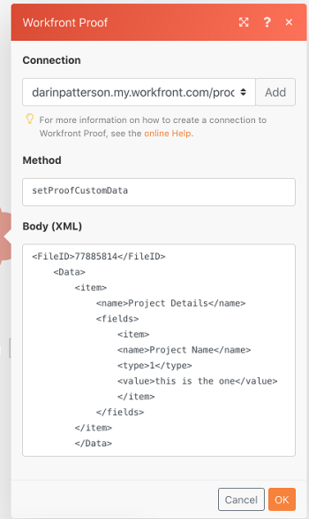

# [!DNL Workfront Proof] modules

Dans un [!DNL Adobe Workfront Fusion] , vous pouvez automatiser les workflows qui utilisent [!DNL Workfront Proof], ainsi que de la connecter à plusieurs applications et services tiers.

Cela s’avère utile si vous devez exécuter des tâches actuellement non prises en charge dans la vérification [!DNL Workfront] ou [!DNL Workfront Proof], comme la mise à jour des BAT en fonction de certains événements et la recherche des destinataires d’un BAT.

La variable [!DNL Workfront Proof] Le connecteur ne compte pas par rapport au nombre d’applications actives disponibles pour votre organisation. Tous les scénarios, même s’ils utilisent uniquement la variable [!DNL Workfront Proof] , ne comptez pas par rapport au nombre total de scénarios de votre entreprise.

Si vous avez besoin d’instructions sur la création d’un scénario, voir [Créez un scénario dans [!DNL Adobe Workfront Fusion]](../../workfront-fusion/scenarios/create-a-scenario.md).

Pour plus d’informations sur les modules, voir [Modules dans [!DNL Adobe Workfront Fusion]](../../workfront-fusion/modules/modules.md).

## Exigences d’accès

Vous devez disposer des accès suivants pour utiliser les fonctionnalités de cet article :

<table style="table-layout:auto">
 <col> 
 <col> 
 <tbody> 
  <tr> 
   <td role="rowheader">[!DNL Adobe Workfront] plan*</td>
  <td> 
[!UICONTROL Pro] ou version ultérieure
 </td>
  </tr> 
  <tr data-mc-conditions=""> 
   <td role="rowheader">[!DNL Adobe Workfront] license*</td>
   <td> 
[!UICONTROL Plan], [!UICONTROL Work]
 </td> 
  </tr> 
  <tr> 
   <td role="rowheader">[!DNL Adobe Workfront Fusion] license**</td> 
   <td>
   
Exigences de licence actuelles : non [!DNL Workfront Fusion] conditions requises pour obtenir une licence.

   
Ou

   
Exigences de licence héritées : [!UICONTROL [!DNL Workfront Fusion] pour l’automatisation et l’intégration du travail, [!UICONTROL [!DNL Workfront Fusion] pour l’automatisation du travail]

   </td> 
  </tr> 
  <tr> 
   <td role="rowheader">Produit</td> 
   <td>
   
Conditions requises du produit actuel : si vous disposez de l’[!UICONTROL Select] ou de l’[!UICONTROL Prime] [!DNL Adobe Workfront] Planifiez, votre entreprise doit acheter [!DNL Adobe Workfront Fusion] ainsi que [!DNL Adobe Workfront] pour utiliser la fonctionnalité décrite dans cet article. [!DNL Workfront Fusion] est inclus dans l’[!UICONTROL Ultimate] [!DNL Workfront] planifiez.

   
Ou

   
Exigences liées aux produits hérités : votre entreprise doit acheter [!DNL Adobe Workfront Fusion] ainsi que [!DNL Adobe Workfront] pour utiliser la fonctionnalité décrite dans cet article.

   </td> 
  </tr> 
 </tbody> 
</table>

Pour connaître le plan, le type de licence ou l’accès dont vous disposez, contactez votre [!DNL Workfront] administrateur.

Pour plus d’informations sur [!DNL Adobe Workfront Fusion] licences, voir [[!DNL Adobe Workfront Fusion] licences](../../workfront-fusion/get-started/license-automation-vs-integration.md).

## Connexion [!DNL Workfront Proof] to [!DNL Workfront Fusion]

Vous pouvez créer une connexion à votre [!DNL Workfront Proof] compte directement depuis l’intérieur d’un [!DNL Workfront Fusion] module .

1. Dans n’importe quel [!DNL Workfront Fusion] module, cliquez sur [!UICONTROL **Ajouter**] en regard de [!UICONTROL Connexion] field

2. Renseignez les champs suivants :

   <table style="table-layout:auto"> 
        <col/>
        <col/>
        <tbody>
            <tr>
                <td role="rowheader">
                    
[!UICONTROL Nom de la connexion]

                </td>
                <td>Saisissez un nom pour la connexion.</td>
            </tr>
            <tr>
                <td  role="rowheader">[!UICONTROL connections.environmentType]</td>
                <td>Indiquez s’il s’agit d’un environnement de production ou d’un environnement hors production tel que Aperçu ou Environnement de test.</td>
            </tr>
            <tr>
                <td role="rowheader">[!UICONTROL connections.authenticationType]</td>
                <td>Indiquez s’il s’agit d’un compte de service ou d’un compte personnel.</td>
            </tr>
            <tr>
                <td  role="rowheader">[!UICONTROL Email / Nom d’utilisateur]</td>
                <td>Saisissez le nom d’utilisateur de votre [!DNL Workfront Proof] compte .</td>
            </tr>
            <tr>
                <td  role="rowheader">[!UICONTROL Password]</td>
                <td>Saisissez le mot de passe de votre [!DNL Workfront Proof] compte .</td>
            </tr>
            <tr>
                <td  role="rowheader">[!UICONTROL Nom du tenant]</td>
                <td><strong>Remarque</strong>: les clients qui n’utilisent pas BYOK doivent laisser ce champ vide. 
Saisissez l’identifiant du client pour ce compte. Si vous avez besoin d’aide pour trouver votre ID de tenant, contactez le service clientèle de Workfront.
</td>
            </tr>
            <tr>
                <td role="rowheader">[!UICONTROL Domain Extension]</td>
                <td>Saisissez l’extension de l’URL que vous utilisez pour accéder à votre compte. 
Exemple : <code>com</code> ou <code>eu</code>
</td>
            </tr>
            <tr>
                <td  role="rowheader">[!UICONTROL Production, Aperçu ou Environnement personnalisé]</td>
                <td>Sélectionnez une connexion à un environnement de production, de prévisualisation ou personnalisé.</td>
            </tr>
        </tbody>
    </table>

3. Cliquez sur [!UICONTROL **Continuer**] pour enregistrer la connexion et revenir au module

## [!DNL Workfront Proof] modules et leurs champs

Lorsque vous configurez [!DNL Workfront Proof] modules, [!DNL Workfront Fusion] affiche les champs répertoriés ci-dessous. En plus de ces [!DNL Workfront Proof] peut s’afficher, selon des facteurs tels que votre niveau d’accès dans l’application ou le service. Un titre en gras dans un module indique un champ obligatoire.

Si le bouton de mappage situé au-dessus d’un champ ou d’une fonction s’affiche, vous pouvez l’utiliser pour définir des variables et des fonctions pour ce champ. Pour plus d’informations, voir [Mappage des informations d’un module à un autre dans [!DNL Adobe Workfront Fusion]](../../workfront-fusion/mapping/map-information-between-modules.md).

* [Triggers](#triggers)
* [Actions](#actions)
* [Recherches](#searches)

### Triggers

* [Bons à tirer](#watch-proofs)
* [Rechercher le résumé du PDF](#watch-for-pdf-summary)
* [[!UICONTROL Activité de contrôle de preuve]](#watch-proof-activity)

#### [!UICONTROL Bons à tirer]

Ce module de déclenchement planifié exécute un scénario lorsqu’une personne crée ou prend une décision sur un BAT.

Le module renvoie une liste de tous les enregistrements trouvés pendant la période que vous spécifiez, ainsi que leurs types. Elle renvoie également les valeurs des champs que vous spécifiez. Si le module a trouvé des décisions prises sur le BAT, il inclut les valeurs précédente et actuelle, dans des champs distincts. Vous pouvez mapper ces informations dans les modules suivants du scénario.

Cela se produit dans un intervalle régulièrement planifié que vous spécifiez.

Vous devez disposer des autorisations suffisantes pour accéder au BAT ou aux BAT dans [!DNL Workfront Proof] afin de récupérer ces informations.

Lors de la configuration de ce module, les champs suivants s’affichent.

<table style="table-layout:auto">
 <col> 
 <col> 
 <tbody> 
  <tr> 
   <td role="rowheader">[!UICONTROL Connection]</td> 
   <td> 
Pour obtenir des instructions sur la connexion à [!DNL Workfront Proof] compte à [!DNL Workfront Fusion], voir <a href="../../workfront-fusion/connections/connect-to-fusion-general.md" class="MCXref xref" data-mc-variable-override="">Créer une connexion à [!DNL Adobe Workfront Fusion] - Instructions de base</a>
 </td> 
  </tr> 
  <tr> 
   <td role="rowheader">Type d’enregistrement</td> 
   <td>Sélectionnez le type de [!DNL Workfront Proof] enregistrement que vous souhaitez que le module regarde.</td> 
  </tr> 
  <tr data-mc-conditions=""> 
   <td role="rowheader">Sorties</td> 
   <td> 
Sélectionnez les informations que vous souhaitez inclure dans le lot de sortie pour ce module.
 </td> 
  </tr> 
  <tr data-mc-conditions=""> 
   <td role="rowheader">Limite</td> 
   <td> 
Saisissez ou mappez le nombre maximum d'enregistrements que le module doit renvoyer pour chaque cycle d'exécution de scénario.
 </td> 
  </tr> 
 </tbody> 
</table>

#### [!UICONTROL Rechercher le résumé du PDF]

Ce module de déclenchement instantané exécute un scénario lorsqu’une personne crée un résumé du PDF pour un BAT.

Un webhook est requis dans ce module.

Le module renvoie tous les champs standard associés au BAT, ainsi que les champs personnalisés et les valeurs auxquels la connexion a accès. Il crée également un nouvel abonnement d’événement pour les résumés PDF et sort le contenu de l’attribut &quot;pdf_url&quot; envoyé dans la payload. Vous pouvez mapper ces informations dans les modules suivants du scénario.

Lors de la configuration de ce module, les champs suivants s’affichent.

<table style="table-layout:auto">
 <col> 
 <col> 
 <tbody> 
  <tr> 
   <td>[!DNL Connection]</td> 
   <td> 
Pour obtenir des instructions sur la connexion à [!DNL Workfront Proof] compte à [!DNL Workfront Fusion], voir <a href="../../workfront-fusion/connections/connect-to-fusion-general.md" class="MCXref xref" data-mc-variable-override="">Créer une connexion à [!DNL Adobe Workfront Fusion] - Instructions de base</a>
 </td> 
  </tr> 
  <tr> 
   <td>[!UICONTROL Webhook]</td> 
   <td>Vous pouvez sélectionner un webhook existant ou en créer un nouveau. Pour plus d’informations, voir <a href="../../workfront-fusion/webhooks/instant-triggers-webhooks.md" class="MCXref xref">Déclencheurs instantanés (webhooks) dans [!DNL Adobe Workfront Fusion]</a>. </td> 
  </tr> 
  <tr> 
   <td>[!UICONTROL Limite]</td> 
   <td>Saisissez ou mappez le nombre maximum d'enregistrements que le module doit renvoyer pour chaque cycle d'exécution de scénario.</td> 
  </tr> 
 </tbody> 
</table>

#### [!UICONTROL Activité de contrôle de preuve]

Ce module de déclenchement exécute un scénario lorsqu’une activité spécifiée se produit sur un BAT.

Le module renvoie tous les champs standard associés au BAT, ainsi que les champs personnalisés et les valeurs auxquels la connexion a accès. Il crée également un nouvel abonnement d’événement pour les résumés de PDF et génère le contenu à partir de la `pdf_url` envoyé dans la payload. Vous pouvez mapper ces informations dans les modules suivants du scénario.

Lors de la configuration de ce module, les champs suivants s’affichent.

<table style="table-layout:auto">
 <col> 
 <col> 
 <tbody> 
  <tr> 
   <td>[!DNL Connection]</td> 
   <td> 
Pour obtenir des instructions sur la connexion à [!DNL Workfront Proof] compte à [!DNL Workfront Fusion], voir <a href="../../workfront-fusion/connections/connect-to-fusion-general.md" class="MCXref xref" data-mc-variable-override="">Créer une connexion à [!DNL Adobe Workfront Fusion] - Instructions de base</a>
 </td> 
  </tr> 
  <tr> 
   <td>[!UICONTROL Type d’activité]</td> 
   <td>Indiquez si vous souhaitez regarder une nouvelle décision (y compris les modifications d’état [!UICONTROL BAT]) ou les modifications d’état global du BAT uniquement.</td> 
  </tr> 
  <tr> 
   <td>[!UICONTROL Limite]</td> 
   <td>Saisissez ou mappez le nombre maximum d'enregistrements que le module doit renvoyer pour chaque cycle d'exécution de scénario.</td> 
  </tr> 
 </tbody> 
</table>

### Actions

* [[!UICONTROL Créer un bon à tirer]](#create-proof)
* [[!UICONTROL Appel API personnalisé]](#custom-api-call)
* [[!UICONTROL Télécharger le bon à tirer]](#download-proof)
* [[!UICONTROL Lire un enregistrement]](#read-a-record)
* [[!UICONTROL Résumé du PDF de requêtes]](#request-pdf-summary)
* [[!UICONTROL Mettre à jour le BAT]](#update-proof)
* [[!UICONTROL Télécharger le fichier]](#upload-file)

#### [!UICONTROL Créer un bon à tirer]

Ce module d’action crée un BAT ou une nouvelle version d’un BAT dans [!DNL Workfront Proof].

Vous spécifiez les paramètres du nouveau BAT et du BAT source si vous créez une nouvelle version.

Le module renvoie l&#39;identifiant de la nouvelle version du BAT ou du BAT. Vous pouvez associer ces informations dans les modules suivants du scénario.

Lors de la configuration de ce module, les champs suivants s’affichent.

<table style="table-layout:auto"> 
 <col> 
 <col> 
 <tbody> 
  <tr> 
   <td>[!DNL Connection]</td> 
   <td> 
Pour obtenir des instructions sur la connexion à [!DNL Workfront Proof] compte à [!DNL Workfront Fusion], voir <a href="../../workfront-fusion/connections/connect-to-fusion-general.md" class="MCXref xref" data-mc-variable-override="">Créer une connexion à [!DNL Adobe Workfront Fusion] - Instructions de base</a>
 </td> 
  </tr> 
  <tr> 
   <td>[!UICONTROL BAT Type]</td> 
   <td> 
Indiquez si vous souhaitez que le BAT créé dispose d’un workflow de base ou d’un [!UICONTROL Processus automatisé].
 
Renseignez ensuite les champs qui s'affichent pour le type de BAT que vous avez choisi. Par exemple, si vous avez sélectionné [!UICONTROL Processus automatisé], renseignez la variable <strong>[!UICONTROL Étapes de workflow]</strong> pour configurer les étapes.
</td> 
  </tr> 
  <tr data-mc-conditions=""> 
   <td>[!UICONTROL Autoriser le téléchargement du fichier d’origine]</td> 
   <td>Indiquez si vous souhaitez autoriser le téléchargement du fichier d’origine à partir duquel le BAT a été créé.</td> 
  </tr> 
  <tr data-mc-conditions=""> 
   <td>[!UICONTROL Classic Proof Viewer]</td> 
   <td>Indiquez si vous utilisez la visionneuse de BAT classique.</td> 
  </tr> 
  <tr data-mc-conditions=""> 
   <td>[!UICONTROL Combiner tous les fichiers en un seul BAT]</td> 
   <td>Activez cette option pour combiner tous les fichiers en un seul BAT multi-page.</td> 
  </tr> 
  <tr> 
   <td>[!UICONTROL Créer une version de BAT]</td> 
   <td>Sélectionnez cette option si vous souhaitez que le module crée une nouvelle version d'un BAT existant. Ensuite, dans la variable <strong>[!UICONTROL ID de bon à tirer existant]</strong> champ qui affiche, mappe ou saisit l’identifiant unique du BAT.</td> 
  </tr> 
  <tr> 
   <td>[!UICONTROL Étiquette de lien personnalisé]</td> 
   <td>Saisissez ou mappez un libellé pour le lien personnalisé du BAT.</td> 
  </tr> 
  <tr> 
   <td>[!UICONTROL URL de lien personnalisé]</td> 
   <td>Saisissez ou mappez l’URL du lien personnalisé.</td> 
  </tr> 
  <tr data-mc-conditions=""> 
   <td>[!UICONTROL Notifications électroniques par défaut pour les abonnés]</td> 
   <td>Saisissez l’un des nombres suivants pour indiquer les paramètres de notification par email par défaut suivants que vous souhaitez utiliser pour le BAT créé.
    <ul>
     <li><strong>1</strong> - Tous les nouveaux commentaires et réponses</li>
     <li><strong>2</strong> - Réponses à mes commentaires</li>
     <li><strong>3</strong> - Résumé quotidien</li>
     <li><strong>4</strong> - Synthèse horaire</li>
     <li><strong>5</strong> - Décisions uniquement</li>
     <li><strong>9</strong> - Désactivé</li>
    </ul></td> 
  </tr> 
  <tr data-mc-conditions=""> 
   <td>[!UICONTROL Désactiver le résumé Excel]</td> 
   <td>Indiquez si vous souhaitez désactiver la possibilité de télécharger des commentaires de BAT dans un fichier Excel.</td> 
  </tr> 
  <tr data-mc-conditions=""> 
   <td>[!UICONTROL Désactiver le résumé du PDF]</td> 
   <td>Indiquez si vous souhaitez désactiver la possibilité de télécharger les commentaires BAT dans un fichier de PDF.</td> 
  </tr> 
  <tr data-mc-conditions=""> 
   <td>[!UICONTROL Désactiver le courrier électronique d’abonnement]</td> 
   <td>Indiquez si vous souhaitez désactiver l'email d'abonnement pour ce BAT.</td> 
  </tr> 
  <tr data-mc-conditions=""> 
   <td>[!UICONTROL Activer le lecteur intégré]</td> 
   <td>Indiquez si vous souhaitez activer le lecteur incorporé pour ce BAT.</td> 
  </tr> 
  <tr data-mc-conditions=""> 
   <td>[!UICONTROL Activer les abonnements]</td> 
   <td>Indiquez si les personnes qui ne sont pas des participants sont autorisées à souscrire au BAT. Si vous sélectionnez cette option, vous pouvez également sélectionner le rôle par défaut des abonnés, comme décrit dans ce tableau.</td> 
  </tr> 
  <tr data-mc-conditions=""> 
   <td>[!UICONTROL Activer la validation des abonnements]</td> 
   <td>Indiquez si vous souhaitez activer la validation des emails d’abonnement. Si cette option est activée, l'abonné doit cliquer sur un lien dans un email pour accéder à un BAT.</td> 
  </tr> 
  <tr data-mc-conditions=""> 
   <td>[!UICONTROL Activer l’URL de l’équipe]</td> 
   <td>Indiquez si vous souhaitez que le BAT créé soit masqué ou affiche l’URL de l’équipe.</td> 
  </tr> 
  <tr data-mc-conditions=""> 
   <td>[!UICONTROL Hash de fichier] ou [!UICONTROL Hachages de fichier]</td> 
   <td>Ajoutez l'identifiant du ou des fichiers à partir desquels vous souhaitez créer un BAT ou des BAT.</td> 
  </tr> 
  <tr data-mc-conditions=""> 
   <td>[!UICONTROL Noms de fichier]</td> 
   <td>Ajoutez le ou les noms du fichier pour le BAT créé. Ce champ est obligatoire.</td> 
  </tr> 
  <tr data-mc-conditions=""> 
   <td>[!UICONTROL BAT de verrouillage lorsque toutes les décisions requises sont prises]</td> 
   <td>Indiquez si vous souhaitez que le BAT créé se verrouille une fois toutes les décisions requises prises.</td> 
  </tr> 
  <tr data-mc-conditions=""> 
   <td>[!UICONTROL Informer les destinataires de ce BAT]</td> 
   <td>Sélectionnez une option pour indiquer si vous souhaitez que les destinataires soient avertis lors de la création du BAT.&gt;</td> 
  </tr> 
  <tr> 
   <td>[!UICONTROL Nom de la preuve]</td> 
   <td>Saisissez le nom du BAT créé. Il s’agit d’un champ obligatoire. Utilisez une barre verticale (|) pour séparer les noms de plusieurs bons à tirer.</td> 
  </tr> 
  <tr> 
   <td>[!UICONTROL ID du propriétaire du BAT]</td> 
   <td>Saisissez ou mappez l’identifiant du propriétaire du BAT. Si ce champ n’est pas renseigné, le propriétaire du BAT est défini sur l’utilisateur actuel.</td> 
  </tr> 
  <tr> 
   <td>[!UICONTROL Reference ID]</td> 
   <td>Saisissez l’ID de référence du BAT.</td> 
  </tr> 
  <tr> 
   <td>[!UICONTROL Nécessiter une signature électronique]</td> 
   <td>Indiquez si vous souhaitez exiger qu’une personne qui prend une décision sur un BAT envoie une signature électronique.</td> 
  </tr> 
  <tr data-mc-conditions=""> 
   <td>[!UICONTROL Nécessite une connexion]</td> 
   <td> 
Indiquez si vous souhaitez que le BAT créé requiert une connexion. 
 
Il s’agit du même paramètre que le paramètre [!UICONTROL Connexion requise] expliqué dans la section <a href="../../workfront-proof/wp-work-proofsfiles/manage-your-work/configure-proof-settings.md" class="MCXref xref">[!UICONTROL Configuration des paramètres de BAT] dans [!DNL Workfront Proof]</a>
 </td> 
  </tr> 
  <tr data-mc-conditions=""> 
   <td>[!UICONTROL Resolution ID]</td> 
   <td>Saisissez l'identifiant de la résolution que vous souhaitez utiliser pour votre BAT. Pour obtenir la liste des ID de résolution, voir [!DNL Workfront Proof] <a href="https://api.proofhq.com/home/objects/soapworkflowproofobject.html">Documentation de l’API</a>.</td> 
  </tr> 
  <tr data-mc-conditions=""> 
   <td>[!UICONTROL SWF]</td> 
   <td>Saisissez le type de BAT SWF.</td> 
  </tr> 
  <tr data-mc-conditions=""> 
   <td>[!UICONTROL Afficher] [élément]</td> 
   <td>Pour chaque élément, choisissez si vous souhaitez l’afficher dans le BAT.</td> 
  </tr> 
  <tr data-mc-conditions=""> 
   <td>[!UICONTROL ID Workspace]</td> 
   <td>Saisissez l'identifiant de l'espace de travail dans lequel vous souhaitez créer le BAT. </td> 
  </tr> 
  <tr data-mc-conditions=""> 
   <td>[!UICONTROL Destinataires]</td> 
   <td>Ajoutez les adresses email des destinataires que vous souhaitez pour le BAT créé .</td> 
  </tr> 
  <tr data-mc-conditions=""> 
   <td>[!UICONTROL Date limite]</td> 
   <td> 
Indiquez la date limite de création du BAT. Utilisez le format de date suivant :
 
<code>YYYY-MM-DD hh:mm</code>
 </td> 
  </tr> 
 </tbody> 
</table>

#### [!UICONTROL Appel API personnalisé]

Ce module d’action vous permet d’effectuer un appel authentifié personnalisé vers le [!DNL Workfront Proof] API. Ainsi, vous pouvez créer une automatisation du flux de données qui ne peut pas être réalisée par l’autre [!DNL Workfront Proof] modules.

Le module renvoie le code d’état, les en-têtes et le corps. Vous pouvez mapper ces informations dans les modules suivants du scénario.

Lors de la configuration de ce module, les champs suivants s’affichent.

<table style="table-layout:auto">
 <col> 
 <col> 
 <tbody> 
  <tr> 
   <td>[!DNL Connection]</td> 
   <td> 
Pour obtenir des instructions sur la connexion à [!DNL Workfront Proof] compte à [!DNL Workfront Fusion], voir <a href="../../workfront-fusion/connections/connect-to-fusion-general.md" class="MCXref xref" data-mc-variable-override="">Créer une connexion à [!DNL Adobe Workfront Fusion] - Instructions de base</a>
 </td> 
  </tr> 
  <tr data-mc-conditions=""> 
   <td>Méthode [!UICONTROL]</td> 
   <td>Définissez l’action de l’appel API. Pour connaître les actions disponibles, voir <a href="https://api.proofhq.com/">Documentation de l’API de test</a>.</td> 
  </tr> 
  <tr data-mc-conditions=""> 
   <td>[!UICONTROL Body (XML)]</td> 
   <td> 
Ajoutez le contenu du corps de l’appel API sous la forme d’un objet JSON standard.
 
Remarque :  
Lors de l’utilisation d’instructions conditionnelles telles que <code>if</code> dans votre fichier JSON, placez les guillemets en dehors de l’instruction conditionnelle.
 
     
Example: </b>"> 
      
  
 
     
 
 </td> 
  </tr> 
 </tbody> 
</table>

>[!INFO]
>
>**Exemple :**
>
>

#### [!UICONTROL Télécharger le bon à tirer]

Ce module d’action télécharge le fichier source d’un BAT particulier que vous identifiez à l’aide de son identifiant.

Vous spécifiez l’identifiant du BAT.

Le module renvoie le contenu du fichier source utilisé pour créer le BAT. Vous pouvez associer ces informations dans les modules suivants du scénario.

Vous devez disposer des autorisations suffisantes pour accéder à l’enregistrement dans [!DNL Workfront Proof] afin de récupérer ces informations.

Lors de la configuration de ce module, les champs suivants s’affichent.

<table style="table-layout:auto">
 <col> 
 <col> 
 <tbody> 
  <tr> 
   <td>[!DNL Connection]</td> 
   <td> 
Pour obtenir des instructions sur la connexion à [!DNL Workfront Proof] compte à [!DNL Workfront Fusion], voir <a href="../../workfront-fusion/connections/connect-to-fusion-general.md" class="MCXref xref" data-mc-variable-override="">Créer une connexion à [!DNL Adobe Workfront Fusion] - Instructions de base</a>
 </td> 
  </tr> 
  <tr> 
   <td>[!UICONTROL BAT ID]</td> 
   <td> 
Saisissez l’identifiant unique du BAT, qui se trouve sur la page [!UICONTROL Proof Details]. Pour plus d’informations, voir <a href="../../workfront-proof/wp-work-proofsfiles/manage-your-work/manage-proof-details.md" class="MCXref xref" data-mc-variable-override="">Gérer les détails du BAT dans [!DNL Workfront Proof]</a>.
 </td> 
  </tr> 
 </tbody> 
</table>

#### [!UICONTROL Lire un enregistrement]

Ce module d’action lit les données à partir d’un seul BAT dans [!DNL Workfront Proof].

Vous indiquez l’identifiant du BAT et les informations que vous souhaitez obtenir du BAT.

Le module renvoie les valeurs des champs que vous choisissez pour le BAT, ainsi que leurs types. Vous pouvez mapper ces informations dans les modules suivants du scénario.

Vous devez disposer des autorisations suffisantes pour accéder à l’enregistrement dans [!DNL Workfront Proof] afin de récupérer ces informations.

Lors de la configuration de ce module, les champs suivants s’affichent.

<table style="table-layout:auto">
 <col> 
 <col> 
 <tbody> 
  <tr> 
   <td>[!DNL Connection]</td> 
   <td> 
Pour obtenir des instructions sur la connexion à [!DNL Workfront Proof] compte à [!DNL Workfront Fusion], voir <a href="../../workfront-fusion/connections/connect-to-fusion-general.md" class="MCXref xref" data-mc-variable-override="">Créer une connexion à [!DNL Adobe Workfront Fusion] - Instructions de base</a>
 </td> 
  </tr> 
  <tr> 
   <td>[!UICONTROL Record Type]</td> 
   <td>Indiquez si vous souhaitez lire un BAT, des commentaires de BAT ou des réviseurs de BAT.</td> 
  </tr> 
  <tr> 
   <td>Sorties [!UICONTROL]</td> 
   <td> 
Sélectionnez les informations que vous souhaitez inclure dans le lot de sortie pour ce module.
 </td> 
  </tr> 
  <tr> 
   <td>[!UICONTROL ID]</td> 
   <td>Saisissez ou mappez l’unique [!DNL Workfront Proof] Identifiant de l’enregistrement que vous souhaitez que le module lise.</td> 
  </tr> 
 </tbody> 
</table>

#### [!UICONTROL Résumé du PDF de requêtes]

Ce module d’action demande la synthèse du PDF pour un BAT particulier dans [!DNL Workfront Proof].

Vous spécifiez l’identifiant du BAT.

Le module renvoie des informations récapitulatives pour le PDF. Vous pouvez mapper ces informations dans les modules suivants du scénario.

Vous devez disposer des autorisations suffisantes pour accéder à l’enregistrement dans [!DNL Workfront Proof] afin de récupérer ces informations.

Lors de la configuration de ce module, les champs suivants s’affichent.

<table style="table-layout:auto"> 
 <col> 
 <col> 
 <tbody> 
  <tr> 
   <td>[!DNL Connection]</td> 
   <td> 
Pour obtenir des instructions sur la connexion à [!DNL Workfront Proof] compte à [!DNL Workfront Fusion], voir <a href="../../workfront-fusion/connections/connect-to-fusion-general.md" class="MCXref xref" data-mc-variable-override="">Créer une connexion à [!DNL Adobe Workfront Fusion] - Instructions de base</a>
 </td> 
  </tr> 
  <tr> 
   <td>[!UICONTROL BAT ID]</td> 
   <td> 
Saisissez l’unique [!DNL Workfront Proof] Identifiant du BAT pour lequel vous souhaitez demander un résumé pour le PDF.
 </td> 
  </tr> 
  <tr data-mc-conditions=""> 
   <td>[!UICONTROL URL de rappel]</td> 
   <td>Saisissez ou mappez l’URL à laquelle vous souhaitez envoyer la synthèse du PDF.</td> 
  </tr> 
 </tbody> 
</table>

##### Erreur possible

* **Erreur**: &quot;[!UICONTROL Vous n’avez pas le droit d’effectuer cette requête. La scène doit contenir au moins un destinataire.]&quot;
* **Solution**: assurez-vous que vous n’êtes pas le seul attribué aux étapes du workflow. Un autre utilisateur doit être affecté aux étapes du workflow.

#### [!UICONTROL Mettre à jour le BAT]

Ce module d’action met à jour un BAT existant dans [!DNL Workfront Proof].

Vous spécifiez l’identifiant du BAT et le type d’enregistrement, ainsi que les champs que vous souhaitez inclure dans la sortie.

Le module renvoie les champs standard associés à l’enregistrement, ainsi que les champs et valeurs personnalisés auxquels la connexion a accès. Vous pouvez mapper ces informations dans les modules suivants du scénario.

Vous devez disposer des autorisations suffisantes pour accéder à l’enregistrement dans [!DNL Workfront Proof] afin de récupérer ces informations.

Lors de la configuration de ce module, les champs suivants s’affichent.

<table style="table-layout:auto">
 <col> 
 <col> 
 <tbody> 
  <tr> 
   <td>[!DNL Connection]</td> 
   <td> 
Pour obtenir des instructions sur la connexion à [!DNL Workfront Proof] compte à [!DNL Workfront Fusion], voir <a href="../../workfront-fusion/connections/connect-to-fusion-general.md" class="MCXref xref" data-mc-variable-override="">Créer une connexion à [!DNL Adobe Workfront Fusion] - Instructions de base</a>
 </td> 
  </tr> 
  <tr> 
   <td>[!UICONTROL BAT ID]</td> 
   <td> 
Saisissez l’identifiant unique du BAT, qui se trouve sur la page [!UICONTROL Proof Details]. Pour plus d’informations, voir <a href="../../workfront-proof/wp-work-proofsfiles/manage-your-work/manage-proof-details.md" class="MCXref xref" data-mc-variable-override="">Gérer les détails du BAT dans [!DNL Workfront Proof]</a>.
 </td> 
  </tr> 
  <tr> 
   <td>[!UICONTROL Date limite]</td> 
   <td> 
Indiquez la date limite de création du BAT. Utilisez le format de date suivant :
 
<code>YYYY-MM-DD hh:mm</code>
 </td> 
  </tr> 
  <tr> 
   <td>[!UICONTROL Notifications électroniques par défaut pour les abonnés]</td> 
   <td>Sélectionnez les paramètres de notification par e-mail par défaut suivants que vous souhaitez utiliser pour le BAT créé.
    <ul>
     <li> [!UICONTROL Tous les nouveaux commentaires et réponses]</li>
     <li>[!UICONTROL Réponses à mes commentaires]</li>
     <li>[!UICONTROL Résumé quotidien]</li>
     <li> [!UICONTROL Résumé horaire]</li>
     <li> [!UICONTROL Décisions uniquement]</li>
     <li> [!UICONTROL Désactivé]</li>
    </ul></td> 
  </tr> 
  <tr> 
   <td>[!UICONTROL Rôle par défaut]</td> 
   <td>Sélectionnez le rôle par défaut du BAT.</td> 
  </tr> 
  <tr> 
   <td>[!UICONTROL Désactiver le courrier électronique d’abonnement]</td> 
   <td>Indiquez si vous souhaitez désactiver l'email d'abonnement pour ce BAT.</td> 
  </tr> 
  <tr> 
   <td>[!UICONTROL Activer les abonnements]</td> 
   <td>Indiquez si les personnes qui ne sont pas des participants sont autorisées à souscrire au BAT. Si vous sélectionnez cette option, vous pouvez également sélectionner le [!UICONTROL Rôle par défaut] pour les abonnés, comme décrit dans ce tableau.</td> 
  </tr> 
  <tr> 
   <td>[!UICONTROL Activer la validation des abonnements]</td> 
   <td>Indiquez si vous souhaitez activer la validation des emails d’abonnement. Si cette option est activée, l'abonné doit cliquer sur un lien dans un email pour accéder à un BAT.</td> 
  </tr> 
  <tr> 
   <td>[!UICONTROL Activer l’URL de l’équipe]</td> 
   <td>Indiquez si vous souhaitez que le BAT créé soit masqué ou affiche l’URL de l’équipe.</td> 
  </tr> 
  <tr> 
   <td>[!UICONTROL BAT de verrouillage lorsque toutes les décisions requises sont prises]</td> 
   <td>Indiquez si vous souhaitez que le BAT créé se verrouille une fois toutes les décisions requises prises.</td> 
  </tr> 
  <tr> 
   <td>[!UICONTROL Message]</td> 
   <td>Saisissez ou mappez un message que vous souhaitez accompagner le BAT.</td> 
  </tr> 
  <tr> 
   <td>[!UICONTROL BAT ID] </td> 
   <td>Saisissez ou mappez l'identifiant du BAT que vous souhaitez mettre à jour.</td> 
  </tr> 
  <tr> 
   <td>[!UICONTROL Proof Name]</td> 
   <td>Saisissez ou mappez le nom du BAT à mettre à jour.</td> 
  </tr> 
  <tr> 
   <td>[!UICONTROL Nécessite une connexion]</td> 
   <td> 
Indiquez si vous souhaitez que le BAT créé requiert une connexion. 
 
Il s’agit du même paramètre que le paramètre [!UICONTROL Connexion requise] expliqué dans la section <a href="../../workfront-proof/wp-work-proofsfiles/manage-your-work/configure-proof-settings.md" class="MCXref xref">[!UICONTROL Configuration des paramètres de BAT] dans [!DNL Workfront Proof]</a>
 </td> 
  </tr> 
  <tr> 
   <td>[!UICONTROL Afficher les versions comme]</td> 
   <td>Indiquez si vous souhaitez afficher un lien vers d’autres versions de ce BAT.</td> 
  </tr> 
  <tr> 
   <td>[!UICONTROL Subject]</td> 
   <td>Entrer ou mapper l’objet du BAT</td> 
  </tr> 
 </tbody> 
</table>

#### [!UICONTROL Télécharger le fichier]

Ce module d’action télécharge un fichier à utiliser avec le [!UICONTROL Créer un bon à tirer] module dans [!DNL Workfront Proof].

Le module renvoie un identifiant de hachage pour le fichier chargé. Vous pouvez mapper ces informations dans les modules suivants du scénario.

Lors de la configuration de ce module, les champs suivants s’affichent.

<table style="table-layout:auto"> 
 <col> 
 <col> 
 <tbody> 
  <tr> 
   <td>[!DNL Connection]</td> 
   <td> 
Pour obtenir des instructions sur la connexion à [!DNL Workfront Proof] compte à [!DNL Workfront Fusion], voir <a href="../../workfront-fusion/connections/connect-to-fusion-general.md" class="MCXref xref" data-mc-variable-override="">Créer une connexion à [!DNL Adobe Workfront Fusion] - Instructions de base</a>
 </td> 
  </tr> 
  <tr> 
   <td>[!UICONTROL Fichier source]</td> 
   <td> 
Sélectionnez un fichier source à partir d’un module précédent ou mappez le nom et les données du fichier source.
 </td> 
  </tr> 
 </tbody> 
</table>

### Recherches

* [[!UICONTROL Rechercher]](#search)
* [[!UICONTROL Liste des modèles de workflow]](#list-workflow-templates)

#### [!UICONTROL Rechercher]

Ce module de recherche recherche recherche des enregistrements dans un objet de la section [!DNL Workfront Proof] qui correspondent à la requête de recherche que vous spécifiez.

Le module renvoie l’identifiant du BAT s’il recherche un BAT. Ou elle renvoie les identifiants utilisateur, emails, noms, positions et alias de messagerie des destinataires, s&#39;il recherche des destinataires. Vous pouvez associer ces informations dans les modules suivants du scénario.

Vous devez disposer des autorisations suffisantes pour accéder à l’enregistrement dans [!DNL Workfront Proof] afin de récupérer ces informations.

Lors de la configuration de ce module, les champs suivants s’affichent.

<table style="table-layout:auto">
 <col> 
 <col> 
 <tbody> 
  <tr> 
   <td>[!DNL Connection]</td> 
   <td> 
Pour obtenir des instructions sur la connexion à [!DNL Workfront Proof] compte à [!DNL Workfront Fusion], voir <a href="../../workfront-fusion/connections/connect-to-fusion-general.md" class="MCXref xref" data-mc-variable-override="">Créer une connexion à [!DNL Adobe Workfront Fusion] - Instructions de base</a>
 </td> 
  </tr> 
  <tr data-mc-conditions=""> 
   <td>Rechercher</td> 
   <td> 
Voir[!UICONTROL ]sélectionnez le type d’enregistrement que le module doit rechercher.
 
    <ul> 
     <li> 
<strong>[!UICONTROL Preuve]</strong> 
 
Saisissez le Nom du BAT du BAT que vous souhaitez rechercher.
 </li> 
     <li> 
<strong>[!UICONTROL Destinataire]</strong> 
 
Saisissez l'adresse email du destinataire que vous souhaitez rechercher.
 </li> 
    </ul> </td> 
  </tr> 
  <tr data-mc-conditions=""> 
   <td>[!UICONTROL Result Set]</td> 
   <td>Indiquez si le module recherche <strong>[!UICONTROL Tous Les Enregistrements Correspondants]</strong> ou uniquement <strong>[!UICONTROL Premier enregistrement correspondant]</strong>.</td> 
  </tr> 
  <tr data-mc-conditions=""> 
   <td>[!UICONTROL Trier Par]</td> 
   <td>Sélectionnez le champ d’après lequel vous souhaitez trier les résultats.</td> 
  </tr> 
  <tr data-mc-conditions=""> 
   <td>[!UICONTROL Direction du tri]</td> 
   <td> 
Indiquez si vous souhaitez trier les résultats par ordre croissant ou décroissant.
 </td> 
  </tr> 
 </tbody> 
</table>

#### [!UICONTROL Liste des modèles de workflow]

Ce module de recherche répertorie tous les modèles de workflow disponibles.

<table style="table-layout:auto"> 
 <col> 
 <col> 
 <tbody> 
  <tr> 
   <td>[!DNL Connection]</td> 
   <td> 
Pour obtenir des instructions sur la connexion à [!DNL Workfront Proof] compte à [!DNL Workfront Fusion], voir <a href="../../workfront-fusion/connections/connect-to-fusion-general.md" class="MCXref xref" data-mc-variable-override="">Créer une connexion à [!DNL Adobe Workfront Fusion] - Instructions de base</a>
 </td> 
  </tr> 
  <tr> 
   <td>Sorties [!UICONTROL]</td> 
   <td> 
Sélectionnez les informations que vous souhaitez inclure dans le lot de sortie pour ce module.
 </td> 
  </tr> 
  <tr data-mc-conditions=""> 
   <td>[!UICONTROL Limite]</td> 
   <td> 
Saisissez ou mappez le nombre maximal de modèles que le module doit renvoyer pour chaque cycle d'exécution de scénario.
 </td> 
  </tr> 
 </tbody> 
</table>
