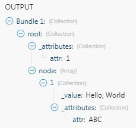

# XML

Le [!UICONTROL XML] L’application vous permet d’analyser un texte au format XML à l’aide de la fonction [!UICONTROL XML] > [!UICONTROL Parse XML] et convertissez-le en un lot afin de rendre les données disponibles pour d’autres modules. Vous pouvez également convertir un lot en texte XML au moyen de l’option [!UICONTROL XML] > [!UICONTROL Créer du XML] module

## Exigences d’accès

Vous devez disposer des accès suivants pour utiliser les fonctionnalités de cet article :

<table style="table-layout:auto"> 
 <col> 
 <col> 
 <tbody> 
  <tr> 
   <td role="rowheader">[!DNL Adobe Workfront] plan*</td>
  <td> <p>[!UICONTROL Pro] ou version ultérieure</p> </td>
  </tr> 
  <tr data-mc-conditions=""> 
   <td role="rowheader">[!DNL Adobe Workfront] license*</td>
   <td> <p>[!UICONTROL Plan], [!UICONTROL Work]</p> </td> 
  </tr> 
  <tr> 
   <td role="rowheader">[!DNL Adobe Workfront Fusion] license**</td> 
   <td> <p>[!UICONTROL [!DNL Workfront Fusion] pour l’automatisation et l’intégration du travail] </p>  </td>  
  </tr> 
  <tr> 
   <td role="rowheader">Produit</td> 
   <td>Votre entreprise doit acheter [!DNL Adobe Workfront Fusion] ainsi que [!DNL Adobe Workfront] pour utiliser la fonctionnalité décrite dans cet article.</td> 
  </tr> 
 </tbody> 
</table>

Pour connaître le plan, le type de licence ou l’accès dont vous disposez, contactez votre [!DNL Workfront] administrateur.

Pour plus d’informations sur [!DNL Adobe Workfront Fusion] licences, voir [[!DNL Adobe Workfront Fusion] licences](../../workfront-fusion/get-started/license-automation-vs-integration.md).

## [!UICONTROL Parse XML]

Le [!UICONTROL XML] > [!UICONTROL Parse XML] module analyse un texte au format XML et génère un seul lot contenant toutes les informations extraites du XML.

<table style="table-layout:auto"> 
 <col> 
 <col> 
 <tbody> 
  <tr> 
   <td role="rowheader"> <p>[!UICONTROL Structure de données]</p> </td> 
   <td> <p>La structure de données décrit la structure du XML pour rendre la sortie du module disponible dans le panneau de mappage pour les modules suivants.</p> <p>Si vous disposez d’un exemple du XML que vous souhaitez analyser, vous pouvez l’utiliser pour générer la structure de données :</p> 
    <ol> 
     <li value="1">Cliquez sur le bouton <strong>[!UICONTROL Ajouter]</strong> bouton .</li> 
     <li value="2">Cliquez sur le bouton <strong>[!UICONTROL Generator]</strong> bouton .</li> 
     <li value="3">Copiez et collez l’exemple XML dans le <strong>[!UICONTROL Exemple de données]</strong> champ .</li> 
     <li value="4">Cliquez sur <strong>[!UICONTROL Enregistrer]</strong>.</li> 
     <li value="5">Vérifiez que la structure de données a bien été générée.</li> 
     <li value="6"> <p>Cliquez sur le bouton <strong>[!UICONTROL Enregistrer]</strong> pour enregistrer la structure des données.</p> <p>Vous pouvez ignorer les étapes 2 à 5 pour fournir une structure de données vide. Si la structure de données est vide, la sortie du module n’est pas disponible dans le panneau de mappage tant que le module n’a pas été exécuté au moins une fois.</p> </li> 
    </ol> <p>Pour plus d’informations, voir <a href="../../workfront-fusion/modules/data-structures.md" class="MCXref xref">Structures de données dans [!DNL Adobe Workfront Fusion]</a>.</p> </td> 
  </tr> 
  <tr> 
   <td role="rowheader">[!UICONTROL Conserver les nombres en tant que texte]</td> 
   <td>Activez cette option pour vous assurer que les nombres restent des valeurs de texte (chaîne). Dans le cas contraire, les nombres sont convertis en valeurs numériques.</td> 
  </tr> 
  <tr> 
   <td role="rowheader"> <p>[!UICONTROL XML]</p> </td> 
   <td> <p>Saisissez ou mappez le texte XML formaté que vous souhaitez analyser.</p> <p>Si vous utilisez une formule, assurez-vous que son type de valeur de résultat est (ou peut être automatiquement contraint) le type de données [!UICONTROL Text]. </p> <p>  </p> <p>Si le type de valeur de résultat est [!UICONTROL Buffer] (données binaires), utilisez la variable <code>toString()</code> pour la convertir en type de données Texte . Pour plus d’informations, voir <a href="../../workfront-fusion/mapping/type-coercion.md" class="MCXref xref">Type de contrainte dans [!DNL Adobe Workfront Fusion]</a> et <a href="../../workfront-fusion/mapping/item-data-types.md" class="MCXref xref">Types de données d’élément dans [!UICONTROL Adobe Workfront Fusion]</a>.</p> </td> 
  </tr> 
 </tbody> 
</table>

>[!INFO]
>
>**Exemple :** Pour télécharger un fichier XML à partir d’une URL et analyser son contenu :
>
>1. Créez un scénario.
>1. Insérer [!UICONTROL HTTP] > [!UICONTROL Obtention d’un fichier] module
>1. Ouvrez la configuration du module et configurez-la comme suit :

>
>   **URL**: URL du fichier XML (par ex. `https://siftrss.com/f/rqLy05ayMBJ`)
>
>   
>
>1. Cliquez sur **[!UICONTROL OK]**&#x200B; enregistrer et fermer la configuration du module.
1. Ajouter [!UICONTROL XML] > [!UICONTROL Parse XML] , connectez-la après la fonction [!UICONTROL HTTP] > [!UICONTROL Obtention d’un fichier] et configurez-le comme suit :
<table style="table-layout:auto"> 
&gt;    <col> 
&gt;    <col> 
&gt;    <tbody> 
&gt;     <tr> 
&gt;      <td role="rowheader">[!UICONTROL Structure de données]</td> 
&gt;      <td> 
&gt;       <ol> 
&gt;        <li value="1">Cliquez sur le bouton <strong>[!UICONTROL Ajouter]</strong> bouton .</li> 
&gt;        <li value="2">Cliquez sur le bouton <strong>[!UICONTROL Generator]</strong> bouton .</li> 
&gt;        <li value="3">Dans votre navigateur web, ouvrez un nouvel onglet ou une nouvelle fenêtre.</li> 
&gt;        <li value="4">Insérez l’URL que vous avez utilisée à la troisième étape dans la barre d’adresse et récupérez le fichier XML.</li> 
&gt;        <li value="5">Sélectionnez tout le texte XML et copiez-le dans le Presse-papiers.</li> 
&gt;        <li value="6">Fermez l’onglet ou la fenêtre et revenez à votre scénario.</li> 
&gt;        <li value="7">Collez le texte XML copié dans le champ Exemple de données .</li> 
&gt;        <li value="8">Cliquez sur <strong>[!UICONTROL Enregistrer]</strong>.</li> 
&gt;        <li value="9">Vérifiez que la structure de données a bien été générée.</li> 
&gt;        <li value="10">Cliquez sur <strong>[!UICONTROL Enregistrer]</strong> pour enregistrer la structure de données.</li> 
&gt;       </ol> <p>Vous pouvez ignorer les étapes 2 à 9 pour fournir une structure de données vide. Si la structure de données est vide, la sortie du module n’est pas disponible dans le panneau de mappage tant que le module n’a pas été exécuté au moins une fois.</p> </td> 
&gt;     </tr> 
&gt;     <tr> 
&gt;      <td role="rowheader">[!UICONTROL XML]</td> 
&gt;      <td> <p>Faites correspondre la variable <code>Data </code>à partir de la sortie du module [!UICONTROL HTTP] &gt; [!UICONTROL Obtenir un fichier] dans le champ . Utilisez la variable <code>toString()</code> pour convertir sa valeur du type de données [!UICONTROL Buffer] (données binaires) en type de données [!UICONTROL Texte] .</p> <p>Vous pouvez copier et coller le code de la formule dans le champ : <code>&#123;&#123;toString(1.data)&#125;&#125;</code></p> <p>Pour plus d’informations sur les types de données de mémoire tampon et de texte, voir <a href="../../workfront-fusion/mapping/item-data-types.md" class="MCXref xref">Types de données d’élément dans Adobe Workfront Fusion</a>.</p> <p>  </p> </td> 
&gt;     </tr> 
&gt;    </tbody> 
&gt;   </table>


## [!UICONTROL Analyse des attributs XML]

Par défaut, la variable [!UICONTROL XML] > [!UICONTROL Parse XML] module place des attributs dans une collection spéciale `_attributes` en tant qu’enfant du noeud qui possède ces attributs. Si le noeud est un noeud de texte doté d’attributs, deux propriétés spéciales sont ajoutées : `_attributes` pour les attributs et `_value` pour le contenu textuel du noeud.

>[!INFO]
**Exemple :** Ce XML :

```
<root attr="1">
<node attr="ABC">Hello, World</node>
</root>
```

est converti en ce lot :



## Créer du XML

Le [!UICONTROL XML] > [!UICONTROL Créer du XML] convertit un lot en texte au format XML.

<table style="table-layout:auto"> 
 <col> 
 <col> 
 <tbody> 
  <tr> 
   <td role="rowheader"> <p>[!UICONTROL Structure de données]</p> </td> 
   <td> <p>La structure de données décrit la structure du XML obtenu. Si vous disposez d’un exemple du XML que vous souhaitez créer, vous pouvez l’utiliser pour générer la structure de données :</p> 
    <ol> 
     <li value="1">Cliquez sur le bouton <strong>[!UICONTROL Ajouter]</strong> bouton .</li> 
     <li value="2">Cliquez sur le bouton <strong>[!UICONTROL Generator]</strong> bouton .</li> 
     <li value="3">Copiez et collez l’exemple XML dans le champ Exemple de données .</li> 
     <li value="4">Cliquez sur le bouton <strong>[!UICONTROL Enregistrer]</strong> bouton .</li> 
     <li value="5">Vérifiez que la structure de données a bien été générée.</li> 
     <li value="6">Cliquez sur <strong>[!UICONTROL Enregistrer]</strong> pour enregistrer la structure de données.</li> 
    </ol> </td> 
  </tr> 
  <tr> 
   <td role="rowheader">[!UICONTROL Nom de l’élément racine]</td> 
   <td>Saisissez le nom de l’élément racine du XML. La valeur par défaut est <code>root</code>.</td> 
  </tr> 
  <tr> 
   <td role="rowheader">[!UICONTROL ID SYSTÈME Doctype]</td> 
   <td>Saisissez le nom du fichier à utiliser dans la variable<code> !DOCTYPE SYSTEM</code> déclaration</td> 
  </tr> 
  <tr> 
   <td role="rowheader">[!UICONTROL Doctype ID PUBLIC]</td> 
   <td>Saisissez le nom du fichier à utiliser dans la variable<code> !DOCTYPE PUBLIC</code> déclaration</td> 
  </tr> 
  <tr> 
   <td role="rowheader">[!UICONTROL Strip Xml Déclaration]</td> 
   <td>Activer cette option pour supprimer la déclaration XML <code>&lt;?xml ... ?&gt;</code> et <code>&lt;!DOCTYPE ... &gt;</code>et ne conservez que l’élément racine XML et son contenu.</td> 
  </tr> 
 </tbody> 
</table>

>[!INFO]
**Exemple:**
Un cas d’utilisation type consiste à transformer des données d’une [!DNL Google] >feuille de calcul au format XML.
1. Placez le [!DNL Google Sheets] > [!UICONTROL Sélectionner des lignes] dans votre scénario pour récupérer les données. Configurez le module pour récupérer les lignes de votre [!DNL Google] feuille de calcul. Définissez la &#x200B;**[!UICONTROL Nombre maximal de lignes renvoyées]** à un petit nombre, mais plus grand qu’un à des fins de test (par exemple, trois). Exécutez le [!DNL Google Sheets] en cliquant dessus avec le bouton droit et en choisissant &quot;**[!UICONTROL Exécuter ce module uniquement]**.&quot; Vérifiez la sortie du module.
1. Connectez-vous au [!UICONTROL Agrégateur de tableau] après l’événement [!DNL Google Sheets] module . Dans la configuration du module, sélectionnez la variable [!DNL Google Sheets] du module **[!UICONTROL Noeud source]** champ . Laissez les autres champs tels quels pour le moment.
1. Connectez-vous au [!UICONTROL XML] > [!UICONTROL Créer du XML] après l’événement [!UICONTROL Agrégateur de tableau] module .
   La configuration du module nécessite une structure de données qui décrit la structure de la sortie XML. Cliquez sur le bouton **[!UICONTROL Ajouter]** pour ouvrir la configuration de la structure de données. La méthode la plus simple pour créer cette structure de données consiste à la générer automatiquement à partir d’un exemple XML.
1. Cliquez sur le bouton **[!UICONTROL Générateur]** et collez votre exemple XML dans le [!UICONTROL Exemples de données] field :


1. Cliquer sur **[!UICONTROL Enregistrer]**. Le champ Spécification de la structure de données contient désormais la structure générée.
1. Remplacez le nom de votre structure de données par un nom plus spécifique, puis cliquez sur **[!UICONTROL Enregistrer]**. Un champ correspondant à l’attribut de tableau racine apparaît comme champ mappable dans la configuration du module JSON.
1. Cliquez sur le bouton **[!UICONTROL Carte]** en regard du champ et mappez le `Array[]` de l’élément [!UICONTROL Agrégateur de tableau] en sortie :
1. Cliquez sur **[!UICONTROL OK]** pour fermer la configuration du module XML.
1. Ouvrez la configuration du [!UICONTROL Agrégateur de tableau] module . Modifiez la variable **[!UICONTROL Structure cible]** de Personnalisé au champ d’un module XML correspondant à l’élément XML parent. Mappez les éléments de la variable [!DNL Google Sheets] aux champs appropriés.
1. Cliquez sur **[!UICONTROL OK]** pour fermer la configuration du module d’agrégation de tableaux.
1. Exécutez le scénario.

   Le module XML génère le fichier XML correct.
1. Ouvrez la configuration du [!DNL Google Sheets] et augmentez la variable [!UICONTROL Nombre maximal de lignes renvoyées] pour traiter toutes les données.
   Le fichier XML obtenu peut être enregistré dans [!DNL Dropbox], envoyé en tant que pièce jointe par courrier électronique, téléchargé via FTP sur un serveur, etc.


## Ajout d’attributs XML

Si vous souhaitez ajouter des attributs à un noeud complexe (un noeud qui contiendra d’autres noeuds), vous devez ajouter une collection nommée . `_attributes` pour la note complexe de votre structure de données personnalisée. Cette collection sera mappée aux attributs de noeud. Si vous souhaitez ajouter des attributs à un noeud de texte (par exemple : `<node attr="1">abc</node>`), vous devez ajouter une collection. `_attributes` pour les attributs et une propriété de texte `_value` pour la valeur de noeud de ce noeud dans votre structure de données personnalisée.

```
{
   "name": "node",
   "type": "collection",
   "spec": [
      {
         "name": "_attributes",
         "type": "collection"
         "spec": [
            {
               "name": "attr1",
               "type": "text"
            }
         ]
      },
      {
         "name": "_value",
         "type": "text"
      }
   ]
}
```

## Dépannage : Impossible de mapper les données de la variable [!UICONTROL Parse XML] module

Assurez-vous que la structure des données est correctement définie. Vous pouvez également utiliser une structure de données vide et exécuter le module au moins une fois pour traiter une entrée XML.
