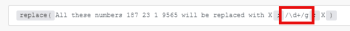

# Fonctions de chaîne dans [!DNL Adobe Workfront Fusion]

## Conditions d’accès

Pour utiliser les fonctionnalités décrites dans cet article, vous devez disposer des éléments suivants :

<table style="table-layout:auto"> 
 <col>  
 <col>  
 <tbody>  
  <tr>  
   <td role="rowheader">[!DNL Adobe Workfront] plan</td>  
   <td> 
N’importe quelle
 </td>  
  </tr>  
  <tr data-mc-conditions="">  
   <td role="rowheader">[!DNL Adobe Workfront] licence</td>  
   <td> 
Nouvelle : [!UICONTROL Standard]

Ou

Actuelle : [!UICONTROL Work] ou licence supérieure
 </td>  
  </tr>  
  <tr>  
   <td role="rowheader">[!DNL Adobe Workfront Fusion] licence**</td>  
   <td> 
   
Actuel : aucune exigence de licence [!DNL Workfront Fusion].
 
   
Ou
 
   
Hérité : Tout 
 
   </td>  
  </tr>  
  <tr>  
   <td role="rowheader">Produit</td>  
   <td> 
   
Nouveau :
 <ul><li>Formule [!UICONTROL Select] ou [!UICONTROL Prime] [!DNL Workfront] : votre entreprise doit acheter [!DNL Adobe Workfront Fusion].</li><li>Plan [!UICONTROL Ultimate] [!DNL Workfront] : [!DNL Workfront Fusion] est inclus.</li></ul> 
   
Ou
 
   
Actuel : votre organisation doit acheter [!DNL Adobe Workfront Fusion].
 
   </td>  
  </tr> 
 </tbody>  
</table>

Pour plus d’informations sur ce tableau, consultez [Conditions d’accès requises dans la documentation Workfront](/help/quicksilver/administration-and-setup/add-users/access-levels-and-object-permissions/access-level-requirements-in-documentation.md).

Pour plus d’informations sur les licences [!DNL Adobe Workfront Fusion], consultez les [[!DNL Adobe Workfront Fusion] licences](../../workfront-fusion/get-started/license-automation-vs-integration.md).

## [!UICONTROL length (texte ou mémoire tampon)]

Renvoie la longueur de la chaîne de texte (nombre de caractères) ou de la mémoire tampon binaire (taille de la mémoire tampon en octets).

>[!INFO]
>
>**Exemple :**
>
>`length( hello )`
>
>Renvoie : 5

## [!UICONTROL lower (text)]

Convertit en minuscules tous les caractères alphabétiques d’une chaîne de texte.

>[!INFO]
>
>**Exemple :**
>
>`lower( Hello )`
>
>Renvoie : hello

## [!UICONTROL capitalize (texte)]

Convertit le premier caractère d’une chaîne de texte en majuscules.

>[!INFO]
>
>**Exemple :**
>
>`capitalize( workfront )`
>
>Renvoie : [!DNL Workfront]

## [!UICONTROL startcase (texte)]

Met en majuscules la première lettre de chaque mot et toutes les autres lettres en minuscules.

>[!INFO]
>
>**Exemple :**
>`startcase( hello WORLD )`
>
>Renvoie : [!UICONTROL Hello World]

## [!UICONTROL ascii (text; [remove diacritics])]

Supprime tous les caractères non ascii d’une chaîne de texte.

>[!INFO]
>
>**Exemples :**
>
>* `ascii(` `Wěošrčkřfžrýoáníté` `)`
>
>   Renvoie : [!DNL Workfront]
>
>* `ascii(` `ěščřž` `;` `true` `)`
>
>   Renvoie : [!UICONTROL escrz]

## [!UICONTROL replace (text;search string; remplacement string)]

Remplace la chaîne de recherche par la nouvelle chaîne.

>[!INFO]
>
>**Exemple :**
>
>`replace( Hello World ; Hello ; Hi )`
>
>Renvoie : [!UICONTROL Hello World]

Les expressions régulières (incluses dans `/.../`) peuvent être utilisées comme chaîne de recherche avec une combinaison d’indicateurs (tels que `g`, `i`, `m`) ajoutés :

>[!INFO]
>
>**Exemple :**
>
>
>
>Tous ces nombres X X X X sont remplacés par X

La chaîne de remplacement peut inclure les modèles de remplacement spéciaux suivants :

* `$&` Insère la sous-chaîne correspondante.
* `$n` Lorsque n est un entier positif inférieur à 100, insère la énième chaîne de sous-correspondance entre parenthèses. Il est indexé à 1.

>[!INFO]
>
>**Exemples :**
>
>
>
>Renvoie : numéro de téléphone `+420777111222`
>>
>
>
>Renvoie : numéro de téléphone : `+420777111222`

>[!CAUTION]
>
>N’utilisez pas de groupes de capture nommés tels que `/ is (?<number>\d+)/` dans l’argument de chaîne de remplacement. Cela entraîne une erreur.

Pour plus d’informations sur les expressions régulières, voir [Analyseur de texte](../../workfront-fusion/apps-and-their-modules/text-parser.md).

## [!UICONTROL trim (texte)]

Supprime les espaces au début ou à la fin du texte.

## [!UICONTROL upper (text)]

Convertit en majuscules tous les caractères alphabétiques d’une chaîne de texte.

>[!INFO]
>
>**Exemple :**
>
>`upper( Hello )`
>
>Renvoie : [!UICONTROL HELLO]

## [!UICONTROL substring (text; start;end)]

Renvoie une partie d’une chaîne de texte entre la position &quot;début&quot; et la position &quot;fin&quot;.

>[!INFO]
>
>**Exemples :**
>
>* `substring( Hello ; 0 ; 3)`
>
>   Renvoie : aide
>
>* `substring( Hello ; 1 ; 3 )`
>
>   Renvoie : el

## [!DNL indexOf (string; value; [start])]

Renvoie la position de la première occurrence d’une valeur spécifiée dans une chaîne. Cette méthode renvoie &quot;-1&quot; si la valeur recherchée n’est pas présente. La valeur start indique où la recherche doit commencer dans la chaîne.

>[!INFO]
>
>**Exemples :**
>
>* `indexOf( Workfront ; o )`
>
>   Renvoie : 1
>
>* `indexOf( Workfront ; x )`
>
>   Renvoie : -1
>
>* `indexOf( Workfront ; o ; 3 )`
>
>   Renvoie : 6

## [!UICONTROL toBinary (value)]

Convertit n’importe quelle valeur en données binaires.

Vous pouvez également spécifier le codage comme second argument pour appliquer des conversions binaires de hex ou base64 aux données binaires.

>[!INFO]
>
>**Exemples :**
>
>* `toBinary( Workfront )`
>
>   Renvoie : 57 6f 72 6b 66 72 6f 6e 74
>
>* `toBinary( V29ya2Zyb250 ; base64 )`
>
>   Renvoie : 57 6f 72 6b 66 72 6f 6e 74

## [!UICONTROL toString (valeur)]

Convertit n’importe quelle valeur en chaîne.

## [!UICONTROL encodeURL (text)]

Code les caractères spéciaux de certains textes à une adresse URL valide.

## [!UICONTROL decodeURL (text)]

Décode les caractères spéciaux d’une URL en texte.

>[!INFO]
>
>**Exemple :**
>`decodeURL( Automate%20your%20workflow )`
>
>Renvoie : [!UICONTROL Automatiser votre workflow]

## [!UICONTROL escapeHTML (text)]

Permet d’ignorer toutes les balises d’HTML dans le texte.

>[!INFO]
>
>**Exemple :**
>
>`escapeHTML( <b>Hello</b> )`
>
> Renvoie : `&lt;b&gt;Hello&lt;/b&gt;`

## [!UICONTROL escapeMarkdown(text)]

Permet d’ignorer toutes les balises Markdown dans le texte.

>[!INFO]
>
>**Exemple :**
>
>`escapeMarkdown( # Header )`
>
>Renvoie : `&#35; Header`

## [!UICONTROL stripHTML (texte)]

Supprime toutes les balises HTML du texte.

>[!INFO]
>
>**Exemple :**
>
>`stripHTML( <b>Hello</b> )`
>
>Renvoie : Hello

## contains (texte ; chaîne de recherche)

Vérifie si le texte contient la chaîne de recherche.

>[!INFO]
>
>**Exemples :**
>
>* `contains( Hello World ; Hello )`
>
>   Renvoie : [!UICONTROL true]
>
>* `contains( Hello World ; Bye )`
>
>   Renvoie : [!UICONTROL false]

## [!UICONTROL split (text; separator)]

Divise une chaîne en un tableau de chaînes en la séparant en sous-chaînes.

>[!INFO]
>
>**Exemple :**
>
>`split( John, George, Paul ; , )`

## [!UICONTROL md5 (texte)]

Calcule le hachage md5 d&#39;une chaîne.

>[!INFO]
>
>**Exemple :**
>
>`md5( Workfront )`
>
>Renvoie : `1448bbbeaa7a9b8091d426999f1f666b`

## [!UICONTROL sha1 (texte; [encoding]; [key])]

Calcule le hachage sha1 d’une chaîne. Si l’argument clé est spécifié, le hachage HMAC sha1 est renvoyé à la place. Codages pris en charge : &quot;hex&quot; (par défaut), &quot;base64&quot; ou &quot;latin1&quot;.

>[!INFO]
>
>**Exemple :**
>
>`sha1( workfront )`
>
>Renvoie : b2b30b8ae1f9e5b40fbb0696eaabdbfd8d0c087f

## [!UICONTROL sha256 (texte ; [encoding]; [key])]

Calcule le hachage sha256 d’une chaîne. Si l’argument clé est spécifié, le hachage HMAC sha256 est renvoyé à la place. Codages pris en charge : &quot;hex&quot; (par défaut), &quot;base64&quot; ou &quot;latin1&quot;.>

>[!INFO]
>
>**Exemple :**
>
>`sha256( workfront )`
>
>Renvoie : ed3d7397eec7b94453035b67ba4468c83ee3bedeb57137f7371f2e0cf5e2bbc

## [!UICONTROL sha512 (texte ; [codage de sortie] ; [clé] ; [codage de clé])]

Calcule le hachage sha512 d’une chaîne. Si l’argument clé est spécifié, le hachage sha512 HMAC est renvoyé à la place.

Codages pris en charge :

* &quot;[!UICONTROL hex]&quot; (par défaut)
* &quot;[!UICONTROL base64]&quot;
* &quot;[!UICONTROL latin1]&quot;

Codages de clé pris en charge :

* &quot;[!UICONTROL text]&quot; (par défaut)
* &quot;[!UICONTROL hex]&quot;
* &quot;[!UICONTROL base64]&quot; ou &quot;[!UICONTROL binary]&quot;

Lors de l’utilisation de l’encodage de la clé &quot;[!UICONTROL binary]&quot;, une clé doit être un tampon et non une chaîne.

>[!INFO]
>
>**Exemple :**
>
>`sha512(workfront)`
>
>Renvoie : 789ae41b9456357e4f27c6a09956a767abbb8d80b206003ffdd1e94dbc687cd119b85e1e19db58bb44b2344933 5fd431639c0345aadf2cf7ec26e9f4a7fb19

## [!UICONTROL base64 (texte)]

Transforme le texte en base64.

>[!INFO]
>
>**Exemple :**
>
>`base64( workfront )`
>
>Renvoie : d29ya2Zyb250==
