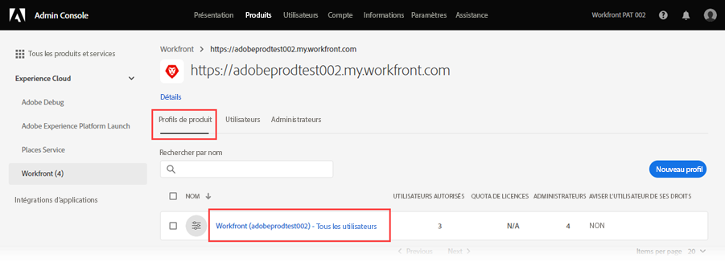

# Ajoutez des utilisateurs à [!DNL Adobe Workfront Fusion] via le [!DNL Adobe Admin Console]

>[!IMPORTANT]
>
>Les procédures décrites sur cette page s’appliquent uniquement aux organisations qui ont été intégrées à [!DNL Adobe Admin Console].
>
>Si votre organisation n’a pas encore été intégrée à [!DNL Adobe Admin Console], voir [Ajout d’un utilisateur à une organisation dans [!DNL Adobe Workfront Fusion]](../organizations/add-user-to-an-organization.md).
>
>Pour obtenir une liste des procédures différentes selon que votre organisation a été intégrée à [!DNL Adobe Admin Console], voir [Différences d’administration basées sur les plateformes ([!DNL Adobe Workfront Fusion]/[!DNL Adobe Business Platform])](../fusion-in-admin-console/fusion-adobe-admin-console.md).

Vous pouvez ajouter un utilisateur à [!DNL Adobe Admin Console] et l&#39;affecter à [!DNL Adobe Workfront Fusion] ou affecter un utilisateur existant de [!DNL Adobe Admin Console] à [!DNL Workfront Fusion].

Pour une vidéo décrivant [!DNL Workfront Fusion] dans [!DNL Adobe Admin Console], y compris comment ajouter des utilisateurs, voir [[!DNL Fusion] sur Adobe IMS](https://video.tv.adobe.com/v/3412464/){target=_blank}.

## Conditions d’accès

Pour utiliser les fonctionnalités décrites dans cet article, vous devez disposer des éléments suivants :

<table style="table-layout:auto"> 
 <col> 
 <col> 
 <tbody> 
  <tr> 
   <td role="rowheader">[!DNL Adobe Workfront] forfait*</td> 
   <td> 
[!UICONTROL Pro] ou un forfait supérieur
 </td> 
  </tr> 
  <tr data-mc-conditions=""> 
   <td role="rowheader">[!DNL Adobe Workfront] licence*</td> 
   <td> 
[!UICONTROL Plan], [!UICONTROL Work]
 </td> 
  </tr> 
  <tr> 
   <td role="rowheader">[!DNL Adobe Workfront Fusion] licence**</td> 
   <td>
   
Exigences de licence actuelle : aucune exigence de licence [!DNL Workfront Fusion]

   
Ou

   
Exigence de licence héritée : [!UICONTROL [!DNL Workfront Fusion] for Work Automation and Integration] 

   </td> 
  </tr> 
  <tr> 
   <td role="rowheader">Produit</td> 
   <td>
   
Exigences du produit actuel : si vous disposez du forfait [!DNL Adobe Workfront] [!UICONTROL Select] ou [!UICONTROL Prime], votre entreprise doit acheter [!DNL Adobe Workfront Fusion] et [!DNL Adobe Workfront] pour utiliser les fonctionnalités décrites dans cet article. [!DNL Workfront Fusion] est inclus dans le forfait [!DNL Workfront] [!UICONTROL Ultimate].

   
Ou

   
Exigences du produit hérité : votre entreprise doit acheter [!DNL Adobe Workfront Fusion] et [!DNL Adobe Workfront] pour utiliser les fonctionnalités décrites dans cet article.

   </td> 
  </tr>
   <tr> 
   <td role="rowheader">[!DNL Adobe] droits d’administrateur</td> 
   <td>Vous devez être un [!UICONTROL Product Configuration Administrator] de [!DNL Adobe] produits pour votre entreprise.</td> 
  </tr>
  </tbody> 
</table>

&#42;Pour connaître le plan, le type de licence ou l’accès dont vous disposez, contactez votre administrateur ou administratrice [!DNL Workfront].

&#42;&#42; Pour plus d’informations sur les [!DNL Adobe Workfront Fusion] licences, voir [[!DNL Adobe Workfront Fusion] licences](../../workfront-fusion/get-started/license-automation-vs-integration.md)

## Conditions préalables

Avant d’utiliser [!DNL Admin Console] pour [!DNL Workfront], vous devriez recevoir un courrier électronique vous invitant à accéder à la console.

1. Si vous découvrez [!DNL Adobe] et que vous avez reçu un courrier électronique vous indiquant que vous disposez désormais des droits d’administration pour gérer les logiciels et services [!DNL Adobe] pour votre organisation, cliquez sur le bouton de l’e-mail pour créer un compte [!DNL Adobe] et ouvrez le [!DNL Admin Console].

   Ou

   Si vous disposez déjà d’un compte d’Adobe, accédez à la [[!DNL Adobe Admin Console] page](https://adminconsole.adobe.com/).

## Ajoutez un nouvel utilisateur à [!DNL Adobe Admin Console] et [!DNL Workfront Fusion]

1. Sur la [[!DNL Adobe Admin Console] page](https://adminconsole.adobe.com/), sélectionnez l’onglet **[!UICONTROL Produits]** dans la barre de navigation supérieure, puis sélectionnez la mosaïque du produit **[!DNL Workfront Fusion]**.

   

1. Dans la liste qui s’affiche, sélectionnez l’organisation à laquelle vous souhaitez ajouter un utilisateur.

   

1. Dans la liste qui s’affiche, avec l’onglet **[!UICONTROL Profils de produit]** sélectionné, cliquez sur le nom du lien [!DNL Workfront Fusion] [!UICONTROL  Profil de produit ].

   

   >[!IMPORTANT]
   >
   > N’apportez aucune modification au [!UICONTROL profil de produit] lui-même.

1. Avec l’onglet **[!UICONTROL Utilisateurs]** sélectionné au-dessus de la liste, cliquez sur **[!UICONTROL Ajouter un utilisateur]**.

1. Dans la zone **[!UICONTROL Ajouter des utilisateurs à ce profil de produit]**, saisissez l’adresse électronique ou le nom d’un utilisateur à ajouter, puis sélectionnez l’utilisateur dans la liste qui s’affiche.

1. Cliquer sur **[!UICONTROL Enregistrer]**.

   L’utilisateur est créé dans [!DNL Workfront Fusion].

   <!--
    >[!IMPORTANT]
    >
    > Do not make any changes to the Product Profile itself.
    -->

1. (Facultatif) Passez à [Modifier le niveau d’accès d’un utilisateur dans [!DNL Workfront Fusion]](#change-a-users-access-level-in-workfront-fusion)

## Modification du niveau d’accès d’un utilisateur dans Workfront Fusion

### Remplacer le rôle d’un utilisateur par Administrateur

Attribuer un rôle d’administrateur à un utilisateur doit être effectué dans le [!DNL Adobe Admin Console].

1. Sur la page [!DNL Workfront Fusion] [!UICONTROL Profil produit] où vous avez ajouté l’utilisateur, sélectionnez l’onglet **[!UICONTROL Admins]** .

1. Cliquez sur **[!UICONTROL Ajouter un administrateur]**.

1. Dans la zone **[!UICONTROL Ajouter des administrateurs de profil de produit]**, saisissez l’adresse électronique ou le nom d’un utilisateur que vous souhaitez ajouter, puis sélectionnez l’utilisateur dans la liste qui s’affiche.

1. Cliquer sur **[!UICONTROL Enregistrer]**.

   Cet utilisateur est désormais administrateur dans [!DNL Workfront Fusion].

### Remplacez le rôle d’un utilisateur par [!UICONTROL Member], [!UICONTROL Account] ou [!UICONTROL App Developer].

Les rôles [!UICONTROL Member], [!UICONTROL Account] et [!UICONTROL App Developer] sont gérés dans [!DNL Workfront Fusion].

Pour obtenir des instructions, reportez-vous à la section [Affichage ou modification des rôles utilisateur](../organizations/manage-fusion-users.md#view-or-edit-user-roles) de l’article [Gérer [!DNL Adobe Workfront Fusion] les utilisateurs de votre organisation](../organizations/manage-fusion-users.md)

## Affectez un utilisateur existant dans le [!DNL Adobe Admin Console] à [!DNL Workfront Fusion]

1. Commencez à modifier l’utilisateur comme décrit dans la section &quot;Modifier les détails de l’utilisateur&quot; de l’article [Gérer les utilisateurs individuellement](https://helpx.adobe.com/fr/enterprise/using/manage-users-individually.html) de la documentation [!DNL Adobe Admin Console].

1. Ajoutez **[!DNL Adobe Workfront Fusion]** aux produits affectés à l’utilisateur.
