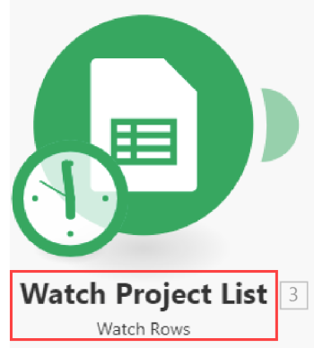

# Créer un scénario d’intégration pratique dans Adobe Workfront Fusion

Cet article décrit comment créer un scénario d’intégration avec Adobe Workfront Fusion. Les scénarios d’intégration connectent des applications distinctes, ce qui permet à vos données d’évoluer dans différentes applications.

Pour créer un scénario d’intégration, votre entreprise doit disposer d’un [!DNL Workfront Fusion for Work Automation and Integration] licence.

Pour plus d’informations sur la création d’un scénario d’automatisation Workfront uniquement, voir [Créer un scénario d’automatisation des pratiques dans Adobe Workfront Fusion](../../workfront-fusion/get-started/create-a-practice-automation-scenario.md)

Pour plus d’informations sur les licences Workfront Fusion, voir [Licences Adobe Workfront Fusion](../../workfront-fusion/get-started/license-automation-vs-integration.md).

>[!NOTE]
>
>Votre entreprise peut ne pas autoriser l’accès aux feuilles de calcul Google. Si tel est le cas, vous ne pourrez pas configurer cette intégration, mais les informations présentées ici peuvent être utilisées comme exemple général du fonctionnement des scénarios d’intégration.

## Conditions d’accès

Pour utiliser les fonctionnalités décrites dans cet article, vous devez disposer des éléments suivants :

<table style="table-layout:auto"> 
 <col> 
 <col> 
 <tbody> 
  <tr> 
    <td role="rowheader">[!DNL Adobe Workfront] forfait*</td> 
   <td> 
[!DNL Pro] ou supérieur
 </td> 
  </tr> 
  <tr data-mc-conditions=""> 
   <td role="rowheader">[!DNL Adobe Workfront] licence*</td> 
   <td> 
[!UICONTROL Plan], [!UICONTROL Work]
 </td> 
  </tr> 
  <tr> 
   <td role="rowheader">Licence [!UICONTROL Adobe Workfront Fusion]**</td> 
   <td>
   
Exigences de licence actuelle : aucune exigence de licence [!DNL Workfront Fusion]

   
Ou

   
Exigences de licence héritées : [!UICONTROL [!DNL Workfront Fusion] pour l’automatisation et l’intégration du travail] 

   </td> 
  </tr> 
  <tr> 
   <td role="rowheader">Produit</td> 
   <td>
   
Exigences du produit actuel : si vous disposez du forfait [!DNL Adobe Workfront] [!UICONTROL Select] ou [!UICONTROL Prime], votre entreprise doit acheter [!DNL Adobe Workfront Fusion] et [!DNL Adobe Workfront] pour utiliser les fonctionnalités décrites dans cet article. [!DNL Workfront Fusion] est inclus dans le forfait [!DNL Workfront] [!UICONTROL Ultimate].

   
Ou

   
Exigences du produit hérité : votre entreprise doit acheter [!DNL Adobe Workfront Fusion] et [!DNL Adobe Workfront] pour utiliser les fonctionnalités décrites dans cet article.

   </td> 
  </tr> 
 </tbody> 
</table>

Pour connaître la formule, le type de licence ou l’accès dont vous disposez, contactez vote administrateur ou administratrice [!DNL Workfront].

Pour plus d’informations sur les licences [!DNL Adobe Workfront Fusion], consultez les [[!DNL Adobe Workfront Fusion] licences](../../workfront-fusion/get-started/license-automation-vs-integration.md).

## Création d’un scénario d’entraînement

Le rôle de [!DNL Adobe Workfront Fusion] est d’automatiser vos processus afin que vous puissiez vous concentrer sur de nouvelles tâches plutôt que de répéter les mêmes tâches encore et encore. Il fonctionne en liant les actions dans et entre les applications et les services pour créer un scénario qui transfère et transforme vos données automatiquement. Le scénario que vous créez recherche les données dans une application ou un service et traite ces données pour obtenir le résultat souhaité.

Un scénario se compose d’une série de modules qui indiquent comment les données doivent être transformées dans une application ou transférées entre les applications et les services web.

Pour expliquer comment créer un scénario et renforcer les bonnes pratiques à mesure que vous apprenez à utiliser [!DNL Workfront Fusion], cet article vous guide tout au long du processus, étape par étape. Nous allons créer un scénario qui crée un nouvel enregistrement dans [!DNL Workfront] pour chaque ligne d’un [!DNL Google Sheets] feuille de calcul.

>[!TIP]
>
>Un tel scénario serait utile si vous aviez une feuille de calcul répertoriant les projets sur lesquels vous devez travailler à l’aide de projets dans [!DNL Workfront]. Le scénario peut &quot;regarder&quot; la feuille de calcul pour trouver de nouvelles lignes et ajouter un nouveau projet dans [!DNL Workfront] pour chacune d&#39;elles.

La création d&#39;un scénario se compose de plusieurs tâches principales :

## Choisissez les applications et nommez le scénario.

1. Téléchargez ceci [feuille de calcul](https://cdn.experience.workfront.com/Documentation/Workfront+Fusion/Fusion+Practice+Scenario+Sample+Sheet.xlsx), puis transférez-le vers votre [!DNL Google Drive] à utiliser tout au long de cet exercice.

   Ou

   Créez ou trouvez votre propre [!DNL Google Sheets] feuille de calcul similaire à celle-ci :

   

1. Se connecter à [!DNL Workfront Fusion] compte .
1. Cliquez sur **[!UICONTROL Scénarios]**  dans le panneau de gauche.

   >[!NOTE]
   >
   >Si le panneau de navigation de gauche ou ses icônes ne s’affichent pas, cliquez sur le menu  Icône

   En gris [!UICONTROL Dossiers] qui s’affiche, vous pouvez organiser vos scénarios en dossiers.

   En haut de la zone principale à droite, vous pouvez afficher **[!UICONTROL Tous]** les scénarios que vous avez créés, vos **[!UICONTROL Scénarios actifs]** et **[!UICONTROL Scénarios inactifs]**, et **[!UICONTROL Concepts]**, qui sont des scénarios qui nécessitent davantage de travail avant [!DNL Workfront Fusion] peuvent les classer comme actifs ou inactifs.

<!--
   
-->

1. Dans le [!UICONTROL Dossiers] , cliquez sur **[!UICONTROL Ajouter un dossier]** icon , puis saisissez un nom tel que &quot;Scénarios d’entraînement&quot; pour votre premier dossier.

1. Ouvrez le dossier, puis cliquez sur **[!UICONTROL Création d’un scénario]** dans le coin supérieur droit de la page.

   La landing page qui s’affiche vous permet de précharger toutes les applications que vous souhaitez utiliser dans le scénario que vous allez créer.

1. Pour cet exercice, recherchez et sélectionnez le **[!UICONTROL Google Sheets]** application.
1. Cliquez sur **[!UICONTROL Continuer]** dans le coin supérieur droit.

   L’éditeur de scénario s’affiche, contenant un module vide au centre, le [!DNL Google Sheets] vous avez pré-chargé l’application et certaines options de la barre d’outils située en bas.

<!--
   
-->

Lorsque vous commencez à créer un scénario, il est préférable de commencer par en créer un nom.

1. Sélectionnez la variable **[!UICONTROL Nouveau scénario]** nom de l’espace réservé dans le coin supérieur gauche, puis saisissez un nom tel que &quot;Scénario pratique 1&quot;.
1. Passez à la [Ajouter et configurer le premier module](#add-and-configure-the-first-module) ci-dessous

## Ajouter et configurer le premier module

Le module vide avec un point d’interrogation représente le module de déclenchement que vous devez ajouter. Ce module démarre le scénario à chaque exécution. L’icône de l’horloge sur le module vide indique qu’il s’agit d’un module planifié.

Ce module contient les données que vous souhaitez que le scénario recherche.

1. Cliquez sur le module vide pour choisir l’application à partir de laquelle vous allez sélectionner un module.

   L’application que vous avez préchargée précédemment s’affiche en regard du module vide. Vous pouvez ajouter toute autre application qui comporte des modules à l’aide de la variable [!UICONTROL Rechercher] de la boîte.

   

1. Cliquez sur **[!DNL Google Sheets]**.

   La liste change pour afficher toutes les [!DNL Google Sheets] modules que vous pouvez utiliser comme module déclencheur.

1. Clic sur le module déclencheur **[!UICONTROL Surveillance des enregistrements]**.

   Vous devez maintenant établir une connexion authentifiée à votre compte Google. Chaque module que vous ajoutez à un scénario doit avoir une connexion à son application.

1. Dans le **[!DNL Google Sheets]** sous **[!UICONTROL Connexion]**, cliquez sur **[!UICONTROL Ajouter]**, puis saisissez un nom pour la connexion, par exemple &quot;Compte Google d’Olivia&quot;, puis cliquez sur **[!UICONTROL Continuer]**.
1. Authentifiez la connexion dans la fenêtre qui s’affiche.

   Le processus d’authentification d’une connexion peut varier légèrement d’une application à l’autre. Vous devrez peut-être vous connecter à l’application. Vous devrez généralement cliquer sur une **[!UICONTROL Autoriser]** bouton . Si vous avez besoin d’aide, voir [Présentation des connexions](../../workfront-fusion/connections/about-connecting-wf-fusion-to-app-or-service.md).

## Configuration du premier module

Après la connexion [!DNL Workfront Fusion] à votre [!DNL Google Sheets] vous pouvez définir un [!DNL Google Sheets] feuille de calcul à laquelle vous avez accès et les données que vous souhaitez que le premier module soit traité.

1. Cliquez sur le bouton **[!UICONTROL Feuille de calcul]** , puis sélectionnez l’option **[!UICONTROL Scénario de pratique de Workfront Fusion] #1** feuille de calcul dans la liste qui s’affiche.

   Cette feuille de calcul contient 2 feuilles (onglets). Nous devons donc spécifier la feuille contenant les données souhaitées :

1. Dans le **[!UICONTROL Feuille]** liste déroulante, sélectionnez **[!UICONTROL Projets]**.

   Notre feuille de calcul contient des en-têtes que le module doit utiliser pour identifier les données à traiter :

   

1. Laisser **[!UICONTROL Oui]** sélectionné pour **[!UICONTROL Le tableau contient des en-têtes]**.

1. Dans le **[!UICONTROL Rangée avec en-têtes]** , vous pouvez spécifier une plage de lignes à inclure, mais laissez la valeur A1:Z1 par défaut pour cet exercice.
1. Dans le **[!UICONTROL Limite]** , saisissez 1.

   Ainsi, chaque fois que vous exécutez le scénario, le module ne traite qu’une ligne dans la feuille de calcul. Cela s’avère utile pour simplifier les exécutions de test pendant que vous créez le scénario.

1. Cliquez sur **[!UICONTROL OK]**.

   La variable **[!UICONTROL Choix de l’emplacement de départ]** vous invite à indiquer où, dans la feuille de calcul, vous souhaitez que le module commence le traitement.

1. Cliquez sur **[!UICONTROL Sélection manuelle]**, sélectionnez l’option supérieure dans la liste qui s’affiche, puis cliquez sur **[!UICONTROL OK]**.
1. Cliquez avec le bouton droit sur le module, puis cliquez sur **[!UICONTROL Renommer]**, puis saisissez un nom qui décrit ce que le module doit faire (par exemple &quot;Regarder la liste des projets&quot;), puis cliquez sur **[!UICONTROL OK]**.

   Le nom apparaît juste en dessous du module. En dessous : [!DNL Workfront Fusion] inclut une brève description du type d’action effectuée par le module.

   

1. Passez à la [Ajouter et configurer le deuxième module](#add-and-configure-the-second-module).

## Ajouter et configurer le deuxième module

1. Cliquez sur le cercle partiel à droite du du module pour **[!UICONTROL Ajouter un autre module]**.

   Ce deuxième module doit être un [!DNL Workfront] , mais nous n’avons pas pré-chargé la variable [!DNL Workfront] application.

1. Pour rechercher la variable [!DNL Workfront] app, commencez à taper &quot;[!DNL Workfront]&quot; et cliquez sur l’application lorsqu’elle apparaît.
1. Dans la liste de [!DNL Workfront] modules qui s’affiche, cliquez sur **[!UICONTROL Créer un enregistrement]**.

1. Comme vous l’avez fait auparavant avec l’application Google Sheets, cliquez sur **[!UICONTROL Ajouter]** dans le [!DNL Workfront] pour ajouter une connexion entre Workfront Fusion et Workfront.

   Maintenant, nous allons commencer à spécifier ce que nous voulons faire avec les données de la feuille de calcul.

1. Cliquez sur **[!UICONTROL Type d’enregistrement]**, puis sélectionnez **[!UICONTROL Projet]** car nous voulons créer un projet dans [!DNL Workfront] à l’aide d’une ligne de la feuille de calcul.

   >[!TIP]
   >
   >Vous pouvez trouver **[!UICONTROL Projet]** dans la liste si vous commencez à saisir le mot &quot;[!UICONTROL project].&quot;

   La zone se développe pour afficher toutes les options disponibles. [!DNL Workfront] champs de projet où vous pouvez placer les informations trouvées par le premier module.

   Nous allons utiliser la variable **[!UICONTROL Nom]** champ : nous voulons que ce module nomme chaque projet dans [!DNL Workfront] en utilisant le texte de la [!UICONTROL Google Sheets] ligne.

1. Recherchez et cliquez sur le bouton **[!UICONTROL Nom]** champ .

   >[!TIP]
   >
   >Vous pouvez utiliser **Cmd+F** ([!DNL Mac] OS) ou **Ctrl+F**([!DNL Windows] Système d’exploitation) pour trouver rapidement un champ.

   La liste des variables que vous pouvez utiliser dans la variable **[!UICONTROL Nom]** pour définir le nom de chaque projet créé dans Workfront.

   

   Notez que les variables proches du haut de la liste correspondent aux en-têtes de colonne de la feuille de calcul.

   

   

1. Clic sur la variable **[!UICONTROL Mon nom de projet (A)]** pour l’ajouter au **[!UICONTROL Nom]** champ .

   Vous venez de mettre en correspondance votre première donnée pour ce scénario.

   Mappons une donnée supplémentaire de la feuille de calcul à [!DNL Workfront]: date de début de chaque projet.

1. Recherchez et cliquez sur le bouton **[!UICONTROL Date de début planifiée]** , puis cliquez sur le champ **[!UICONTROL Date de début prévue (E)]** pour extraire des données de cette colonne dans la feuille de calcul.

1. Cliquez sur **[!UICONTROL OK]**.

   Maintenant, vous avez un scénario de travail.

1. Attribuez un nom au deuxième module, par exemple &quot;Créer un projet Workfront&quot;, puis continuez avec [Test du scénario](#test-the-scenario).

## Test du scénario

Avant d’activer votre scénario, il est important de le tester en l’exécutant au moins une fois et en affichant les résultats. Vous pouvez ainsi comprendre le flux des données dans le scénario et rechercher les erreurs.

Nous avons choisi de traiter 1 ligne de la feuille de calcul pour créer un projet dans Workfront. Si vous exécutez le scénario, c’est ce qui devrait se produire.

1. Cliquez sur **[!UICONTROL Exécuter une seule fois]** dans le coin inférieur gauche de l’éditeur de scénarios.
1. Une fois le scénario en cours d’exécution, cliquez sur la bulle au-dessus de la balise [!DNL Google Sheets] module .

   

   Dans la zone qui s’affiche, vous pouvez afficher des informations sur le lot de données traité par le module, y compris les données réelles extraites de la feuille de calcul pour la ligne avec laquelle vous avez commencé.

   

1. Cliquez sur la bulle Inspecteur d’exécution au-dessus de la [!DNL Workfront] pour afficher l’entrée des informations et la sortie, qui est l’identifiant du projet désormais créé dans [!DNL Workfront]

   

   Vous pouvez en savoir plus sur la lecture des informations d’exécution de scénario dans les articles suivants :

   * Pour obtenir des informations générales, voir [Flux d’exécution du scénario dans [!DNL Adobe Workfront Fusion]](../../workfront-fusion/scenarios/scenario-execution-flow.md).
   * Pour plus d’informations sur les lots traités, voir [Exécution, cycles et phases d’un scénario [!DNL Adobe Workfront Fusion]](../../workfront-fusion/scenarios/scenario-execution-cycles-phases.md).

1. Accédez à [!DNL Workfront] et recherchez &quot;soho town loft&quot; pour voir le projet que le scénario a créé. Il s’agissait de la dernière ligne de la feuille de calcul.
1. Dans [!DNL Workfront Fusion], cliquez sur **[!UICONTROL Enregistrer]**  près du coin inférieur gauche pour enregistrer la progression sur le scénario.

   >[!IMPORTANT]
   >
   >Enregistrez souvent lorsque vous affinez et testez un scénario.

## Finalisez le scénario et testez-le à nouveau.

Nous devons toujours configurer le scénario pour créer des projets pour toutes les autres lignes de la feuille de calcul.

1. Cliquez sur le bouton **[!UICONTROL Lignes de contrôle]** module que vous avez créé pour les feuilles de calcul Google.
1. Modifiez la variable **[!UICONTROL Limite]** à 100.

   La spécification d’un nombre supérieur au nombre de lignes que vous connaissez figure dans la feuille de calcul pour garantir que le scénario les capturera toutes.

1. Cliquez avec le bouton droit de la souris sur le **[!UICONTROL Lignes de contrôle]** module, cliquez sur **[!UICONTROL Choix de l’emplacement de départ]**, cliquez sur **[!UICONTROL Tous]**, puis cliquez sur **[!UICONTROL OK]**.

1. Cliquez sur **[!UICONTROL Exécuter une seule fois]** et regardez ce qui se passe dans les bulles de l’inspecteur d’exécution.

   La variable [!DNL Google] Feuilles **[!UICONTROL Lignes de contrôle]** s’exécute une fois pour lire toutes les lignes. Ensuite, le Workfront **[!UICONTROL Créer un enregistrement]** s’exécute 20 fois pour créer un projet pour chacune des 20 lignes restantes de la feuille de calcul.

1. Cliquez sur la bulle de l’Inspecteur d’exécution pour [!DNL Workfront] pour afficher les 20 opérations, puis cliquez sur l’une des opérations pour afficher les informations sur le projet créé.
1. Cliquez sur **[!UICONTROL Enregistrer]**  près du coin inférieur gauche.
1. Accédez à [!DNL Workfront] pour voir les projets créés par le scénario.

>[!TIP]
>
>Nous recommandons la pratique facultative mais utile d’ajouter des notes sur chaque module.
>
>1. Cliquez avec le bouton droit de la souris sur le [!DNL Workfront] module, puis cliquez sur **[!UICONTROL Ajouter une note]**.
>1. Dans la note qui s’affiche, saisissez un aperçu du module.
>
>    Cela s’avère utile, car vous n’aurez pas à ouvrir continuellement le module pour voir ce qu’il fait. Vous pouvez saisir &quot;Crée un projet avec le nom, la date de début planifiée et la priorité mappés à partir d’une feuille de calcul&quot;.
>
>    Pour le [!UICONTROL Google Sheets] module , vous pouvez saisir &quot;Regarder la liste des projets pour les nouvelles lignes/projets ajoutés&quot;.
>
>    Vous pouvez ajouter plusieurs notes pour un module.
>
>1. Fermez la **[!UICONTROL Remarques]** zone.
>
>    Après avoir ajouté une note à un scénario, un point orange s’affiche sur la page **[!UICONTROL Remarques]** icon  au bas de l’éditeur de scénario.
>
>1. Cliquez sur le bouton **[!UICONTROL Remarques]** icon  pour afficher vos notes.
>

## Activation du scénario

Si c’était un scénario que vous utiliseriez pour des données réelles, la dernière chose que vous feriez est de l’activer. Une fois que vous avez activé un scénario, celui-ci s’exécute par défaut toutes les 15 minutes. Vous pouvez modifier ce paramètre en définissant quand et à quelle fréquence il doit s’exécuter.

Pour plus d’informations sur l’activation de scénarios, voir [Activation ou désactivation d’un scénario dans Adobe Workfront Fusion](../../workfront-fusion/scenarios/activate-or-inactivate-scenario.md).

Pour plus d’informations sur les plannings, voir [Planification d’un scénario dans Adobe Workfront Fusion](../../workfront-fusion/scenarios/schedule-a-scenario.md).
