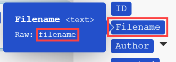

# Mappage des informations d’un module à un autre dans [!DNL Adobe Workfront Fusion]

Le mappage est le processus d’affectation des sorties d’un module, structurées en éléments, aux champs d’entrée d’un autre module.

Le panneau de mappage s’affiche lorsque vous cliquez sur un champ dans lequel vous souhaitez insérer une valeur extraite d’un module précédent dans un scénario. Dans un module, dans n’importe quel champ disponible pour le mappage, vous pouvez créer une formule à l’aide de n’importe quelle combinaison de fonctions et d’éléments mappés du panneau de mappage avec du texte statique saisi. Ces éléments peuvent être imbriqués les uns dans les autres.

## Exigences d’accès

Vous devez disposer des accès suivants pour utiliser les fonctionnalités de cet article :

<table style="table-layout:auto">
 <col> 
 <col> 
 <tbody> 
  <tr> 
    <td role="rowheader">[!DNL Adobe Workfront] plan*</td> 
   <td> 
[!DNL Pro] ou supérieur
 </td> 
  </tr> 
  <tr data-mc-conditions=""> 
   <td role="rowheader">[!DNL Adobe Workfront] license*</td> 
   <td> 
[!UICONTROL Plan], [!UICONTROL Work]
 </td> 
  </tr> 
  <tr> 
   <td role="rowheader">Licence [!UICONTROL Adobe Workfront Fusion]**</td> 
   <td>
   
Exigences de licence actuelles : non [!DNL Workfront Fusion] conditions requises pour obtenir une licence.

   
Ou

   
Exigences de licence héritées : [!UICONTROL [!DNL Workfront Fusion] pour l’automatisation et l’intégration du travail] 

   </td> 
  </tr> 
  <tr> 
   <td role="rowheader">Produit</td> 
   <td>
   
Conditions requises du produit actuel : si vous disposez de l’[!UICONTROL Select] ou de l’[!UICONTROL Prime] [!DNL Adobe Workfront] Planifiez, votre entreprise doit acheter [!DNL Adobe Workfront Fusion] ainsi que [!DNL Adobe Workfront] pour utiliser la fonctionnalité décrite dans cet article. [!DNL Workfront Fusion] est inclus dans l’[!UICONTROL Ultimate] [!DNL Workfront] planifiez.

   
Ou

   
Exigences liées aux produits hérités : votre entreprise doit acheter [!DNL Adobe Workfront Fusion] ainsi que [!DNL Adobe Workfront] pour utiliser la fonctionnalité décrite dans cet article.

   </td> 
  </tr> 
 </tbody> 
</table>

Pour connaître le plan, le type de licence ou l’accès dont vous disposez, contactez votre [!DNL Workfront] administrateur.

Pour plus d’informations sur [!DNL Adobe Workfront Fusion] licences, voir [[!DNL Adobe Workfront Fusion] licences](../../workfront-fusion/get-started/license-automation-vs-integration.md).

## Lots et éléments

L’opération d’un module produit zéro, un ou plusieurs lots en tant que sortie. Un lot se compose d’un ou de plusieurs éléments.

Pour explorer la sortie d’un module :

1. Cliquez sur **[!UICONTROL Exécuter une seule fois]** pour exécuter le module.
1. Cliquez sur la bulle au-dessus du module.

   Un journal contenant toutes les phases du module s’affiche. Vous pouvez trouver le ou les lots sortis par la phase d’opération d’un module sous le **[!UICONTROL Sortie]** en-tête. Chaque lot contient ses éléments et les valeurs de chaque élément.

>[!INFO]
>
>**Exemple :** Cet exemple illustre le module [!UICONTROL Email] > [!UICONTROL Regarder les emails]. Vous pouvez constater qu’il a effectué une opération produisant un seul lot contenant divers éléments, tels que `Date`, `Email ID (UID)`, `size`, etc.
>
>

>[!NOTE]
>
>Les sorties des modules placés entre un [!UICONTROL Itérateur] et [!UICONTROL Agrégateur] ne sont pas accessibles au-delà de [!UICONTROL Agrégateur] module .

## Mappage d’un élément

Après avoir créé une séquence de modules en les liant, chaque module peut traiter les valeurs des éléments générés par les modules qui le précèdent.

Pour affecter les éléments aux champs de saisie d’un module :

1. Cliquez sur le module qui doit traiter la sortie du ou des modules précédents.
1. Dans le panneau Paramètres du module qui s’affiche, cliquez sur un champ dans lequel vous souhaitez utiliser la valeur d’un élément généré à partir d’un ou plusieurs modules précédents.

   Le panneau de mappage s’ouvre.

1. Cliquez sur un élément du panneau de mappage pour l’insérer dans le champ.
1. (Facultatif) Pour rechercher un champ particulier dans le panneau de mappage, cliquez sur la barre de recherche du panneau de mappage et saisissez le terme à rechercher. Cliquez sur le champ lorsqu’il apparaît dans la liste.

   Les résultats de la recherche contiennent le terme recherché et ne sont pas sensibles à la casse.

Pour plus d’informations, voir [Configurez les paramètres d’un module dans [!DNL Adobe Workfront Fusion]](../../workfront-fusion/modules/configure-a-modules-settings.md).

## Formules

Vous pouvez mapper plusieurs éléments dans un champ, les combiner avec des littéraux (valeurs fixes) et utiliser des opérateurs et des fonctions pour créer des formules complexes :

Les fonctions et opérateurs sont disponibles dans le panneau de mappage sous l’un de ses onglets.

Premier onglet  (affiché à l’ouverture du panneau) affiche les éléments que vous pouvez mapper à partir d’autres modules.

Les autres onglets contiennent les types de fonctions suivants :

* **Fonctions générales**  - Voir [Fonctions générales dans [!DNL Adobe Workfront Fusion]](../../workfront-fusion/functions/general-functions.md) pour plus d’informations.

* **Fonctions mathématiques**  - Voir [Fonctions mathématiques dans [!DNL Adobe Workfront Fusion]](../../workfront-fusion/functions/math-functions.md) pour plus d’informations.

* **Fonctions de texte et binaires**  - Voir [Fonctions de chaîne dans [!DNL Adobe Workfront Fusion]](../../workfront-fusion/functions/string-functions.md) pour plus d’informations.

* **Date et heure**  - Voir [Fonctions de date et d’heure dans [!DNL Adobe Workfront Fusion]](../../workfront-fusion/functions/date-and-time-functions.md) et les articles ci-dessous pour plus d’informations.

   * [Jetons pour le formatage de la date et de l’heure dans [!DNL Adobe Workfront Fusion]](../../workfront-fusion/functions/tokens-for-date-and-time-formatting.md)
   * [Jetons d’analyse de date et d’heure dans Adobe Workfront Fusion](../../workfront-fusion/functions/tokens-for-date-and-time-parsing.md)

* **Fonctions relatives à l’utilisation de tableaux**  - Voir [Fonctions de tableau dans [!DNL Adobe Workfront Fusion]](../../workfront-fusion/functions/array-functions.md) pour plus d’informations.

>[!TIP]
>
>Lorsque vous créez une formule complexe que vous souhaitez réutiliser dans un autre champ, vous pouvez cliquer sur le champ qui contient la combinaison, utiliser Commande-A ou Ctrl-A pour la sélectionner, puis copier-coller dans l&#39;autre champ.

Pour plus d’informations sur le mappage des éléments à l’aide de fonctions, voir [Mise en correspondance des éléments à l’aide de fonctions dans [!DNL Adobe Workfront Fusion]](../../workfront-fusion/functions/map-using-functions.md).

## Collections

Certains éléments peuvent contenir plusieurs valeurs de différents types. Il s’agit d’éléments de type collection.

Vous pouvez identifier une [!UICONTROL collection] saisissez l’élément par le petit rectangle noir affiché à droite du libellé de l’élément et sa liste de sous-éléments automatiquement étendue :

>[!NOTE]
>
>Dans la plupart des cas, vous mappez les sous-éléments de la collection plutôt que l’élément représentant l’ensemble de la collection.

Pour plus d’informations sur les collections, voir [Types de données d’élément dans [!UICONTROL Adobe Workfront Fusion]](../../workfront-fusion/mapping/item-data-types.md)

## Tableaux

Certains éléments peuvent contenir plusieurs éléments du même type. Il s’agit d’éléments de type tableau .

Vous pouvez identifier un élément de type tableau par les crochets à la fin du libellé de l’élément. Cliquez sur le petit rectangle noir à droite du libellé de l’élément pour afficher les éléments de l’élément :

Pour plus d’informations sur les tableaux, voir [Types de données d’élément dans [!DNL Adobe Workfront Fusion]](../../workfront-fusion/mapping/item-data-types.md)

### Mappage du premier élément d’un tableau

Si vous mappez un tableau de `Recipient name` , il s’affiche dans le champ comme suit :

Le nombre entre crochets est un index qui détermine l’élément du tableau qui sera utilisé. Il est défini sur 1 par défaut.

### Mappage du n-ième élément d’un tableau

Si vous souhaitez accéder à un autre élément, cliquez sur les crochets et modifiez la valeur de l&#39;index :

### Mise en correspondance de l’élément d’un tableau avec une clé donnée

Certains tableaux contiennent plusieurs collections avec des éléments de clé et de valeur. Il s’agit généralement de différentes métadonnées, attributs, etc.

L’exemple suivant illustre la sortie de la variable [!DNL Jira] Application.

Dans cet exemple, nous obtenons un nom de fichier provenant d’un tableau de pièces jointes pour la pièce jointe spécifique avec un ID de 10108.

La sortie de [!DNL Jira] ressemble à ceci :

En règle générale, il est nécessaire de rechercher un élément par sa valeur de clé donnée et d’obtenir la valeur correspondante de l’élément de valeur. Cela peut être réalisé avec une formule utilisant une combinaison de la variable `map()` et `get()` fonctions.

Vous trouverez ci-dessous une répartition détaillée de la formule :

1. Le premier paramètre de la variable `map()` est l’élément de tableau entier.
1. Le deuxième paramètre est le nom brut de l’élément de valeur. Pour obtenir le nom brut, passez la souris sur l’élément dans la [!UICONTROL mapping] panel :

   

   >[!NOTE]
   >
   >Tous les paramètres respectent la casse. Même si, dans cet exemple particulier, le libellé de l’élément ne diffère de son nom brut qu’en majuscules, il est nécessaire d’utiliser le nom brut, qui est entièrement en minuscules, contrairement au libellé Valeur.

1. Le troisième paramètre est le nom brut de l’élément clé :

   

1. Le quatrième paramètre est la valeur de clé donnée.

Parce que la variable `map()` renvoie un tableau (puisqu’il peut y avoir plus d’éléments avec la valeur de clé donnée), il est nécessaire d’appliquer la variable `get()` pour obtenir son premier élément :

* Le premier paramètre de la variable `get()` est le résultat de la fonction `map()` de la fonction

* Le deuxième paramètre est l’index de l’élément - un.

Pour plus d’informations sur la variable `map()` fonction, voir [Fonctions de tableau dans [!DNL Adobe Workfront Fusion]](../../workfront-fusion/functions/array-functions.md).

Pour plus d’informations sur la variable `get()` fonction, voir [Fonctions générales dans [!DNL Adobe Workfront Fusion]](../../workfront-fusion/functions/general-functions.md).

## Conversion d’éléments en une série de lots

Les tableaux peuvent être convertis en une série de lots à l’aide de la variable [!UICONTROL Itérateur] module . Pour plus d’informations, voir [[!UICONTROL Itérateur] module dans [!UICONTROL Adobe Workfront Fusion]](../../workfront-fusion/modules/iterator-module.md).

## Dépannage

### Éléments manquants dans le panneau de mappage

Pour chaque module, le panneau de mappage affiche tous les éléments de sortie, répertoriés par l’auteur du module. Dans certains cas, cette liste peut être incomplète pour diverses raisons et certains éléments peuvent être manquants. [!DNL Workfront Fusion] vous pouvez découvrir automatiquement les éléments de sortie manquants lorsque vous exécutez le module dans l’éditeur de scénario. La procédure exacte diffère légèrement selon le type du module :

#### Déclencheur instantané

1. Cliquez avec le bouton droit sur le module, puis cliquez sur **[!UICONTROL Exécuter ce module uniquement]** dans le menu qui s’affiche.

   S’il n’existe aucun webhooks en file d’attente, le module attend qu’un nouveau webhook soit traité.

1. Générez un webhook.

   Par exemple, le module webhook **[!DNL Slack]>[!UICONTROL Écoute des nouveaux événements]** (qui recherche les nouveaux messages de canal dans un canal) envoie un message au canal.

1. Lorsque l’exécution du module est terminée, cliquez sur la bulle au-dessus du module pour explorer sa sortie complète.

   Le panneau de mappage contient tous les éléments qui ont été découverts dans la sortie du module.

#### Sondage

1. Cliquez avec le bouton droit sur le module, puis cliquez sur **[!UICONTROL Exécuter ce module uniquement]** dans le menu qui s’affiche.
1. Si aucune sortie n’est disponible, cliquez sur **[!UICONTROL Choix de l’emplacement de départ]** et ajustez les paramètres.
1. Si aucun événement ne doit être traité, créez-en un et revenez à l’étape 2.

   Par exemple, le module webhook **[!UICONTROL Gmail] >[!UICONTROL Regarder les emails]** envoie un courrier électronique au dossier que le module regarde.

1. Lorsque l’exécution du module est terminée, cliquez sur la bulle au-dessus du module pour explorer sa sortie complète.

   Le panneau de mappage contient désormais tous les éléments qui ont été découverts dans la sortie du module.

#### Autres modules

Vous pouvez choisir d’exécuter :

* L’ensemble du scénario (ou seulement la partie contenant le module)

  Si votre scénario commence par un déclencheur, reportez-vous à la section [Déclencheur instantané](#instant-trigger) ou [Sondage](#polling-trigger) ci-dessus.

* Uniquement le module

Si vous choisissez d’exécuter uniquement le module unique :

1. Cliquez avec le bouton droit sur le module, puis cliquez sur **[!UICONTROL Exécuter ce module uniquement]** dans le menu qui s’affiche.
1. Indiquez des exemples de valeurs pour les éléments d’entrée, puis cliquez sur **[!UICONTROL OK]** .
1. Lorsque l’exécution du module est terminée, cliquez sur la bulle au-dessus du module pour explorer sa sortie complète.

   Le panneau de mappage contient désormais tous les éléments qui ont été découverts dans la sortie du module.
