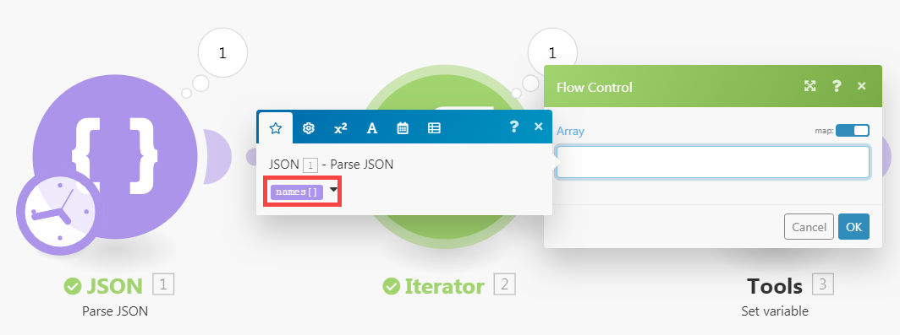

# [!UICONTROL Itérateur] module dans [!DNL Adobe Workfront Fusion]

Un [!UICONTROL Itérateur] module est un type spécial de module qui convertit un tableau en une série de lots. Chaque élément du tableau est généré sous la forme d’un lot distinct.

Pour plus d’informations, voir [Types de modules](../../workfront-fusion/modules/module-types.md) et [Mappage d’un tableau dans Adobe Workfront Fusion](../../workfront-fusion/mapping/map-an-array.md).

## Exigences d’accès

Vous devez disposer des accès suivants pour utiliser les fonctionnalités de cet article :

<table style="table-layout:auto">
 <col> 
 <col> 
 <tbody> 
  <tr> 
    <td role="rowheader">[!DNL Adobe Workfront] plan*</td> 
   <td> 
[!DNL Pro] ou supérieur
 </td> 
  </tr> 
  <tr data-mc-conditions=""> 
   <td role="rowheader">[!DNL Adobe Workfront] license*</td> 
   <td> 
[!UICONTROL Plan], [!UICONTROL Work]
 </td> 
  </tr> 
  <tr> 
   <td role="rowheader">Licence [!UICONTROL Adobe Workfront Fusion]**</td> 
   <td> 
[!UICONTROL [!DNL Workfront Fusion] pour l’automatisation et l’intégration du travail] 
  </td> 
  </tr> 
  <tr> 
   <td role="rowheader">Produit</td> 
   <td>Votre entreprise doit acheter Adobe Workfront Fusion ainsi qu’Adobe Workfront pour utiliser la fonctionnalité décrite dans cet article.</td> 
  </tr> 
 </tbody> 
</table>

Pour connaître le plan, le type de licence ou l’accès dont vous disposez, contactez votre administrateur Workfront.

Pour plus d’informations sur [!DNL Adobe Workfront Fusion] licences, voir [[!DNL Adobe Workfront Fusion] licences](../../workfront-fusion/get-started/license-automation-vs-integration.md).

## [!UICONTROL Itérateur] configuration du module

Vous configurez une [!UICONTROL Itérateur] de la même manière que vous configurez tout autre module. Le [!UICONTROL Tableau] contient le tableau à convertir ou à fractionner en lots distincts.

Pour plus d’informations, voir [Configuration des paramètres d’un module dans Adobe Workfront Fusion](../../workfront-fusion/modules/configure-a-modules-settings.md).

>[!INFO]
>
>**Exemples:**
>
>* Le scénario ci-dessous montre comment récupérer des emails avec des pièces jointes et enregistrer les pièces jointes en tant que fichiers uniques dans une sélection [!DNL Dropbox] dossier.
   >
   >   Les emails peuvent contenir un tableau de pièces jointes. Le [!UICONTROL Itérateur] module inséré après le premier module vous permettra de gérer chaque pièce jointe séparément. Le [!UICONTROL Itérateur] divise le tableau de pièces jointes en lots uniques. Chaque lot, accompagné d’une pièce jointe, est ensuite enregistré un par un dans une sélection [!DNL Dropbox] dossier. Le [!UICONTROL Itérateur] la configuration du module est illustrée ci-dessus : la valeur [!UICONTROL Tableau] doit contenir le champ `Attachments` tableau.
   >
   >   
>
>* Pour votre commodité, de nombreuses [!DNL Workfront Fusion] offre d’applications spécialisée [!UICONTROL Itérateur] modules avec une configuration simplifiée. Par exemple, la variable [!UICONTROL Email] L’application contient le [!UICONTROL Itérateur] module [!UICONTROL Email] > [!UICONTROL Itérer les pièces jointes] qui produira les mêmes résultats que le général [!UICONTROL Itérateur] module .
   >
   >   

## Dépannage : Le panneau de mappage n’affiche pas les éléments mappables sous [!UICONTROL Itérateur] module

Lorsqu’une [!UICONTROL Itérateur] ne contient pas d’informations sur la structure des éléments du tableau, le panneau de mappage dans les modules qui suivent la balise [!UICONTROL Itérateur] module n’affiche que 2 éléments sous [!UICONTROL Itérateur] module :`Total number of bundles` et `Bundle order position`:

Cela est dû au fait que chaque module est chargé de fournir des informations sur les éléments qu’il génère afin que ces éléments puissent être correctement affichés dans le panneau de mappage dans les modules suivants. Cependant, plusieurs modules peuvent ne pas être en mesure de fournir ces informations dans certains cas ; par exemple, [!UICONTROL JSON] > [!UICONTROL Analyse JSON] ou [!UICONTROL Webhooks] > [!UICONTROL Webhook personnalisé] modules avec structure de données manquante.

La solution consiste à exécuter manuellement le scénario pour faire en sorte que le module découvre les éléments qu’il génère afin qu’il puisse fournir les informations aux modules suivants.

Par exemple, si vous avez une [!UICONTROL JSON] > [!UICONTROL Analyse JSON] module sans structure de données, comme ci-dessous :

Et si vous connectez un [!UICONTROL Itérateur] vous ne pourrez pas mapper la sortie du module au champ Tableau dans le panneau de configuration du module [!UICONTROL Itérateur] module :

Pour résoudre ce problème, démarrez manuellement le scénario dans l’éditeur de scénarios. Vous pouvez annuler la liaison des modules après l’événement [!UICONTROL JSON] > [!UICONTROL Analyse JSON] pour empêcher le flux de continuer. Vous pouvez également cliquer avec le bouton droit sur la [!UICONTROL JSON] > [!UICONTROL Analyse JSON] module et choisissez **[!UICONTROL Exécuter ce module uniquement]** dans le menu contextuel pour exécuter uniquement la variable [!UICONTROL JSON] > [!UICONTROL Analyse JSON] module .

Lorsque la variable [!UICONTROL JSON] > [!UICONTROL Analyse JSON] s’exécute, il identifie les éléments qu’il génère et fournit ces informations à tous les modules suivants, y compris le module Itérateur. Le panneau de mappage dans la configuration de l’itérateur affiche ensuite les éléments :

De plus, le panneau de mappage dans les modules connectés après l’événement [!UICONTROL Itérateur] module affiche les éléments contenus dans les éléments du tableau :

Si vous ne pouvez pas voir certains éléments dans le panneau de mappage d’un module, exécutez le scénario une fois afin que tous les modules puissent en savoir plus sur les éléments qu’ils génèrent et fournissez ces informations aux modules suivants.
