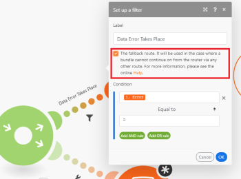

# Module [!UICONTROL Router] dans [!DNL Adobe Workfront Fusion]

Le module [!UICONTROL Router] vous permet de diviser votre flux en plusieurs itinéraires et de traiter les données de chaque itinéraire différemment. Une fois qu’un module [!UICONTROL Router] reçoit un lot, il le transfère vers chaque itinéraire connecté dans l’ordre dans lequel les itinéraires ont été associés au module [!UICONTROL Router].

>[!NOTE]
>
>* Pour vérifier l’ordre des itinéraires, vous pouvez cliquer sur l’icône [!UICONTROL Auto-align] , qui organisera les itinéraires selon l’ordre de haut en bas.
>
>  Pour modifier l’ordre, supprimez le module [!UICONTROL Router] et reconnectez les itinéraires dans l’ordre souhaité.
>
>* Les itinéraires sont traités de manière séquentielle, et non en parallèle. Un lot n’est pas envoyé vers l’itinéraire suivant tant qu’il n’a pas été complètement traité par l’itinéraire précédent.
>

## Conditions d’accès

Pour utiliser les fonctionnalités décrites dans cet article, vous devez disposer des éléments suivants :

<table style="table-layout:auto">
 <col> 
 <col> 
 <tbody> 
  <tr> 
    <td role="rowheader">[!DNL Adobe Workfront] forfait*</td> 
   <td> 
[!DNL Pro] ou supérieur
 </td> 
  </tr> 
  <tr data-mc-conditions=""> 
   <td role="rowheader">[!DNL Adobe Workfront] licence*</td> 
   <td> 
[!UICONTROL Plan], [!UICONTROL Work]
 </td> 
  </tr> 
  <tr> 
   <td role="rowheader">Licence [!UICONTROL Adobe Workfront Fusion]**</td> 
   <td>
   
Exigences de licence actuelle : aucune exigence de licence [!DNL Workfront Fusion]

   
Ou

   
Exigence de licence héritée : [!UICONTROL [!DNL Workfront Fusion] for Work Automation and Integration] 

   </td> 
  </tr> 
  <tr> 
   <td role="rowheader">Produit</td> 
   <td>
   
Exigences du produit actuel : si vous disposez du forfait [!DNL Adobe Workfront] [!UICONTROL Select] ou [!UICONTROL Prime], votre entreprise doit acheter [!DNL Adobe Workfront Fusion] et [!DNL Adobe Workfront] pour utiliser les fonctionnalités décrites dans cet article. [!DNL Workfront Fusion] est inclus dans le forfait [!DNL Workfront] [!UICONTROL Ultimate].

   
Ou

   
Exigences du produit hérité : votre entreprise doit acheter [!DNL Adobe Workfront Fusion] et [!DNL Adobe Workfront] pour utiliser les fonctionnalités décrites dans cet article.

   </td> 
  </tr> 
 </tbody> 
</table>

Pour connaître la formule, le type de licence ou l’accès dont vous disposez, contactez vote administrateur ou administratrice [!DNL Workfront].

Pour plus d’informations sur les licences [!DNL Adobe Workfront Fusion], consultez les [[!DNL Adobe Workfront Fusion] licences](../../workfront-fusion/get-started/license-automation-vs-integration.md).

## Ajout d’un module [!UICONTROL Router] à un scénario

Un [!UICONTROL routeur] peut être ajouté à un scénario de l’une des façons suivantes :

* Si vous souhaitez connecter le module [!UICONTROL Router] après un module, cliquez sur la poignée droite du module, commencez à taper **[!UICONTROL router]** pour le rechercher, puis sélectionnez **[!UICONTROL Contrôle de flux]** > **[!UICONTROL Router]** dans la liste des modules qui s’affiche.

  

* Si vous souhaitez insérer le module [!UICONTROL Router] entre deux modules, cliquez sur l&#39;icône en forme de clé à molette située sous l&#39;itinéraire reliant les deux modules (ou cliquez avec le bouton droit de la souris sur l&#39;itinéraire) et choisissez **[!UICONTROL Ajouter un routeur]** dans le menu.

  

* Vous pouvez insérer automatiquement un module [!UICONTROL Router]. Par exemple, dans l’image ci-dessous, pour connecter le module dans le coin inférieur droit à celui dans le coin supérieur gauche (qui est déjà connecté à celui dans le coin supérieur droit), faites glisser la poignée gauche du module inférieur droit et déposez-le dans le module supérieur gauche.

  

## Filtres

Vous pouvez placer un filtre sur un itinéraire après le module [!UICONTROL Router] pour filtrer les lots comme sur tout autre itinéraire :

1. Cliquez sur l’un des points de l’itinéraire.

   

1. Dans la zone **[!UICONTROL Configurer un filtre]** qui s’affiche, ajoutez des conditions, puis cliquez sur **[!UICONTROL OK]** pour enregistrer la configuration du filtre.

   

Pour plus d’informations, voir [Ajout d’un filtre à un scénario dans [!DNL Adobe Workfront Fusion]](../../workfront-fusion/scenarios/add-a-filter-to-a-scenario.md).

## Itinéraire de secours

La configuration du filtre sur un itinéraire après un module [!UICONTROL Router] contient une option spéciale : l’itinéraire de secours :

Lorsqu’il est activé, cet itinéraire est utilisé lorsqu’un lot ne peut pas continuer à partir du module [!UICONTROL Router] via un autre itinéraire, car les filtres sur les autres itinéraires l’ont filtré.

L’itinéraire de secours se distingue par un autre signe fléché à l’intérieur du module [!UICONTROL Router] :

## If/Else

Un cas d’utilisation type de l’itinéraire de secours consiste à poursuivre le flux avec un itinéraire si la condition est remplie et avec un autre itinéraire s’il ne l’est pas, comme dans les étapes suivantes :

1. Insérez un module [!UICONTROL Router] dans votre scénario.
1. Connectez les deux itinéraires au module [!UICONTROL Router] .
1. Cliquez sur le premier itinéraire et spécifiez une condition :

   

1. Cliquez sur le deuxième itinéraire et activez l’option [!UICONTROL route de secours] :

   
