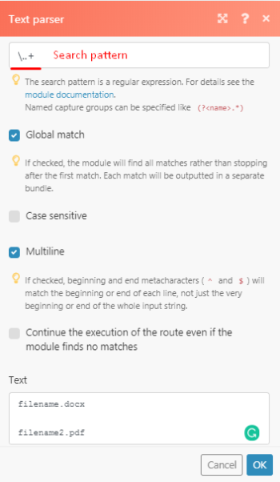

# Dépannage de l’analyseur de texte dans [!DNL Adobe Workfront Fusion]

Utilisez ces informations si l’analyseur de texte échoue à produire une sortie.

## Conditions d’accès

Vous devez disposer des accès suivants pour utiliser les fonctionnalités de cet article :

<table style="table-layout:auto">
 <col> 
 <col> 
 <tbody> 
  <tr> 
    <td role="rowheader">[!DNL Adobe Workfront] formule*</td> 
   <td> 
[!DNL Pro] ou une version ultérieure
 </td> 
  </tr> 
  <tr data-mc-conditions=""> 
   <td role="rowheader">[!DNL Adobe Workfront] licence*</td> 
   <td> 
[!UICONTROL Plan], [!UICONTROL Work]
 </td> 
  </tr> 
  <tr> 
   <td role="rowheader">Licence [!UICONTROL Adobe Workfront Fusion]**</td> 
   <td>
   
Exigence de licence actuelle : aucune exigence de licence [!DNL Workfront Fusion].

   
Ou

   
Exigences de licence héritées : [!UICONTROL [!DNL Workfront Fusion] for Work Automation and Integration] 

   </td> 
  </tr> 
  <tr> 
   <td role="rowheader">Produit</td> 
   <td>
   
Conditions requises du produit actuel : si vous disposez de la formule [!DNL Adobe Workfront] [!UICONTROL Select] ou [!UICONTROL Prime], votre entreprise doit acheter [!DNL Adobe Workfront Fusion] ainsi que [!DNL Adobe Workfront] pour utiliser la fonctionnalité décrite dans cet article. [!DNL Workfront Fusion] est inclus dans la formule [!DNL Workfront] [!UICONTROL Ultimate].

   
Ou

   
Exigences liées aux produits hérités : votre entreprise doit acheter [!DNL Adobe Workfront Fusion] ainsi qu’[!DNL Adobe Workfront] pour utiliser la fonctionnalité décrite dans cet article.

   </td> 
  </tr> 
 </tbody> 
</table>

Pour connaître la formule, le type de licence ou l’accès dont vous disposez, contactez votre équipe d’administration [!DNL Workfront].

Pour plus d’informations sur les licences [!DNL Adobe Workfront Fusion], consultez Licences [[!DNL Adobe Workfront Fusion] ](../../workfront-fusion/get-started/license-automation-vs-integration.md).

## Dépannage

Exemple de scénario : vous souhaitez analyser le type de fichier d’un document « filename.docx » et l’extension du nom de fichier varie toujours de DOCX à PDF à CSV.

L’expression à utiliser dans ce cas est [!DNL \..+].

Si vous l’utilisez dans une expression régulière sur regex101.com, vous obtiendrez une correspondance exacte.

L’image ci-dessus affiche une correspondance exacte de l’extension du fichier. Si vous essayez de l’implémenter dans votre analyseur de texte,

vous n’obtiendrez pas de correspondance :

Cela est dû au fait que la valeur « i » indique uniquement le nombre de correspondances par correspondance. Dans ce cas, nous avons deux correspondances, il y a donc après la valeur « i » une valeur numérique 1 et 2. Le cas d’utilisation à appliquer ici est que, si vous devez faire correspondre ou transférer des données via un filtre vers la seconde valeur correspondante, vous pouvez spécifier la valeur à l’aide de sa représentation numérique.

Pour obtenir les valeurs de correspondance dont vous avez besoin pour ajouter des intervalles à la partie que vous souhaitez analyser (par exemple, pour extraire uniquement « docx » de « filename.docx »), selon l’expression régulière que nous utilisons pour ce scénario, vous devez appliquer les intervalles sur \.(.+)

Cela capture « docx », le place dans un groupe et ignore « . » .

Dans la sortie affichée dans l’image ci-dessous, le groupe de capture correspondra à n’importe quel caractère (sauf pour les terminaisons de ligne).

Une autre solution qui intègre également l’expression régulière consiste à utiliser la fonction Remplacer.

`{{replace("abcdefghijklmno pqr stuvw xyz.docx"; "/.\./"; ".")}}`

Remplacez alors `abcdefghijklmno pqr stuvw xyz.docx` avec votre variable de nom de fichier.
