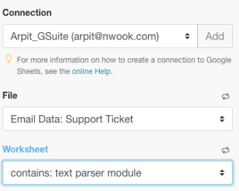

# [!DNL Adobe Workfront Fusion] exemple de scénario : Connecter un email, [!UICONTROL Analyse de texte], et [!DNL Google Sheets]

Ce scénario vous permet de créer un journal de tous les emails et de les baliser pour effectuer d’autres actions dans une feuille de calcul. Il capture le corps d’un email dans deux tableaux distincts dans une feuille de calcul à l’aide d’expressions régulières (Regex) comme modèles de recherche. Le premier modèle recherche une expression et le second recherche la même expression et une adresse électronique.

## Exigences d’accès

Vous devez disposer des accès suivants pour utiliser les fonctionnalités de cet article :

<table style="table-layout:auto"> 
 <col> 
 <col> 
 <tbody> 
  <tr> 
    <td role="rowheader">[!DNL Adobe Workfront] plan*</td> 
   <td> 
[!DNL Pro] ou supérieur
 </td> 
  </tr> 
  <tr data-mc-conditions=""> 
   <td role="rowheader">[!DNL Adobe Workfront] license*</td> 
   <td> 
[!UICONTROL Plan], [!UICONTROL Work]
 </td> 
  </tr> 
  <tr> 
   <td role="rowheader">Licence [!UICONTROL Adobe Workfront Fusion]**</td> 
   <td> 
[!UICONTROL [!DNL Workfront Fusion] pour l’automatisation et l’intégration du travail] 
  </td> 
  </tr> 
  <tr> 
   <td role="rowheader">Produit</td> 
   <td>Votre entreprise doit acheter [!DNL Adobe Workfront Fusion] ainsi que [!DNL Adobe Workfront] pour utiliser la fonctionnalité décrite dans cet article.</td> 
  </tr> 
 </tbody> 
</table>

Pour connaître le plan, le type de licence ou l’accès dont vous disposez, contactez votre [!DNL Workfront] administrateur.

Pour plus d’informations sur [!DNL Adobe Workfront Fusion] licences, voir [[!DNL Adobe Workfront Fusion] licences](../../workfront-fusion/get-started/license-automation-vs-integration.md).

## Conditions préalables

Ce tutoriel nécessite des connaissances de base sur les expressions régulières. Pour en savoir plus sur Regex, rendez-vous sur [https://regexone.com](https://regexone.com/).

Ajouter le premier module et le configurer

1. Recherchez Email et choisissez **[!UICONTROL Regarder les emails]** comme déclencheur.

   >[!NOTE]
   >
   >Lorsque vous vous connectez à un [!DNL Google] compte utilisant l’Emodule mail, vous pouvez également utiliser une [!DNL Gmail] module .

1. Connectez-vous à [!DNL Google] compte ou tout autre client de messagerie IMAP (tel que [!DNL Outlook]).
1. Une fois connecté, sélectionnez un Dossier dont vous souhaitez consulter les emails entrants, par exemple [!UICONTROL Boîte de réception].
1. Sous [!UICONTROL Critères], choisissez **[!UICONTROL Tous les emails]** (ou réduisez-la pour lire ou non les courriers électroniques).

   Vous pouvez également choisir de marquer les emails récupérés comme lus ou non lus.

1. Définissez la variable [!UICONTROL Nombre maximal de résultats] à 1.

   

   Vous pouvez le modifier en fonction du volume de messages que vous recevez. Cependant, il est recommandé de définir une valeur basse et d’exécuter le scénario plus souvent.

1. Cliquez sur **[!UICONTROL Afficher les paramètres avancés]** en bas.

   

1. Filtrage des emails par [!UICONTROL Adresse expéditeur], [!UICONTROL Objet] et [!UICONTROL Expression].

   Vous pouvez ainsi ne consulter que les emails pertinents. Dans cet exemple, nous avons ajouté uniquement un filtre Objet et laissé les 2 autres vides.

   >[!NOTE]
   >
   >Nous allons ajouter un routeur pour rechercher des expressions dans un email à l’aide de la fonction [!UICONTROL Modèle de correspondance] itérateur et une expression régulière (Regex) comme modèle de recherche. Cela nous permet également de créer un scénario multi-utilitaire.

1. Une fois la configuration terminée, et lorsque vous êtes invité à indiquer où commencer à regarder vos emails, cliquez sur **[!DNL From now on]**.

   

1. Passez à la [Rechercher [!UICONTROL Contrôle de flux] et ajoutez une [!UICONTROL Routeur]](#search-for-flow-control-and-add-a-router)

## Rechercher [!UICONTROL Contrôle de flux] et ajoutez une [!UICONTROL Routeur]

1. Ajoutez un routeur après tout module pour fractionner ou dupliquer les données avant de les envoyer au module suivant.

   Ici, nous avons utilisé une [!UICONTROL Routeur] pour envoyer le texte du corps de l’email à 2 tables distinctes dans une [!DNL Google Sheet].

   

## Utilisez la variable [!UICONTROL Analyse de texte] Module

1. Ajouter un [!UICONTROL Modèle de correspondance] transformateur pour rechercher une expression dans un email.

   Nous rechercherons l’expression &quot;[!UICONTROL module d’analyseur de texte]&quot; dans tous les emails entrants pour capturer le texte du corps et le nom de l’expéditeur de ceux qui correspondent à cette expression.

   1. Ecrivez le modèle en tant qu’expression régulière :

      text\sparser\smodule

   1. (Facultatif) Utilisez l’une des autres options de modèle.

      

      La multiligne est utile si votre texte contient plusieurs lignes et si vous devez rechercher le modèle dans chaque ligne. Pour ce tutoriel, nous devons rechercher le modèle dans tout le texte du corps de l’email. Par conséquent, nous ne le vérifierons pas.

   1. Dans le [!UICONTROL Texte] , cliquez sur l’attribut **Contenu texte** dans la liste.

      

      Il s’agit de l’attribut qui stocke le texte dans le corps de l’email dans lequel nous allons rechercher le modèle.

1. Ajouter un autre [!UICONTROL Modèle de correspondance] qui recherche la même expression et une adresse électronique.

   Cela s’avère particulièrement utile si vous disposez de comptes clients avec plusieurs utilisateurs. Pour gagner du temps, vous pouvez cloner la variable [!UICONTROL Analyse de texte] que vous venez de créer et de le lier au routeur.

   

1. Modifiez le modèle comme suit :

   text\sparser\smodule.+\s([\w.-]+@[\w.-]+)

   

   Ce modèle recherche l’expression &quot;[!UICONTROL module d’analyseur de texte]&quot; et une adresse électronique telle que john.doe@gmail.com et renvoie uniquement l’adresse électronique.

   >[!NOTE]
   >
   >Il est important d’écrire votre expression régulière conformément aux spécifications des adresses électroniques que vous acceptez, mais celle ci-dessus s’occupe de la plupart des adresses électroniques standard.

   * Si vous souhaitez rechercher uniquement les adresses électroniques, vous pouvez utiliser l’expression régulière suivante :

      ([\w.-]+@[\w.-]+)

   * Vous pouvez également rechercher uniquement les numéros de téléphone en utilisant l’expression régulière ci-dessous :

      ^[+]?\(?(\d{1,3})\)?[\s-]?\(?(\d{3})\)?[\s-]?\d{3}[\s-]?\d{3,4} Le modèle ci-dessus couvre les formats les plus courants dans lesquels un numéro de téléphone est écrit.
   Pour tester vos modèles, nous vous recommandons d’utiliser [[!DNL https://regex101.com]](https://regex101.com/) avec [!DNL javascript] comme le Flavor.

   Le reste de la configuration reste le même que précédemment.

## Ajoutez la variable [!DNL Google Sheets] modules

Pour [!DNL Sheets], nous devons d’abord créer une feuille de calcul avec les en-têtes requis.

1. Créez une feuille de calcul contenant les colonnes sous lesquelles vous souhaitez capturer les données utilisateur. (N’hésitez pas à utiliser un fichier existant également).

   Par exemple, créez-en un appelé &quot;Email Data: Prendre en charge le ticket&quot; avec pour colonnes Nom de l’expéditeur, Email de l’expéditeur et Contenu de l’email. Nommez la feuille de calcul &quot;contient : module d’analyseur de texte.&quot;

1. Ajoutez la variable [!UICONTROL Google Sheets] module avec **[!UICONTROL Ajouter une ligne]** comme action.

   

1. Connectez-vous à [!DNL Google] (si ce n’est déjà fait). Sélectionnez le Fichier que vous avez créé précédemment, puis choisissez la feuille de calcul dans laquelle vous capturez les données.

   Votre configuration doit se présenter comme suit :

   

1. Mappez les attributs dans les champs (colonnes) pertinents pour terminer la configuration du module.

   

1. Cloner le module que vous venez de créer et le lier à la seconde [!UICONTROL Analyse de texte] module .

   1. Dans la feuille de calcul, dupliquez la feuille de calcul que vous avez créée précédemment et nommez-la.

      Par exemple, nommez-le &quot;contient : module d’analyseur de texte et courrier électronique.&quot;

   1. Ajoutez une autre colonne pour stocker l’adresse électronique que le corps de l’email contient.

      Par exemple, nommez-le &quot;Adresse électronique partagée&quot;.

   1. Cliquez sur le cloné [!DNL Google Sheets] pour configurer la configuration.
   1. Remplacez la feuille de calcul par la nouvelle que vous venez de créer.
   1. Faites correspondre la sortie de la [!UICONTROL Modèle de correspondance] module (1 $) à la colonne dans laquelle vous souhaitez stocker l’adresse électronique (adresse électronique partagée).

      

      

   1. Cliquez sur **[!UICONTROL OK]**, enregistrez le scénario, puis effectuez-le pour une exécution de test.

      Vous devrez envoyer deux emails distincts à l’adresse email connectée comme suit :

      * Contenant l’expression &quot;[!UICONTROL module d’analyseur de texte]&quot; (et aucune adresse électronique)

         

      * Contenant l’expression ci-dessus et une adresse électronique

         

         Si votre configuration ne comporte aucune erreur, vous verrez que la première feuille de calcul capture tous les emails contenant l’expression &quot;[!UICONTROL module d’analyseur de texte]&quot; tandis que la seconde feuille de calcul capture uniquement les feuilles contenant l’expression &quot;[!UICONTROL module d’analyseur de texte]&quot; et une adresse électronique. Reportez-vous aux captures d’écran ci-dessous.

         Feuille de calcul 1 :

         

         Feuille de calcul 2 :

         

## Ressources

* [Exercices gratuits](https://regexone.com/) pour en savoir plus sur les expressions régulières
* [En savoir plus sur la correspondance des numéros de téléphone](https://regexone.com/problem/matching_phone_numbers) Utilisation de Regex
* [En savoir plus sur la correspondance des emails](https://regexone.com/problem/matching_emails) Utilisation de Regex
* [Test de vos expressions régulières](https://regex101.com/)
