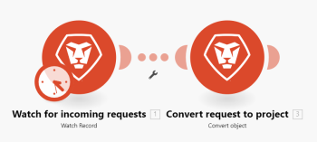

# Panneau des paramètres de scénario dans [!DNL Adobe Workfront Fusion]

## Conditions d’accès

Pour utiliser les fonctionnalités décrites dans cet article, vous devez disposer des éléments suivants :

<table style="table-layout:auto"> 
 <col> 
 <col> 
 <tbody> 
  <tr> 
    <td role="rowheader">[!DNL Adobe Workfront] forfait*</td> 
   <td> 
[!DNL Pro] ou supérieur
 </td> 
  </tr> 
  <tr data-mc-conditions=""> 
   <td role="rowheader">[!DNL Adobe Workfront] licence*</td> 
   <td> 
[!UICONTROL Plan], [!UICONTROL Work]
 </td> 
  </tr> 
  <tr> 
   <td role="rowheader">Licence [!UICONTROL Adobe Workfront Fusion]**</td> 
   <td>
   
Exigences de licence actuelle : aucune exigence de licence [!DNL Workfront Fusion]

   
Ou

   
Exigences de licence héritée : [!UICONTROL [!DNL Workfront Fusion] for Work Automation and Integration], [!UICONTROL [!DNL Workfront Fusion] for Work Automation]

   </td> 
  </tr> 
  <tr> 
   <td role="rowheader">Produit</td> 
   <td>
   
Exigences du produit actuel : si vous disposez du forfait [!DNL Adobe Workfront] [!UICONTROL Select] ou [!UICONTROL Prime], votre entreprise doit acheter [!DNL Adobe Workfront Fusion] et [!DNL Adobe Workfront] pour utiliser les fonctionnalités décrites dans cet article. [!DNL Workfront Fusion] est inclus dans le forfait [!DNL Workfront] [!UICONTROL Ultimate].

   
Ou

   
Exigences du produit hérité : votre entreprise doit acheter [!DNL Adobe Workfront Fusion] et [!DNL Adobe Workfront] pour utiliser les fonctionnalités décrites dans cet article.

   </td> 
  </tr> 
 </tbody> 
</table>

Pour connaître la formule, le type de licence ou l’accès dont vous disposez, contactez vote administrateur ou administratrice [!DNL Workfront].

Pour plus d’informations sur les licences [!DNL Adobe Workfront Fusion], consultez les [[!DNL Adobe Workfront Fusion] licences](../../workfront-fusion/get-started/license-automation-vs-integration.md).

## Ouvrir les paramètres du scénario

1. Ouvrez l’éditeur de scénario, comme expliqué dans [L’éditeur de scénario dans [!DNL Adobe Workfront Fusion]](../../workfront-fusion/scenarios/scenario-editor.md).
1. Cliquez sur l’icône d’engrenage près du coin inférieur gauche de la page.

   

   Dans le panneau [!UICONTROL Paramètres du scénario] qui s’affiche, vous pouvez configurer divers paramètres avancés pour le scénario.

## [!UICONTROL Autoriser le stockage des exécutions incomplètes]

Cette option détermine le déroulement de [!DNL Adobe Workfront Fusion] en cas d’erreur lors de l’exécution d’un scénario. Lorsque cette option est activée, le scénario est suspendu et déplacé vers [Afficher et résoudre les exécutions incomplètes dans [!DNL Adobe Workfront Fusion]](../../workfront-fusion/scenarios/view-and-resolve-incomplete-executions.md). Vous avez ainsi la possibilité de résoudre le problème et de continuer à exécuter à partir de l’endroit où le scénario a été arrêté. Si cette option est désactivée, l’exécution du scénario s’arrête et une phase de restauration est lancée.

## [!UICONTROL Traitement séquentiel]

Cette option force toutes les exécutions dans l’ordre. Elle est principalement adaptée aux webhooks et aux exécutions incomplètes.

Lorsque le traitement séquentiel est activé, les exécutions parallèles du scénario sont désactivées.

### Instant Webhooks

Si un déclencheur webhook est configuré comme `instant` et que &quot;le traitement séquentiel&quot; est activé, toutes les payloads de webhook instantanées seront mises en file d’attente et traitées dans l’ordre dans lequel elles arrivent. Cela peut s’avérer utile lors du traitement d’événements à partir de systèmes externes dans un ordre exact.

>[!NOTE]
>
>Il y aura des retards de traitement automatique lorsque chaque charge utile sera traitée avant le prochain démarrage.

### Exécutions incomplètes

Si l’option &quot;Exécutions incomplètes&quot; est également activée, si une erreur se produit lors de l’exécution d’un scénario, le scénario est suspendu. L’une des actions suivantes se produit alors :

* Si l’option de traitement séquentiel est **activée**, Workfront Fusion arrête le traitement de la séquence préexistante jusqu’à ce que toutes les exécutions incomplètes soient résolues.
* Si l’option de traitement séquentiel est **désactivée**, l’exécution du scénario se poursuit conformément à son planning, accompagnée de tentatives répétées d’exécution incomplète.

Pour plus d’informations sur les exécutions incomplètes, voir [Affichage et résolution des exécutions incomplètes dans Adobe Workfront Fusion](/help/quicksilver/workfront-fusion/scenarios/view-and-resolve-incomplete-executions.md).

<!--

This option determines how [!DNL Workfront Fusion] proceeds if an error occurs and the execution of a scenario is moved to the [View and resolve incomplete executions in [!DNL Adobe Workfront Fusion]](../../workfront-fusion/scenarios/view-and-resolve-incomplete-executions.md). If the [!UICONTROL Sequential processing] option is enabled, Workfront Fusion stops processing the task sequence altogether until all incomplete executions are resolved. If the [!UICONTROL Sequential processing] option is disabled, the scenario continues to run according to its schedule, accompanied by repeated attempts to rerun the incomplete executions.-->

>[!NOTE]
>
>Le traitement séquentiel peut entraîner un retard dans l’exécution d’un scénario. Si des exécutions incomplètes se trouvent toujours dans la file d’attente lorsqu’un scénario instantané se déclenche ou qu’un scénario planifié est défini pour s’exécuter, ce scénario s’exécutera une fois toutes les exécutions avant qu’il ne soit dans la file d’attente terminées.
>
>Si le cas d’utilisation de vos scénarios ne nécessite pas de traitement séquentiel, nous vous recommandons de désactiver l’option de traitement séquentiel.

Pour plus d’informations sur la planification, voir [Planification d’un scénario dans [!DNL Adobe Workfront Fusion]](../../workfront-fusion/scenarios/schedule-a-scenario.md).

## Les données sont confidentielles

Une fois qu’un scénario a été exécuté, vous pouvez afficher par défaut des informations sur les données qui ont été traitées par les modules du scénario. Si vous ne souhaitez pas que ces informations soient stockées, activez l’option [!UICONTROL Les données sont confidentielles].

Pour plus d’informations sur l’affichage des informations, voir [Flux d’exécution de scénario dans [!DNL Adobe Workfront Fusion]](../../workfront-fusion/scenarios/scenario-execution-flow.md).

>[!IMPORTANT]
>
>Si vous activez cette option, il peut être difficile de résoudre les erreurs qui peuvent se produire lors de l’exécution d’un scénario.

## Perte de données

Cette option concerne l’activation de la perte de données si [!DNL Workfront Fusion] ne parvient pas à enregistrer un lot dans la file d’attente de [Afficher et résoudre les exécutions incomplètes dans [!DNL Adobe Workfront Fusion]](../../workfront-fusion/scenarios/view-and-resolve-incomplete-executions.md) (par exemple, en raison d’un manque d’espace libre). Lorsque cette option est activée, les données sont perdues afin d’éviter des interruptions dans l’exécution globale du scénario. Cela s’avère utile dans les cas où la priorité la plus élevée est l’exécution continue et où les données erronées entrantes ne sont pas si importantes.

En outre, lors de l’exécution d’un scénario, un module peut parfois rencontrer un fichier plus volumineux que la taille maximale autorisée. Dans ce cas, [!DNL Workfront Fusion] se déroule conformément au paramètre de l’option [!UICONTROL Activer la perte de données] et un message d’avertissement s’affiche.

Pour plus d’informations sur la taille maximale des fichiers, voir [À propos des fichiers de mappage dans [!DNL Adobe Workfront Fusion]](../../workfront-fusion/mapping/about-mapping-files.md).

Pour plus d’informations sur les avertissements, voir [Traitement des erreurs dans [!DNL Adobe Workfront Fusion]](../../workfront-fusion/errors/error-processing.md).

## [!UICONTROL Validation automatique]

Les paramètres [!UICONTROL Validation automatique] s’appliquent aux transactions et définissent la manière de traiter un scénario. Si l’option Validation automatique est activée, la phase de validation de chaque module démarre immédiatement après avoir terminé la phase d’opération. Lorsque l’option Validation automatique est désactivée, aucune validation n’a lieu tant que les opérations ne sont pas exécutées pour tous les modules (il s’agit du mode par défaut).

Pour plus d’informations sur les transactions, voir [Exécution de scénario, cycles et phases dans [!DNL Adobe Workfront Fusion]](../../workfront-fusion/scenarios/scenario-execution-cycles-phases.md).

## Nombre maximum de cycles

La définition de davantage de cycles peut s’avérer utile lorsque vous souhaitez empêcher l’interruption de connexion à un service tiers et vous assurer que tous les enregistrements sont traités dans un seul scénario d’exécution.

* Si le scénario commence par un déclencheur d’interrogation, le paramètre définit le nombre maximal de cycles autorisés lors de l’exécution du scénario.

  Pour plus d’informations sur les déclencheurs d’interrogation, voir [Déclencheurs d’interrogation](../../workfront-fusion/modules/module-types.md#polling) dans [Types de modules](../../workfront-fusion/modules/module-types.md).

* Si le scénario commence par un déclencheur instantané, le paramètre est ignoré et tous les événements en attente sont traités lors d’une seule exécution de scénario, un événement par cycle.

  Pour plus d’informations sur les déclencheurs instantanés, voir [Instant triggers](../../workfront-fusion/modules/module-types.md#instant) dans [Types de modules](../../workfront-fusion/modules/module-types.md).

* Si le scénario ne commence pas par un déclencheur (instantané/interrogation), le nombre maximal de cycles spécifié est toujours effectué.

>[!INFO]
>
>**Exemples :** [!DNL Workfront] > [!UICONTROL Watch record] recherche les nouveaux problèmes qui entrent et [!DNL Workfront] >[!UICONTROL Convert object] convertit la nouvelle requête en projet et lui affecte le modèle approprié.
>
>
>
>Un paramètre [!UICONTROL more cycles] est appliqué uniquement lorsque vous planifiez l’exécution de votre scénario. Lorsque vous utilisez le bouton [!UICONTROL Exécuter une fois] , les paramètres de cycle sont pris en compte.
>
>### Le nombre maximal de cycles est défini sur 1 (valeur par défaut)
>
>
>
>Le [!UICONTROL nombre maximal de fichiers renvoyés] dans le module [!UICONTROL Workfront] >[!UICONTROL Surveiller les enregistrements] est défini sur `10`.
>Si 100 demandes sont envoyées à [!DNL Workfront] et que le champ [!UICONTROL Limit] est défini sur 10, 90 fichiers sont laissés sans traitement après l’exécution d’un scénario. Les 10 fichiers suivants sont traités lors de la prochaine exécution du scénario planifiée.
>
>### Le nombre maximal de cycles est défini sur 10.
>
>Le [!UICONTROL nombre maximal de fichiers renvoyés] dans le module [!UICONTROL Dropbox] >[!UICONTROL fichiers de contrôle] est défini sur `10`.
>
>Si 100 fichiers sont ajoutés au dossier du Dropbox et que l’option [!UICONTROL Nombre maximal de fichiers renvoyés] est définie sur 10, 10 fichiers sont traités au cours du premier cycle, les 10 fichiers suivants du deuxième cycle, les 10 fichiers suivants du troisième cycle, etc., jusqu’à ce que tous les fichiers soient traités.
>
>Tous les fichiers sont traités dans un scénario d’exécution.
>
>Vous pouvez voir les cycles déjà exécutés dans les détails du scénario :
>
>
>
>Pour plus d’informations sur cette page, voir [Détails du scénario dans [!DNL Adobe Workfront Fusion]](../../workfront-fusion/scenarios/scenario-detail.md).

## Nombre d&#39;erreurs consécutives

Définit le nombre maximal de tentatives d’exécution consécutives avant la désactivation de l’exécution d’un scénario (à l’exception de [!UICONTROL DataError], [!UICONTROL DuplicateDataError] et [!UICONTROL ConnectionError]).

Pour plus d’informations sur les erreurs, voir [Traitement des erreurs dans [!DNL Adobe Workfront Fusion]](../../workfront-fusion/errors/error-processing.md).

>[!NOTE]
>
>Si un scénario commence par un déclencheur instantané, le paramètre est ignoré et le scénario est désactivé immédiatement une fois la première erreur survenue.
