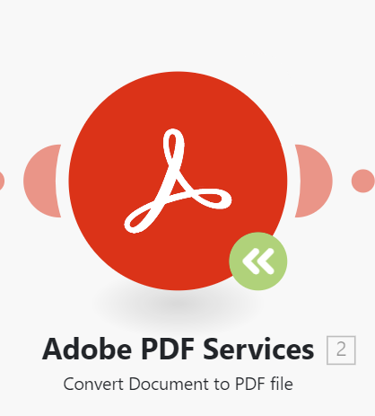

# Mise à jour d’un module vers une nouvelle version dans un scénario [!DNL Adobe Workfront Fusion]

Comme les applications auxquelles Workfront Fusion se connecte peuvent mettre à jour ou publier une nouvelle version, il est parfois nécessaire que Fusion publie des modules mis à jour pour ces applications.

Si un scénario affiche une icône de module de mise à niveau verte sur un module, Workfront Fusion a publié une nouvelle version de ce module.

Vous pouvez mettre à jour le module sans créer de scénario.

1. Cliquez sur l&#39;icône **Mettre à niveau le module**  sur le module que vous souhaitez mettre à niveau vers une nouvelle version.
1. Cliquez sur **Afficher mes nouveaux modules**.
1. Sélectionnez le nouveau module correspondant au module existant.
1. Configurez le module avec les mêmes paramètres que le module existant.
1. Connectez le nouveau module au scénario au même endroit que le module existant.
1. Supprimez l’ancien module.
