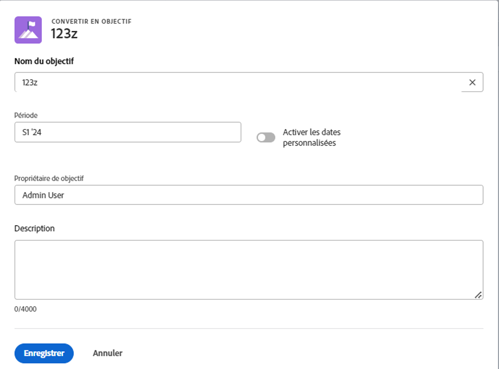

# Alignement des objectifs en convertissant les résultats et les activités en objectifs

Vous pouvez aligner manuellement deux objectifs ou convertir les résultats et activités d’un objectif existant en un autre. Le résultat ou l’activité converti devient l’objectif enfant de l’objectif d’origine.
Pour plus d’informations sur l’alignement manuel de deux objectifs, voir [Alignement des objectifs en les connectant aux objectifs Adobe Workfront](../../workfront-goals/goal-alignment/align-goals-by-connecting-them.md).

## Exigences d’accès

<!--drafted for P&P release: 

<table style="table-layout:auto">
 <col>
 </col>
 <col>
 </col>
 <tbody>
  <tr>
   <td role="rowheader">Adobe Workfront plan*</td>
   <td>
   
Current plan: Select or higher

   Or
   
Legacy plan: Pro or higher

   
   </td>
  </tr>
  <tr>
   <td role="rowheader">Adobe Workfront license*</td>
   <td>
   
Current license: Contributor or higher

   Or
   
Legacy license: Request or higher
 
For more information, see <a href="../../administration-and-setup/add-users/access-levels-and-object-permissions/wf-licenses.md" class="MCXref xref">Adobe Workfront licenses overview</a>.
 </td>
  </tr>
  <tr>
   <td role="rowheader">Product</td>
   <td>
   
 Current product requirement: If you have the Select or Prime Adobe Workfront plan, you must also buy an additional Adobe Workfront Goals license.  Workfront Goals are included in the Ultimate Workfront Plan.

   Or
   
Legacy product requirement: You must purchase an additional license for the Adobe Workfront Goals to access functionality described in this article. 
 
For information, see <a href="../../workfront-goals/goal-management/access-needed-for-wf-goals.md" class="MCXref xref">Requirements to use Workfront Goals</a>. 
 </td>
  </tr>
  <tr>
   <td role="rowheader">Access level*</td>
   <td> 
Edit access to Goals
 
<b>NOTE</b>
If you still don't have access, ask your Workfront administrator if they set additional restrictions in your access level. For information on how a Workfront administrator can change your access level, see:

     <ul>
      <li> 
<a href="../../administration-and-setup/add-users/configure-and-grant-access/create-modify-access-levels.md" class="MCXref xref">Create or modify custom access levels</a> 
 </li>
      <li> 
<a href="../../administration-and-setup/add-users/configure-and-grant-access/grant-access-goals.md" class="MCXref xref">Grant access to Adobe Workfront Goals</a> 
 </li>
     </ul> 
 </td>
  </tr>
  <tr data-mc-conditions="">
   <td role="rowheader">Object permissions</td>
   <td>
    

     
View or higher permissions to the goal to view it

     
Manage permissions to the goal to edit it

     
For information about sharing goals, see <a href="../../workfront-goals/workfront-goals-settings/share-a-goal.md" class="MCXref xref">Share a goal in Workfront Goals</a>. 

    
 </td>
  </tr>
 </tbody>
</table>

-->

Vous devez disposer des éléments suivants :

<table style="table-layout:auto"> 
 <col> 
 <col> 
 <tbody> 
  <tr> 
   <td role="rowheader">Formule Adobe Workfront*</td> 
   <td> 
Pro ou version ultérieure
 </td> 
  </tr> 
  <tr> 
   <td role="rowheader">Licence Adobe Workfront*</td> 
   <td> 
Requête ou supérieure
 
Pour plus d’informations, voir <a href="../../administration-and-setup/add-users/access-levels-and-object-permissions/wf-licenses.md" class="MCXref xref">Présentation des licences Adobe Workfront</a>.
 </td> 
  </tr> 
  <tr> 
   <td role="rowheader">Produit</td> 
   <td> 
Pour accéder aux fonctionnalités décrites dans cet article, vous devez acheter une licence supplémentaire pour les objectifs d’Adobe Workfront. 
 
Pour plus d’informations, voir <a href="../../workfront-goals/goal-management/access-needed-for-wf-goals.md" class="MCXref xref">Conditions requises pour utiliser les objectifs Workfront</a>. 
 </td> 
  </tr> 
  <tr> 
   <td role="rowheader">Paramétrages du niveau d'accès*</td> 
   <td> 
Modifier l’accès aux objectifs ou plus
 
<b>NOTE</b> 
   
Si vous n’avez toujours pas accès à , demandez à votre administrateur Workfront s’il définit des restrictions supplémentaires à votre niveau d’accès. Pour plus d’informations sur la façon dont un administrateur Workfront peut modifier votre niveau d’accès, voir :
 
     <ul> 
      <li> 
<a href="../../administration-and-setup/add-users/configure-and-grant-access/create-modify-access-levels.md" class="MCXref xref">Création ou modification de niveaux d’accès personnalisés</a> 
 </li> 
      <li> 
<a href="../../administration-and-setup/add-users/configure-and-grant-access/grant-access-goals.md" class="MCXref xref">Accorder l’accès aux objectifs Adobe Workfront</a> 
 </li> 
     </ul> 
 </td> 
  </tr> 
  <tr data-mc-conditions=""> 
   <td role="rowheader">Autorisations d’objet</td> 
   <td> 
    
 
     
Gérer les autorisations pour l’objectif
 
     
Pour plus d’informations sur le partage des objectifs, voir <a href="../../workfront-goals/workfront-goals-settings/share-a-goal.md" class="MCXref xref">Partage d’un objectif dans les objectifs Workfront</a>. 
 
    
 </td> 
  </tr> 
 </tbody> 
</table>

*Pour connaître le plan, le type de licence ou l’accès dont vous disposez, contactez votre administrateur Workfront.

## Conditions préalables

Avant de pouvoir commencer, vous devez disposer des éléments suivants :

* Un modèle de mise en page qui inclut la zone Objectifs dans le menu principal.
* Objectif existant avec des résultats et des activités existants.

   Pour plus d’informations sur la création d’objectifs, voir [Création d’objectifs dans les objectifs Adobe Workfront](../../workfront-goals/goal-management/create-goals.md).

>[!IMPORTANT]
>
>Un objectif peut comporter jusqu’à 1 000 indicateurs de progression.

<!--drafted for goal redesign: At PRODUCTION: update the sentence above to remove Production/ Preview references-->

## Considérations relatives à la conversion de résultats et d’activités en objectifs

Parfois, un résultat ou une activité peut avoir une portée plus large que prévu et il serait plus logique qu’ils deviennent des objectifs. Vous pouvez convertir les résultats et les activités d’un objectif existant en un nouvel objectif. Il s’agit d’une approche ascendante de l’alignement des objectifs.

Tenez compte des points suivants lors de la conversion de résultats et d’activités en objectifs :

* Le résultat ou l’activité converti devient l’objectif enfant de l’objectif d’origine, et les deux objectifs s’alignent.
* L’objectif nouvellement créé devient l’indicateur de progression unique de l’objectif d’origine, s’il n’y a aucun résultat ou activité supplémentaire sur l’objectif d’origine. Vous devez ajouter des résultats et des activités à l’objectif enfant pour pouvoir suivre la progression de cet objectif.
* La conversion d’un résultat ou d’une activité en un objectif est irréversible. Une fois converti, le nouvel objectif enfant ne peut plus jamais devenir un résultat ou une activité pour l’objectif parent.

## Convertir un résultat ou une activité en objectif

<!--
Converting results and activities differs depending on what environment you use. 

### Convert a result or activity to a goal in the Production environment

1. Go to a goal that has a result or an activity that you want to convert to a goal.
1. Click the name of the goal to open the **Goal Details** panel.
1. Expand the **Results** or **Activities** right-pointing arrows to see a list of results or activities for the goal. 

1. Click the **gear icon**  to the right of the result or activity name that you want to convert, then click **Convert into a Goal**.

   

1. (Optional) Remove the name of the original activity or result owner from the **Goal Owner** field and replace it with another user, team, group, or your organization's name. By default, Workfront selects the owner of the result or the activity as the goal owner. 
1. Click **Convert**. The activity or result displays as an aligned goal in the Goal Details panel of the original goal and the original activity or result is removed from the original goal and transferred to the second goal. By default, the new goal has the same name as the original converted result or activity. 
1. (Optional) Click the name of the new goal to open the **Goal Details** panel and edit the name of the goal. For information about editing any information for an existing goal, see [Edit goals in Adobe Workfront Goals](../../workfront-goals/goal-management/edit-goals.md).
-->

1. Accédez à un objectif comportant un résultat ou une activité que vous souhaitez convertir en objectif.
1. Sur la page de l’objectif, cliquez sur **Indicateurs de progression** dans le panneau de gauche.
1. Sélectionnez un résultat ou une activité dans la liste des indicateurs de progression, puis cliquez sur le bouton **Convertir en objectif** icon  en haut de la liste des indicateurs de progression. La zone Convertir en objectif s’ouvre.

   
1. Mettez à jour les informations suivantes :
   * **Nom de l’objectif**: Par défaut, le nouvel objectif porte le même nom que le résultat ou l’activité d’origine.
   * **Période**: Par défaut, la période du nouvel objectif est le trimestre en cours. Vous pouvez sélectionner la variable **Activation des dates personnalisées** pour définir une période personnalisée pour le nouvel objectif.
   * **Propriétaire de l’objectif**: Par défaut, le nouveau propriétaire de l’objectif est le propriétaire du résultat ou de l’activité d’origine.
   * **Description**: Ajoutez des informations supplémentaires sur le nouvel objectif.
1. Cliquer sur **Enregistrer**

   Le résultat ou l’activité est désormais converti en objectif enfant de l’objectif d’origine. Il est répertorié comme un objectif dans la liste des indicateurs de progression de l’objectif d’origine.

