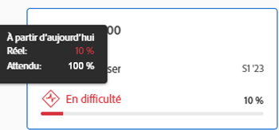

# Naviguer dans la section Alignement des objectifs d’Objectifs Adobe Workfront

<!--Audited P&P only: 4/2025-->

Utilisez la section Alignement des objectifs pour afficher une vue holistique de l’alignement des objectifs sur l’ensemble de l’organisation dans un organigramme. Les objectifs alignés s’affichent sur des cartes qui s’interconnectent dans une arborescence hiérarchique.

Pour plus d’informations sur l’alignement des objectifs et sur la manière d’y parvenir, voir également les articles suivants :

* [Vue d’ensemble de l’alignement des objectifs d’Objectifs Adobe Workfront](../../workfront-goals/goal-alignment/goal-alignment-overview.md)
* [Aligner des objectifs en les connectant dans les Objectifs Adobe Workfront](../../workfront-goals/goal-alignment/align-goals-by-connecting-them.md)

## Conditions d’accès

>[!NOTE]
>
>Votre entreprise peut choisir de continuer à utiliser les objectifs Adobe Workfront si elle a déjà acheté ce package par le passé. Pour plus de détails, contactez votre représentant de compte.
>
>Adobe Workfront Goals ne peut plus être acheté.

+++ Développez pour afficher les exigences d’accès aux fonctionnalités de cet article. 

<table style="table-layout:auto"> 
 <col> 
 <col> 
 <tbody> 
  <tr>
  <td> 
Package Adobe Workfront
 </td> 
   <td> 
   
Adobe Workfront Ultimate

   </td> 
  </tr> 
  <tr> 
   <td> 
Licence Adobe Workfront
 </td> 
   <td> 
Contributeur ou version ultérieure
 
     
Demandeur ou supérieur
 </td> 
  </tr>

<td>
Configurations des niveaux d’accès
 </td> 
   <td> 
Modifier l’accès aux Objectifs
 </td> 
  </tr> 
  <tr> 
   <td> 
Autorisations d’objet 
 </td> 
   <td> 
Autorisations d’affichage ou de niveau supérieur sur l’objectif pour l’afficher

Autorisations de gestion sur l’objectif pour le modifier

  <tr>
   <td role="rowheader">
Modèle de mise en page
</td>
   <td> 
Un modèle de mise en page comprenant la zone Objectifs du menu principal doit être affecté à tous les utilisateurs, y compris les administrateurs système. 
  
</td>
  </tr>
 </tbody> 
</table>

Pour plus d’informations, voir [Conditions d’accès à la documentation de Workfront](/help/quicksilver/administration-and-setup/add-users/access-levels-and-object-permissions/access-level-requirements-in-documentation.md).

+++ 

<!--Old:

<table style="table-layout:auto">
<col>
</col>
<col>
</col>
<tbody>
<tr>
<td role="rowheader">Adobe Workfront plan*</td>
<td> 
   
For the new plan and license structure:
  <ul><li>An Ultimate plan </li></ul>
   

For the current plan and license structure: 
<ul><li> A Pro or higher </li>
  <li>An Adobe Workfront Goals license in addition to a Workfront license.</li></ul>

   </td> 
</tr>
<tr>
<td role="rowheader">Adobe Workfront license*</td>
<td>

New license: Contributor or higher

Or

Current license: Request or higher
  </td>
</tr>
<tr>
<td role="rowheader">Product*</td>
<td>
  
 New product requirement: Workfront

  Or
  
Current product requirement: In addition to a Workfront license, you must purchase a license for Adobe Workfront Goals. 
 
For information, see <a href="../../workfront-goals/goal-management/access-needed-for-wf-goals.md" class="MCXref xref">Requirements to use Workfront Goals</a>. 
 </td>
</tr>
<tr>
<td role="rowheader">Access level</td>
<td> 
Edit access to Goals
 </td>
</tr>
<tr data-mc-conditions="">
<td role="rowheader">Object permissions</td>
<td>

View or higher permissions to the goal to view it

Manage permissions to the goal to edit it

For information about sharing goals, see <a href="../../workfront-goals/workfront-goals-settings/share-a-goal.md" class="MCXref xref">Share a goal in Workfront Goals</a>. 

 </td>
</tr>
<tr>
<td role="rowheader">
Layout template
</td>
<td> 
All users, including Workfront administrators,  must be assigned a layout template that includes the Goals area in the Main Menu. 
  
</td>
</tr>
</tbody>
</table>-->

## Naviguer dans la section Alignement des objectifs

{{step1-to-goals}}

1. Cliquez sur **Alignement des objectifs** dans le panneau de gauche.
1. Utilisez les filtres situés dans le coin supérieur droit du graphique d’alignement pour sélectionner uniquement les objectifs qui vous semblent importants. Pour plus d’informations sur l’utilisation de filtres dans Objectifs Workfront, voir [Filtrer des informations dans Objectifs Adobe Workfront](../../workfront-goals/goal-management/filter-information-wf-goals.md).

   Les objectifs qui correspondent à vos filtres s’affichent dans le graphique d’alignement des cartes.

   Les informations suivantes s’affichent sur une carte d’objectif :

   <table style="table-layout:auto"> 
    <col> 
    <col> 
    <tbody> 
     <tr> 
      <td role="rowheader">Dates de la période </td> 
      <td> 
Il s’agit de la période pendant laquelle l’objectif est ouvert. L’objectif doit être atteint d’ici la date de fin de la période. Objectifs Workfront calcule la progression vers l’objectif en fonction de la durée de la période de l’objectif et de la date actuelle.
 </td> 
     </tr> 
     <tr> 
      <td role="rowheader">Indicateurs de progression</td> 
      <td>Nombre d’indicateurs de progression pour l’objectif. Les indicateurs de progression peuvent être alignés sur des objectifs, des résultats ou des activités. </td> 
     </tr> 
     <tr> 
      <td role="rowheader">Nom du propriétaire</td> 
      <td>Nom de l’utilisateur, de l’équipe, du groupe ou de l’organisation désigné comme propriétaire de l’objectif. </td> 
     </tr> 
     <tr> 
      <td role="rowheader">Nom de l’objectif</td> 
      <td>Nom de l’objectif. </td> 
     </tr> 
     <tr> 
      <td role="rowheader">Barre de progression de l’objectif et progression</td> 
      <td> 
La progression de l’objectif indique la part de l’objectif actuellement atteinte. Il s’agit d’un calcul automatique de la moyenne de la progression de tous les objectifs, résultats et activités alignés pour l’objectif en fonction du temps écoulé depuis le début de la période de l’objectif. Pour plus d’informations sur le calcul de la progression vers les objectifs, voir <a href="../../workfront-goals/goal-management/calculate-goal-progress.md" class="MCXref xref">Vue d’ensemble de la progression et de l’état des objectifs dans Objectifs Adobe Workfront</a>. 
 
       
 
        
Progression réelle de l’objectif à la date actuelle. Les valeurs de progression et les couleurs suivantes indiquent la probabilité d’atteindre l’objectif dans les délais : 
 
        <ul> 
         <li>Ciblé (indicateur vert) : l’objectif est dans les délais et sera atteint à temps.</li> 
         <li> À risque (indicateur jaune) : l’objectif est en retard et peut ne pas être atteint à temps.</li> 
         <li> En difficulté (indicateur rouge) : l’objectif risque de ne pas être atteint à temps. </li> 
        </ul> 
       
 </td> 
     </tr> <!--
      <tr data-mc-conditions="QuicksilverOrClassic.Draft mode"> 
       <td role="rowheader">Updated on date </td> 
       <td> 
The date when the goal was last updated
 
(NOTE: drafted because I think this was removed with the alignment chart redesign - 21.1) 
 </td> 
      </tr>
     --> 
     <tr> 
      <td role="rowheader">Statut</td> 
      <td>Les objectifs dans tous les statuts s’affichent dans la section Alignement des objectifs. </td> 
     </tr> 
    </tbody> 
   </table>

   Les objectifs alignés sur d’autres objectifs affichent le nombre d’objectifs alignés sous la carte d’objectif.

   

1. Cliquez sur l’icône **Flèche pointant vers le bas** dans un objectif pour développer et afficher les objectifs enfant.

   

   >[!TIP]
   >
   >Les objectifs pour lesquels des objectifs enfant sont alignés affichent le nombre d’objectifs alignés sous leurs cartes respectives.

1. (Le cas échéant) Si le filtre actuel exclut certains des objectifs qui participent à un alignement, un message d’avertissement s’affiche pour indiquer que tous les objectifs ne s’affichent pas.

   

1. Cliquez sur **Les afficher** pour afficher les objectifs actuellement éliminés par le filtre.

   Remarquez les modifications suivantes dans le graphique d’alignement :

   * Les objectifs connectés précédemment éliminés par le filtre s’affichent désormais dans le graphique d’alignement.
   * Le filtre dans le coin supérieur droit est souligné en jaune pour indiquer qu’il n’est actuellement pas appliqué.

     

     Un lien Appliquer à nouveau le filtre s’affiche à gauche du nom du filtre.

1. (Facultatif) Cliquez sur **Appliquer à nouveau le filtre** pour revenir aux résultats d’origine et afficher la hiérarchie d’objectifs.
1. (Facultatif) Pointez sur l’indicateur de progression pour comprendre où devrait se trouver l’objectif de progression pour la journée en cours.

   

   Les informations suivantes s’affichent :

   <table style="table-layout:auto"> 
    <col> 
    <col> 
    <tbody> 
     <tr> 
      <td role="rowheader">À partir d’aujourd’hui</td> 
      <td>Le statut de la progression est toujours à jour. </td> 
     </tr> 
     <tr> 
      <td role="rowheader">En cours </td> 
      <td>Progression en cours (un pourcentage) de l’objectif à la date actuelle calculée en prenant en compte tous les indicateurs de progression de l’objectif. Les indicateurs de progression des objectifs sont des objectifs, des activités et des résultats alignés. </td> 
     </tr> 
     <tr> 
      <td role="rowheader">Attendu</td> 
      <td> 
Progression attendue (un pourcentage) de l’objectif à la date actuelle, en supposant que vous atteindrez l’objectif dans les délais.
 </td> 
     </tr> 
    </tbody> 
   </table>

1. Cliquez sur une carte d’objectif pour ouvrir la page d’objectif. Pour plus d’informations sur la modification d’objectifs existants, voir [Modifier des objectifs dans Objectifs Adobe Workfront](../../workfront-goals/goal-management/edit-goals.md). Pour plus d’informations sur la mise à jour de la progression des objectifs, voir [Mettre à jour la progression de l’objectif dans Objectifs Adobe Workfront](../../workfront-goals/goal-review-and-workfront-goals-sections/check-in-goals.md).

1. Cliquez sur la flèche pointant vers le haut de l’objectif de niveau actuel pour revenir au niveau précédent dans la hiérarchie du graphique.

   Ou

   (Facultatif) Cliquez sur **Quitter la hiérarchie des objectifs** pour afficher les cartes de tous les objectifs correspondant au filtre actuel, sans afficher leur connexion entre eux.

