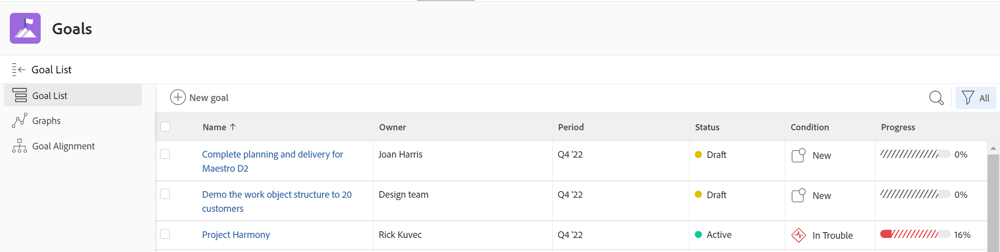

# Accéder aux objectifs et les ouvrir dans Objectifs Adobe Workfront

<!--Audited P&P only: 4/2025-->

Cet article explique comment trouver et gérer des objectifs stratégiques dans Adobe Workfront.

## Conditions d’accès

>[!NOTE]
>
>Votre entreprise peut choisir de continuer à utiliser les objectifs Adobe Workfront si elle a déjà acheté ce package par le passé. Pour plus de détails, contactez votre représentant de compte.
>
>Adobe Workfront Goals ne peut plus être acheté.

+++ Développez pour afficher les exigences d’accès aux fonctionnalités de cet article. 

<table style="table-layout:auto"> 
 <col> 
 </col> 
 <col> 
 </col> 
 <tbody> 
  <tr>
  <td> 
Package Adobe Workfront
 </td> 
   <td> 
   
Adobe Workfront Ultimate

   </td> 
  </tr>
  <tr> 
   <td role="rowheader">Licence Adobe Workfront</td> 
   <td> 
   
Contributeur ou version ultérieure

   
Requête ou supérieure
 </td> 
  </tr> 
  <tr> 
   <td role="rowheader">Configurations des niveaux d’accès</td> 
   <td> 
Modifier l’accès aux Objectifs
 </td> 
  </tr> 
  <tr> 
   <td role="rowheader">Autorisations d’objet</td> 
   <td> 
    
 
     
Autorisations d’affichage ou de niveau supérieur sur l’objectif pour l’afficher
 
     
Autorisations de gestion sur l’objectif pour le modifier
 
      
 </td> 
  </tr> 
  <tr>
   <td role="rowheader">
Modèle de mise en page
</td>
   <td> 
Un modèle de mise en page comprenant la zone Objectifs du menu principal doit être affecté à tous les utilisateurs, y compris les administrateurs système. 
  
</td>
  </tr>
 </tbody> 
</table>

Pour plus d’informations, voir [Conditions d’accès dans la documentation Workfront](/help/quicksilver/administration-and-setup/add-users/access-levels-and-object-permissions/access-level-requirements-in-documentation.md).

+++

<!--Old:
<table style="table-layout:auto"> 
 <col> 
 </col> 
 <col> 
 </col> 
 <tbody> 
  <tr> 
   <td role="rowheader">Adobe Workfront plan*</td> 
   <td> 
   
For the new plan and license structure:
  <ul><li>An Ultimate plan </li></ul>
   

For the current plan and license structure: 
<ul><li> A Pro or higher </li>
  <li>An Adobe Workfront Goals license in addition to a Workfront license.</li></ul>

   </td> 
  </tr> 
  <tr> 
   <td role="rowheader">Adobe Workfront license*</td> 
   <td> 
   
New license: Contributor or higher

   Or
   
Current license: Request or higher
 
For more information, see <a href="../../administration-and-setup/add-users/access-levels-and-object-permissions/wf-licenses.md" class="MCXref xref">Adobe Workfront licenses overview</a>.
 </td> 
  </tr> 
  <tr>
 <td role="rowheader">Product*</td>
 <td>
 
 New product requirement: Workfront

Or

 
Current product requirement: In addition to a Workfront license, you must purchase a license for Adobe Workfront Goals. 
 
For information, see <a href="../../workfront-goals/goal-management/access-needed-for-wf-goals.md" class="MCXref xref">Requirements to use Workfront Goals</a>. 
 </td>
 </tr>
 
  <tr> 
   <td role="rowheader">Access level</td> 
   <td> 
Edit access to Goals
 </td> 
  </tr> 
  <tr data-mc-conditions=""> 
   <td role="rowheader">Object permissions</td> 
   <td> 
    
 
     
View or higher permissions to the goal to view it
 
     
Manage permissions to the goal to edit it
 
     
For information about sharing goals, see <a href="../../workfront-goals/workfront-goals-settings/share-a-goal.md" class="MCXref xref">Share a goal in Workfront Goals</a>. 
 
    
 </td> 
  </tr> 
  <tr>
   <td role="rowheader">
Layout template
</td>
   <td> 
All users, including Workfront administrators,  must be assigned a layout template that includes the Goals area in the Main Menu. 
  
</td>
  </tr>
 </tbody> 
</table>-->

## Accéder aux Objectifs Workfront

{{step1-to-goals}}

La liste des objectifs s’affiche.

>[!IMPORTANT]
>
>   Lorsque vous avez l’accès correct aux Objectifs Workfront, vous pouvez visualiser les objectifs que vous ou toute autre personne avez créés dans la liste des objectifs, par défaut.

<!--   
   (NOTE: This might change when sharing is in place; right now, with sharing in place, they can VIEW all goals in the system but they cannot EDIT the ones others created!)
   -->

1. (Facultatif) Cliquez sur le nom d’un objectif pour l’ouvrir ou le modifier.

   Ou

   Cliquez sur **Nouvel objectif** pour ajouter un nouvel objectif.

   Pour plus d’informations sur la création d’objectifs, voir [Créer des objectifs dans les Objectifs Adobe Workfront](../../workfront-goals/goal-management/create-goals.md).

## Ouvrir et gérer des objectifs individuels

Vous devez accéder à un objectif individuel pour effectuer les actions suivantes dans le cadre de la gestion de vos objectifs :

* Le modifier.
* Y ajouter un résultat ou une activité.
* Modifier les résultats et les activités qui y sont associés.
* L’activer.
* Le désactiver.
* Le supprimer.
* L’aligner sur un autre objectif.
* Convertir les résultats ou les activités en d’autres objectifs.
* Le mettre à jour.
<!--
Accessing goals differs depending on what environment you use.

To access an individual goal in the Production environment:

1. Click the **Main Menu** icon  in the upper-right corner of Workfront, then click **Goals** .

     (!--drafted for Shell release: Add this when Shell is available to all: or (if available), click the **Main Menu** icon  in the upper-left corner)
   --)

   The Goal List displays by default. 

1. Click the name of a goal in the list 

   Or

   Click one of the options below in the left panel, then click the name of a goal to access it:

   * Goal Alignment
   * Check-in 
   * Pulse 

   >[!NOTE]
   >
   >Depending on what action you want to perform on the individual goal, you might choose to select different sections every time. For information about the differences between the Workfront Goals sections, see [Overview of the Adobe Workfront Goals sections](../../workfront-goals/goal-review-and-workfront-goals-sections/overview-of-wf-goals-sections.md).

   The Goal Details panel displays on the right. You can update the goal, its results, and activities in the Goal Details panel when you have access to manage it. For information about updating goals using the Goal Details panel, see [Update goals in the Goal details section in Adobe Workfront Goals](../../workfront-goals/goal-management/update-goals-in-goal-details-panel.md).
-->

Pour accéder à un objectif individuel, procédez comme suit :

{{step1-to-goals}}

La liste des objectifs s’affiche par défaut.

1. Cliquez sur le nom d’un objectif dans la liste.
La page de l’objectif s’affiche.
   
1. Cliquez sur le menu **Plus**  à droite du nom de l’objectif pour modifier ou partager l’objectif.
1. Cliquez sur **Détails de l’objectif** dans le panneau de gauche pour modifier les informations relatives à l’objectif. Pour plus d’informations, voir [Mettre à jour des objectifs dans la section Détails de l’objectif dans les Objectifs Adobe Workfront](../goal-management/update-goals-in-goal-details-panel.md).

