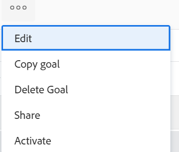

# Activer des objectifs dans Objectifs Adobe Workfront

Lorsque vous créez un objectif, les objectifs Adobe Workfront l’enregistrent avec l’état Brouillon. Les objectifs élaborés ne font pas partie de la gestion des objectifs.

Pour suivre à quel point vous êtes proche de l’atteinte d’un objectif en mettant à jour sa progression, vous devez l’activer. L’état devient alors Actif.

Pour plus d’informations sur la création d’un objectif, voir [Création d’objectifs dans les objectifs Adobe Workfront](../../workfront-goals/goal-management/create-goals.md).

>[!IMPORTANT]
>
>Vous devez activer un objectif avant de pouvoir mettre à jour la progression de ses résultats et activités.

## Conditions d’accès

Vous devez disposer des éléments suivants :

<table style="table-layout:auto">
<col>
</col>
<col>
</col>
<tbody>
 <tr>
 <td role="rowheader">Forfait Adobe Workfront</td>
 <td>
 
N’importe quelle

</td>
 </tr>
 <tr>
 <td role="rowheader">Licence Adobe Workfront*</td>
 <td>
 
Nouvelle licence : contributeur ou contributrice ou supérieure

 Ou
 
Licence actuelle : demande ou supérieure
 
Pour plus d’informations, voir <a href="../../administration-and-setup/add-users/access-levels-and-object-permissions/wf-licenses.md" class="MCXref xref">Présentation des licences Adobe Workfront</a>.
 </td>
 </tr>
 <tr>
 <td role="rowheader">Produit*</td>
 <td>
 
 Nouvelle exigence de produit, l’une des options suivantes : 

<ul>
<li>Un forfait Select ou Prime Adobe Workfront et une licence Adobe Workfront Goals supplémentaire.</li>
<li>Un plan Workfront Ultimate qui inclut par défaut les objectifs de Workfront. </li></ul>
 
Ou

 
Exigences actuelles du produit : formule Workfront et licence supplémentaire pour les objectifs Adobe Workfront. 
 
Pour plus d’informations, consultez la section <a href="../../workfront-goals/goal-management/access-needed-for-wf-goals.md" class="MCXref xref">Exigences pour l’utilisation des Objectifs Workfront</a>. 
 </td>
 </tr>
 <tr>
 <td role="rowheader">Niveau d’accès</td>
 <td> 
Modifier l’accès aux objectifs
 </td>
 </tr>
 <tr data-mc-conditions="">
 <td role="rowheader">Autorisations d’objet</td>
 <td>
  

  
Afficher ou des autorisations supérieures à l’objectif pour l’afficher

  
Gérer les autorisations sur l’objectif pour le modifier

  
Pour plus d’informations sur le partage des objectifs, consultez <a href="../../workfront-goals/workfront-goals-settings/share-a-goal.md" class="MCXref xref">Partager un objectif dans les Objectifs Workfront</a>. 

  
 </td>
 </tr>
<tr>
   <td role="rowheader">
Modèle de mise en page
</td>
   <td> 
Tous les utilisateurs, y compris les administrateurs de Workfront, doivent se voir attribuer un modèle de mise en page incluant la zone Objectifs dans le menu principal. 
  
</td>
  </tr>
</tbody>
</table>

*Pour plus d’informations, voir [Conditions d’accès requises dans la documentation Workfront](/help/quicksilver/administration-and-setup/add-users/access-levels-and-object-permissions/access-level-requirements-in-documentation.md).

## Conditions préalables

Pour activer un objectif, celui-ci doit être associé à un indicateur de progression tel qu’une activité, un résultat, un projet, ou être aligné sur un autre objectif actif.

Effectuez au moins l’une des opérations suivantes pour activer un objectif :

* Ajouter un résultat à l’objectif

  Pour plus d’informations, voir [Ajout de résultats aux objectifs dans les objectifs Adobe Workfront](../../workfront-goals/results-and-activities/add-results-to-goals.md).

* Ajouter une activité à l’objectif

  Pour plus d’informations, voir [Ajout d’activités aux objectifs dans les objectifs Adobe Workfront](../../workfront-goals/results-and-activities/add-activities-to-goals.md).

* Connexion d’un projet à l’objectif

  Pour plus d’informations, voir [Ajout de projets aux objectifs dans les objectifs Adobe Workfront](../results-and-activities/connect-projects-to-goals-overview.md).

* Aligner un autre objectif sur l’objectif que vous souhaitez activer

  Pour plus d’informations, voir [Alignement des objectifs en les connectant aux objectifs Adobe Workfront](../../workfront-goals/goal-alignment/align-goals-by-connecting-them.md).

## Activer des objectifs

Vous pouvez activer les objectifs que vous avez créés ou un objectif pour lequel vous disposez des autorisations de gestion .

1. Accédez à un objectif que vous souhaitez activer. La page d’objectif s’ouvre.

1. Cliquez sur le bouton **Plus** menu  à droite du nom de l’objectif, puis cliquez sur **Activer**.

   

   L’état de l’objectif passe à Actif. Vous pouvez maintenant suivre la progression de l’objectif et l’objectif s’affiche dans la section Archivage , ainsi que dans les sections Graphiques des objectifs de Workfront.
