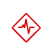

# Présentation de la progression et de la condition des objectifs dans les objectifs Adobe Workfront

<!--drafted for P&P release: the note at the top will need to be replaced with this:

Your organization must have the following to use the functionality described in this article:

* For the legacy plan and license structure: 

  * A Pro or higher [Adobe Workfront plan](https://www.workfront.com/plans). 
  * An Adobe Workfront Goals license in addition to a Workfront license.

* For the current plan and license structure:

  * An Ultimate plan 
    
    Or
    
    An additional license for Adobe Workfront Goals for the Prime or Select Adobe Workfront plans. <is there a link we can add here for the plans and what they contain?!>

Contact your Workfront account manager to learn about a Workfront Goals license.

For additional information about access to Workfront Goals, see [Requirements to use Workfront Goals](../../workfront-goals/goal-management/access-needed-for-wf-goals.md).
-->

>[!NOTE]
>
>Votre entreprise doit disposer des éléments suivants pour utiliser les fonctionnalités décrites dans cet article :
>
>* A Pro ou version ultérieure [Formule Adobe Workfront](https://www.workfront.com/plans).
>* Une licence Adobe Workfront Goals en plus d’une licence Workfront.
>
>Contactez votre gestionnaire de compte Workfront pour en savoir plus sur une licence Workfront Goals.
>Pour plus d’informations sur l’accès aux objectifs de Workfront, voir [Conditions requises pour utiliser les objectifs Workfront](../../workfront-goals/goal-management/access-needed-for-wf-goals.md).

Adobe Workfront calcule automatiquement la progression de l’objectif en fonction de la progression de ses indicateurs de progression.

## Conditions préalables

Avant de pouvoir commencer, vous devez disposer des éléments suivants :

* Un modèle de mise en page qui inclut la zone Objectifs dans le menu principal.

## Présentation de la progression des objectifs et du seuil

Une fois que vous avez activé un objectif, les objectifs de Workfront commencent à calculer sa progression et sa condition et affichent les indicateurs suivants lorsque vous passez la souris sur le champ Progression :

| Indicateur | Description de l’indicateur |
|---|---|
| Pourcentage réel terminé | Quelle est la part de l&#39;objectif réellement atteint jusqu&#39;à présent ? Les objectifs de Workfront calculent cette valeur en calculant la moyenne du pourcentage d’achèvement de tous les indicateurs de progression associés à l’objectif. |
| Pourcentage attendu terminé | Quelle partie de l’objectif doit être atteinte jusqu’à présent pour que l’objectif soit atteint à temps. Les objectifs de Workfront calculent cette valeur en observant la durée de l’objectif et le moment présent dans le temps. L’objectif doit afficher cette valeur à l’heure actuelle, si elle doit être terminée à temps. |
| Progression | Libellé qui indique si l’objectif est sur la cible pour être atteint à temps, ou s’il est menacé ou s’il a des difficultés à ne pas l’être. |


<!--drafted for the redesign: replace the screen shot above with the redesigned one which is white, not black-->

* [Pourcentage réel terminé](#actual-percent-complete)
* [Pourcentage attendu terminé](#expected-percent-complete)
* [Progression et condition](#progress)

### Pourcentage réel terminé {#actual-percent-complete}

Les objectifs de Workfront calculent automatiquement le pourcentage réel de réalisation d’un objectif en fonction de la moyenne de pourcentage complète des indicateurs de progression de l’objectif.

Les éléments suivants sont considérés comme des indicateurs de progression pour les objectifs :

* Résultats

   Pour plus d’informations sur l’ajout de résultats aux objectifs, voir [Ajout de résultats aux objectifs dans les objectifs Adobe Workfront](../../workfront-goals/results-and-activities/add-results-to-goals.md).

* Activités

   Pour plus d’informations sur l’ajout d’activités comprenant des projets à des objectifs, voir [Ajout d’activités aux objectifs dans les objectifs Adobe Workfront](../../workfront-goals/results-and-activities/add-activities-to-goals.md).

* Objectifs pour les enfants

   Pour plus d’informations sur les objectifs parents et enfants, voir [Alignement des objectifs en les connectant aux objectifs Adobe Workfront](../../workfront-goals/goal-alignment/align-goals-by-connecting-them.md).

   Workfront Goals calcule le pourcentage réel de réalisation à l’aide de la formule suivante :

   ```
   Actual percent complete of goal = SUM(Percent complete of goal progress indicators)* 100 / Number of progress indicators
   ```

   Par exemple, si un objectif a un résultat qui est de 20 % terminé, une barre de progression manuelle qui est de 30 % terminée, un projet qui est 10 % terminé et un objectif enfant qui est de 40 % terminé, le pourcentage d’objectif terminé est de 25 %.

### Pourcentage attendu terminé {#expected-percent-complete}

Les objectifs de Workfront calculent automatiquement le pourcentage d’achèvement attendu d’un objectif en fonction du nombre total de jours dans la durée de l’objectif ainsi que du nombre de jours écoulés depuis la date de début de l’objectif.

Workfront Goals calcule le pourcentage d’achèvement attendu à l’aide de la formule suivante :

```
Expected percent complete of goal = Number of days since the goal start date * 100/ Number of days in the goal duration
```

Par exemple, si un objectif doit être atteint dans 90 jours, et qu’aujourd’hui est le 45e jour de cette durée, le pourcentage attendu est de 50 %.

### Progression et condition {#progress}

Les objectifs de Workfront calculent un pourcentage de progression et attribuent une étiquette de progression aux objectifs, en fonction du pourcentage du pourcentage prévu atteint à ce moment précis. La couleur de la barre de fin du pourcentage d’objectif change pour indiquer la progression de l’objectif.

La condition de l’objectif est également mise à jour, en conséquence, afin d’indiquer si l’objectif est sur le point de se terminer à temps ou s’il est en retard.

Workfront Goals calcule le pourcentage de progression d’un objectif à l’aide de la formule suivante :

```
Goal progress percentage = Actual percent complete * 100 / Expected percent complete
```

Par exemple, si le pourcentage attendu est de 53 % à l’heure actuelle et que le pourcentage réel est de 30 %, le pourcentage de progression de l’objectif est de 56 %. Les objectifs de Workfront attribuent à cet objectif la condition &quot;En danger&quot;.

Le graphique suivant illustre la relation entre les libellés de condition et le pourcentage de progression :


Le tableau ci-dessous répertorie les libellés de condition d’objectif et les pourcentages de progression de l’objectif associés à chaque étiquette.

>[!TIP]
>
>Les libellés de condition d’objectif correspondent au nom et à la couleur de la condition du projet Workfront.

<table style="table-layout:auto"> 
 <col> 
 <col> 
 <col> 
 <col> 
 <tbody> 
  <tr> 
   <td><b>Nom de la progression de l’objectif</b></td> 
   <td><b>Définition de la progression de l’objectif</b></td> 
   <td><b>Pourcentage de progression de l'objectif</b></td> 
   <td><b>Couleur de la barre complète de pourcentage</b></td> 
   <td><b>Icône Indicateur de condition</b></td> 
  </tr> 
  <tr> 
   <td>Nouveau</td> 
   <td> <p>L’objectif vient d’être créé et n’enregistre pas encore la progression. La progression de l’objectif s’affiche sous la forme Nouveau jusqu’à ce qu’une personne mette à jour sa progression pour la première fois. </p> <p>Pour plus d’informations sur la mise à jour de la progression de l’objectif, voir <a href="../../workfront-goals/goal-review-and-workfront-goals-sections/check-in-goals.md" class="MCXref xref">Mise à jour de la progression de l’objectif dans les objectifs Adobe Workfront</a>.</p> </td> 
   <td>Aucun pourcentage</td> 
   <td>Aucune barre</td> 
   <td></td>
  </tr> 
  <tr> 
   <td> <p><span>Dans les temps</span> </p> </td> 
   <td>L’objectif fonctionne comme prévu et il est très probable qu’il se termine à temps. </td> 
   <td>90-100%</td> 
   <td>Vert</td> 
    <td></td>
  </tr> 
  <tr> 
   <td> <p><span>En danger</span> </p> </td> 
   <td>L'objectif est à la traîne, mais il pourrait encore être possible de le réaliser à temps. </td> 
   <td>70-89.99%</td> 
   <td>Jaune</td>
   <td></td> 
  </tr> 
  <tr> 
   <td> <p><span>En difficulté</span> </p> </td> 
   <td> <p>Il est très probable que l’objectif ne sera pas atteint à temps. </p> </td> 
   <td>0-69.99%</td> 
   <td>Rouge</td> 
   <td></td> 
  </tr> 
 </tbody> 
</table>