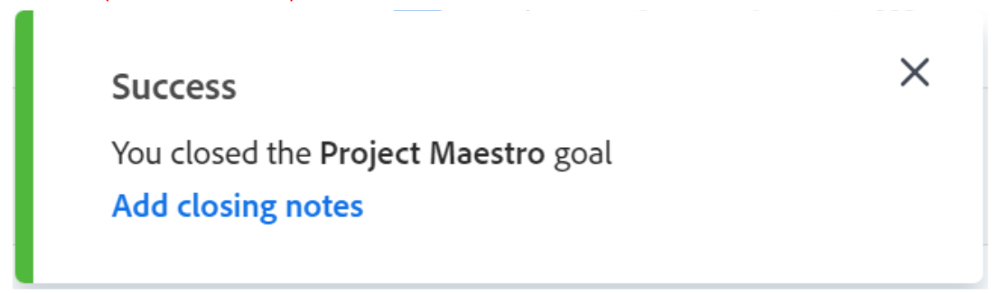

# Fermer et rouvrir des objectifs dans Objectifs Adobe Workfront

<!--Audited for P&P only: 4/2025-->

Vous pouvez fermer un objectif lorsque vous souhaitez indiquer les éléments suivants :

* L’objectif est terminé, soit parce que vous l’avez atteint, soit parce que le délai est écoulé.
* Vous ne travaillez plus dessus et ne prévoyez pas de le faire dans un avenir immédiat.

Vous pouvez rouvrir les objectifs qui ont été fermés lorsqu’ils deviennent à nouveau pertinents.

## Conditions d’accès

>[!NOTE]
>
>Votre entreprise peut choisir de continuer à utiliser les objectifs Adobe Workfront si elle a déjà acheté ce package par le passé. Pour plus de détails, contactez votre représentant de compte.
>
>Adobe Workfront Goals ne peut plus être acheté.

+++ Développez pour afficher les exigences d’accès aux fonctionnalités de cet article. 

<table style="table-layout:auto">
<col>
</col>
<col>
</col>
<tbody>
 <tr>
  <td> 
Package Adobe Workfront
 </td> 
   <td> 
   
Adobe Workfront Ultimate

   </td> 
  </tr> 
 <tr>
 <tr>
 <td role="rowheader">Licence Adobe Workfront</td>
 <td>
 
Contributeur ou version ultérieure

 
Requête ou supérieure
</td>
 </tr>
 <td role="rowheader">Configuration du niveau d’accès</td>
 <td> 
Modifier l’accès aux Objectifs
 </td>
 </tr>
 <tr>
 <td role="rowheader">Autorisations d’objet</td>
 <td>
  

  
Autorisations d’affichage ou de niveau supérieur sur l’objectif pour l’afficher

  
Autorisations de gestion sur l’objectif pour le modifier

  
 </td>
 </tr>
<tr>
   <td role="rowheader">
Modèle de mise en page
</td>
   <td> 
Un modèle de mise en page comprenant la zone Objectifs du menu principal doit être affecté à tous les utilisateurs, y compris les administrateurs système. 
  
</td>
  </tr>
</tbody>
</table>

Pour plus d’informations, voir [Conditions d’accès dans la documentation Workfront](/help/quicksilver/administration-and-setup/add-users/access-levels-and-object-permissions/access-level-requirements-in-documentation.md).

+++

<!--Old:
<table style="table-layout:auto">
<col>
</col>
<col>
</col>
<tbody>
 <tr> 
   <td role="rowheader">Adobe Workfront plan*</td> 
   <td> 
   
For the new plan and license structure:
  <ul><li>An Ultimate plan </li></ul>
   

For the current plan and license structure: 
<ul><li> A Pro or higher </li>
  <li>An Adobe Workfront Goals license in addition to a Workfront license.</li></ul>

   </td> 
  </tr>
 <tr>
 <tr>
 <td role="rowheader">Adobe Workfront license*</td>
 <td>
 
New license: Contributor or higher

 Or
 
Current license: Request or higher
 
For more information, see <a href="../../administration-and-setup/add-users/access-levels-and-object-permissions/wf-licenses.md" class="MCXref xref">Adobe Workfront licenses overview</a>.
 </td>
 </tr>
 <tr>
 <td role="rowheader">Product*</td>
 <td>
  
 New product requirement: Workfront

 
Or

  
Current product requirement: In addition to a Workfront license, you must purchase a license for Adobe Workfront Goals. 
 
For information, see <a href="../../workfront-goals/goal-management/access-needed-for-wf-goals.md" class="MCXref xref">Requirements to use Workfront Goals</a>. 
 </td>
 </tr>
 <td role="rowheader">Access level</td>
 <td> 
Edit access to Goals
 </td>
 </tr>
 <tr data-mc-conditions="">
 <td role="rowheader">Object permissions</td>
 <td>
  

  
View or higher permissions to the goal to view it

  
Manage permissions to the goal to edit it

  
For information about sharing goals, see <a href="../../workfront-goals/workfront-goals-settings/share-a-goal.md" class="MCXref xref">Share a goal in Workfront Goals</a>. 

  
 </td>
 </tr>
<tr>
   <td role="rowheader">
Layout template
</td>
   <td> 
All users, including Workfront administrators,  must be assigned a layout template that includes the Goals area in the Main Menu. 
  
</td>
  </tr>
</tbody>
</table>-->

## Éléments à prendre en compte concernant la fermeture ou la réouverture d’objectifs

* Vous devez avoir l’accès Modifier des objectifs dans votre niveau d’accès pour pouvoir fermer et rouvrir des objectifs. Pour plus d’informations sur l’octroi de l’accès aux Objectifs, voir [Accorder l’accès aux Objectifs Adobe Workfront](../../administration-and-setup/add-users/configure-and-grant-access/grant-access-goals.md).
* Vous ne pouvez fermer que les objectifs actifs. Vous ne pouvez pas fermer les objectifs dont le statut est Brouillon.

  Pour plus d’informations sur les statuts des objectifs, voir [Vue d’ensemble des statuts des objectifs dans Objectifs Adobe Workfront](../../workfront-goals/goal-management/goal-status-overview.md).

* Fermer un objectif verrouille sa progression et vous permet d’évaluer vos performances concernant leur réalisation.

  >[!CAUTION]
  >
  >Lors de la fermeture d’un objectif qui possède des objectifs de contribution actifs, sa progression est modifiée après sa fermeture afin d’indiquer la progression des objectifs de contribution actifs. Pour plus d’informations sur l’alignement des objectifs, voir [Aligner des objectifs en les connectant dans Objectifs Adobe Workfront](../../workfront-goals/goal-alignment/align-goals-by-connecting-them.md).

* Mettez à jour les indicateurs de progression de l’objectif avant de fermer l’objectif pour vous assurer que l’objectif se ferme avec une valeur de progression correcte. Si tous les indicateurs de progression sont atteints, le pourcentage d’accomplissement de l’objectif doit alors être de 100 % et votre objectif est atteint. Pour plus d’informations sur la mise à jour de vos objectifs, voir [Mettre à jour la progression des objectifs dans Objectifs Adobe Workfront](../../workfront-goals/goal-review-and-workfront-goals-sections/check-in-goals.md).
* Ajoutez vos commentaires finaux en tant que mise à jour pour les objectifs que vous fermez. Pour plus d’informations sur l’ajout de commentaires aux objectifs, voir [Gérer les commentaires des objectifs dans Objectifs Adobe Workfront](../../workfront-goals/goal-management/manage-goal-comments.md).
* Vous ne pouvez plus mettre à jour la progression des résultats et des activités sur un objectif que vous fermez.
* Vous pouvez rouvrir un objectif fermé si vous souhaitez continuer à travailler dessus.
* Si l’objectif n’a pas été atteint, pensez à copier la plupart de ses informations vers la prochaine période calendaire (trimestre ou année). Il s’agit d’une excellente option pour les objectifs qui sont identiques d’une période à l’autre ou pour les objectifs sur lesquels vous devrez peut-être encore travailler au cours de la prochaine période. Pour plus d’informations sur la copie d’objectifs, voir [Copier des objectifs dans Objectifs Adobe Workfront](../../workfront-goals/goal-management/copy-goals.md). Vous pouvez également mettre à jour la période sur l’objectif au lieu de la copier dans une autre période.
* Workfront supprime les commentaires d’un objectif fermé lorsque vous le rouvrez. Si vous devez conserver les commentaires, nous vous recommandons de copier l’objectif fermé, y compris les résultats qui lui sont associés, plutôt que de le rouvrir.

## Fermer les objectifs

<!--
Closing goals differs depending on what environment you use. 

### Close goals in the Production environment

1. Click the **Main Menu** icon  > **Goals** in the upper-right corner.

   (!-- Add this when Shell is available to all: or (if available), click the **Main Menu** icon  in the upper-left corner)
   --)

   The Goal List opens. 

1. (Optional) Modify your filters to display only goals that are active.

   For information about filtering information in Workfront Goals, see [Filter information in Adobe Workfront Goals](../../workfront-goals/goal-management/filter-information-wf-goals.md). 

1. Click an active goal.

   The Goal Details panel displays on the right. 

1. (Optional and recommended) Click the **Updates** tab and add an update in the **Comment here** field about the reason you are closing the goal, then click **Post**. 

1. Click the **More icon**  to the right of the goal name, then click **Close** > **Close Goal**.

   This closes the goal and saves the current progress on the goal and its results and activities.

   >[!IMPORTANT]
   >
   >If the goal has contributing goals that are still active, the progress of the goal continues to update based on the progress of the aligned goals.
   >
   >
   >   >
   >

1. (Optional) Modify your filters again to display only closed goals. The goals you closed display on the screen.
-->

{{step1-to-goals}}

La liste des objectifs s’affiche.

1. (Facultatif) Modifiez vos filtres pour n’afficher que les objectifs actifs.

   Pour plus d’informations sur le filtrage des informations dans les Objectifs Workfront, voir [Filtrer des informations dans les Objectifs Adobe Workfront](../goal-management/filter-information-wf-goals.md).
1. Cliquez sur un objectif actif.

   La page de l’objectif s’ouvre.

   
1. Cliquez sur le menu **Plus**  à droite du nom de l’objectif, puis cliquez sur **Fermer**.

   L’objectif se ferme et vous recevez une confirmation dans le coin supérieur droit de l’écran.

   

1. (Facultatif) Dans la zone de confirmation, cliquez sur **Ajouter des notes à propos de la fermeture** pour ajouter des commentaires sur cet objectif et les raisons pour lesquelles vous devez le fermer.
1. Saisissez des notes à propos de la fermeture, puis cliquez sur **Ajouter les notes**.

   

   Les commentaires s’affichent dans la section Détails sur l’objectif de la page de l’objectif, dans la zone Notes à propos de la fermeture.

   >[!NOTE]
   >
   >Workfront supprime les notes à propos de la fermeture si vous rouvrez ultérieurement un objectif fermé.

## Rouvrir des objectifs

Vous pouvez rouvrir les objectifs fermés si vous décidez qu’ils sont redevenus pertinents et que vous devez continuer à mettre à jour leur progression.

<!--
Reopening goals differs depending on what environment you use.

### Reopen goals in the Production environment

1. Click the **Main Menu** icon  > **Goals** in the upper-right corner.

   (!-- Add this when Shell is available to all: or (if available), click the **Main Menu** icon  in the upper-left corner)
   --)

   The Goal List opens. 

1. (Optional) Modify your filters to display only goals that are closed.

   For information about filtering information in Workfront Goals, see [Filter information in Adobe Workfront Goals](../../workfront-goals/goal-management/filter-information-wf-goals.md).

1. Click a closed goal.

   This opens the Goal Details panel on the right. 

1. Click the **More icon**  to the right of the goal name, then click **Reopen** > **Reopen**.

   This reopens the goal and places it in a status of Active. The progress of the goal is recalculated starting with the current date. 

1. (Optional) Modify your filters again to display only active goals. The goals you opened display on the screen.

-->

{{step1-to-goals}}

La liste des objectifs s’affiche.

1. (Facultatif) Modifiez vos filtres pour n’afficher que les objectifs fermés.

   Pour plus d’informations sur le filtrage des informations dans les Objectifs Workfront, voir [Filtrer des informations dans les Objectifs Adobe Workfront](../goal-management/filter-information-wf-goals.md).
1. Cliquez sur le nom d’un objectif fermé.

   La page de l’objectif s’ouvre.
1. Cliquez sur le menu **Plus**  à droite du nom de l’objectif, puis **Rouvrir** > **Rouvrir**.

   Les événements suivants se produisent :
   * L’objectif est maintenant ouvert avec le statut Actif.
   * La progression de l’objectif est recalculée à partir de la date actuelle.
   * Toutes les notes à propos de la fermeture sont supprimées de la page Détails sur l’objectif. Vous ne pouvez pas récupérer les notes à propos de la fermeture supprimées.

1. (Facultatif) Modifiez à nouveau vos filtres pour n’afficher que les objectifs actifs.

   Les objectifs que vous avez ouverts s’affichent à l’écran.

