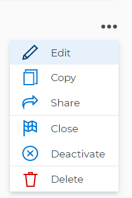

# Modifier des objectifs dans Objectifs Adobe Workfront

Vous pouvez modifier les objectifs existants de n’importe quelle période et dans n’importe quel statut.

## Conditions d’accès

Vous devez disposer des éléments suivants :

<table style="table-layout:auto">
<col>
</col>
<col>
</col>
<tbody>
 <tr> 
   <td role="rowheader">Forfait Adobe Workfront*</td> 
   <td> 
   
Pour la nouvelle structure de forfait et de licence :
  <ul><li>Un forfait Ultimate </li></ul>
   

Pour la structure de forfait et de licence actuelle : 
<ul><li> Un forfait Pro ou supérieur </li>
  <li>Une licence Objectifs Adobe Workfront en plus d’une licence Workfront.</li></ul>

   </td> 
  </tr>
 <tr>
 <td role="rowheader">Licence Adobe Workfront*</td>
 <td>
 
Nouvelle licence : contributeur ou contributrice ou niveau supérieur

 Ou
 
Licence actuelle : demande ou niveau supérieur
 
Pour plus d’informations, voir <a href="../../administration-and-setup/add-users/access-levels-and-object-permissions/wf-licenses.md" class="MCXref xref">Vue d’ensemble des licences Adobe Workfront</a>.
 </td>
 </tr>
 <tr>
 <td role="rowheader">Produit*</td>
 <td>
 
 Nouvelle exigence de produit, une des options suivantes : 

<ul>
<li>Un forfait Adobe Workfront Select ou Prime et une licence Objectifs Adobe Workfront supplémentaire.</li>
<li>Un forfait Workfront Ultimate qui inclut Objectifs Workfront par défaut. </li></ul>
 
Ou

 
Exigence de produit actuelle : un forfait Workfront et une licence supplémentaire pour Objectifs Adobe Workfront. 
 
Pour plus d’informations, consultez la section <a href="../../workfront-goals/goal-management/access-needed-for-wf-goals.md" class="MCXref xref">Exigences pour l’utilisation des Objectifs Workfront</a>. 
 </td>
 </tr>
 <tr>
 <td role="rowheader">Niveau d’accès</td>
 <td> 
Modifier l’accès aux Objectifs
 </td>
 </tr>
 <tr data-mc-conditions="">
 <td role="rowheader">Autorisations d’objet</td>
 <td>
  

  
Autorisations d’affichage ou de niveau supérieur sur l’objectif pour l’afficher

  
Autorisations de gestion sur l’objectif pour le modifier

  
Pour plus d’informations sur le partage des objectifs, voir <a href="../../workfront-goals/workfront-goals-settings/share-a-goal.md" class="MCXref xref">Partager un objectif dans Objectifs Workfront</a>. 

  
 </td>
 </tr>
 <tr>
   <td role="rowheader">
Modèle de mise en page
</td>
   <td> 
Toutes les personnes, y compris les administrateurs et administratrices Workfront, doivent se voir attribuer un modèle de mise en page incluant la zone Objectifs dans le menu principal. 
  
</td>
  </tr>
</tbody>
</table>

*Pour plus d’informations, voir [Conditions d’accès dans la documentation de Workfront](/help/quicksilver/administration-and-setup/add-users/access-levels-and-object-permissions/access-level-requirements-in-documentation.md).

## Remarques relatives à la modification des objectifs

* Vous ne pouvez pas modifier les objectifs dont le statut est Clos.
* Vous pouvez modifier les objectifs de n’importe quelle période.

  Vous pouvez modifier les informations suivantes pour un objectif passé :

   * Nom
   * Période
   * Statut

     >[!TIP]
     >
     >Si l’objectif est Clos, sa réouverture recalcule le pourcentage d’avancement. Vous ne pouvez pas modifier un objectif clos.

   * Description
   * Résultats et activités

## Modifier des objectifs

<!--
Editing goals differs depending on what environment you use.

### Edit goals in the Production environment

1. Go to a goal that you want to edit and click the goal name to open the **Goal Details** panel. 
1. Click the **More icon** , then click **Edit**.

   

1. Update the name of the goal in the **Goal** field. 
1. Select a time period when the goal should be completed.

   Select from the following predefined options:

   * The current year
   * The quarters of the current year
   * The next two years
   * The quarters of the next two years

   Or

   Click **Define custom dates** to select a custom time frame. 

1. (Conditional) Select a start and an end date for your goal, if you clicked **Define custom dates**.

   
   
(NOTE: these fields don't yet have a name) 

   

   >[!CAUTION]
   >
   >You cannot create a goal with custom dates in the past.

1. (Optional) Click **Reset custom dates** to return to the predefined options.

   >[!TIP]
   >
   >We recommend that everyone in your organization selects the same time frames for similar goals or goals that are aligned. This provides better alignment between goals and ensures that everyone's work supports your larger organization-wide strategy.

1. Click the **Owner** field and select a new owner for the goal, if you want to indicate someone else as the owner of the goal. 
1. (Conditional) Start typing the name of a user, team, group, or the name of your organization in the **Owner** field, then select it when it displays in the list. You can have only one owner for a goal. 
1. Update the **Description** of the goal, then click **Save**.

-->

1. Cliquez sur l’icône **Menu principal** , puis sur **Objectifs**.\
   Une liste d’objectifs s’affiche.
1. Cliquez sur un objectif.\
   La page de l’objectif s’affiche.

   

1. Effectuez l’une des opérations suivantes pour modifier les informations relatives à l’objectif :
   * Cliquez sur les champs qui s’affichent dans l’en-tête de l’objectif pour les mettre à jour. Tous les champs de l’en-tête ne sont pas modifiables.
   * Cliquez sur l’icône **Plus**  à droite du nom de l’objectif, puis cliquez sur **Modifier**.
   * Cliquez sur **Détails de l’objectif** dans le panneau de gauche, puis cliquez sur l’icône **Modifier**  dans le coin supérieur droit, puis cliquez sur **Tout modifier**. Commencez à mettre à jour les champs de la section Détails sur l’objectif.

     >[!IMPORTANT]
     >
     >Les champs qui s’affichent dans les zones mentionnées ci-dessus ne sont pas tous modifiables. Workfront calcule certains champs et ceux-ci sont en lecture seule.

1. (Le cas échéant) En fonction de ce que vous avez sélectionné à l’étape précédente, mettez à jour les informations suivantes sur l’objectif :

   * Mettez à jour les informations suivantes dans l’en-tête de l’objectif, puis appuyez sur Entrée pour enregistrer vos modifications :
      * **Nom de l’objectif** : cliquez sur le nom de l’objectif et commencez à saisir un nouveau nom.
      * **Personne propriétaire** : cliquez sur le nom de la personne propriétaire et commencez à taper le nom d’une personne, d’une équipe, d’un groupe ou de votre entreprise, puis sélectionnez-le lorsqu’il s’affiche dans la liste. Vous ne pouvez avoir qu’une seule personne propriétaire pour un objectif.
   * Mettez à jour les informations suivantes dans la case Modifier l’objectif, puis cliquez sur **Enregistrer** :
      * **Nom de l’objectif**
      * **Période** : cliquez pour mettre à jour la période de l’objectif.\
        Ou\
        Sélectionnez **Activer des dates personnalisées** pour indiquer les dates de **Début** et de **Fin** de l’objectif.

        >[!TIP]
        >
        >Désélectionnez **Activer les dates personnalisées** pour revenir à la période originale de l’objectif.

      * **Personne propriétaire de l’objectif**
      * **Description** : ajoutez ou mettez à jour des informations sur l’objectif.
   * Mettez à jour ou révisez les informations dans la section Détails sur l’objectif. Pour plus d’informations, voir [Mettre à jour les objectifs dans la section Détails sur l’objectif dans Objectifs Adobe Workfront](../goal-management/update-goals-in-goal-details-panel.md).

   <!-- (should you update the title here after changing it at production??? - change it to Update goals in the goal Details section)-->

1. (Facultatif) Cliquez sur **Indicateurs de progression** dans le panneau de gauche pour ajouter des résultats, des activités ou des projets à l’objectif. En ajoutant des indicateurs de progression, vous vous assurez de pouvoir suivre l’évolution de l’objectif.
Pour plus d’informations, consultez les articles suivants :
   * [Ajouter des activités aux objectifs dans Objectifs Adobe Workfront](../results-and-activities/add-activities-to-goals.md)
   * [Ajoutez des résultats aux objectifs dans Objectifs Adobe Workfront](../results-and-activities/add-results-to-goals.md).
   * [Ajoutez des projets aux objectifs dans Objectifs Adobe Workfront](../results-and-activities/connect-projects-to-goals-overview.md).

