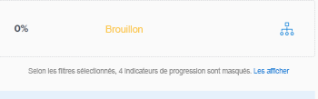

# Filtrer des informations dans Objectifs Adobe Workfront

<!--Audited for P&P only: 4/2025-->

Vous pouvez afficher les objectifs que vous ou toute autre personne avez ajoutés dans Objectifs Adobe Workfront. Pour plus d’informations sur la création d’objectifs, voir [Créer des objectifs dans Objectifs Adobe Workfront](../../workfront-goals/goal-management/create-goals.md). Lorsque vous affichez des objectifs, vous pouvez filtrer les informations dans les Objectifs Workfront afin de n’afficher que les objectifs qui vous semblent importants.

## Conditions d’accès

+++ Développez pour afficher les exigences d’accès aux fonctionnalités de cet article.

Vous devez disposer des éléments suivants :

<table style="table-layout:auto">
<col>
</col>
<col>
</col>
<tbody>
 <tr> 
   <td role="rowheader">Forfait Adobe Workfront*</td> 
   <td> 
   
Pour la nouvelle structure de forfait et de licence :
  <ul><li>Un forfait Ultimate </li></ul>
   

Pour la structure de forfait et de licence actuelle : 
<ul><li> Un forfait Pro ou supérieur </li>
  <li>Une licence Objectifs Adobe Workfront en plus d’une licence Workfront.</li></ul>

   </td>  
  </tr>
 <tr>
 <td role="rowheader">Licence Adobe Workfront*</td>
 <td>
 
Nouvelle licence : contributeur ou contributrice ou niveau supérieur

 Ou
 
Licence actuelle : demande ou niveau supérieur
 
Pour plus d’informations, voir <a href="../../administration-and-setup/add-users/access-levels-and-object-permissions/wf-licenses.md" class="MCXref xref">Vue d’ensemble des licences Adobe Workfront</a>.
 </td>
 </tr>
 <tr>
 <td role="rowheader">Produit*</td>
 <td>
   
 Nouvelle exigence de produit : Workfront

  
Ou

   
Configuration requise actuelle du produit : en plus d’une licence Workfront, vous devez acheter une licence pour les objectifs Adobe Workfront. 
 
Pour plus d’informations, consultez la section <a href="../../workfront-goals/goal-management/access-needed-for-wf-goals.md" class="MCXref xref">Exigences pour l’utilisation des Objectifs Workfront</a>. 
 </td>
 </tr>
 <tr>
 <td role="rowheader">Niveau d’accès</td>
 <td> 
Modifier l’accès aux Objectifs
 </td>
 </tr>
 <tr data-mc-conditions="">
 <td role="rowheader">Autorisations d’objet</td>
 <td>
  

  
Autorisations d’affichage ou de niveau supérieur sur l’objectif pour l’afficher

  
Autorisations de gestion sur l’objectif pour le modifier

  
Pour plus d’informations sur le partage des objectifs, voir <a href="../../workfront-goals/workfront-goals-settings/share-a-goal.md" class="MCXref xref">Partager un objectif dans Objectifs Workfront</a>. 

  
 </td>
 </tr>
 <tr>
   <td role="rowheader">
Modèle de mise en page
</td>
   <td> 
Toutes les personnes, y compris les administrateurs et administratrices Workfront, doivent se voir attribuer un modèle de mise en page incluant la zone Objectifs dans le menu principal. 
  
</td>
  </tr>
</tbody>
</table>

*Pour plus d’informations, voir [Conditions d’accès dans la documentation de Workfront](/help/quicksilver/administration-and-setup/add-users/access-levels-and-object-permissions/access-level-requirements-in-documentation.md).

+++

## Vue d’ensemble des filtres dans Objectifs Workfront

>[!NOTE]
>
>Pour identifier et vous concentrer efficacement sur les objectifs appropriés, nous vous recommandons d’utiliser des filtres dans les Objectifs Workfront. Vous pouvez ainsi afficher les informations correctes avant de commencer à gérer les objectifs importants pour vous. Par défaut, les Objectifs Workfront affichent tous les objectifs du système.

Vous pouvez localiser et filtrer les objectifs dans différentes sections de la zone Objectifs dans Workfront :

* Liste d’objectifs
* Graphiques
* Alignement des objectifs

Pour plus d’informations sur les sections de la zone Objectifs, voir [Vue d’ensemble des sections d’Objectifs Adobe Workfront](../../workfront-goals/goal-review-and-workfront-goals-sections/overview-of-wf-goals-sections.md).

>[!IMPORTANT]
>
>Vous pouvez configurer des filtres pour une section et ils restent persistants lors du passage à une autre section des Objectifs Workfront.

Tenez compte des points suivants lorsque vous utilisez des filtres dans les Objectifs Workfront :

* Vous pouvez créer et appliquer un filtre sans l’enregistrer, ou enregistrer un filtre pour le réutiliser ultérieurement.

  Les scénarios suivants sont possibles :

   * Lorsque vous enregistrez un filtre, il devient votre filtre par défaut chaque fois que vous vous connectez aux Objectifs Workfront.
   * Lorsque vous appliquez un filtre sans l’enregistrer, vous pouvez revenir aux listes d’origine en actualisant votre page.

* Vous pouvez uniquement afficher et appliquer les filtres que vous avez créés. Les filtres créés par d’autres personnes s’affichent uniquement pour ces personnes.
* Vous ne pouvez pas partager les filtres que vous avez créés avec d’autres personnes.

## Appliquer un filtre rapide dans Objectifs Workfront

Pour localiser rapidement les éléments qui vous intéressent dans une liste d’objectifs, vous pouvez utiliser un filtre rapide. Vous ne pouvez pas enregistrer les filtres rapides et ils ne sont pas persistants. Lors de l’actualisation d’une page, Workfront supprime les résultats d’un filtre rapide.

Pour plus d’informations, consultez la section [Appliquer un filtre rapide à une liste](../../workfront-basics/navigate-workfront/use-lists/apply-quick-filter-list.md).

## Créer et appliquer un filtre dans Objectifs Workfront

Pour toutes les sections des Objectifs Workfront, le processus de création de filtres est le même.

Vous pouvez créer un filtre à partir de zéro ou modifier l’un des filtres intégrés.

1. Accédez aux Objectifs Workfront.

   Pour plus d’informations sur l’accès aux Objectifs Workfront, consultez la section [Accéder et ouvrir des objectifs dans Objectifs Adobe Workfront](../../workfront-goals/goal-management/access-goals-in-wf-goals.md).

   Par défaut, la section « Liste des objectifs » s’affiche.

1. Cliquez sur **Filtre** dans le coin supérieur droit de la liste.

   

   Par défaut, Workfront applique le filtre **Tous** qui affiche tous les objectifs de votre système.

   >[!TIP]
   >
   >Le filtre « Tous » ne peut ni être modifié ni être supprimé.

1. Utilisez l’une des méthodes suivantes :

   * Pour afficher uniquement les objectifs pour les personnes propriétaires suivantes, cliquez sur l’un de ces filtres prédéfinis :

     <table style="table-layout:auto"> 
      <col> 
      <col> 
      <tbody> 
       <tr> 
        <td>Tout</td> 
        <td> 
Tous les objectifs de votre système, indépendamment des personnes qui les ont créés, de la période à laquelle ils se rapportent ou des personnes propriétaires. Il s’agit du filtre par défaut et vous ne pouvez pas le modifier. 
 <!--
          
(NOTE: what the ALL filter displays might change; right now, it displays all, regardless of status, period, owner, etc)

         --> </td> 
       </tr> 
       <tr> 
        <td>Personnel</td> 
        <td>Objectifs dont vous êtes propriétaire.</td> 
       </tr> 
       <tr> 
        <td>Mes équipes</td> 
        <td> 
Objectifs dont l’entité propriétaire est l’une de vos équipes. 
 
<b>CONSEIL</b>

     Si aucune équipe ne vous est affectée, aucun objectif ne s’affichera. 
 </td>
     </tr> 
       <tr> 
        <td>Mes groupes</td> 
        <td>Objectifs dont l’entité propriétaire est l’un de vos groupes. </td> 
       </tr> 
       <tr> 
        <td>Entreprise</td> 
        <td> 
Objectifs associés à votre entreprise. 
 
<b>CONSEIL</b>
        
Le filtre « Entreprise » des Objectifs Adobe Workfront affiche les objectifs dont l’entité propriétaire est votre entreprise. 
 
Ce champ ne permet pas de rechercher des entreprises. Par défaut, seule votre entreprise, propriétaire de votre instance Workfront, est sélectionnée. 
 
 </td> 
       </tr> 
      </tbody> 
     </table>

   * Pointez sur le nom d’un filtre, puis cliquez sur l’icône **Modifier**  en regard de son nom pour le personnaliser et ajouter des noms spécifiques d’utilisateurs, d’équipes, de groupes ou le nom de votre organisation, puis sélectionnez-le lorsqu’il apparaît dans la liste.

   * Pour créer un filtre, cliquez sur **Nouveau filtre** et choisissez parmi les options suivantes pour le personnaliser :

     <table style="table-layout:auto"> 
      <col> 
      <col> 
      <tbody> 
       <tr> 
        <td role="rowheader">Période</td> 
        <td>Sélectionnez une période dans le menu déroulant. Vous pouvez sélectionner plusieurs périodes. </td> 
       </tr> 
       <tr> 
        <td role="rowheader">Statut</td> 
        <td> 
Sélectionnez un statut dans le menu déroulant à partir des options suivantes :
 
         <ul> 
          <li> 
Actif
 </li> 
          <li> 
Brouillon
 </li> 
          <li> 
Inactif
 </li> 
          <li> 
Fermé
 </li> 
         </ul> </td> 
       </tr> 
       <tr> 
        <td role="rowheader">Progression</td> 
        <td> 
Sélectionnez un statut de progression dans le menu déroulant parmi les options suivantes : 
 
         <ul> 
          <li> 
En difficulté
 </li> 
          <li> 
En danger
 </li> 
          <li> 
Dans les temps
 </li> 
         </ul> </td> 
       </tr> 
       <tr> 
        <td role="rowheader">Propriétaire</td> 
        <td> 
Commencez à saisir le nom d’une personne propriétaire, puis sélectionnez-le lorsqu’il apparaît dans la liste. 
 
Vous pouvez saisir les noms des utilisateurs et utilisatrices, des équipes, des groupes ou le nom de votre organisation ou sélectionner des options prédéfinies. 
 
Les options de filtre prédéfinies suivantes se rapportent toujours à la personne actuellement connectée : 
 
         <ul> 
          <li> 
<strong>Moi</strong> : affiche les objectifs dont vous êtes propriétaire.
 </li> 
          <li> 
<strong>Mon équipe interne</strong> et <strong>Toutes mes équipes</strong> : affichent les objectifs pour lesquels votre équipe interne ou l’une de vos équipes est désignée comme propriétaire. 
 
Conseil : aucun objectif ne s’affiche lorsqu’aucune équipe ne vous est affectée. 
 </li> 
          <li> 
<strong>Mon groupe interne</strong> et <strong>Tous mes groupes</strong> : affichent les objectifs pour lesquels votre groupe interne ou l’un de vos groupes est désigné comme propriétaire.
 </li> 
         </ul> </td> 
       </tr> 
      </tbody> 
     </table>

1. (Facultatif) Cliquez sur **Réinitialiser** dans le coin inférieur droit de la zone de filtrage pour effacer tous les champs que vous avez sélectionnés et commencer à créer le filtre à partir de zéro.
1. (Facultatif) Cliquez sur **Appliquer** pour appliquer le filtre sans enregistrer.

   Le filtre s’affiche dans la zone **Non enregistré** du créateur de filtres en tant que **Nouveau filtre**.

   Vous ne pouvez pas renommer un filtre non enregistré.

   Les filtres non enregistrés sont supprimés de la zone Objectifs la prochaine fois que vous vous déconnectez de Workfront et que vous vous reconnectez.

   >[!TIP]
   >
   >Vous ne pouvez avoir qu’un seul nouveau filtre non enregistré à la fois.

1. Cliquez sur **Enregistrer** pour enregistrer le filtre afin de l’utiliser ultérieurement, puis ajoutez un nom pour le filtre dans le champ **Ajouter un nom de filtre** et cliquez sur **Terminé**.

   Cela enregistre le filtre dans la section **Enregistré** du créateur de filtres. Vous pouvez utiliser ce filtre à l’avenir.

   Le dernier filtre enregistré et appliqué s’affiche par défaut lors de la prochaine connexion à Workfront.

1. (Facultatif) Cliquez sur la **flèche pointant vers la gauche** en regard de **Nouveau filtre** pour quitter le créateur de filtres et revenir à la liste des filtres.
1. (Facultatif) Pointez sur le nom d’un filtre personnalisé, cliquez sur le menu **Plus**, puis cliquez sur **Supprimer**, puis sur **Supprimer**. Cela supprime le filtre et vous ne pouvez pas le récupérer.

   >[!TIP]
   >
   >Vous ne pouvez supprimer aucun des filtres prédéfinis.

1. Cliquez sur l’**icône X** dans le coin supérieur droit du créateur de filtres pour fermer le créateur de filtres.

   Le nom du filtre actuellement appliqué s’affiche à droite de l’icône Filtrer, dans le coin supérieur droit de la liste des objectifs.

   La liste des objectifs est filtrée selon vos critères de filtre.

1. (Facultatif et le cas échéant) Lors de l’affichage des objectifs dans la section Alignement des objectifs, cliquez sur **Afficher** si vous souhaitez afficher les objectifs filtrés.

   

   Le nom du filtre est indiqué en jaune pour indiquer qu’il est ignoré.

   

1. (Facultatif et le cas échéant) Cliquez sur **Réappliquer le filtre** pour appliquer le filtre et omettre les éléments affichés à l’étape précédente.

