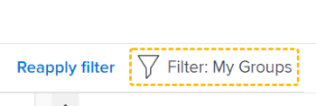

# Filtrer des informations dans Objectifs Adobe Workfront

Vous pouvez afficher les objectifs que vous ou toute autre personne avez ajoutés dans les objectifs Adobe Workfront. Pour plus d’informations sur la création d’objectifs, voir [Création d’objectifs dans les objectifs Adobe Workfront](../../workfront-goals/goal-management/create-goals.md). Lorsque vous affichez des objectifs, vous pouvez filtrer les informations dans les objectifs de Workfront afin de n’afficher que les objectifs qui vous semblent importants.

## Conditions d’accès

Pour effectuer les actions décrites dans cet article, vous devez disposer de l’accès suivant :

<table style="table-layout:auto">
<col>
</col>
<col>
</col>
<tbody>
 <tr> 
   <td role="rowheader">Forfait Adobe Workfront*</td> 
   <td> 
   
Pour le nouveau plan et la nouvelle structure de licence :
  <ul><li>Un plan ultime </li>
  Ou
  <li>Une licence supplémentaire pour les objectifs Adobe Workfront pour les plans Prime ou Select Adobe Workfront. </li></ul> 

Pour le plan actuel et la structure de licence : 
<ul><li> A Pro ou version ultérieure </li>
  <li>Une licence Adobe Workfront Goals en plus d’une licence Workfront.</li></ul>

   </td> 
  </tr>
 <tr>
 <td role="rowheader">Licence Adobe Workfront*</td>
 <td>
 
Nouvelle licence : contributeur ou contributrice ou supérieure

 Ou
 
Licence actuelle : demande ou supérieure
 
Pour plus d’informations, voir <a href="../../administration-and-setup/add-users/access-levels-and-object-permissions/wf-licenses.md" class="MCXref xref">Présentation des licences Adobe Workfront</a>.
 </td>
 </tr>
 <tr>
 <td role="rowheader">Produit*</td>
 <td>
 
 Nouvelle exigence de produit, l’une des options suivantes : 

<ul>
<li>Un forfait Select ou Prime Adobe Workfront et une licence Adobe Workfront Goals supplémentaire.</li>
<li>Un plan Workfront Ultimate qui inclut par défaut les objectifs de Workfront. </li></ul>
 
Ou

 
Exigences actuelles du produit : formule Workfront et licence supplémentaire pour les objectifs Adobe Workfront. 
 
Pour plus d’informations, consultez la section <a href="../../workfront-goals/goal-management/access-needed-for-wf-goals.md" class="MCXref xref">Exigences pour l’utilisation des Objectifs Workfront</a>. 
 </td>
 </tr>
 <tr>
 <td role="rowheader">Niveau d’accès</td>
 <td> 
Modifier l’accès aux objectifs
 </td>
 </tr>
 <tr data-mc-conditions="">
 <td role="rowheader">Autorisations d’objet</td>
 <td>
  

  
Afficher ou des autorisations supérieures à l’objectif pour l’afficher

  
Gérer les autorisations sur l’objectif pour le modifier

  
Pour plus d’informations sur le partage des objectifs, consultez <a href="../../workfront-goals/workfront-goals-settings/share-a-goal.md" class="MCXref xref">Partager un objectif dans les Objectifs Workfront</a>. 

  
 </td>
 </tr>
 <tr>
   <td role="rowheader">
Modèle de disposition
</td>
   <td> 
Tous les utilisateurs, y compris les administrateurs de Workfront, doivent se voir attribuer un modèle de mise en page incluant la zone Objectifs dans le menu principal. 
  
</td>
  </tr>
</tbody>
</table>

*Pour plus d’informations, voir [Conditions d’accès dans la documentation de Workfront](/help/quicksilver/administration-and-setup/add-users/access-levels-and-object-permissions/access-level-requirements-in-documentation.md).

## Présentation des filtres dans les objectifs Workfront

>[!NOTE]
>
>Pour identifier et vous concentrer efficacement sur les objectifs appropriés, nous vous recommandons d’utiliser des filtres dans les objectifs de Workfront. Vous pouvez ainsi afficher les informations correctes avant de commencer à gérer les objectifs importants pour vous. Par défaut, les objectifs de Workfront affichent tous les objectifs du système.

Vous pouvez localiser et filtrer les objectifs dans les sections suivantes de la zone Objectifs de Workfront :

* Liste d’objectifs
* Graphiques
* Alignement des objectifs

Pour plus d’informations sur les sections de la zone Objectifs, voir [Présentation des sections Objectifs d’Adobe Workfront](../../workfront-goals/goal-review-and-workfront-goals-sections/overview-of-wf-goals-sections.md).

>[!IMPORTANT]
>
>Vous pouvez configurer des filtres pour une section et ils restent persistants lors du passage à une autre section des objectifs de Workfront.

Tenez compte des points suivants lorsque vous utilisez des filtres dans les objectifs de Workfront :

* Vous pouvez créer et appliquer un filtre sans l’enregistrer, ou enregistrer un filtre pour le réutiliser ultérieurement.

  Les scénarios suivants sont possibles :

   * Lorsque vous enregistrez un filtre, il devient le filtre par défaut pour vous chaque fois que vous vous connectez aux objectifs Workfront.
   * Lorsque vous appliquez un filtre sans l’enregistrer, vous pouvez revenir aux listes d’origine en actualisant votre page.

* Vous pouvez uniquement afficher et appliquer les filtres que vous avez créés. Les filtres créés par d’autres utilisateurs s’affichent uniquement pour ces utilisateurs.
* Vous ne pouvez pas partager les filtres que vous avez créés avec d’autres utilisateurs.

## Application d’un filtre rapide dans les objectifs Workfront

Vous pouvez utiliser un filtre rapide dans une liste d’objectifs pour vous aider à localiser uniquement les éléments importants pour vous. Vous ne pouvez pas enregistrer les filtres rapides qui ne sont pas persistants. Workfront efface les résultats d’un filtre rapide lors de l’actualisation de la page.

Pour plus d’informations, voir [Appliquer le filtre rapide à une liste](../../workfront-basics/navigate-workfront/use-lists/apply-quick-filter-list.md).

## Création et application d’un filtre dans les objectifs Workfront

Le processus de création de filtres est le même pour toute section des objectifs de Workfront.

Vous pouvez créer un filtre à partir de zéro ou modifier l’un des filtres intégrés.

1. Accédez aux objectifs de Workfront.

   Pour plus d’informations sur l’accès aux objectifs Workfront, voir [Accès et ouverture des objectifs dans les objectifs Adobe Workfront](../../workfront-goals/goal-management/access-goals-in-wf-goals.md)

   Par défaut, la section Liste des objectifs s’affiche.

1. Cliquez sur **Filtre** dans le coin supérieur droit de la liste.

   

   Par défaut, Workfront applique le filtre **Tous** qui affiche tous les objectifs de votre système.

   >[!TIP]
   >
   >Vous ne pouvez pas modifier ni supprimer le filtre Toutes .

1. Utilisez l’une des méthodes suivantes :

   * Cliquez sur l’un des filtres prédéfinis suivants pour afficher uniquement les objectifs pour les propriétaires suivants :

     <table style="table-layout:auto"> 
      <col> 
      <col> 
      <tbody> 
       <tr> 
        <td>Tout</td> 
        <td> 
Tous les objectifs de votre système, indépendamment de qui les a créés, quelle que soit la période pour lesquels ils ont été créés ou de qui est le propriétaire. Il s’agit du filtre par défaut et vous ne pouvez pas le modifier. 
 <!--
          
(NOTE: what the ALL filter displays might change; right now, it displays all, regardless of status, period, owner, etc)

         --> </td> 
       </tr> 
       <tr> 
        <td>Personnel</td> 
        <td>Les objectifs pour lesquels vous êtes le propriétaire.</td> 
       </tr> 
       <tr> 
        <td>Mes équipes</td> 
        <td> 
Les objectifs pour lesquels l’une de vos équipes est sélectionnée comme propriétaire. 
 
<b>CONSEIL</b>

     Aucun objectif ne s’affiche lorsque vous n’êtes affecté à aucune équipe. 
 </td>
     </tr> 
       <tr> 
        <td>Mes groupes</td> 
        <td>Les objectifs pour lesquels l’un de vos groupes est sélectionné comme propriétaire. </td> 
       </tr> 
       <tr> 
        <td>Entreprise</td> 
        <td> 
Objectifs associés à votre organisation. 
 
<b>CONSEIL</b>
        
Dans les objectifs Adobe Workfront, le filtre Société affiche les objectifs pour lesquels votre entreprise est sélectionnée en tant que propriétaire. 
 
Vous ne pouvez pas rechercher des sociétés utilisant ce champ. Seule votre organisation propriétaire de votre instance Workfront est sélectionnée par défaut. 
 
 </td> 
       </tr> 
      </tbody> 
     </table>

   * Pointez sur le nom d’un filtre, puis cliquez sur l’icône **Modifier**  en regard de son nom pour le personnaliser et ajouter des noms spécifiques d’utilisateurs, d’équipes, de groupes ou du nom de votre organisation, puis sélectionnez-le lorsqu’il s’affiche dans la liste.

   * Cliquez sur **Nouveau filtre** pour créer un nouveau filtre, puis sélectionnez l’une des options suivantes pour personnaliser le nouveau filtre :

     <table style="table-layout:auto"> 
      <col> 
      <col> 
      <tbody> 
       <tr> 
        <td role="rowheader">Période</td> 
        <td>Sélectionnez une période dans le menu déroulant. Vous pouvez sélectionner plusieurs périodes. </td> 
       </tr> 
       <tr> 
        <td role="rowheader">Statut</td> 
        <td> 
Sélectionnez un état dans le menu déroulant à partir des options suivantes :
 
         <ul> 
          <li> 
Actif
 </li> 
          <li> 
Brouillon
 </li> 
          <li> 
Inactif
 </li> 
          <li> 
Fermé
 </li> 
         </ul> </td> 
       </tr> 
       <tr> 
        <td role="rowheader">Progression</td> 
        <td> 
Sélectionnez une progression dans le menu déroulant parmi les options suivantes : 
 
         <ul> 
          <li> 
En difficulté
 </li> 
          <li> 
En danger
 </li> 
          <li> 
Dans les temps
 </li> 
         </ul> </td> 
       </tr> 
       <tr> 
        <td role="rowheader">Propriétaire</td> 
        <td> 
Commencez à saisir le nom d’un propriétaire, puis sélectionnez-le lorsqu’il apparaît dans la liste. 
 
Vous pouvez saisir les noms des utilisateurs, des équipes, des groupes ou le nom de votre organisation ou sélectionner des options prédéfinies. 
 
Les options de filtre prédéfinies suivantes se rapportent toujours à l’utilisateur actuellement connecté : 
 
         <ul> 
          <li> 
<strong>Moi</strong> : affiche les objectifs dont vous êtes le propriétaire.
 </li> 
          <li> 
<strong>Mon équipe d’accueil</strong> et <strong>Toutes mes équipes</strong> : affiche les objectifs où votre équipe d’accueil ou l’une de vos équipes est désignée comme propriétaire. 
 
Conseil : Aucun objectif ne s’affiche lorsque vous n’êtes affecté à aucune équipe. 
 </li> 
          <li> 
<strong>Mon groupe d’accueil</strong> et <strong>Tous mes groupes</strong> : affiche les objectifs pour lesquels votre groupe d’accueil ou l’un de vos groupes sont désignés comme propriétaire.
 </li> 
         </ul> </td> 
       </tr> 
      </tbody> 
     </table>

1. (Facultatif) Cliquez sur **Réinitialiser** dans le coin inférieur droit de la zone de filtrage pour effacer tous les champs que vous avez sélectionnés et commencer à créer le filtre à partir de zéro.
1. (Facultatif) Cliquez sur **Appliquer** pour appliquer le filtre sans l’enregistrer.

   Le filtre s’affiche dans la zone **Non enregistré** du créateur de filtres sous la forme **Nouveau filtre**.

   Vous ne pouvez pas renommer un filtre non enregistré.

   Les filtres non enregistrés sont supprimés de la zone Objectifs la prochaine fois que vous vous déconnectez de Workfront et que vous vous reconnectez.

   >[!TIP]
   >
   >Vous ne pouvez avoir qu’un seul nouveau filtre non enregistré à la fois.

1. Cliquez sur **Enregistrer** pour enregistrer le filtre afin de l’utiliser ultérieurement, puis ajoutez un nom pour le filtre dans le champ **Ajouter le nom du filtre** et cliquez sur **Terminé**.

   Cela enregistre le filtre dans la section **Enregistré** du créateur de filtres. Vous pouvez utiliser ce filtre à l’avenir.

   Le dernier filtre enregistré et appliqué s’affiche par défaut lors de la prochaine connexion à Workfront.

1. (Facultatif) Cliquez sur la **flèche vers la gauche** en regard de **Nouveau filtre** pour quitter le créateur de filtres et revenir à la liste des filtres.
1. (Facultatif) Passez la souris sur le nom d’un filtre personnalisé, cliquez sur le menu **Plus** , puis sur **Supprimer** et **Supprimer**. Cela supprime le filtre et vous ne pouvez pas le récupérer.

   >[!TIP]
   >
   >Vous ne pouvez supprimer aucun des filtres prédéfinis.

1. Cliquez sur l’icône **X** dans le coin supérieur droit du créateur de filtres pour fermer le créateur de filtres.

   Le nom du filtre actuellement appliqué s’affiche à droite de l’icône Filtrer, dans le coin supérieur droit de la liste des objectifs.

   La liste des objectifs est filtrée selon vos critères de filtrage.

1. (Facultatif et conditionnel) Lors de l’affichage des objectifs dans la section Alignement de l’objectif , cliquez sur **Afficher les objectifs** si vous souhaitez afficher les objectifs filtrés.

   

   Le nom du filtre est indiqué en jaune pour indiquer qu’il est ignoré.

   

1. (Facultatif et conditionnel) Cliquez sur **Réappliquer le filtre** pour appliquer le filtre et omettre les éléments que vous avez affichés à l’étape précédente.

