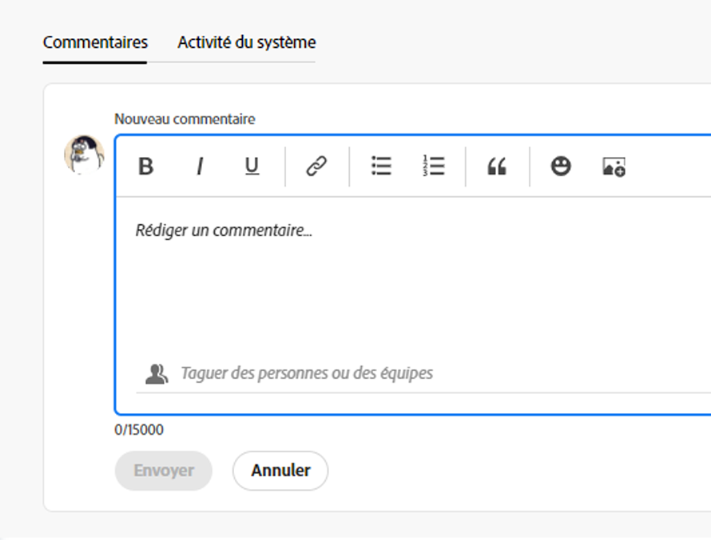

# Gestion des commentaires d’objectif dans les objectifs Adobe Workfront

<!--consider retiring this article when goals and all objects are in parity - after the new commenting experience goes to production GA-->

<!--The highlighted information on this page refers to functionality not yet generally available. It is available only in the Preview environment.-->

Vous pouvez ajouter des commentaires à tous les objectifs que vous pouvez afficher dans les objectifs Adobe Workfront.

<!--drafted for P&P:

<table style="table-layout:auto">
 <col>
 </col>
 <col>
 </col>
 <tbody>
  <tr>
   <td role="rowheader">Adobe Workfront plan*</td>
   <td>
   
Current plan: Select or higher

   Or
   
Legacy plan: Pro or higher

   
   </td>
  </tr>
  <tr>
   <td role="rowheader">Adobe Workfront license*</td>
   <td>
   
Current license: Contributor or higher

   Or
   
Legacy license: Request or higher
 
For more information, see <a href="../../administration-and-setup/add-users/access-levels-and-object-permissions/wf-licenses.md" class="MCXref xref">Adobe Workfront licenses overview</a>.
 </td>
  </tr>
  <tr>
   <td role="rowheader">Product</td>
   <td>
   
 Current product requirement: If you have the Select or Prime Adobe Workfront plan, you must also buy an additional Adobe Workfront Goals license.  Workfront Goals are included in the Ultimate Workfront Plan.

   Or
   
Legacy product requirement: You must purchase an additional license for the Adobe Workfront Goals to access functionality described in this article. 
 
For information, see <a href="../../workfront-goals/goal-management/access-needed-for-wf-goals.md" class="MCXref xref">Requirements to use Workfront Goals</a>. 
 </td>
  </tr>
  <tr>
   <td role="rowheader">Access level*</td>
   <td> 
Edit access to Goals
 
<b>NOTE</b>
If you still don't have access, ask your Workfront administrator if they set additional restrictions in your access level. For information on how a Workfront administrator can change your access level, see:

     <ul>
      <li> 
<a href="../../administration-and-setup/add-users/configure-and-grant-access/create-modify-access-levels.md" class="MCXref xref">Create or modify custom access levels</a> 
 </li>
      <li> 
<a href="../../administration-and-setup/add-users/configure-and-grant-access/grant-access-goals.md" class="MCXref xref">Grant access to Adobe Workfront Goals</a> 
 </li>
     </ul> 
 </td>
  </tr>
  <tr data-mc-conditions="">
   <td role="rowheader">Object permissions</td>
   <td>
    

     
View or higher permissions to the goal to view it

     
Manage permissions to the goal to edit it

     
For information about sharing goals, see <a href="../../workfront-goals/workfront-goals-settings/share-a-goal.md" class="MCXref xref">Share a goal in Workfront Goals</a>. 

    
 </td>
  </tr>
 </tbody>
</table>
-->

## Exigences d’accès

Vous devez disposer des accès suivants pour effectuer les actions décrites dans cet article :

<table style="table-layout:auto"> 
 <col> 
 <col> 
 <tbody> 
  <tr> 
   <td role="rowheader">Formule Adobe Workfront*</td> 
   <td> 
Pro ou version ultérieure
 </td> 
  </tr> 
  <tr> 
   <td role="rowheader">Licence Adobe Workfront*</td> 
   <td> 
Requête ou supérieure
 
Pour plus d’informations, voir <a href="../../administration-and-setup/add-users/access-levels-and-object-permissions/wf-licenses.md" class="MCXref xref">Présentation des licences Adobe Workfront</a>.
 </td> 
  </tr> 
  <tr> 
   <td role="rowheader">Produit</td> 
   <td> 
Pour accéder aux fonctionnalités décrites dans cet article, vous devez acheter une licence supplémentaire pour les objectifs d’Adobe Workfront. 
 
Pour plus d’informations, voir <a href="../../workfront-goals/goal-management/access-needed-for-wf-goals.md" class="MCXref xref">Conditions requises pour utiliser les objectifs Workfront</a>. 
 </td> 
  </tr> 
  <tr> 
   <td role="rowheader">Niveau d’accès*</td> 
   <td> 
Affichage ou accès supérieur aux objectifs
 
<b>NOTE</b>
Si vous n’avez toujours pas accès à , demandez à votre administrateur Workfront s’il définit des restrictions supplémentaires à votre niveau d’accès. Pour plus d’informations sur la façon dont un administrateur Workfront peut modifier votre niveau d’accès, voir :
 
     <ul> 
      <li> 
<a href="../../administration-and-setup/add-users/configure-and-grant-access/create-modify-access-levels.md" class="MCXref xref">Création ou modification de niveaux d’accès personnalisés</a> 
 </li> 
      <li> 
<a href="../../administration-and-setup/add-users/configure-and-grant-access/grant-access-goals.md" class="MCXref xref">Accorder l’accès aux objectifs Adobe Workfront</a> 
 </li> 
     </ul> 
 </td> 
  </tr> 
  <tr data-mc-conditions=""> 
   <td role="rowheader">Autorisations d’objet</td> 
   <td> 
    
 
     
Affichage ou autorisations supérieures sur les objectifs
 
     
Pour plus d’informations sur le partage des objectifs, voir <a href="../../workfront-goals/workfront-goals-settings/share-a-goal.md" class="MCXref xref">Partage d’un objectif dans les objectifs Workfront</a>. 
 
    
 </td> 
  </tr> 
 </tbody> 
</table>

*Pour connaître le plan, le type de licence ou l’accès dont vous disposez, contactez votre administrateur Workfront.

## Conditions préalables

Avant de pouvoir commencer, vous devez disposer des éléments suivants :

* Un modèle de mise en page qui inclut la zone Objectifs dans le menu principal.

## Recherche de la section Mises à jour

Vous pouvez ajouter des commentaires aux objectifs dans la section Mises à jour de la page d’un objectif.

Vous pouvez répondre ou aimer un commentaire que vous ou d’autres avez ajouté dans cette zone.

1. Cliquez sur le bouton **Menu Principal** icon  > **Objectifs** dans le coin supérieur droit.
Cela ouvre la liste des objectifs.
1. Recherchez l’objectif auquel vous souhaitez ajouter des commentaires, puis cliquez sur son nom pour ouvrir la page d’objectif.
1. Cliquez sur  **Mises à jour** dans le panneau de gauche.
1. Cliquez sur le bouton **Commentaires** dans le coin supérieur gauche de la zone Mises à jour .
1. Commencez à saisir un commentaire dans la variable **Nouveau commentaire** de la boîte.

   

   >[!TIP]
   >
   >Lorsque vous quittez la section Mises à jour avant de terminer la saisie, un commentaire est envoyé afin de conserver le commentaire sur la page en mode préliminaire, même après vous être déconnecté et vous être reconnecté. Toutes les images ajoutées au commentaire sont également enregistrées dans le brouillon. Les brouillons sont enregistrés pendant 7 jours, après quoi ils sont ignorés et ne peuvent pas être récupérés. Les commentaires préliminaires ne sont visibles que par l’utilisateur qui les saisit.

1. (Facultatif) Pour ajouter une mise en forme de texte enrichi à votre mise à jour, à un lien hypertexte ou à une image, utilisez n’importe quelle option de la barre d’outils Texte enrichi ou les icônes adjacentes. Pour plus d’informations, voir [Mise à jour du travail](../../workfront-basics/updating-work-items-and-viewing-updates/update-work.md).
1. (Facultatif) Dans le **Balisage de personnes ou d’équipes** , commencez à saisir le nom ou l’adresse électronique d’un utilisateur ou d’une équipe que vous souhaitez inclure dans ce commentaire, puis sélectionnez-la lorsqu’elle s’affiche dans la liste.
1. Sélectionnez la **Privé à ma société** pour rendre le commentaire visible uniquement aux personnes de votre société.

   >[!TIP]
   >
   >Pour que cette option soit disponible dans la zone Mises à jour, une société doit être spécifiée dans votre profil.

1. Cliquez sur **Envoyer**.

   >[!TIP]
   >
   >Si un autre utilisateur envoie un commentaire au même élément que celui que vous mettez à jour, une ligne rouge s’affiche avec un indicateur &quot;Nouveau&quot; pour vous informer des commentaires les plus récents.
   >
   >L’indicateur ne s’affiche qu’après l’envoi du commentaire sur l’élément, et non lorsque le commentaire est toujours composé.
   >
   >L’indicateur &quot;Nouveau&quot; s’affiche uniquement lorsque l’utilisateur qui a saisi une nouvelle mise à jour, ainsi que celui qui a saisi une mise à jour, utilisent tous deux la nouvelle expérience de commentaire.
   >

1. (Facultatif) Pour modifier un commentaire, cliquez sur le bouton **Plus** menu  à droite de l’icône J’aime, puis cliquez sur **Modifier**.
1. Modifiez les informations du commentaire, ajoutez ou supprimez des images, ou supprimez l’un des utilisateurs balisés.
Vous pouvez modifier votre commentaire dans les 15 minutes suivant son envoi. Un indicateur &quot;modifié&quot; est ajouté à gauche de l’horodatage qui s’affiche lorsque le commentaire a été mis à jour.

   

   >[!TIP]
   >
   > * Un message électronique est généré pour informer les utilisateurs de votre mise à jour uniquement lorsque vous envoyez la mise à jour d’origine. Aucun email n&#39;est généré après avoir modifié votre mise à jour.
   >
   > * Le tampon de date est la date du commentaire d’origine et non la date de la dernière mise à jour.

   1. (Facultatif) Cliquez sur le **Plus** menu , puis cliquez sur l’une des options suivantes pour copier des informations d’un commentaire dans le Presse-papiers :

      * **Copier le lien** pour copier le lien d&#39;une mise à jour, sans les réponses.
      * **Copier le texte du corps** pour copier le texte d’une mise à jour.

         Pour plus d’informations, voir [Mise à jour du travail](../../workfront-basics/updating-work-items-and-viewing-updates/update-work.md).

1. (Facultatif) Cliquez sur le **Plus** menu  à droite d’un commentaire, puis cliquez sur **Supprimer** pour supprimer un commentaire que vous avez ajouté. Pour plus d’informations, voir [Mise à jour du travail](../../workfront-basics/updating-work-items-and-viewing-updates/update-work.md).
1. (Facultatif) Cliquez sur **Répondre** pour répondre à un commentaire existant, suivez les étapes 5 à 9 ci-dessus. <!--insure this stays accurate-->
1. (Conditionnel et facultatif) Si d’autres utilisateurs ont ajouté des commentaires qui s’affichent en dehors de la zone visible dans la section Mises à jour, cliquez sur **Affichage** à l’intérieur du bleu **nouvelle bannière de commentaires** en bas de l’écran pour afficher ces commentaires.

   

   D’autres commentaires s’affichent en bas de l’écran.
1. (Facultatif) Cliquez sur le **Comme** icon pour aimer un commentaire que quelqu&#39;un d&#39;autre a ajouté. L’icône se met à jour avec le nombre de mentions &quot;J’aime&quot;.

1. (Facultatif) Cliquez sur le **Activité du système** pour afficher les mises à jour enregistrées par le système. Lorsqu’un objectif est mis à jour, Workfront génère une note à ce sujet et l’affiche dans l’onglet Activité du système . Workfront enregistre également une mise à jour du système lorsqu’un résultat, une activité ou un projet est ajouté à l’objectif ou lorsqu’il est mis à jour. <!--ensure the casing on the tab has not changed-->

<!--BELOW IS OLD, ATIIM/ WORKFRONT GOALS INFORMATION ABOUT COMMENTS: 

## Add comments to goals in the Check-in section

The Check-in section has been removed from the Preview environment. You can update goals by accessing the goal page. For information, see 
[Update goals in the Goal details section in Adobe Workfront Goals](../goal-management/update-goals-in-goal-details-panel.md). 

>[!TIP]
>
>You must have access to Edit Goals in your access level to view the Check-in section.

You can add comments to goals in the Check-in section of Workfront Goals, as part of updating your list of goals. For information about updating goals, see [Update goal progress in Adobe Workfront Goals](../../workfront-goals/goal-review-and-workfront-goals-sections/check-in-goals.md).

You can also like goal comments that other users have added to mark your approval of them in the Check-in section.

1. Click the **Main Menu** icon  > **Goals** in the upper-right corner.

   ( Add this when Shell is available to all: or (if available), click the **Main Menu** icon  in the upper-left corner))

   This opens the Workfront Goals area. 

1. Click the **Check-in** section in the left panel.

   

   Goals assigned to you or that have results and activities that are assigned to you display in this area. 

1. (Optional) Click the right-pointing arrow to the left of the goal name to expand the goal, if the goal is not already expanded. 
1. Type your comment in the **Add a comment to this goal (optional)** field, then click **Post**.

   Two most recent comments display by default under each goal.

1. Click **Show all comments** to display all comments on a goal. A number of total comments for the goal also displays. Comments display in the order they were entered, with the most recent first. 
1. (Optional) Click the **Like icon**  to like a comment. The icon updates with the number of likes. 

1. (Optional) Click the number of likes next to a comment and a list with the names of the users who liked the comment displays in the right panel.

   

1. (Conditional) Click **Back to Updates** to return to the Updates tab of the Goal Details panel, or click the **X icon** in the upper-right corner to close the right panel.

## Add comments to goals in the Pulse section

The Pulse section has been removed from the Preview environment. You can update goals by accessing the goal page. For information, see 
[Update goals in the Goal details section in Adobe Workfront Goals](../goal-management/update-goals-in-goal-details-panel.md). 

You can add comments to goals in the Pulse section of Workfront Goals, as part of reviewing goals that might affect yours. For information about reviewing goals in the Pulse section, see [Review goals in the Adobe Workfront Goals Pulse section](../../workfront-goals/goal-review-and-workfront-goals-sections/review-goals-in-pulse.md).

You can also like goal comments that other users have added to mark your approval of them in the Pulse section.

1. Click the **Main Menu** icon  > **Goals** in the upper-right corner.

   (Add this when Shell is available to all: or (if available), click the **Main Menu** icon  in the upper-left corner))

   This opens the Workfront Goals area. 

1. Click the Pulse section in the left panel.

   

   All current goals display in this section, regardless of their status.

1. Click **Add a comment**, then type your comment in the **Add a comment to this goal (optional)** field.
1. Click **Post**.

   Three comments display by default under each goal.

1. Click **Show all updates** to display all comments on a goal. A number of total comments for the goal also displays. Comments display in the order they were entered, with the most recent first. 
1. (Optional) Click the **Like icon**  to like a comment. The icon updates with the number of likes. 

1. (Optional) Click the number of likes next to a comment and a list with the names of the users who liked the comment displays in the right panel.

   

1. (Conditional) Click **Back to Updates** to return to the Updates tab of the Goal Details panel, or click the **X icon** in the upper-right corner to close the right panel.

-->

<!--
Locating goal comments differs depending on what environment you use. 

### Locate goal comments in the Production environment

You can add comments to goals in the following areas of Workfront Goals:

* The Goal Details panel
* The Check-in section 
* The Pulse section

Although the process for adding comments to goals is similar in these areas, there are differences in being able to edit, delete, or react to a comment when using one area versus another. When you enter a comment in any of these areas, the comment is visible in all areas where goal comments display.

>[!NOTE]
>
>You cannot add comments to results and activities.

-->

<!--
## Add comments to goals in the Goal Details panel

Adding comments to goals differs depending on what environment you use.

### Add comments to goals in the Production environment

You can add comments to goals in the Goal Details panel, as part of updating an individual goal.

You can edit or delete a comment that you entered in this area, or you can like comments.

1. Click the **Main Menu** icon  > **Goals** in the upper-right corner.

   (Add this when Shell is available to all: or (if available), click the **Main Menu** icon  in the upper-left corner))
   

   This opens the Workfront Goals area. 

1. Locate the goal you want to add comments to, then click its name to open the Goal Details panel to the right. 
1. Click the **Updates** tab.
1. Type your comment in the **Comment here** field, then click **Post**. 
1. (Optional and conditional) Select the **Comments** option at the top of the list to view your comment at the top of the list. It is enabled by default and comments display here with the most recent comment first. 
1. (Optional) Click **Edit** to edit your comment, then click **Save** to save your changes, or **Cancel** to revert to the original update.

   >[!TIP]
   >
   >* You can only edit comments you entered. 
   >* There is no time limit for how long after you enter a comment you are allowed to edit it.

1. (Optional) Click **Delete** to delete your comment, then click **Yes, Delete** to confirm.

   >[!TIP]
   >
   >* You can only delete comments you entered. 
   >* There is no time limit for how long after you enter a comment you are allowed to delete it.

1. (Optional) Click the **Like icon**  to like a comment that someone else added. The icon updates with the number of likes. 

1. (Optional) Click the number of likes next to a comment and a list with the names of the users who liked the comment displays in the right panel.

   <!--
   
(NOTE: this functionality might change)

   

   

1. (Conditional) Click **Back to Updates** to return to the Updates tab of the Goal Details panel, or click the **X icon** in the upper-right corner to close the right panel.

-->