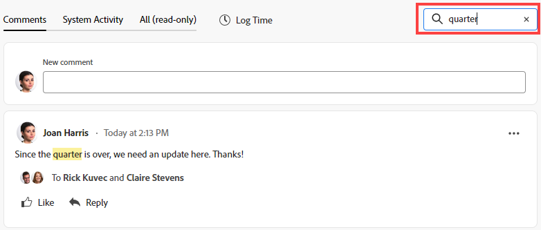
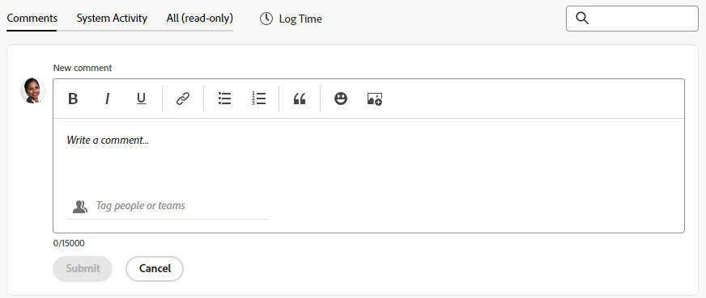

# Gestion des commentaires d’objectif dans les objectifs Adobe Workfront

{{highlighted-preview}}

<!--Audited: 01/2024-->

<!--consider retiring this article when goals and all objects are in parity and we remove the legacy commenting from the system. From then on, there is just ONE way to comment and that will be documented in the Update Work article-->

<!--take "legacy" and "new commenting" references out when we remove the legacy - April 2024???-->

<!--The highlighted information on this page refers to functionality not yet generally available. It is available only in the Preview environment for all customers. 

For information about the current release schedule, see [First Quarter 2024 release overview](../../product-announcements/product-releases/24-q1-release-activity/24-q1-release-overview.md).-->

<!--
After the monthly releases to Production, the same features are also available in the Production environment for customers who enabled fast releases.   
For information about fast releases, see [Enable or disable fast releases for your organization](../../administration-and-setup/set-up-workfront/configure-system-defaults/enable-fast-release-process.md)  
-->

Vous pouvez ajouter des commentaires à tous les objectifs que vous pouvez afficher dans les objectifs Adobe Workfront.

## Exigences d’accès

Vous devez disposer des droits d’accès suivants pour effectuer les actions décrites dans cet article :

<table style="table-layout:auto">
<col>
</col>
<col>
</col>
<tbody>
 <tr>
 <td role="rowheader">Formule Adobe Workfront</td>
 <td>
 
Quelconque

</td>
 </tr>
 <tr>
 <td role="rowheader">Licence Adobe Workfront*</td>
 <td>
 
Nouvelle licence : contributeur ou version ultérieure

 Ou
 
Licence actuelle : demande ou supérieure
 </td>
 </tr>
 <tr>
 <td role="rowheader">Product*</td>
 <td>
 
 Nouvelle exigence du produit : si vous disposez du forfait Select ou Prime Adobe Workfront, vous devez également acheter une licence Adobe Workfront Goals supplémentaire. Les objectifs Workfront sont inclus dans le plan Workfront Ultimate.

 Ou
 
Exigences actuelles du produit : vous devez acheter une licence supplémentaire pour les objectifs Adobe Workfront afin d’accéder aux fonctionnalités décrites dans cet article. 
 
Pour plus d’informations, voir <a href="../../workfront-goals/goal-management/access-needed-for-wf-goals.md" class="MCXref xref">Conditions requises pour utiliser les objectifs Workfront</a>. 
 </td>
 </tr>
 <tr>
 <td role="rowheader">Configuration du niveau d’accès</td>
 <td> 
Affichage ou accès supérieur aux objectifs
 
<b>NOTE</b>
Si vous n’y avez pas accès, demandez à votre administrateur Workfront s’il définit des restrictions supplémentaires à votre niveau d’accès. Pour plus d’informations, voir <a href="../../administration-and-setup/add-users/configure-and-grant-access/grant-access-goals.md" class="MCXref xref">Accorder l’accès aux objectifs Adobe Workfront</a></td>
 </tr>
 <tr data-mc-conditions="">
 <td role="rowheader">Autorisations d’objet</td>
 <td>
  

  
Affichage ou autorisations supérieures à l’objectif

  
Par défaut, les utilisateurs n’ont pas accès aux objectifs 

 
Pour plus d’informations sur le partage des objectifs, voir <a href="../../workfront-goals/workfront-goals-settings/share-a-goal.md" class="MCXref xref">Partage d’un objectif dans les objectifs Workfront</a>. 

  
 </td>
 </tr>
</tbody>
</table>

*Pour connaître le plan, le type de licence ou l’accès dont vous disposez, contactez votre administrateur Workfront. Pour plus d’informations, voir [Conditions d’accès requises dans la documentation Workfront](/help/quicksilver/administration-and-setup/add-users/access-levels-and-object-permissions/access-level-requirements-in-documentation.md).

## Conditions préalables

Avant de pouvoir commencer, vous devez disposer des éléments suivants :

* Un modèle de mise en page qui inclut la zone Objectifs dans le menu principal.

## Gestion des commentaires d’objectif

Vous pouvez ajouter des commentaires aux objectifs dans la section Mises à jour de la page d’un objectif.

Vous pouvez répondre ou aimer un commentaire que vous ou d’autres avez ajouté dans cette zone.

1. Cliquez sur le bouton **Menu Principal** icon  dans le coin supérieur droit, ou le **Menu Principal** icon  dans le coin supérieur gauche, le cas échéant, puis cliquez sur **Objectifs**.
Cela ouvre la liste des objectifs.
1. Recherchez l’objectif auquel vous souhaitez ajouter des commentaires, puis cliquez sur son nom pour ouvrir la page d’objectif.
1. Cliquez sur  **Mises à jour** dans le panneau de gauche.
1. (Facultatif) Pour localiser un commentaire existant, commencez à saisir un mot-clé. <!--or a user's name--> dans le **Rechercher** dans le coin supérieur droit de la **Commentaires** .

   

   Exemple dans l&#39;environnement Aperçu :
   

   

   Exemple dans l’environnement de production :
   

   Le mot-clé <!--or user--> La recherche effectuée est mise en surbrillance et les commentaires qui la contiennent s’affichent en haut de la section Mises à jour .

   <!--change the NOTE below when functionality changes-->

   >[!NOTE]
   >
   >Vous devez rechercher un mot inclus dans un commentaire ou une réponse. Vous ne pouvez pas rechercher un utilisateur ou une équipe balisé.

   Pour plus d’informations, voir [Mise à jour du travail](../../workfront-basics/updating-work-items-and-viewing-updates/update-work.md).

1. Cliquez sur le bouton **x** dans le champ de recherche pour effacer les résultats de la recherche et revenir à la mise à jour complète.
1. Cliquez sur le bouton **Commentaires** dans le coin supérieur gauche de la zone Mises à jour .
1. Commencez à saisir un commentaire dans la variable **Nouveau commentaire** de la boîte.

   

   Exemple de nouvelle zone de commentaire dans l’environnement Aperçu :
   

   

   Exemple de nouvelle zone de commentaire dans l’environnement de production :
   

   >[!TIP]
   >
   >Lorsque vous quittez la section Mises à jour avant de terminer la saisie, un commentaire est envoyé afin de conserver le commentaire sur la page en mode préliminaire, même après vous être déconnecté et vous être reconnecté. Toutes les images ajoutées au commentaire sont également enregistrées dans le brouillon. Les brouillons sont enregistrés pendant 7 jours, après quoi ils sont ignorés et ne peuvent pas être récupérés. Les commentaires préliminaires ne sont visibles que par l’utilisateur qui les saisit.

1. (Facultatif) Pour annuler ou rétablir une modification, utilisez les raccourcis clavier suivants :
   * Ctrl + Z ( ⌘ + z pour Mac) pour annuler une modification.
   * Ctrl + Y ( ⌘ + y pour Mac) pour rétablir la modification
1. (Facultatif) Pour ajouter une mise en forme de texte enrichi à votre mise à jour, à un lien hypertexte ou à une image, utilisez n’importe quelle option de la barre d’outils Texte enrichi ou les icônes adjacentes. Pour plus d’informations, voir [Mise à jour du travail](../../workfront-basics/updating-work-items-and-viewing-updates/update-work.md).
1. (Facultatif) Dans la variable **Balisage de personnes ou d’équipes** , commencez à saisir le nom ou l’adresse électronique d’un utilisateur ou d’une équipe que vous souhaitez inclure dans ce commentaire, puis sélectionnez-la lorsqu’elle s’affiche dans la liste.
1. Sélectionnez la variable **Privé à ma société** pour rendre le commentaire visible uniquement aux personnes de votre société.

   >[!TIP]
   >
   >Pour que cette option soit disponible dans la zone Mises à jour, une société doit être spécifiée dans votre profil.

1. Cliquez sur **Envoyer**.

   >[!TIP]
   >
   >Si un autre utilisateur envoie un commentaire sur l’élément que vous mettez à jour, une ligne rouge s’affiche avec un indicateur &quot;Nouveau&quot; pour vous informer des commentaires les plus récents, ainsi qu’une notification bleue au bas de l’écran pour indiquer le nombre de nouveaux commentaires.
   >
   >L’indicateur ne s’affiche qu’après l’envoi du commentaire sur l’élément, et non lorsque le commentaire est toujours composé.
   >

1. (Facultatif) Cliquez sur le bouton **Plus** menu  à droite de l’icône J’aime, puis cliquez sur **Modifier**.
1. Modifiez les informations du commentaire, ajoutez ou supprimez des images, ou supprimez l’un des utilisateurs balisés.
Vous pouvez modifier votre commentaire dans les 15 minutes suivant son envoi. Un indicateur &quot;modifié&quot; est ajouté à gauche de l’horodatage qui s’affiche lorsque le commentaire a été mis à jour.

   

   >[!TIP]
   >
   > * Un message électronique est généré pour informer les utilisateurs de votre mise à jour uniquement lorsque vous envoyez la mise à jour d’origine. Aucun email n&#39;est généré après avoir modifié votre mise à jour.
   >
   > * L’horodatage correspond à la date du commentaire d’origine et non à la date de la dernière mise à jour.

1. (Facultatif) Cliquez sur le **Plus** menu , puis cliquez sur l’une des options suivantes pour copier des informations d’un commentaire dans le presse-papiers ou dans une nouvelle réponse :

   * **Copier le lien** pour copier le lien d&#39;une mise à jour, sans les réponses.
   * **Copier le texte du corps** pour copier le texte d’une mise à jour.
   * **Réponse entre guillemets** pour ouvrir une nouvelle boîte de commentaires où le commentaire d’origine est cité dans une nouvelle réponse et est marqué comme citation bloquée.

     Pour plus d’informations, voir [Mise à jour du travail](../../workfront-basics/updating-work-items-and-viewing-updates/update-work.md).

1. (Facultatif) Cliquez sur le **Plus** menu  à droite d’un commentaire, puis cliquez sur **Supprimer** pour supprimer un commentaire que vous avez ajouté. Pour plus d’informations, voir [Mise à jour du travail](../../workfront-basics/updating-work-items-and-viewing-updates/update-work.md).
1. (Facultatif) Cliquez sur **Répondre** pour répondre à un commentaire existant, suivez les étapes 5 à 9 ci-dessus. Pour plus d’informations sur la réponse aux mises à jour, voir [Répondre aux mises à jour](../../workfront-basics/updating-work-items-and-viewing-updates/reply-to-updates.md). <!--insure this stays accurate-->
1. (Conditionnel et facultatif) Si d’autres utilisateurs ont ajouté des commentaires qui s’affichent en dehors de la zone visible dans la section Mises à jour, cliquez sur **Affichage** à l’intérieur du bleu **nouvelle bannière de commentaires** en bas de l’écran pour afficher ces commentaires.

   

   D’autres commentaires s’affichent en bas de l’écran.
1. (Facultatif) Cliquez sur le **Comme** icon pour aimer un commentaire que quelqu&#39;un d&#39;autre a ajouté. L’icône se met à jour avec le nombre de mentions &quot;J’aime&quot;.

1. (Facultatif) Cliquez sur le **Activité du système** pour afficher les mises à jour enregistrées par le système. Lorsqu’un objectif est mis à jour, Workfront génère une note à ce sujet et l’affiche dans l’onglet Activité du système . Workfront enregistre également une mise à jour du système lorsqu’un résultat, une activité ou un projet est ajouté à l’objectif ou lorsqu’il est mis à jour. <!--ensure the casing on the tab has not changed-->

1. (Facultatif) Cliquez sur le **Tous** pour afficher à la fois les commentaires d’utilisateur et les commentaires d’activité du système. Pour répondre à un commentaire dans l’onglet Toutes , cliquez sur **Réponse aux commentaires** pour ouvrir le commentaire dans l’onglet Commentaires . Vous ne pouvez pas répondre dans l’onglet Tout .

