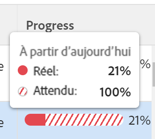

# Revoir les objectifs en difficulté dans Objectifs Adobe Workfront

<!--Audited: 4/2025-->

<!--

(NOTE: the status of goals in "red" used to be called At Risk. Now, it is "in trouble") 

-->

Les objectifs dont la progression est En difficulté risquent de ne pas être atteints et sont représentés par une barre de progression rouge dans les Objectifs Adobe Workfront. Vous devez examiner régulièrement vos objectifs et comprendre pourquoi la progression est lente. Pour plus d’informations sur la progression de l’objectif, voir [Vue d’ensemble de la progression du statut des objectifs dans les Objectifs Adobe Workfront](../../workfront-goals/goal-management/calculate-goal-progress.md).

## Conditions d’accès

>[!NOTE]
>
>Votre entreprise peut choisir de continuer à utiliser les objectifs Adobe Workfront si elle a déjà acheté ce package par le passé. Pour plus de détails, contactez votre représentant de compte.
>
>Adobe Workfront Goals ne peut plus être acheté.

+++ Développez pour afficher les exigences d’accès aux fonctionnalités de cet article. 

<table style="table-layout:auto">
<col>
</col>
<col>
</col>
<tbody>
 <tr>
  <td> 
Package Adobe Workfront
 </td> 
   <td> 
   
Adobe Workfront Ultimate

   </td> 
  </tr>
 <tr>
 <td role="rowheader">Licence Adobe Workfront</td>
 <td>
 
Contributeur ou version ultérieure

Requête ou supérieure
</td>
 </tr>
  <tr>
 <td role="rowheader">Configuration du niveau d’accès</td>
 <td> 
Modifier l’accès aux Objectifs
 </td>
 </tr>
 <tr data-mc-conditions="">
 <td role="rowheader">Autorisations d’objet</td>
 <td>
  

  
Autorisations d’affichage ou de niveau supérieur sur l’objectif pour l’afficher

  
Autorisations de gestion sur l’objectif pour le modifier

  
 </td>
 </tr>
<tr>
   <td role="rowheader">
Modèle de mise en page
</td>
   <td> 
Un modèle de mise en page comprenant la zone Objectifs du menu principal doit être affecté à tous les utilisateurs, y compris les administrateurs système. 
  
</td>
  </tr>
</tbody>
</table>

Pour plus d’informations, voir [Conditions d’accès dans la documentation Workfront](/help/quicksilver/administration-and-setup/add-users/access-levels-and-object-permissions/access-level-requirements-in-documentation.md).

+++

<!--Old:
<table style="table-layout:auto">
<col>
</col>
<col>
</col>
<tbody>
 <tr> 
   <td role="rowheader">Adobe Workfront plan*</td> 
   <td> 
   
For the new plan and license structure:
  <ul><li>An Ultimate plan </li></ul>
   

For the current plan and license structure: 
<ul><li> A Pro or higher </li>
  <li>An Adobe Workfront Goals license in addition to a Workfront license.</li></ul>

   </td> 
  </tr>
 <tr>
 <td role="rowheader">Adobe Workfront license*</td>
 <td>
 
New license: Contributor or higher

 Or
 
Current license: Request or higher
 
For more information, see <a href="../../administration-and-setup/add-users/access-levels-and-object-permissions/wf-licenses.md" class="MCXref xref">Adobe Workfront licenses overview</a>.
 </td>
 </tr>
 <tr>
 <td role="rowheader">Product*</td>
 <td>
  
 New product requirement: Workfront

  Or
  
Current product requirement: In addition to a Workfront license, you must purchase a license for Adobe Workfront Goals. 
 
For information, see <a href="../../workfront-goals/goal-management/access-needed-for-wf-goals.md" class="MCXref xref">Requirements to use Workfront Goals</a>. 
 </td>
 </tr>
 <tr>
 <td role="rowheader">Access level</td>
 <td> 
Edit access to Goals
</td>
 </tr>
 <tr data-mc-conditions="">
 <td role="rowheader">Object permissions</td>
 <td>
  

  
View or higher permissions to the goal to view it

  
Manage permissions to the goal to edit it

  
For information about sharing goals, see <a href="../../workfront-goals/workfront-goals-settings/share-a-goal.md" class="MCXref xref">Share a goal in Workfront Goals</a>. 

  
 </td>
 </tr>
 <tr>
   <td role="rowheader">
Layout template
</td>
   <td> 
All users, including Workfront administrators,  must be assigned a layout template that includes the Goals area in the Main Menu. 
  
</td>
  </tr>
</tbody>
</table>-->

## Recommandations pour empêcher les objectifs d’atteindre une progression de En difficulté

Avant que les objectifs n’atteignent une progression de En difficulté, vous pouvez les surveiller souvent et ajuster leur progression lorsqu’ils atteignent une progression de À risque. Les objectifs qui sont en danger le sont également. Pour plus d’informations sur la progression de l’objectif, voir [Présentation de la progression et de la condition des objectifs dans les objectifs Adobe Workfront](../../workfront-goals/goal-management/calculate-goal-progress.md)

Avant que la progression de vos objectifs ne devienne En difficulté, nous vous recommandons ce qui suit :

* Examinez les objectifs ayant un état En danger qui vous sont assignés ainsi que les objectifs organisationnels assignés à vos équipes, à vos groupes ou à votre organisation qui pourraient être affectés par la progression de vos objectifs. Les objectifs En danger risquent de devenir des objectifs En difficulté. Les objectifs En danger sont marqués par une barre de progression jaune. Utilisez la liste des objectifs pour afficher les objectifs qui vous appartiennent, qui appartiennent à vos équipes, à vos groupes ou à votre organisation.

## Examiner les objectifs En difficulté dans la liste des objectifs

Vous pouvez consulter les objectifs dans n’importe quelle section des objectifs Workfront. Pour plus d’informations sur les sections Objectifs Workfront, voir [Présentation des sections Objectifs Adobe Workfront](../../workfront-goals/goal-review-and-workfront-goals-sections/overview-of-wf-goals-sections.md).

Cet article décrit comment passer en revue les objectifs dans la liste des objectifs.

{{step1-to-goals}}

La zone Objectifs Workfront s’ouvre et la section Liste des objectifs s’affiche par défaut.

1. (Recommandé) Ajustez les filtres suivants pour la zone Liste des objectifs afin d’examiner les objectifs En danger :

   * Cliquez sur **Entreprise**, puis **Mes équipes**, puis **Mes groupes**, puis **Personnel** dans cet ordre pour afficher les objectifs de votre organisation, de vos équipes, de vos groupes, puis vos propres objectifs.

     >[!TIP]
     >
     >Le filtre « Entreprise » des Objectifs Adobe Workfront affiche les objectifs dont l’entité propriétaire est votre entreprise.
     >
     >
     >Ce champ ne permet pas de rechercher des entreprises. Par défaut, seule votre entreprise, propriétaire de votre instance Workfront, est sélectionnée.

   * Pour chacune des unités organisationnelles sélectionnées ci-dessus, cliquez sur **Nouveau filtre** > **Progression** > **En difficulté** > **Appliquer.**
   * (Facultatif) Sélectionnez la période pour laquelle vous souhaitez afficher les objectifs.

     L’indicateur de la barre de progression s’affiche en rouge pour chaque objectif de la liste des objectifs.

     Pour plus d’informations sur le filtrage des objectifs à l’aide de tous les autres critères dans le panneau de droite, consultez la section [Filtrer les informations dans les Objectifs Adobe Workfront](../../workfront-goals/goal-management/filter-information-wf-goals.md).

1. Pointez sur l’indicateur de la barre de progression pour voir quel est le pourcentage de progression actuel et quelle est la valeur attendue pour la journée en cours.

   

1. (Facultatif) Utilisez les filtres pour trouver les objectifs qui appartiennent à une personne spécifique.

   Les objectifs En difficulté des personnes sélectionnées s’affichent dans la liste des objectifs.

1. Cliquez sur le nom d’un objectif pour ouvrir la page de l’objectif, puis cliquez sur **Indicateurs de progression** dans le panneau de gauche. Affichez l’indicateur de progression qui provoque le retard de l’objectif et mettez à jour la progression de l’indicateur en ligne, dans la colonne **Progression en cours** de la liste des indicateurs de progression.

   Pour plus d’informations sur la mise à jour des résultats et des activités, voir [Mettre à jour la progression des objectifs dans Objectifs Adobe Workfront](../goal-review-and-workfront-goals-sections/check-in-goals.md)

   

   >[!NOTE]
   >
   >Vous ne pouvez mettre à jour que les résultats et les activités dans la liste des indicateurs de progression. Vous devez mettre à jour les indicateurs de progression des objectifs enfant en accédant aux objectifs et vous devez mettre à jour les tâches sur les projets connectés pour actualiser la progression des projets.

