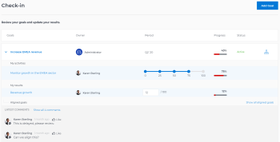

# Mettre à jour la progression des objectifs dans Adobe Workfront Goals

Vous devez revoir vos objectifs périodiquement et actualiser leur progression pour vous assurer qu’ils ne prennent pas de retard et qu’ils ne risquent pas de ne pas être atteints.

<!--And: take this last sentence ^^ out when you update this for goal redesign production.-->

## Conditions d’accès

Vous devez disposer des éléments suivants :

<table style="table-layout:auto">
<col>
</col>
<col>
</col>
<tbody>
 <tr> 
   <td role="rowheader">Forfait Adobe Workfront*</td> 
   <td> 
   
Pour la nouvelle structure de forfait et de licence :
  <ul><li>Un forfait Ultimate </li></ul>
   

Pour la structure de forfait et de licence actuelle : 
<ul><li> Un forfait Pro ou supérieur </li>
  <li>Une licence Objectifs Adobe Workfront en plus d’une licence Workfront.</li></ul>

   </td> 
  </tr>
 <tr>
 <td role="rowheader">Licence Adobe Workfront*</td>
 <td>
 
Nouvelle licence : contributeur ou contributrice ou niveau supérieur

 Ou
 
Licence actuelle : demande ou niveau supérieur
 
Pour plus d’informations, voir <a href="../../administration-and-setup/add-users/access-levels-and-object-permissions/wf-licenses.md" class="MCXref xref">Vue d’ensemble des licences Adobe Workfront</a>.
 </td>
 </tr>
 <tr>
 <td role="rowheader">Produit*</td>
 <td>
 
 Nouvelle exigence de produit, une des options suivantes : 

<ul>
<li>Un forfait Adobe Workfront Select ou Prime et une licence Objectifs Adobe Workfront supplémentaire.</li>
<li>Un forfait Workfront Ultimate qui inclut Objectifs Workfront par défaut. </li></ul>
 
Ou

 
Exigence de produit actuelle : un forfait Workfront et une licence supplémentaire pour Objectifs Adobe Workfront. 
 
Pour plus d’informations, consultez la section <a href="../../workfront-goals/goal-management/access-needed-for-wf-goals.md" class="MCXref xref">Exigences pour l’utilisation des Objectifs Workfront</a>. 
 </td>
 </tr>
 <tr>
 <td role="rowheader">Niveau d’accès</td>
 <td> 
Modifier l’accès aux Objectifs
</td>
 </tr>
 <tr data-mc-conditions="">
 <td role="rowheader">Autorisations d’objet</td>
 <td>
  

  
Autorisations d’affichage ou de niveau supérieur sur l’objectif pour l’afficher

  
Autorisations de gestion sur l’objectif pour le modifier

  
Pour plus d’informations sur le partage des objectifs, voir <a href="../../workfront-goals/workfront-goals-settings/share-a-goal.md" class="MCXref xref">Partager un objectif dans Objectifs Workfront</a>. 

  
 </td>
 </tr>
<tr>
   <td role="rowheader">
Modèle de mise en page
</td>
   <td> 
Toutes les personnes, y compris les administrateurs et administratrices Workfront, doivent se voir attribuer un modèle de mise en page incluant la zone Objectifs dans le menu principal. 
  
</td>
  </tr>
</tbody>
</table>

*Pour plus d’informations, voir [Conditions d’accès dans la documentation de Workfront](/help/quicksilver/administration-and-setup/add-users/access-levels-and-object-permissions/access-level-requirements-in-documentation.md).

## Conditions préalables

Vous devez disposer d’un objectif actif avant de commencer.

Vous ne pouvez pas mettre à jour la progression des objectifs qui sont des brouillons, inactifs ou fermés.

## Considérations relatives à la mise à jour des objectifs

Tenez compte des éléments suivants lorsque vous mettez à jour la progression des objectifs :

* Workfront Goals calcule automatiquement la progression d’un objectif lorsque vous mettez à jour ses indicateurs de progression.

  >[!TIP]
  >
  >Vous ne pouvez pas mettre à jour directement la progression d’un objectif. Vous devez mettre à jour la progression des indicateurs de progression de l’objectif (activités, résultats et projets associés), qui à leur tour mettent à jour la progression de l’objectif. Pour mettre à jour la progression des projets, vous devez mettre à jour les tâches du projet.

  Voir aussi les articles suivants :

   * Pour plus d’informations sur l’ajout d’activités aux objectifs, voir [Ajouter des activités aux objectifs dans Adobe Workfront Objectifs](../../workfront-goals/results-and-activities/add-activities-to-goals.md).
   * Pour plus d’informations sur l’ajout de résultats aux objectifs, voir [Ajouter des résultats aux objectifs dans Adobe Workfront Goals](../../workfront-goals/results-and-activities/add-results-to-goals.md).
   * Pour plus d’informations sur la façon dont Workfront Goals calcule la progression d’un objectif, voir [Vue d’ensemble de la progression et de la condition des objectifs dans Adobe Workfront Goals](../../workfront-goals/goal-management/calculate-goal-progress.md).

* Vous devez créer des objectifs et les activer avant de pouvoir mettre à jour leur progression.

  Voir aussi les articles suivants :

   * Pour plus d’informations sur la création d’objectifs, voir [Créer des objectifs dans Adobe Workfront Goals](../../workfront-goals/goal-management/create-goals.md).
   * Pour plus d’informations sur l’activation des objectifs, voir [Activer les objectifs dans Adobe Workfront Goals](../../workfront-goals/goal-management/activate-goals.md).

  >[!IMPORTANT]
  >
  >Vous ne pouvez pas mettre à jour la progression des objectifs qui sont en brouillon, fermés ou inactifs.

* La première fois que vous ou quelqu’un d’autre met à jour la progression d’un résultat ou d’une activité d’un objectif, la progression de l’objectif n’est plus Nouveau et Workfront Goals commence à enregistrer la progression et les mises à jour de le statut de la progression de l’objectif.

<!--

## Update goal progress by using Check-in in the Production environment

>[!IMPORTANT]
>
>  The Check-in functionality has been removed from the Preview environment and will be removed from Workfront Goals with the 23.1 release. See the [Update goal progress in the Preview environment](#update-goal-progress-in-the-preview-environment) section in this article to update goal progress in Preview. 

You can check in on goals at the individual goal level, or you can check in on multiple goals from the Check-in section of Workfront Goals.

* [Update individual goals](#update-individual-goals) 
* [Update goals in the Check-in section](#update-goals-in-the-check-in-section)

### Update individual goals {#update-individual-goals}

When you check in on a goal at the goal level, you can update the progress of the results and activities that are assigned to you or other users.

For information about how to update additional information about results and activities, see [Edit results and activities in Adobe Workfront Goals](../../workfront-goals/results-and-activities/edit-results-and-activities.md).

1. Click the **Main Menu** icon  > **Goals** in the upper-right corner.

   (!-- Add this when Shell is available to all: or (if available), click the **Main Menu** icon  in the upper-left corner)
   --)

   This opens the Workfront Goals area.

   All goals display by default. 

1. (Optional) Click any of the following sections in the left panel to access a list of goals:

   * Goal Alignment 
   * Pulse 
   * Check-in

   Or

   From the Goal List, click the name of a goal to open the **Goal Details** panel on the right.

   >[!TIP]
   >
   >You must have Edit access to Goals in your Access Level to view the Check-in section or the Check in button.

1. Click **Check in**.

   

   The progress of results and activities becomes editable.

1. Update the current progress on each of the results. Depending on what type of result you selected, you can do one of the following:

   * Update the quantity 
   * Update the currency amount
   * Update the percent complete

1. Update the percent complete on the Manual progress bar activity.

   >[!TIP]
   >
   >When you add projects as activities to your goals, you cannot manually update projects at the goal level. Workfront automatically updates project progress based on the project of their tasks. When the project percent complete updates in Workfront, the goal progress associated with the project also updates automatically.

1. Click **Back to Summary** to return to the Goal Details panel.

   Your goal progress updates as you update the results and activities of your goal. 

1. Click the **X icon** in the upper-right corner of the Goal Details panel to close it.

### Update goals in the Check-in section {#update-goals-in-the-check-in-section}

You can use the Check-in section to check in on goals when you want to quickly provide updates for several goals at the same time.

>[!TIP]
>
>You can access the Check-in section from any of the following sections:
>
>* Goal List 
>* Goal Alignment 
>* Pulse 
>

When you check in on a goal in the Check-in section, you can update the progress of the results and activities that are assigned only to you. You cannot update the progress of results and activities that are assigned to other users in this section.

1. Click the **Main Menu** icon  > **Goals** in the upper-right corner.

   (!-- Add this when Shell is available to all: or (if available), click the **Main Menu** icon  in the upper-left corner)
   --)

   This opens the Workfront Goals area and the Goal List section displays by default. 

1. Click Check-in in the left panel.

   Or

   (Conditional) If you are in the Goal List, Goal Alignment, or Pulse sections, click the **Check in** button in the upper-right of the screen. This opens the Check-in section.

   

   Goals display in a list and results and activities are listed under each goal.

   

1. (Optional) Click **Show all results**, **Show all activities**, or **Show all aligned goals** to the far right of the goal name to display all results, activities, and aligned goals of a goal whose progress you want to update.

   >[!CAUTION]
   >
   >You cannot directly update aligned goals, but you can update their results and activities.

1. Update the current progress on each of the results assigned to you. Depending on what type of result you selected, you can do one of the following:

   * Update the quantity 
   * Update the currency amount
   * Update the percent complete

   The result and the goal progress updated automatically and you receive a confirmation of your changes.

1. Update the percent complete on your Manual progress bar activity.

   >[!TIP]
   >
   >When you add projects as activities to your goals, you cannot manually update projects at the goal level. Workfront automatically updates project progress based on the project of their tasks. When the project percent complete updates in Workfront, the goal progress associated with the project also updates automatically.

   The activity and the goal progress updated automatically and you receive a confirmation of your changes.

1. (Optional) Add a comment for your goal, then click **Post** to save your comment.

-->

Pour mettre à jour la progression des objectifs :

1. Cliquez sur l’icône **Menu principal**  > **Objectifs** dans le coin supérieur droit.

   <!-- Add this when Shell is available to all: or (if available), click the **Main Menu** icon  in the upper-left corner)
   -->

   La liste des objectifs s’ouvre. Tous les objectifs auxquels vous avez accès s’affichent par défaut.

   Vous pouvez également cliquer sur Alignement des objectifs dans le panneau de gauche.

1. Dans la liste des objectifs, cliquez sur le nom d’un objectif pour ouvrir la page de l’objectif.
1. Cliquez sur **Indicateurs de progression** dans le panneau de gauche.

   La liste des indicateurs de progression affiche tous les indicateurs de progression pour l’objectif que vous avez sélectionné.

   >[!NOTE]
   >
   >  * Vous ne pouvez mettre à jour que les résultats et les activités.
   >  * Vous devez mettre à jour les indicateurs de progression des objectifs enfant afin d’afficher la progression accomplie dans la réalisation des objectifs enfant.
   >  * Vous devez mettre à jour les tâches sur les projets connectés pour afficher la progression des projets.
   >   
   >    À leur tour, la progression des objectifs enfant et la progression des projets entraînent la progression de l’objectif sélectionné.

1. Pour mettre à jour la progression d’un résultat ou d’une activité, cliquez sur la valeur dans la colonne **Progression en cours** du résultat ou de l’activité, saisissez un nombre pour mettre à jour la valeur, puis appuyez sur Entrée.

   

   La barre de progression de l’indicateur de progression dans la colonne Progression et la progression de l’objectif dans l’en-tête de l’objectif sont mises à jour immédiatement.

