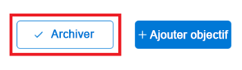

# Mettre à jour la progression des objectifs dans Objectifs Adobe Workfront

Vous devez revoir régulièrement vos objectifs et mettre à jour leurs progrès pour vous assurer qu’ils ne sont pas en retard ou qu’ils ne risquent pas d’être atteints.

<!--And: take this last sentence ^^ out when you update this for goal redesign production.-->

## Conditions d’accès

Vous devez disposer des éléments suivants :

<table style="table-layout:auto">
<col>
</col>
<col>
</col>
<tbody>
 <tr> 
   <td role="rowheader">Forfait Adobe Workfront*</td> 
   <td> 
   
Pour le nouveau plan et la nouvelle structure de licence :
  <ul><li>Un plan ultime </li>
  Ou
  <li>Une licence supplémentaire pour les objectifs Adobe Workfront pour les plans Prime ou Select Adobe Workfront. </li></ul> 

Pour le plan actuel et la structure de licence : 
<ul><li> A Pro ou version ultérieure </li>
  <li>Une licence Adobe Workfront Goals en plus d’une licence Workfront.</li></ul>

   </td> 
  </tr>
 <tr>
 <td role="rowheader">Licence Adobe Workfront*</td>
 <td>
 
Nouvelle licence : contributeur ou contributrice ou supérieure

 Ou
 
Licence actuelle : demande ou supérieure
 
Pour plus d’informations, voir <a href="../../administration-and-setup/add-users/access-levels-and-object-permissions/wf-licenses.md" class="MCXref xref">Présentation des licences Adobe Workfront</a>.
 </td>
 </tr>
 <tr>
 <td role="rowheader">Produit*</td>
 <td>
 
 Nouvelle exigence de produit, l’une des options suivantes : 

<ul>
<li>Un forfait Select ou Prime Adobe Workfront et une licence Adobe Workfront Goals supplémentaire.</li>
<li>Un plan Workfront Ultimate qui inclut par défaut les objectifs de Workfront. </li></ul>
 
Ou

 
Exigences actuelles du produit : formule Workfront et licence supplémentaire pour les objectifs Adobe Workfront. 
 
Pour plus d’informations, consultez la section <a href="../../workfront-goals/goal-management/access-needed-for-wf-goals.md" class="MCXref xref">Exigences pour l’utilisation des Objectifs Workfront</a>. 
 </td>
 </tr>
 <tr>
 <td role="rowheader">Niveau d’accès</td>
 <td> 
Modifier l’accès aux objectifs
</td>
 </tr>
 <tr data-mc-conditions="">
 <td role="rowheader">Autorisations d’objet</td>
 <td>
  

  
Afficher ou des autorisations supérieures à l’objectif pour l’afficher

  
Gérer les autorisations sur l’objectif pour le modifier

  
Pour plus d’informations sur le partage des objectifs, consultez <a href="../../workfront-goals/workfront-goals-settings/share-a-goal.md" class="MCXref xref">Partager un objectif dans les Objectifs Workfront</a>. 

  
 </td>
 </tr>
<tr>
   <td role="rowheader">
Modèle de disposition
</td>
   <td> 
Tous les utilisateurs, y compris les administrateurs de Workfront, doivent se voir attribuer un modèle de mise en page incluant la zone Objectifs dans le menu principal. 
  
</td>
  </tr>
</tbody>
</table>

*Pour plus d’informations, voir [Conditions d’accès dans la documentation de Workfront](/help/quicksilver/administration-and-setup/add-users/access-levels-and-object-permissions/access-level-requirements-in-documentation.md).

## Conditions préalables

Vous devez avoir un objectif actif avant de pouvoir commencer.

Vous ne pouvez pas mettre à jour la progression des objectifs qui sont des brouillons, inactifs ou fermés.

## Observations relatives à la mise à jour des objectifs

Tenez compte des points suivants lors de la mise à jour de la progression par rapport aux objectifs :

* Les objectifs de Workfront calculent automatiquement la progression d’un objectif lorsque vous mettez à jour ses indicateurs de progression.

  >[!TIP]
  >
  >Vous ne pouvez pas mettre à jour la progression directement sur un objectif. Vous devez mettre à jour les indicateurs de progression de l&#39;objectif (activités, résultats, projets connectés) qui à leur tour mettent à jour la progression de l&#39;objectif. Pour mettre à jour la progression des projets, vous devez mettre à jour les tâches du projet.

  Consultez également les articles suivants :

   * Pour plus d’informations sur l’ajout d’activités aux objectifs, voir [Ajout d’activités aux objectifs dans les objectifs Adobe Workfront](../../workfront-goals/results-and-activities/add-activities-to-goals.md).
   * Pour plus d’informations sur l’ajout de résultats aux objectifs, voir [Ajout de résultats aux objectifs dans les objectifs Adobe Workfront](../../workfront-goals/results-and-activities/add-results-to-goals.md).
   * Pour plus d’informations sur la façon dont les objectifs de Workfront calculent la progression sur un objectif, voir [Présentation de la progression et de la condition de l’objectif dans les objectifs Adobe Workfront](../../workfront-goals/goal-management/calculate-goal-progress.md).

* Vous devez créer des objectifs et les activer avant de pouvoir mettre à jour leur progression.

  Consultez également les articles suivants :

   * Pour plus d’informations sur la création d’objectifs, voir [Création d’objectifs dans les objectifs Adobe Workfront](../../workfront-goals/goal-management/create-goals.md).
   * Pour plus d’informations sur l’activation des objectifs, voir [Activation des objectifs dans les objectifs Adobe Workfront](../../workfront-goals/goal-management/activate-goals.md).

  >[!IMPORTANT]
  >
  >Vous ne pouvez pas mettre à jour la progression des objectifs qui sont rédigés, fermés ou inactifs.

* La première fois que vous ou quelqu’un d’autre mettez à jour la progression d’un résultat ou d’une activité sur un objectif, l’objectif Changements de progression par rapport aux nouveaux objectifs et aux objectifs de Workfront commence à enregistrer la progression et les mises à jour de l’état de progression sur l’objectif.

<!--

## Update goal progress by using Check-in in the Production environment

>[!IMPORTANT]
>
>  The Check-in functionality has been removed from the Preview environment and will be removed from Workfront Goals with the 23.1 release. See the [Update goal progress in the Preview environment](#update-goal-progress-in-the-preview-environment) section in this article to update goal progress in Preview. 

You can check in on goals at the individual goal level, or you can check in on multiple goals from the Check-in section of Workfront Goals.

* [Update individual goals](#update-individual-goals) 
* [Update goals in the Check-in section](#update-goals-in-the-check-in-section)

### Update individual goals {#update-individual-goals}

When you check in on a goal at the goal level, you can update the progress of the results and activities that are assigned to you or other users.

For information about how to update additional information about results and activities, see [Edit results and activities in Adobe Workfront Goals](../../workfront-goals/results-and-activities/edit-results-and-activities.md).

1. Click the **Main Menu** icon  > **Goals** in the upper-right corner.

   (!-- Add this when Shell is available to all: or (if available), click the **Main Menu** icon  in the upper-left corner)
   --)

   This opens the Workfront Goals area.

   All goals display by default. 

1. (Optional) Click any of the following sections in the left panel to access a list of goals:

   * Goal Alignment 
   * Pulse 
   * Check-in

   Or

   From the Goal List, click the name of a goal to open the **Goal Details** panel on the right.

   >[!TIP]
   >
   >You must have Edit access to Goals in your Access Level to view the Check-in section or the Check in button.

1. Click **Check in**.

   

   The progress of results and activities becomes editable.

1. Update the current progress on each of the results. Depending on what type of result you selected, you can do one of the following:

   * Update the quantity 
   * Update the currency amount
   * Update the percent complete

1. Update the percent complete on the Manual progress bar activity.

   >[!TIP]
   >
   >When you add projects as activities to your goals, you cannot manually update projects at the goal level. Workfront automatically updates project progress based on the project of their tasks. When the project percent complete updates in Workfront, the goal progress associated with the project also updates automatically.

1. Click **Back to Summary** to return to the Goal Details panel.

   Your goal progress updates as you update the results and activities of your goal. 

1. Click the **X icon** in the upper-right corner of the Goal Details panel to close it.

### Update goals in the Check-in section {#update-goals-in-the-check-in-section}

You can use the Check-in section to check in on goals when you want to quickly provide updates for several goals at the same time.

>[!TIP]
>
>You can access the Check-in section from any of the following sections:
>
>* Goal List 
>* Goal Alignment 
>* Pulse 
>

When you check in on a goal in the Check-in section, you can update the progress of the results and activities that are assigned only to you. You cannot update the progress of results and activities that are assigned to other users in this section.

1. Click the **Main Menu** icon  > **Goals** in the upper-right corner.

   (!-- Add this when Shell is available to all: or (if available), click the **Main Menu** icon  in the upper-left corner)
   --)

   This opens the Workfront Goals area and the Goal List section displays by default. 

1. Click Check-in in the left panel.

   Or

   (Conditional) If you are in the Goal List, Goal Alignment, or Pulse sections, click the **Check in** button in the upper-right of the screen. This opens the Check-in section.

   

   Goals display in a list and results and activities are listed under each goal.

   

1. (Optional) Click **Show all results**, **Show all activities**, or **Show all aligned goals** to the far right of the goal name to display all results, activities, and aligned goals of a goal whose progress you want to update.

   >[!CAUTION]
   >
   >You cannot directly update aligned goals, but you can update their results and activities.

1. Update the current progress on each of the results assigned to you. Depending on what type of result you selected, you can do one of the following:

   * Update the quantity 
   * Update the currency amount
   * Update the percent complete

   The result and the goal progress updated automatically and you receive a confirmation of your changes.

1. Update the percent complete on your Manual progress bar activity.

   >[!TIP]
   >
   >When you add projects as activities to your goals, you cannot manually update projects at the goal level. Workfront automatically updates project progress based on the project of their tasks. When the project percent complete updates in Workfront, the goal progress associated with the project also updates automatically.

   The activity and the goal progress updated automatically and you receive a confirmation of your changes.

1. (Optional) Add a comment for your goal, then click **Post** to save your comment.

-->

Pour mettre à jour les progrès réalisés par rapport aux objectifs :

1. Cliquez sur l’icône **Menu principal**  > **Objectifs** dans le coin supérieur droit.

   <!-- Add this when Shell is available to all: or (if available), click the **Main Menu** icon  in the upper-left corner)
   -->

   Cela ouvre la liste des objectifs. Tous les objectifs auxquels vous avez accès s’affichent par défaut.

   Vous pouvez également cliquer sur Alignement de l’objectif dans le panneau de gauche.

1. Dans la liste des objectifs, cliquez sur le nom d’un objectif pour ouvrir la page d’objectif.
1. Cliquez sur **Indicateurs de progression** dans le panneau de gauche.

   La liste Indicateurs de progression affiche tous les indicateurs de progression pour l’objectif que vous avez sélectionné.

   >[!NOTE]
   >
   >  * Vous pouvez uniquement mettre à jour les résultats et les activités.
   >  * Vous devez mettre à jour les indicateurs de progression des objectifs pour enfants afin de montrer la progression par rapport aux objectifs pour enfants.
   >  * Vous devez mettre à jour les tâches sur les projets connectés pour afficher la progression des projets.
   >   
   >    En retour, les progrès des objectifs pour enfants et les progrès des projets stimulent la progression de l&#39;objectif sélectionné.

1. Pour mettre à jour la progression d’un résultat ou d’une activité, cliquez sur la valeur dans la colonne **Progression réelle** du résultat ou de l’activité et saisissez un nombre pour mettre à jour sa valeur, puis appuyez sur Entrée.

   

   La barre de progression de l&#39;indicateur de progression dans la colonne Progression et la progression de l&#39;objectif dans l&#39;en-tête de l&#39;objectif sont mises à jour immédiatement.

