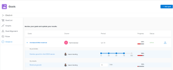

# Vue d’ensemble des sections d’Objectifs Adobe Workfront

>[!IMPORTANT]
>
>Votre organisation doit disposer des éléments suivants pour utiliser les fonctionnalités décrites dans cet article :
>
>* Pour la nouvelle structure de forfait et de licence :
>
>   * Formule Workfront ultime
>    
>* Pour la structure de forfait et de licence actuelle :
>
>   * Formule Workfront Pro ou ultérieure
>   * Une licence Objectifs Adobe Workfront en plus d’une licence Workfront.
>
>Contactez la personne chargée de la gestion de votre compte Workfront pour en savoir plus sur la licence Objectifs Workfront.
> 
>Pour plus d’informations sur l’accès à Objectifs Workfront, voir [Conditions requises pour utiliser Objectifs Workfront](/help/quicksilver/workfront-goals/goal-management/access-needed-for-wf-goals.md).

Une fois que l’équipe d’administration Workfront vous a accordé l’accès aux Objectifs Workfront, vous pouvez afficher les objectifs que vous ou toute autre personne de votre organisation avez créés dans la zone Objectifs Workfront.

Vous pouvez accéder à des listes d’objectifs ou d’objectifs individuels et les gérer à partir de plusieurs sections dans les Objectifs Workfront. La section que vous utilisez dépend de l’objectif que vous souhaitez atteindre lorsque vous travaillez avec des objectifs.

Vous pouvez appliquer des filtres pour n’afficher que les objectifs qui vous sont importants dans chaque section.

>[!TIP]
>
>Les filtres mis à jour dans une section sont automatiquement appliqués aux sections Liste des objectifs, Graphiques et Alignement des objectifs. De cette façon, vous ne pouvez les mettre à jour qu’une seule fois. Pour plus d’informations, voir [Filtrer les informations dans Objectifs Adobe Workfront](../../workfront-goals/goal-management/filter-information-wf-goals.md).

Vous trouverez ci-dessous une brève vue d’ensemble des sections des Objectifs Workfront et des options disponibles pour la gestion des objectifs. Pour plus d’informations sur les actions supplémentaires que vous pouvez effectuer dans chaque section des Objectifs Workfront, nous vous recommandons également les articles suivants :

* [Créer des objectifs dans les Objectifs Adobe Workfront](../../workfront-goals/goal-management/create-goals.md)
* [Mettre à jour la progression des objectifs dans les Objectifs Adobe Workfront](../../workfront-goals/goal-review-and-workfront-goals-sections/check-in-goals.md)
* [Filtrer des informations dans les Objectifs Adobe Workfront](../../workfront-goals/goal-management/filter-information-wf-goals.md)

## Liste d’objectifs

Vous pouvez utiliser la Liste des objectifs pour passer en revue les objectifs qui vous appartiennent, ainsi qu’à vos équipes, à vos groupes ou à votre organisation. Vous pouvez afficher les objectifs dans n’importe quel statut et à partir de n’importe quelle période.

Pour plus d’informations sur la navigation dans la Liste des objectifs et la gestion des objectifs, voir [Gérer les objectifs dans la Liste des objectifs d’Objectifs Adobe Workfront](../../workfront-goals/goal-review-and-workfront-goals-sections/manage-goals-in-goal-list.md).

Utilisez la Liste des objectifs pour effectuer les opérations suivantes :

* Afficher les objectifs qui vous appartiennent, à vos équipes, à vos groupes ou à votre organisation.
* Vérifier les objectifs et leurs informations (par exemple, le nom, la personne propriétaire, la progression ou la condition).
* Ajouter des objectifs.

  Pour plus d’informations, voir [Créer des objectifs dans Objectifs Adobe Workfront](../../workfront-goals/goal-management/create-goals.md).

* Accéder à la page d’un objectif et le modifier, le metttre à jour, ainsi que ses résultats et ses activités

  Pour plus d’informations, voir [Modifier les objectifs dans Objectifs Adobe Workfront](../../workfront-goals/goal-management/edit-goals.md).

* Modifier des objectifs.

## Graphiques

Vous pouvez utiliser la section Graphiques pour obtenir une vue d’ensemble de l’intégrité des objectifs qui vous appartiennent ou qui appartiennent à votre organisation. Vous pouvez afficher les informations de progression des objectifs dans n’importe quel statut à partir de n’importe quelle période dans cette section.

Pour plus d’informations sur l’utilisation de la section Graphiques, voir [Examiner des graphiques pour comprendre les tendances de progression des objectifs d’Objectifs Adobe Workfront](../../workfront-goals/goal-review-and-workfront-goals-sections/review-goal-graphs.md).

Utilisez la section Graphiques pour effectuer les opérations suivantes :

* Afficher les performances des objectifs qui vous appartiennent, à vos équipes, à vos groupes ou à votre organisation.
* Afficher le nombre d’objectifs avec un statut de progression donné.
* Comprendre les performances hebdomadaires de vos objectifs.

## Alignement des objectifs

Si vos objectifs sont harmonisés, utilisez la section Alignement des objectifs pour afficher et revoir tous les objectifs de votre organisation, ainsi que leur alignement les uns par rapport aux autres. Les objectifs alignés s’affichent ici sur les cartes connectées afin d’illustrer l’alignement entre eux. Les objectifs parent s’affichent en premier, et les objectifs enfant sont empilés derrière eux. Vous pouvez afficher les objectifs dans n’importe quel statut et à n’importe quelle période dans cette section.

Pour plus d’informations sur la navigation dans la section Alignement des objectifs pour gérer les objectifs, voir [Naviguer dans la section Alignement des objectifs d’Objectifs Adobe Workfront](../../workfront-goals/goal-alignment/navigate-goal-alignment-chart.md).

Pour plus d’informations sur l’alignement des objectifs, consultez les articles suivants :

* [Aligner des objectifs en les connectant à Objectifs Adobe Workfront](../../workfront-goals/goal-alignment/align-goals-by-connecting-them.md)
* [Alignement des objectifs en convertissant les résultats et les activités en objectifs](../../workfront-goals/goal-alignment/align-goals-by-converting-results-activities.md)

Utilisez la section Alignement des objectifs pour effectuer les opérations suivantes :

* Afficher les objectifs qui vous appartiennent ou qui appartiennent à votre organisation au format d’une carte.
* Afficher la hiérarchie des objectifs et afficher les objectifs enfants alignés.
* Accéder à la page de l’objectif et mettre à jour l’objectif, ses résultats ou ses activités.

<!--
## Pulse

 The Pulse section has been removed from the Preview environment and will be removed from Workfront Goals with the 23.1 release. Use the Goal List area to review goals that you or your teams are responsible for. 

You can use the Pulse section to review and request updates to goals that might influence the progress of your goals. These could be your own goals, or goals that belong to your teams, groups, or your organization. You can view goals in any status and from any time period in this section.

>[!TIP]
>
>Only goals that have been checked in on at least once display in the Pulse section.

For information about reviewing goals using the Pulse section, see [Review goals in the Adobe Workfront Goals Pulse section](../../workfront-goals/goal-review-and-workfront-goals-sections/review-goals-in-pulse.md).

Use the Pulse section to do the following:

* View goals that belong to your teams, groups, or organization. 
* Review goal progress and updates, including aligned goals, their results, and activities. 
* Make or ask for updates to a goal by adding a comment. 
* Access the Goal Details panel and edit and update the goal, its results, or activities.
* Add new goals. 
* Check in on goals.

  >[!TIP]
  >
  >Clicking Check in opens the Check-in section in the left panel.

## Check-in

 The Check-in section has been removed from the Preview environment and will be removed from Workfront Goals with the 23.1 release. Use the Goal List area to review goals that you or your teams are responsible for.

You must have access to Edit Goals in your access level before you can access the Check- in section. For information about granting access to Goals, see  [Grant access to Adobe Workfront Goals](../../administration-and-setup/add-users/configure-and-grant-access/grant-access-goals.md).

You can use the Check-in section to update active goals and any results and activities that you are the owner of. You can primarily view only goals in an Active status in this section. Children goals aligned to active parents also display in the Check-in section, regardless of their status.

>[!IMPORTANT]
>
>* A goal displays in the Check-in section only if it is assigned to you or if it has a result or activity that is assigned to you. 
>* If a goal assigned to you is the child goal of a parent that is not assigned to you and your goal (the child goal) is closed, inactive, or a draft, the parent goal does not display in your Check-in section. 
>

For information about managing goals in the Goal List, see [Manage goals in the Goal List of Adobe Workfront Goals](../../workfront-goals/goal-review-and-workfront-goals-sections/manage-goals-in-goal-list.md).

Use the Check-in section to do the following:

* Review goal progress and updates, including aligned goals, their results, and activities. 
* Update the progress on the results and activities that are assigned to you. For information about updating goals by checking in on them, see [Update goal progress in Adobe Workfront Goals](../../workfront-goals/goal-review-and-workfront-goals-sections/check-in-goals.md).

  >[!IMPORTANT]
  >
  >You can check in only on the results and activities assigned to you in the Check-in section, and not those that are assigned to other entities.

* Add a comment to a goal, then click Post to make or ask for updates to a goal. 
* Access the Goal Details panel and edit and update the goal, its results, or activities.
* Add new goals.
-->
