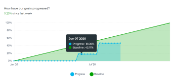

# Examiner les graphiques pour comprendre les tendances de la progression des objectifs dans Objectifs Adobe Workfront

<!--Audited for P&P only: 4/2025-->

Vous pouvez afficher l’intégrité globale de vos objectifs et la tendance de leur progression dans le temps dans la section Graphiques des Objectifs Adobe Workfront. Les graphiques de cette section ne ventilent pas la progression de chaque objectif, mais vous donnent à la place un aperçu holistique du statut de la progression de tous les objectifs ainsi que la tendance de leur progression dans le temps au cours d’une période donnée.

>[!IMPORTANT]
>
>Vous pouvez afficher le nombre total de vos objectifs dans la section Graphiques pour une période sélectionnée. Cependant, la fonction Objectifs Workfront prend uniquement en compte les objectifs dont le statut est Actif et Fermé lors du calcul du statut de progression globale des objectifs et du pourcentage d’achèvement.

## Conditions d’accès

>[!NOTE]
>
>Votre entreprise peut choisir de continuer à utiliser les objectifs Adobe Workfront si elle a déjà acheté ce package par le passé. Pour plus de détails, contactez votre représentant de compte.
>
>Adobe Workfront Goals ne peut plus être acheté.

+++ Développez pour afficher les exigences d’accès aux fonctionnalités de cet article. 

<table style="table-layout:auto">
<col>
</col>
<col>
</col>
<tbody>
 <tr>
  <td> 
Package Adobe Workfront
 </td> 
   <td> 
   
Adobe Workfront Ultimate

   </td> 
  </tr>
 <tr>
 <td role="rowheader">Licence Adobe Workfront</td>
 <td>
 
Contributeur ou version ultérieure

Requête ou supérieure
</td>
 </tr>
  <tr>
 <td role="rowheader">Configuration du niveau d’accès</td>
 <td> 
Modifier l’accès aux Objectifs
 </td>
 </tr>
 <tr data-mc-conditions="">
 <td role="rowheader">Autorisations d’objet</td>
 <td>
  

  
Autorisations d’affichage ou de niveau supérieur sur l’objectif pour l’afficher

  
Autorisations de gestion sur l’objectif pour le modifier

  
 </td>
 </tr>
<tr>
   <td role="rowheader">
Modèle de mise en page
</td>
   <td> 
Un modèle de mise en page comprenant la zone Objectifs du menu principal doit être affecté à tous les utilisateurs, y compris les administrateurs système. 
  
</td>
  </tr>
</tbody>
</table>

Pour plus d’informations, voir [Conditions d’accès dans la documentation Workfront](/help/quicksilver/administration-and-setup/add-users/access-levels-and-object-permissions/access-level-requirements-in-documentation.md).

+++

<!--Old:
<table style="table-layout:auto">
<col>
</col>
<col>
</col>
<tbody>
 <tr> 
   <td role="rowheader">Adobe Workfront plan*</td> 
   <td> 
   
For the new plan and license structure:
  <ul><li>An Ultimate plan </li></ul>
   

For the current plan and license structure: 
<ul><li> A Pro or higher </li>
  <li>An Adobe Workfront Goals license in addition to a Workfront license.</li></ul>

   </td>  
  </tr>
 <tr>
 <td role="rowheader">Adobe Workfront license*</td>
 <td>
 
New license: Contributor or higher

 Or
 
Current license: Request or higher
 
For more information, see <a href="../../administration-and-setup/add-users/access-levels-and-object-permissions/wf-licenses.md" class="MCXref xref">Adobe Workfront licenses overview</a>.
 </td>
 </tr>
 <tr>
 <td role="rowheader">Product*</td>
 <td>
    
 New product requirement: Workfront

    Or
    
Current product requirement: In addition to a Workfront license, you must purchase a license for Adobe Workfront Goals. 
 
For information, see <a href="../../workfront-goals/goal-management/access-needed-for-wf-goals.md" class="MCXref xref">Requirements to use Workfront Goals</a>. 
 </td>
 </tr>
 <tr>
 <td role="rowheader">
Access level
</td>
 <td> 
Edit access to Goals
 </td>
 </tr>
 <tr data-mc-conditions="">
 <td role="rowheader">Object permissions</td>
 <td>
  

  
View or higher permissions to the goal to view it

  
Manage permissions to the goal to edit it

  
For information about sharing goals, see <a href="../../workfront-goals/workfront-goals-settings/share-a-goal.md" class="MCXref xref">Share a goal in Workfront Goals</a>. 

  
 </td>
 </tr>
 <tr>
   <td role="rowheader">
Layout template
</td>
   <td> 
All users, including Workfront administrators,  must be assigned a layout template that includes the Goals area in the Main Menu. 
  
</td>
  </tr>
</tbody>
</table>-->

## Types de graphiques dans les Objectifs Workfront

Les graphiques suivants sont disponibles dans la section Graphiques ou dans Objectifs Workfront :

<table style="table-layout:auto"> 
 <col> 
 <col> 
 <tbody> 
  <tr> 
   <td role="rowheader">Graphique de l’intégrité des objectifs</td> 
   <td> 
Graphique d’enregistrement qui affiche les éléments suivants :
 
    <ul> 
     <li>Nombre total d’objectifs pour la période sélectionnée. Les objectifs sont pris en compte, peu importe leur statut. </li> 
     <li>Statut de la progression des objectifs dont le statut est Actif et Fermé.</li> 
    </ul> 
Pour plus d’informations sur la façon dont les Objectifs Workfront calculent le statut de la progression, voir <a href="../../workfront-goals/goal-management/calculate-goal-progress.md" class="MCXref xref">Vue d’ensemble de la progression et du statut des objectifs dans les Objectifs Adobe Workfront</a>.
 </td> 
  </tr> 
  <tr> 
   <td role="rowheader">Graphique de progression de l’objectif</td> 
   <td> 
Graphique en courbe qui affiche les mises à jour apportées aux objectifs par incréments hebdomadaires pendant la durée de l’objectif. Le graphique de progression de l’objectif affiche les éléments suivants :
 
    <ul> 
     <li>Pourcentage réel et attendu moyen de l'ensemble des objectifs actifs et clôturés sur la période sélectionnée. Le pourcentage terminé de progression est ventilé en incréments hebdomadaires marqués par des nœuds. </li> 
     <li>Pourcentage moyen global de progression pour les objectifs actifs et clôturés depuis la semaine précédente. </li> 
    </ul> 
Conseil : il se peut que le graphique de progression de l’objectif n’affiche aucune information lorsque des mises à jour sont effectuées sur les objectifs en dehors de la période sélectionnée. 
 </td> 
  </tr> 
 </tbody> 
</table>

## Examiner la progression de l’objectif dans les graphiques

{{step1-to-goals}}

La zone Objectifs Workfront s’ouvre alors.

1. Cliquez sur **Graphiques** dans le panneau de gauche.

   

   La section « Graphiques » s’affiche.

   Par défaut, les objectifs affichés dans la section « Graphiques » sont limités par les critères suivants :

   * Filtres appliqués à la zone « Graphiques ».
   * Objectifs dont le statut est « Actif » et « Brouillon ».

1. (Facultatif) Sélectionnez le type d’informations à afficher en mettant à jour les filtres dans le coin supérieur droit de la section « Graphiques ».

   Pour plus d’informations sur le filtrage des objectifs, consultez la section [Filtrer les informations dans les Objectifs Adobe Workfront](../../workfront-goals/goal-management/filter-information-wf-goals.md).

   >[!TIP]
   >
   >Si vous avez choisi d’afficher plusieurs périodes, un graphique de l’intégrité de l’objectif (jauge) ainsi qu’un graphique de progression de l’objectif (courbe) s’affichent pour chaque période.

1. Consultez les informations du tableau ci-dessous lorsque vous passez en revue le graphique de l’intégrité de l’objectif.

   

   | Nombre total d’objectifs | Le nombre au bas du graphique indique le nombre de tous les objectifs de la période sélectionnée, dans tous les statuts que vous avez sélectionnés. |
   |---|---|
   | Pourcentage moyen terminé | Dans la partie supérieure du graphique, ce nombre indique le pourcentage moyen d’objectifs actifs et fermés au cours de la période sélectionnée. |
   | Objectifs et leurs progression | Nombre d’objectifs pour chaque segment du statut de progression, lorsque vous pointez la souris sur les segments du graphique. Seuls les objectifs dont le statut est soit « Actif » soit « Fermé » sont comptabilisés dans les segments. |

1. Consultez les informations du tableau ci-dessous lorsque vous passez en revue le graphique de progression de l’objectif.

   

   <table style="table-layout:auto"> 
    <col> 
    <col> 
    <tbody> 
     <tr> 
      <td>Progression de référence</td> 
      <td>La ligne verte indique le pourcentage global moyen de progession des objectifs actifs et fermés pour la période sélectionnée. Tous les objectifs d’une période donnée sont censés être atteints, de sorte que la progression de référence est toujours de 100 % à la fin de la période. </td> 
     </tr> 
     <tr> 
      <td>Progression en cours</td> 
      <td> 
La ligne bleue indique le pourcentage global moyen de progession en cours des objectifs actifs et fermés pour la période sélectionnée par incréments hebdomadaires. Chaque semaine pendant la durée de l’objectif est représentée par un nœud sur la ligne. 
 </td> 
     </tr> 
    </tbody> 
   </table>

1. Pointez sur un nœud représentant une semaine dans le graphique de progression de l’objectif et passez en revue les éléments suivants :

   * **Date de la semaine** : mois, jour et année de la semaine sélectionnée.
   * **Progression** : moyenne du pourcentage d’achèvement réel de tous les objectifs pour la semaine sélectionnée.
   * **Référence** : moyenne du pourcentage d’achèvement attendu de tous les objectifs pour la semaine sélectionnée.

1. (Facultatif) Cliquez sur **Progression** au bas du graphique de progression pour supprimer la ligne de progression globale en cours.

   Ou

   Cliquez sur **Référence** au bas du graphique de progression pour supprimer la ligne de progression attendue du graphique.

