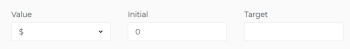

# Ajout de résultats aux objectifs dans les objectifs Adobe Workfront

Les résultats mesurent la progression d’un objectif. Sans associer de résultats, d’activités ou d’objectifs alignés à un objectif, vous ne pouvez pas activer l’objectif et vous ne pouvez pas y enregistrer la progression.

## Exigences d’accès

<!--drafted for P&P release: 

<table style="table-layout:auto">
 <col>
 </col>
 <col>
 </col>
 <tbody>
  <tr>
   <td role="rowheader">Adobe Workfront plan*</td>
   <td>
   
Current plan: Select or higher

   Or
   
Legacy plan: Pro or higher

   
   </td>
  </tr>
  <tr>
   <td role="rowheader">Adobe Workfront license*</td>
   <td>
   
Current license: Contributor or higher

   Or
   
Legacy license: Request or higher
 
For more information, see <a href="../../administration-and-setup/add-users/access-levels-and-object-permissions/wf-licenses.md" class="MCXref xref">Adobe Workfront licenses overview</a>.
 </td>
  </tr>
  <tr>
   <td role="rowheader">Product</td>
   <td>
   
 Current product requirement: If you have the Select or Prime Adobe Workfront plan, you must also buy an additional Adobe Workfront Goals license.  Workfront Goals are included in the Ultimate Workfront Plan.

   Or
   
Legacy product requirement: You must purchase an additional license for the Adobe Workfront Goals to access functionality described in this article. 
 
For information, see <a href="../../workfront-goals/goal-management/access-needed-for-wf-goals.md" class="MCXref xref">Requirements to use Workfront Goals</a>. 
 </td>
  </tr>
  <tr>
   <td role="rowheader">Access level*</td>
   <td> 
Edit access to Goals
 
<b>NOTE</b>
If you still don't have access, ask your Workfront administrator if they set additional restrictions in your access level. For information on how a Workfront administrator can change your access level, see:

     <ul>
      <li> 
<a href="../../administration-and-setup/add-users/configure-and-grant-access/create-modify-access-levels.md" class="MCXref xref">Create or modify custom access levels</a> 
 </li>
      <li> 
<a href="../../administration-and-setup/add-users/configure-and-grant-access/grant-access-goals.md" class="MCXref xref">Grant access to Adobe Workfront Goals</a> 
 </li>
     </ul> 
 </td>
  </tr>
  <tr data-mc-conditions="">
   <td role="rowheader">Object permissions</td>
   <td>
    

     
View or higher permissions to the goal to view it

     
Manage permissions to the goal to edit it

     
For information about sharing goals, see <a href="../../workfront-goals/workfront-goals-settings/share-a-goal.md" class="MCXref xref">Share a goal in Workfront Goals</a>. 

    
 </td>
  </tr>
 </tbody>
</table>

-->

Vous devez disposer des éléments suivants :

<table style="table-layout:auto"> 
 <col> 
 <col> 
 <tbody> 
  <tr> 
   <td role="rowheader">Formule Adobe Workfront*</td> 
   <td> 
Pro ou version ultérieure
 </td> 
  </tr> 
  <tr> 
   <td role="rowheader">Licence Adobe Workfront*</td> 
   <td> 
Requête ou supérieure
 
Pour plus d’informations, voir <a href="../../administration-and-setup/add-users/access-levels-and-object-permissions/wf-licenses.md" class="MCXref xref">Présentation des licences Adobe Workfront</a>.
 </td> 
  </tr> 
  <tr> 
   <td role="rowheader">Produit</td> 
   <td> 
Pour accéder aux fonctionnalités décrites dans cet article, vous devez acheter une licence supplémentaire pour les objectifs d’Adobe Workfront. 
 
Pour plus d’informations, voir <a href="../../workfront-goals/goal-management/access-needed-for-wf-goals.md" class="MCXref xref">Conditions requises pour utiliser les objectifs Workfront</a>. 
 </td> 
  </tr> 
  <tr> 
   <td role="rowheader">Paramétrages du niveau d'accès*</td> 
   <td> 
Modifier l’accès aux objectifs
 
<b>NOTE</b>

Si vous n’avez toujours pas accès à , demandez à votre administrateur Workfront s’il définit des restrictions supplémentaires à votre niveau d’accès. Pour plus d’informations sur la façon dont un administrateur Workfront peut modifier votre niveau d’accès, voir :
 
     <ul> 
      <li> 
<a href="../../administration-and-setup/add-users/configure-and-grant-access/create-modify-access-levels.md" class="MCXref xref">Création ou modification de niveaux d’accès personnalisés</a> 
 </li> 
      <li> 
<a href="../../administration-and-setup/add-users/configure-and-grant-access/grant-access-goals.md" class="MCXref xref">Accorder l’accès aux objectifs Adobe Workfront</a> 
 </li> 
     </ul> 
 </td> 
  </tr> 
  <tr data-mc-conditions=""> 
   <td role="rowheader">Autorisations d’objet</td> 
   <td> 
    
 
     
Gérer les autorisations pour l’objectif
 
     
Pour plus d’informations sur le partage des objectifs, voir <a href="../../workfront-goals/workfront-goals-settings/share-a-goal.md" class="MCXref xref">Partage d’un objectif dans les objectifs Workfront</a>. 
 
    
 </td> 
  </tr> 
 </tbody> 
</table>

*Pour connaître le plan, le type de licence ou l’accès dont vous disposez, contactez votre administrateur Workfront.

## Conditions préalables

Avant de pouvoir commencer, vous devez disposer des éléments suivants :

* Un modèle de mise en page qui inclut la zone Objectifs dans le menu principal.
* Un objectif existant.

   Pour plus d’informations sur la création d’objectifs, voir [Création d’objectifs dans les objectifs Adobe Workfront](../../workfront-goals/goal-management/create-goals.md).

>[!IMPORTANT]
>Un objectif ne peut pas comporter plus de 1 000 activités, résultats, projets ou objectifs alignés.

## Ajouter un résultat à un objectif

<!--

Adding results to goals differs depending on which environment you use.

### Add a result to a goal in the Production environment

1. Go to the goal for which you want to add a result and click the name to open the **Goal Details** panel.
1. Click **Add results**.

   

1. Start typing the result you want to achieve in the **Result** field. This is the name of the result and it displays wherever the goal displays. 
1. (Optional) If you want to set the Result Owner as someone other than yourself, click your name in the **Owner** field and start typing the name of the user that you want to assign as the owner of the result, then click it when it appears in the drop-down list.

   >[!NOTE]
   >
   >You cannot assign a team or group as a result owner.

1. In the Value drop-down menu, select the type of value that you want to measure your success by.

   

   Select from the following options:

   |Option|Value type|
   |---|---|
   | # |Number value |
   | % |Percentage value |
   |$, CN¥, DKK, KR, Mex$, R, R$, zł, £ , ¥ , &euro; , ₹, ฿, MYR, ₪  |Currency values |

   For example, if you want to increase profit to 8%, and profit is currently at 4%, you can select % as the Measured Value.

   >[!TIP]
   >
   >The result Type is always Metric and cannot be edited.

1. In the Initial field, indicate the value that the result has in the beginning, before any progress on it has been recorded. For example, if you want to increase profit to 8%, and profit is currently at 4%, you can enter 4 as the Starting At value. 
1. In the Target field, indicate the value that the result aims to achieve. For example, if you want to increase profit to 8%, and profit is currently at 4%, you can enter 8 as the Ending At value.
1. Click **Save**.

   The result is saved for the selected goal. The progress of the goal automatically updates when you update the progress of a result.

-->

1. Cliquez sur le menu principal , puis **Objectifs**.

1. Dans la **Liste des objectifs**, cliquez sur le nom d’un objectif pour ouvrir la page d’objectif.
1. Cliquez sur **Indicateurs de progression** dans le panneau de gauche.
1. Développez l’objet **Nouvel indicateur de progression** menu déroulant, puis cliquez sur **Créer un résultat**.

   La boîte de dialogue Nouveau résultat s’affiche.

   

1. Saisissez un nom pour le résultat dans la variable **Result name** champ . Champ obligatoire.
1. (Facultatif) Supprimez votre nom du **Propriétaire du résultat** si vous souhaitez affecter le résultat à un autre utilisateur. Par défaut, vous êtes le propriétaire d’une activité que vous créez.

   >[!NOTE]
   >
   >Vous ne pouvez pas affecter une équipe, un groupe ou l’entreprise en tant que propriétaire de résultat.

1. Dans le **Comment voulez-vous mesurer votre résultat ?** définissez les informations suivantes :
   * **Type de valeur**: Cela indique comment mesurer la progression par rapport au résultat. Vous pouvez mesurer la progression numériquement, avec une valeur de pourcentage ou à l’aide d’un montant en devise.

      Sélectionnez un type de valeur parmi les options répertoriées dans le tableau suivant :

      | Type de valeur | Description |
      |---------------------------------------------------------|------------------|
      | Nombre | Valeur numérique |
      | % | Valeur en pourcentage |
      | CN¥,DKK,KR,Mex$, R$, zverify, £, ¥ , € , ₹, ฿, MYR, $ | Valeurs de devise |

   * **Valeur initiale**: La valeur du résultat au début, avant que toute progression n’ait été enregistrée.
   * **Valeur cible**: Valeur que le résultat vise à obtenir lorsqu’il est considéré comme terminé.
1. Cliquez sur **Créer un résultat**.

   Le résultat s&#39;affiche dans la section Indicateurs de progression de la page d&#39;objectif, sous le groupement Résultat .

   Après avoir activé l’objectif, la progression de l’objectif se met automatiquement à jour lorsque vous mettez à jour la progression d’un résultat. Pour plus d’informations sur l’activation d’un objectif, voir [Activation des objectifs dans les objectifs Adobe Workfront](../goal-management/activate-goals.md).
