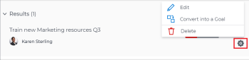
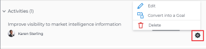

# Modification des résultats et des activités dans Objectifs Adobe Workfront

Une fois que votre administrateur ou administratrice Adobe Workfront vous a accordé l’accès correct aux Objectifs Adobe Workfront, vous pouvez créer et modifier des objectifs, des résultats et des activités.

Pour plus d’informations sur la création d’objectifs, de résultats et d’activités, consultez les articles suivants :

* [Créer des objectifs dans Objectifs Adobe Workfront](../../workfront-goals/goal-management/create-goals.md)
* [Commencer avec les résultats et les activités dans les Objectifs Adobe Workfront](../../workfront-goals/results-and-activities/get-started-with-results-and-activities.md)
* [Ajout de résultats aux objectifs dans Objectifs Adobe Workfront](../../workfront-goals/results-and-activities/add-results-to-goals.md)
* [Ajouter des activités aux objectifs dans Objectifs Adobe Workfront](../../workfront-goals/results-and-activities/add-activities-to-goals.md)

## Conditions d’accès

>[!NOTE]
>
>Votre entreprise peut choisir de continuer à utiliser les objectifs Adobe Workfront si elle a déjà acheté ce package par le passé. Pour plus de détails, contactez votre représentant de compte.
>
>Adobe Workfront Goals ne peut plus être acheté.

+++ Développez pour afficher les exigences d’accès aux fonctionnalités de cet article. 

<table style="table-layout:auto">
<col>
</col>
<col>
</col>
<tbody>
 <tr>
  <td> 
Package Adobe Workfront
 </td> 
   <td> 
   
Adobe Workfront Ultimate

   </td> 
  </tr>
 <tr>
 <td role="rowheader">Licence Adobe Workfront</td>
 <td>
 
Contributeur ou version ultérieure

Requête ou supérieure
</td>
 </tr>
  <tr>
 <td role="rowheader">Configuration du niveau d’accès</td>
 <td> 
Modifier l’accès aux Objectifs
 </td>
 </tr>
 <tr data-mc-conditions="">
 <td role="rowheader">Autorisations d’objet</td>
 <td>
  

  
Autorisations d’affichage ou de niveau supérieur sur l’objectif pour l’afficher

  
Autorisations de gestion sur l’objectif pour le modifier

  
 </td>
 </tr>
<tr>
   <td role="rowheader">
Modèle de mise en page
</td>
   <td> 
Un modèle de mise en page comprenant la zone Objectifs du menu principal doit être affecté à tous les utilisateurs, y compris les administrateurs système. 
  
</td>
  </tr>
</tbody>
</table>

Pour plus d’informations, voir [Conditions d’accès dans la documentation Workfront](/help/quicksilver/administration-and-setup/add-users/access-levels-and-object-permissions/access-level-requirements-in-documentation.md).

+++

<!--Old:
<table style="table-layout:auto">
<col>
</col>
<col>
</col>
<tbody>
 <tr> 
   <td role="rowheader">Adobe Workfront plan*</td> 
   <td> 
   
For the new plan and license structure:
  <ul><li>An Ultimate plan </li></ul>
   

For the current plan and license structure: 
<ul><li> A Pro or higher </li>
  <li>An Adobe Workfront Goals license in addition to a Workfront license.</li></ul>

   </td> 
  </tr>
 <tr>
 <td role="rowheader">Adobe Workfront license*</td>
 <td>
 
New license: Contributor or higher

 Or
 
Current license: Request or higher
 
For more information, see <a href="../../administration-and-setup/add-users/access-levels-and-object-permissions/wf-licenses.md" class="MCXref xref">Adobe Workfront licenses overview</a>.
 </td>
 </tr>
 <tr>
 <td role="rowheader">Product*</td>
 <td>
 
 New product requirement, one of the following: 

<ul>
<li>A Select or Prime Adobe Workfront plan and an additional Adobe Workfront Goals license.</li>
<li>An Ultimate Workfront plan which includes Workfront Goals by default. </li></ul>
 
Or

 
Current product requirement: A Workfront plan and an additional license for Adobe Workfront Goals. 
 
For information, see <a href="../../workfront-goals/goal-management/access-needed-for-wf-goals.md" class="MCXref xref">Requirements to use Workfront Goals</a>. 
 </td>
 </tr>
 <tr>
 <td role="rowheader">
Access level
</td>
 <td> 
Edit access to Goals
 </td>
 </tr>
 <tr data-mc-conditions="">
 <td role="rowheader">Object permissions</td>
 <td>
  

  
View or higher permissions to the goal to view it

  
Manage permissions to the goal to edit it

  
For information about sharing goals, see <a href="../../workfront-goals/workfront-goals-settings/share-a-goal.md" class="MCXref xref">Share a goal in Workfront Goals</a>. 

  
 </td>
 </tr>
 <tr>
   <td role="rowheader">
Layout template
</td>
   <td> 
All users, including Workfront administrators,  must be assigned a layout template that includes the Goals area in the Main Menu. 
  
</td>
  </tr>
</tbody>
</table>-->

## Remarques concernant la modification des résultats et des activités

<!--
According to Vazgen, access levels will add more considerations.)
-->

* Vous pouvez modifier les résultats et les activités qui appartiennent aux objectifs que vous avez créés ou aux objectifs que vous avez l’autorisation de gérer.
* Vous ne pouvez pas modifier la progression des projets liés aux objectifs en tant qu’activités des Objectifs Workfront. La progression du projet est mise à jour une fois les tâches du projet terminées. Vous pouvez supprimer des projets de l’objectif en les déconnectant. Pour plus d’informations, voir la section « Déconnexion de projets » de l’article [Supprimer des résultats, des activités et des projets des objectifs dans les Objectifs Adobe Workfront](../../workfront-goals/results-and-activities/remove-results-activities-from-goals.md).

  >[!NOTE]
  >
  >Si les informations de projet suivantes sont mises à jour au niveau du projet, les Objectifs Workfront les mettent automatiquement à jour au niveau de l’objectif :
  >
  >   
  >   
  >   * Propriétaire du projet
  >   * Nom du projet
  >   * Pourcentage terminé du projet
  >   
  >   
  >Pour plus d’informations sur la connexion des projets aux objectifs, voir [Ajouter des projets aux objectifs dans les Objectifs Adobe Workfront](../../workfront-goals/results-and-activities/connect-projects-to-goals-overview.md).

* Vous pouvez supprimer des résultats et des activités des objectifs lorsqu’ils ne sont plus pertinents pour la progression de l’objectif. Les résultats et activités supprimés ne peuvent pas être récupérés. Pour plus d’informations sur la suppression de résultats et d’activités, voir [Supprimer des résultats, des activités et des projets des objectifs dans les Objectifs Adobe Workfront](../../workfront-goals/results-and-activities/remove-results-activities-from-goals.md).
* Vous pouvez modifier les résultats et les activités associées aux objectifs pour n’importe quelle période, y compris dans le passé.
* La modification des résultats et des activités met à jour leurs paramètres et ne met pas à jour leur progression. Vous devez mettre à jour la progression des résultats et des activités. Pour plus d’informations sur la mise à jour de la progression des objectifs, des résultats et des activités, voir [Mettre à jour la progression des objectifs dans les Objectifs Adobe Workfront](../../workfront-goals/goal-review-and-workfront-goals-sections/check-in-goals.md).

## Modifier les résultats

<!--
Editing results differs depending on which environment you use.

### Edit results in the Production environment

1. Go to the goal for which you want to edit a result and click the goal name to open the **Goal Details** panel.
1. Click **Results**.
1. Click the **gear icon**  to the right of the result you want to edit.

   

1. Click **Edit** to edit the following information:

   | Field |Description|
   |---|---|
   | Name |The name of the result. |
   | Owner |The owner of result.  |
   | Value |How you measure the progress of the result. |
   | Initial |The original value of the result. |
   | Target |The desired value when the result is completed. |

1. Click **Save**.
-->

1. Cliquez sur l’icône **Menu principal** , puis **Objectifs**.
1. Dans la liste des objectifs, cliquez sur le nom d’un objectif pour ouvrir la page de l’objectif.
1. Cliquez sur **Indicateurs de progression** dans le panneau de gauche.
1. Sélectionnez un résultat dans la liste Indicateurs de progression et cliquez sur l’icône **Modifier** .

   La zone Modifier le résultat s’affiche.

   

1. Modifiez les informations suivantes :
   * **Nom du résultat** : nom du résultat. Utilisez un nom explicite qui illustre le résultat à obtenir pour atteindre l’objectif.
   * **Personne propriétaire du résultat** : personne propriétaire du résultat. La personne propriétaire doit être active sur Workfront.
   * **Type de valeur** : comment vous mesurez la progression du résultat.
   * **Valeur initiale** : valeur d’origine du résultat.
   * **Valeur cible** : valeur souhaitée une fois le résultat atteint.
Pour plus d’informations sur les champs de résultat, voir [Ajouter des résultats aux objectifs](../results-and-activities/add-results-to-goals.md).
1. Cliquer sur **Enregistrer**.

## Modifier des activités

<!--
Editing activities differs depending on which environment you use.

### Edit activities in the Production environment

>[!TIP]
>
>You cannot edit the Activity Type after you saved an activity on a goal.

1. Go to the goal for which you want to edit an activity and click the goal name to open the **Goal Details** panel.
1. Click **Activities**.
1. Click the **gear icon**  to the right of the activity you want to edit .

   

1. Click **Edit** to edit the following information:

   | Field |Description |
   |---|---|
   | Name |The name of the activity. |
   | Owner |The owner of activity.  |

1. Click **Save**.
-->

1. Cliquez sur l’icône **Menu principal** , puis **Objectifs**.
1. Dans la liste des objectifs, cliquez sur le nom d’un objectif pour ouvrir la page de l’objectif.
1. Cliquez sur **Indicateurs de progression** dans le panneau de gauche.
1. Sélectionnez une activité dans la liste Indicateurs de progression , puis cliquez sur l’icône **Modifier** .

   La boîte de dialogue Modifier l’activité s’ouvre.

   

1. Modifiez les informations suivantes :

   * **Nom de l’activité** : nom de l’activité. Utilisez un nom explicite qui illustre l’activité que vous devez exécuter pour indiquer que l’objectif va être atteint.
   * **Personne propriétaire de l’activité :**: personne propriétaire de l’activité. La personne propriétaire doit être active sur Workfront.

   Pour plus d’informations sur les champs d’activité, voir [Ajouter des activités aux objectifs](../results-and-activities/add-activities-to-goals.md).

1. Cliquer sur **Enregistrer**.
