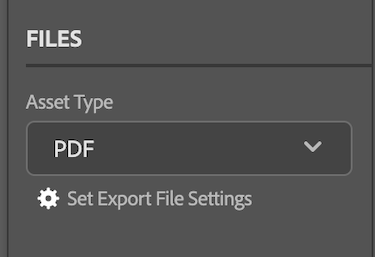

# Charger des documents et des épreuves d’[!DNL Adobe Workfront plugin] à [!DNL Creative Cloud]

Vous pouvez charger vos projets sous forme de documents pour un examen et une approbation rapides ou simplement pour les stocker dans [!DNL Adobe Workfront].

>[!NOTE]
>
>Charger des documents et des épreuves n’est pas pris en charge actuellement dans Premiere Pro et After Effects.

## Limites du document

Cette section décrit les limites connues des documents dans [!DNL Workfront for Adobe Creative Cloud plugins].

### Les nouvelles versions des documents autorisent le chargement d’un fichier uniquement.

Compte tenu du fait que les documents [!DNL Workfront] ne peuvent pas contenir plusieurs fichiers, certains paramètres doivent être désactivés pour charger de nouvelles versions de documents vers Workfront.

>[!NOTE]
>
>Si vous devez générer plusieurs fichiers, vous pouvez créer une épreuve à la place. La nouvelle épreuve ne sera pas associée au document d’origine.

Pour revenir à un fichier unique dans [!DNL InDesign], procédez comme suit :

1. Ouvrez la boîte de dialogue **Définir des paramètres d’export de fichier**.

   

1. Recherchez le type de ressource que vous souhaitez exporter et ajustez les paramètres comme décrit ci-dessous :

   <table>
    <tr>
    <td><strong>PDF et PDF-PRINT</strong>
    </td>
    <td>Désélectionnez <strong>Créer des fichiers PDF séparés</strong>.
    </td>
    </tr>
    <tr>
    <td><strong>EPS</strong>
    </td>
    <td>Sélectionnez <strong>Plages</strong> et saisissez un numéro de page unique. 
    

    <strong>Note</strong> : si vous souhaitez charger le document complet, vous devez créer une épreuve. 
    </td>
    </tr>
    <tr>
    <td><strong>EPUB et EPUB-FIXED</strong>
    </td>
    <td>Aucun ajustement n’est nécessaire.
    </td>
    </tr>
    <tr>
    <td><strong>IDML</strong>
    </td>
    <td>Aucun ajustement n’est nécessaire.
    </td>
    </tr>
    <tr>
    <td><strong>JPG</strong>
    </td>
    <td>Sélectionnez <strong>Plages</strong> et saisissez un numéro de page unique. 
    

    <strong>Note</strong> : si vous souhaitez charger le document complet, vous devez créer une épreuve. 
    </td>
    </tr>
    <tr>
    <td><strong>PNG</strong>
    </td>
    <td>Sélectionnez <strong>Plages</strong> et saisissez un numéro de page unique. 
    

    <strong>Note</strong> : si vous souhaitez charger le document complet, vous devez créer une épreuve. 
    </td>
    </tr>
    <tr>
    <td><strong>XML</strong>
    </td>
    <td>Aucun ajustement n’est nécessaire. 
    </td>
    </tr>
    </table>
