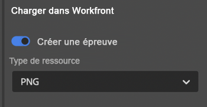

# Téléchargement de BAT à partir de [!DNL Illustrator]

Vous pouvez charger vos tableaux d’art en tant que bons à tirer directement vers [!DNL Adobe Workfront] pour une révision et une approbation approfondies.

## Exigences d’accès

Vous devez disposer des accès suivants pour effectuer les étapes de cet article :

<table style="table-layout:auto"> 
 <col> 
 <col> 
 <tbody> 
 <tr> 
   <td role="rowheader">[!DNL Adobe Workfront] plan*</td> 
   <td> 
Formule actuelle : [!UICONTROL Pro] ou version ultérieure
 
ou
 
Plan hérité : [!UICONTROL Premium]
 
Pour plus d’informations sur la vérification de l’accès avec les différents plans, voir .
 </td> 
  </tr> 
  <tr> 
   <td role="rowheader">[!DNL Adobe Workfront] license*</td> 
   <td> 
Formule actuelle : [!UICONTROL Work] ou [!UICONTROL Proof]
 
Plan hérité : N’importe quel (la vérification doit être activée pour l’utilisateur)
 </td> 
  </tr> 
  <tr> 
   <td role="rowheader">Produit</td> 
   <td>Vous devez disposer d’un [!DNL Adobe Creative Cloud] en plus d’une [!DNL Workfront] licence.</td> 
  </tr> 
  <tr> 
   <td role="rowheader">Profil d'autorisation pour l'épreuve </td> 
   <td>[!UICONTROL Manager] ou version ultérieure</td> 
  </tr> 
  <tr> 
   <td role="rowheader">Autorisations d’objet</td> 
   <td> 
Modifier l’accès aux [!UICONTROL Documents]
 
Pour plus d’informations sur la demande d’accès supplémentaire, voir <a href="../../workfront-basics/grant-and-request-access-to-objects/request-access.md" class="MCXref xref">Demande d’accès aux objets </a>.
 </td> 
  </tr> 
 </tbody> 
</table>

&#42;Pour savoir quel plan, rôle ou profil d’autorisation de BAT vous avez, contactez votre [!DNL Workfront] ou [!DNL Workfront Proof] administrateur.

## Conditions préalables

* Vous devez installer le [!DNL Adobe Workfront for design and video] avant de pouvoir télécharger des bons à tirer à partir de [!DNL Illustrator].

   Pour obtenir des instructions, voir [Installer [!DNL Adobe Workfront for design and video]](/help/quicksilver/workfront-integrations-and-apps/adobe-workfront-for-creative-cloud/wf-install-cc.md).

## Téléchargement d’un bon à tirer de base

1. Cliquez sur le bouton **[!UICONTROL Menu]** dans le coin supérieur droit, puis sélectionnez **[!UICONTROL Liste de tâches]**. Vous pouvez également utiliser le menu pour accéder aux objets parents.

   

1. Accédez à l’élément de travail dans lequel vous souhaitez charger un BAT.
1. Cliquez sur le bouton **[!UICONTROL Document]** icon  dans la barre de navigation.
1. Cliquez sur **[!UICONTROL Nouveau fichier]** près du bas du module externe.
1. Activez la variable **[!UICONTROL Créer un BAT]** bascule.
1. Choisissez la **[!UICONTROL Type de ressource]** dans le menu déroulant.

   

1. Dans le **[!UICONTROL Approbations des BAT]** , sélectionnez **[!UICONTROL De base]**.
1. (Facultatif) Ajoutez des approbateurs.
1. (Facultatif) Saisissez un commentaire dans le champ **[!UICONTROL Mises à jour]** zone.

   

1. (Facultatif) Saisissez un nom pour le BAT dans le champ **[!UICONTROL Nom du BAT]** zone de texte.
1. (Facultatif) Sélectionnez **[!UICONTROL Ajouter un fichier externe]** pour ajouter un fichier de votre ordinateur.
1. Cliquez sur **[!UICONTROL Télécharger]**, puis configurez les options d’exportation souhaitées en fonction du type de ressource sélectionné ci-dessus.

   \
   Le document apparaît dans la [!UICONTROL Documents] dans le module externe et l’appli de bureau.

## Téléchargement d’un BAT automatisé

1. Cliquez sur le bouton **[!UICONTROL Menu]** dans le coin supérieur droit, puis sélectionnez **[!UICONTROL Liste de tâches]**. Vous pouvez également utiliser le menu pour accéder aux objets parents.

   

1. Accédez à l’élément de travail dans lequel vous souhaitez charger un BAT.
1. Cliquez sur le bouton **[!UICONTROL Document]** icon  dans la barre de navigation.

1. Cliquez sur **[!UICONTROL Nouveau fichier]** près du bas du module externe.
1. Activez la variable **[!UICONTROL Créer un BAT]** bascule, puis sélectionnez l’option **[!UICONTROL Type de ressource]** dans le menu déroulant.

   

1. Dans le **[!UICONTROL Approbations des BAT]** , sélectionnez **[!UICONTROL Automatique]**.
1. (Facultatif) Dans le **[!UICONTROL Modèle de workflow]** saisissez le nom d&#39;un modèle de workflow de BAT.
<!--
{{adjust-proof-settings}}
-->
1. (Facultatif) Saisissez un commentaire dans le champ **[!UICONTROL Mises à jour]** zone.

    <!-- new screenshot -->

1. (Facultatif) Saisissez un nom pour le BAT dans le champ **[!UICONTROL Nom du BAT]** zone de texte.
1. (Facultatif) Sélectionnez **[!UICONTROL Ajouter un fichier externe]** pour ajouter un fichier de votre ordinateur.
1. Cliquez sur **[!UICONTROL Télécharger]**, puis configurez les options d’exportation souhaitées en fonction du type de ressource sélectionné ci-dessus.

   \
   Le document apparaît dans la [!UICONTROL Documents] dans le module externe et l’appli de bureau.

## Télécharger une nouvelle version du BAT

Vous pouvez télécharger une nouvelle version d’un BAT. Le module externe mémorise le workflow de vérification défini sur la version précédente, mais vous pouvez le modifier si vous le souhaitez.

1. Cliquez sur le bouton **[!UICONTROL Menu]** dans le coin supérieur droit, puis sélectionnez **[!UICONTROL Liste de tâches]**. Vous pouvez également utiliser le menu pour accéder aux objets parents.

   

1. Accédez à l’élément de travail sur lequel vous devez charger un document.
1. Cliquez sur le bouton **[!UICONTROL Document]** icon dans la barre de navigation.

1. Cliquez sur **[!UICONTROL Nouvelle version]** près du bas du module externe.
1. Choisissez la **[!UICONTROL Type de ressource]** dans le menu déroulant.
1. Activez la variable **[!UICONTROL Créer un BAT]** bascule, puis sélectionnez l’option **[!UICONTROL Type de ressource]** dans le menu déroulant.

   

1. Dans le *[!UICONTROL *Validation des BAT]** , choisissez **[!UICONTROL De base]** ou **[!UICONTROL Automatique]**.

1. Ajouter **[!UICONTROL Réviseurs]** ou **[!UICONTROL Modèle de workflow]** en fonction du type de validation sélectionné à l&#39;étape 7.

1. (Facultatif) Saisissez un commentaire dans le champ **[!UICONTROL Mises à jour]** zone.
1. Cliquez sur **[!UICONTROL Télécharger]**, puis configurez les options d’exportation souhaitées en fonction du type de ressource sélectionné ci-dessus.
Le document apparaît dans la [!UICONTROL Documents] dans le module externe et l’appli de bureau.
