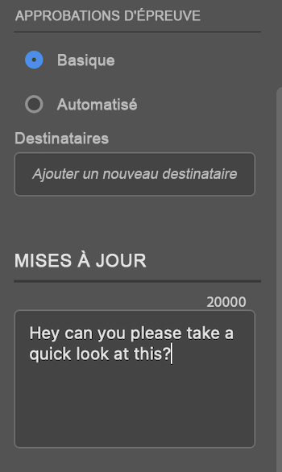

# Téléchargement de BAT depuis [!DNL InDesign]

Vous pouvez télécharger vos tableaux d’art en tant que bons à tirer directement vers [!DNL Adobe Workfront] pour une révision et une approbation approfondies.

## Conditions d’accès

+++ Développez pour afficher les exigences d’accès aux fonctionnalités de cet article.

Vous devez disposer des accès suivants pour effectuer les étapes de cet article :

<table style="table-layout:auto"> 
 <col> 
 <col> 
 <tbody> 
 <tr> 
   <td role="rowheader">[!DNL Adobe Workfront] forfait*</td> 
   <td> 
Formule actuelle : [!UICONTROL Pro] ou version ultérieure
 
ou
 
Formule héritée : [!UICONTROL Premium]
 
Pour plus d’informations sur la vérification de l’accès avec les différents plans, voir .
 </td> 
  </tr> 
  <tr> 
   <td role="rowheader">[!DNL Adobe Workfront] licence*</td> 
   <td> 
Plan actuel : [!UICONTROL Travail] ou [!UICONTROL Preuve]
 
Formule héritée : Toutes (la vérification doit être activée pour l’utilisateur).
 </td> 
  </tr> 
  <tr> 
   <td role="rowheader">Produit</td> 
   <td>Vous devez disposer d’une licence [!DNL Adobe Creative Cloud] en plus d’une licence [!DNL Workfront].</td> 
  </tr> 
  <tr> 
   <td role="rowheader">Profil d'autorisation pour l'épreuve </td> 
   <td>[!UICONTROL Manager] ou version ultérieure</td> 
  </tr> 
  <tr> 
   <td role="rowheader">Autorisations d’objet</td> 
   <td> 
Modifier l’accès aux [!UICONTROL Documents]
 
Pour plus d’informations sur la demande d’accès supplémentaire, voir <a href="../../workfront-basics/grant-and-request-access-to-objects/request-access.md" class="MCXref xref">Demander l’accès aux objets</a>.
 </td> 
  </tr> 
 </tbody> 
</table>

&#42;Pour savoir quel plan, rôle ou profil d’autorisation de BAT vous avez, contactez votre administrateur [!DNL Workfront] ou [!DNL Workfront Proof].

+++

## Conditions préalables

* Vous devez installer le module externe [!DNL Adobe Workfront for design and video] avant de pouvoir télécharger des bons à tirer depuis [!DNL InDesign].

  Pour obtenir des instructions, voir [Installation [!DNL Adobe Workfront for design and video]](/help/quicksilver/workfront-integrations-and-apps/adobe-workfront-for-creative-cloud/wf-install-cc.md).

## Téléchargement d’un bon à tirer de base

1. Cliquez sur l’icône **[!UICONTROL Menu]** dans le coin supérieur droit, puis sélectionnez **[!UICONTROL Liste de travail]**. Vous pouvez également utiliser le menu pour accéder aux objets parents.

   

1. Accédez à l’élément de travail dans lequel vous souhaitez charger un BAT.
1. Cliquez sur l’icône **[!UICONTROL Document]**  dans la barre de navigation.
1. Cliquez sur **[!UICONTROL New File]** près du bas du module externe.
1. Activez le bouton bascule **[!UICONTROL Créer un BAT]** .
1. (Facultatif) Saisissez un nom pour le BAT dans la zone de texte **[!UICONTROL Nom du BAT]**.
1. Dans la section **[!UICONTROL Approbations de BAT]**, sélectionnez **[!UICONTROL De base]**.
1. (Facultatif) Ajoutez des approbateurs.
1. (Facultatif) Saisissez un commentaire dans la zone **[!UICONTROL Mises à jour]**.

   

1. Sélectionnez le **[!UICONTROL Type de ressource]** dans le menu déroulant.

1. (Facultatif) Sélectionnez **[!UICONTROL Ajouter un fichier externe]** pour ajouter un fichier depuis votre ordinateur.
1. Cliquez sur **[!UICONTROL Télécharger]**, puis configurez les options d’exportation de votre choix en fonction du type de ressource sélectionné ci-dessus.

   \
   Le document apparaît dans la zone [!UICONTROL Documents] du module externe et de l’appli de bureau.

## Téléchargement d’un BAT automatisé

1. Cliquez sur l’icône **[!UICONTROL Menu]** dans le coin supérieur droit, puis sélectionnez **[!UICONTROL Liste de travail]**. Vous pouvez également utiliser le menu pour accéder aux objets parents.

   

1. Accédez à l’élément de travail dans lequel vous souhaitez charger un BAT.
1. Cliquez sur l’icône **[!UICONTROL Document]**  dans la barre de navigation.

1. Cliquez sur **[!UICONTROL New File]** près du bas du module externe.
1. Activez le bouton bascule **[!UICONTROL Créer un BAT]** .
1. (Facultatif) Saisissez un nom pour le BAT dans la zone de texte **[!UICONTROL Nom du BAT]**.
1. Dans la section **[!UICONTROL Approbations de BAT]**, sélectionnez **[!UICONTROL Automatisé]**.
1. (Facultatif) Dans la zone **[!UICONTROL Modèle de workflow]**, saisissez le nom d’un modèle de workflow de BAT.

{{adjust-proof-settings}}

>[!NOTE]
>
> S’il existe des champs obligatoires vides dans le modèle de workflow, les paramètres de BAT automatisés s’ouvrent automatiquement et vous devez renseigner ces champs pour télécharger le BAT.

1. (Facultatif) Saisissez un commentaire dans la zone **[!UICONTROL Mises à jour]**.

   

1. Sélectionnez le **[!UICONTROL Type de ressource]** dans le menu déroulant.
1. (Facultatif) Sélectionnez **[!UICONTROL Ajouter un fichier externe]** pour ajouter un fichier depuis votre ordinateur.
1. Cliquez sur **[!UICONTROL Télécharger]**, puis configurez les options d’exportation de votre choix en fonction du type de ressource sélectionné ci-dessus.
Le document apparaît dans la zone [!UICONTROL Documents] du module externe et de l’appli de bureau.

## Télécharger une nouvelle version du BAT

Vous pouvez télécharger une nouvelle version d’un BAT. Le module externe mémorise le workflow de vérification défini sur la version précédente, mais vous pouvez le modifier si vous le souhaitez.

1. Cliquez sur l’icône **[!UICONTROL Menu]** dans le coin supérieur droit, puis sélectionnez **[!UICONTROL Liste de travail]**. Vous pouvez également utiliser le menu pour accéder aux objets parents.

   

1. Accédez à l’élément de travail sur lequel vous devez charger un document.
1. Cliquez sur l&#39;icône **[!UICONTROL Document]**  dans la barre de navigation.

1. Cliquez sur **[!UICONTROL Nouvelle version]** près du bas du module externe.
1. Activez le bouton bascule **[!UICONTROL Créer un BAT]** .

1. Dans la section *[!UICONTROL *Approbations de BAT]**, sélectionnez **[!UICONTROL De base]** ou **[!UICONTROL Automatisée]**.

1. Ajoutez **[!UICONTROL Réviseurs]** ou un **[!UICONTROL Modèle de workflow]** en fonction du type d’approbation que vous avez sélectionné à l’étape 7.

1. (Facultatif) Saisissez un commentaire dans la zone **[!UICONTROL Mises à jour]**.
1. Sélectionnez le **[!UICONTROL Type de ressource]** dans le menu déroulant.
1. Cliquez sur **[!UICONTROL Télécharger]**, puis configurez les options d’exportation de votre choix en fonction du type de ressource sélectionné ci-dessus.
Le document apparaît dans la zone [!UICONTROL Documents] du module externe et de l’appli de bureau.
