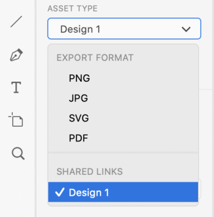

# Charger des plans de travail [!DNL XD] en tant qu’épreuves sur [!DNL Workfront]

Vous pouvez charger vos plans de travail en tant qu’épreuves directement sur [!DNL Adobe Workfront] pour une révision et une approbation approfondies.

## Conditions d’accès

+++ Développez pour afficher les exigences d’accès aux fonctionnalités de cet article.

Vous devez disposer des accès suivants pour effectuer les étapes de cet article :

<table style="table-layout:auto"> 
 <col> 
 <col> 
 <tbody> 
  <tr> 
   <td role="rowheader">[!DNL Adobe Workfront] formule*</td> 
   <td> 
Formule actuelle : [!UICONTROL Pro] ou version ultérieure
 
ou
 
Formule héritée : [!UICONTROL Premium]
 
Pour plus d’informations sur l’accès en relecture avec les différentes formules, voir .
 </td> 
  </tr> 
  <tr> 
   <td role="rowheader">[!DNL Adobe Workfront] licence*</td> 
   <td> 
Formule actuelle : [!UICONTROL Work] ou [!UICONTROL Proof]
 
Plan hérité : n’importe lequel (la relecture doit être activée pour l’utilisateur ou l’utilisatrice)
 </td> 
  </tr> 
  <tr> 
   <td role="rowheader">Produit</td> 
   <td>Vous devez disposer d’une licence [!DNL Adobe Creative Cloud] en plus d’une licence [!DNL Workfront].</td> 
  </tr> 
  <tr> 
   <td role="rowheader">Profil d'autorisation pour l'épreuve </td> 
   <td>[!UICONTROL Manager] ou version supérieure</td> 
  </tr> 
  <tr> 
   <td role="rowheader">Autorisations d’objet</td> 
   <td> 
Modifier l’accès aux [!UICONTROL Documents]
 
Pour plus d’informations sur la demande d’accès supplémentaire, consultez la section <a href="../../workfront-basics/grant-and-request-access-to-objects/request-access.md" class="MCXref xref">Demander l’accès aux objets</a>.
 </td> 
  </tr> 
 </tbody> 
</table>

&#42;Pour connaître le plan, rôle ou profil d’autorisation d’épreuve dont vous disposez, contactez l’administration [!DNL Workfront] ou [!DNL Workfront Proof].

+++

## Conditions préalables

* Vous devez installer le plug-in [!DNL Adobe Workfront for XD] avant de pouvoir charger des épreuves sur [!DNL Adobe XD].

  Pour obtenir des instructions, consultez la section [Installer [!DNL Adobe Workfront for XD]](/help/quicksilver/workfront-integrations-and-apps/adobe-workfront-for-creative-cloud/wf-adobe-xd-install.md).

## Charger une épreuve statique

1. Cliquez sur le bouton **[!UICONTROL Menu]** dans le coin supérieur droit, puis sélectionnez **[!UICONTROL Liste de travail]**. Vous pouvez également utiliser le menu pour accéder aux objets parents.

   

1. Accédez à l’élément de travail dans lequel vous souhaitez charger une épreuve statique.
1. Cliquez sur l’icône **[!UICONTROL Document]**  dans la barre de navigation.

1. Cliquez sur **[!UICONTROL Nouveau fichier]** au bas du plug-in.
1. Sélectionnez les plans de travail que vous souhaitez charger.

   >[!TIP]
   >
   >* Les plans de travail s’affichent dans l’épreuve suivant l’ordre de sélection. Le premier plan de travail sélectionné constituera la première page de l’épreuve, etc.
   >* Pour sélectionner rapidement plusieurs plans de travail, cliquez et faites glisser la souris sur les plans de travail souhaités. Cela ne vous permet pas de contrôler l’ordre des plans de travail dans l’épreuve.

1. Cochez **[!UICONTROL Créer une épreuve]**.

1. Nommez l’épreuve.

1. Choisissez le type d’approbation de l’épreuve que vous souhaitez :

   <table style="table-layout:auto"> 
    <col> 
    <col> 
    <tbody> 
     <tr> 
      <td role="rowheader">[!UICONTROL Basic] : </td> 
      <td> 
Les processus d’approbation de base sont ad hoc et peuvent inclure différentes personnes chargées de la révision selon les besoins : 
 
       <ul> 
        <li> 
(Facultatif) Ajoutez des <strong>Approbateurs et approbatrices</strong> dans la zone.
 </li> 
       </ul> </td> 
     </tr> 
     <tr> 
      <td role="rowheader">[!UICONTROL Automated]</td> 
      <td> 
Les processus d’approbation automatisée sont préconfigurés par l’équipe d’administration et incluent des réviseurs et réviseuses et des étapes spécifiques. Pour plus d’informations, consultez la section <a href="../../review-and-approve-work/proofing/proofing-overview/automated-workflow.md" class="MCXref xref">Vue d’ensemble des workflows automatisés</a>.
 
       <ul> 
        <li> 
Sélectionnez un [!UICONTROL Workflow Template] dans le menu déroulant.
 </li> 
       </ul> </td> 
     </tr> 
    </tbody> 
   </table>

{{adjust-proof-settings}}

1. (Facultatif) Apportez un commentaire dans la zone **[!UICONTROL Mises à jour]**.

   

1. Choisissez le format d’export dans le menu déroulant **[!UICONTROL Type de ressource]**.

1. (Facultatif) Si vous sélectionnez le type de ressource PDF et que plusieurs plans de travail sont sélectionnés, choisissez si vous souhaitez exporter vos plans de travail en tant que **[!UICONTROL Fichiers PDF uniques]** ou en tant que **[!UICONTROL Plusieurs fichiers PDF]**.

1. (Facultatif) Nommez le PDF.

   

1. Cliquez sur **[!UICONTROL Charger]**.\
   Le document apparaît dans la zone [!UICONTROL Documents] dans le plug-in et l’application de bureau.

## Charger une épreuve interactive {#upload-an-interactive-proof}

Vous pouvez créer une épreuve interactive pour vos tableaux de bord à l’aide du plug-in [!DNL Workfront for Adobe]. Il s’agit d’un processus en 2 étapes. Vous devez d’abord créer un lien interactif, puis charger l’épreuve dans un élément de travail.

### Créer un lien interactif pour votre plan de travail  {#create-an-interactive-link-for-your-art-board}

1. Ouvrez votre plan de travail, puis cliquez sur **[!UICONTROL Partager]** dans la zone supérieure gauche de l’écran.
1. Indiquez les paramètres du lien :

   1. Nommez le lien.
   1. Choisissez un paramètre de vue.
   1. Dans la section **[!UICONTROL Lier l’accès]**, assurez-vous que l’option **[!UICONTROL Toute personne disposant de ce lien]** est sélectionnée.

      Vous devez activer ce type d’accès pour générer une épreuve interactive.

   1. Cliquez sur **[!UICONTROL Créer un lien]**.

1. Revenez à **[!UICONTROL Conception]** dans la zone supérieure gauche de l’écran. Passez à la section [Charger une épreuve interactive](#upload-an-interactive-proof) ci-dessous.

   >[!NOTE]
   >
   >Vous devrez peut-être rouvrir le panneau du plug-in dans le coin inférieur gauche de l’écran.

### Charger une épreuve interactive

1. Cliquez sur l’icône **[!UICONTROL Menu]** dans le coin supérieur droit, puis sélectionnez **[!UICONTROL Liste de travail]**. Vous pouvez également utiliser le menu pour accéder aux objets parents.

   

1. Accédez à l’élément de travail dans lequel vous souhaitez charger une épreuve interactive.
1. Cliquez sur l’icône **[!UICONTROL Document]**  dans la barre de navigation.

1. Cliquez sur **[!UICONTROL Nouveau fichier]** près du bas du plug-in.
1. Activez **[!UICONTROL Créer une épreuve]**.

1. Choisissez le type d’approbation de l’épreuve que vous souhaitez :

   <table style="table-layout:auto"> 
    <col> 
    <col> 
    <tbody> 
     <tr> 
      <td role="rowheader">[!UICONTROL Basic] : </td> 
      <td> 
Les processus d’approbation de base sont ad hoc et peuvent inclure différentes personnes chargées de la révision selon les besoins : 
 
       <ul> 
        <li> 
(Facultatif) Ajoutez des <strong>Approbateurs et approbatrices</strong> dans la zone.
 </li> 
       </ul> </td> 
     </tr> 
     <tr> 
      <td role="rowheader">[!UICONTROL Automated]</td> 
      <td> 
Les processus d’approbation automatisée sont préconfigurés par l’équipe d’administration et incluent des réviseurs et réviseuses et des étapes spécifiques. Pour plus d’informations, consultez la section <a href="../../review-and-approve-work/proofing/proofing-overview/automated-workflow.md" class="MCXref xref">Vue d’ensemble des workflows automatisés</a>.
 
       <ul> 
        <li> 
Sélectionnez un [!UICONTROL Workflow Template] dans le menu déroulant.
 </li> 
       </ul> </td> 
     </tr> 
    </tbody> 
   </table>

{{adjust-proof-settings}}

1. (Facultatif) Saisissez un commentaire dans la zone **[!UICONTROL Mises à jour]**.

   

1. Dans le menu déroulant **[!UICONTROL Type de ressource]**, sélectionnez le lien que vous venez de créer sous l’onglet **Liens partagés**. Pour plus d’informations, voir [Créer un lien interactif pour votre plan de travail](#create-an-interactive-link-for-your-artboard).\
   

1. Cliquez sur **[!UICONTROL Charger]**.

   Le document apparaît dans la zone [!UICONTROL Documents] dans le plug-in et l’application de bureau.

   >[!IMPORTANT]
   >
   >Les personnes doivent avoir accès à la [!UICONTROL visionneuse de relecture de bureau] pour réviser et approuver les épreuves interactives. Pour plus d’informations, consultez [Installer la [!UICONTROL visionneuse de relecture de bureau]](../../review-and-approve-work/proofing/use-the-desktop-proofing-viewer/installing-desktop-proofing-viewer.md).

## Charger une nouvelle version d’épreuve

Vous pouvez charger une nouvelle version d’une épreuve. Le plug-in conserve en mémoire le workflow de relecture défini sur la version précédente, mais vous pouvez modifier ce paramètre si vous le souhaitez.

1. Cliquez sur l’cône **[!UICONTROL Menu]** dans le coin supérieur droit, puis sélectionnez **[!UICONTROL Liste de travail]**. Vous pouvez également utiliser le menu pour accéder aux objets parents.

   

1. Accédez à l’élément de travail dans lequel vous devez charger un document.
1. Cliquez sur l’icône **[!UICONTROL Document]**  dans la barre de navigation.

1. Cliquez sur **[!UICONTROL Nouvelle version]** près du bas du plug-in.
1. Activez **[!UICONTROL Créer une épreuve]**.
1. Sélectionnez les plans de travail que vous souhaitez charger.

   >[!NOTE]
   >
   >Si vous souhaitez charger une nouvelle version d’un fichier .svg, .png ou .jpg, vous ne pouvez charger qu’un seul plan de travail.

1. Choisissez le type d’approbation de l’épreuve que vous souhaitez :

   <table style="table-layout:auto"> 
    <col> 
    <col> 
    <tbody> 
     <tr> 
      <td role="rowheader">[!UICONTROL Basic] : </td> 
      <td> 
Les processus d’approbation de base sont ad hoc et peuvent inclure différentes personnes chargées de la révision selon les besoins : 
 
       <ul> 
        <li> 
(Facultatif) Ajoutez des <strong>Approbateurs et approbatrices</strong> dans la zone.
 </li> 
       </ul> </td> 
     </tr> 
     <tr> 
      <td role="rowheader">[!UICONTROL Automated]</td> 
      <td> 
Les processus d’approbation automatisée sont préconfigurés par l’équipe d’administration et incluent des réviseurs et réviseuses et des étapes spécifiques. Pour plus d’informations, consultez la section <a href="../../review-and-approve-work/proofing/proofing-overview/automated-workflow.md" class="MCXref xref">Vue d’ensemble des workflows automatisés</a>.
 
       <ul> 
        <li> 
Sélectionnez un [!UICONTROL Workflow Template] dans le menu déroulant.
 </li> 
       </ul> </td> 
     </tr> 
    </tbody> 
   </table>

{{adjust-proof-settings}}

1. Choisissez le format d’export dans le menu déroulant **[!UICONTROL Type de ressource]**.

   

1. (Facultatif) Saisissez un commentaire dans la zone **[!UICONTROL Mises à jour]**.

   

1. (Facultatif) Si vous sélectionnez PDF comme type de ressource et que plusieurs plans de travail sont sélectionnés, choisissez si vous souhaitez exporter vos plans de travail en tant que **[!UICONTROL Fichiers PDF uniques]** ou **[!UICONTROL Plusieurs fichiers PDF]**.

1. (Facultatif) Nommez le PDF.

   

1. Cliquez sur **[!UICONTROL Charger]**.\
   Le document apparaît dans la zone [!UICONTROL Documents] dans le plug-in et l’appli de bureau.
