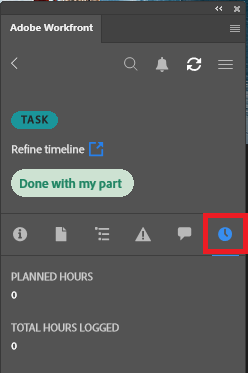

# Consigner le temps en utilisant le plug-in [!DNL Adobe Workfront]

Vous pouvez consigner le temps consacré aux projets, aux tâches et aux problèmes sur lesquels vous travaillez directement dans l’une des applications [!DNL Adobe Creative Cloud] suivantes :

{{cc-app-list}}

## Conditions d’accès

+++ Développez pour afficher les exigences d’accès aux fonctionnalités de cet article.

<table style="table-layout:auto"> 
 <col> 
 <col> 
 <tbody> 
  <tr> 
  <!--
   <td role="rowheader">[!DNL Adobe Workfront] package</td> 
   <td> Any</td> 
  </tr> 
  <tr data-mc-conditions=""> 
   <td role="rowheader">[!DNL Adobe Workfront] license</td> 
   <td>
   
Standard

    
Work or higher
 </td> 
  </tr>
  -->
  <tr> 
   <td role="rowheader">Produits supplémentaires</td> 
   <td>Vous devez disposer d’une licence [!DNL Adobe Creative Cloud] en plus d’une licence [!DNL Workfront].</td> 
  </tr> 
  <tr> 
   <td role="rowheader">Configurations des niveaux d’accès</td> 
   <td> 
Accès en [!UICONTROL Edit] aux tâches ou aux problèmes
</td> 
  </tr> 
  <tr> 
   <td role="rowheader">Autorisations d’objet</td> 
   <td> 
Autorisation de [!UICONTROL Log Hours] pour la tâche ou le problème
 </td> 
  </tr> 
 </tbody> 
</table>

Pour plus d’informations, voir [Conditions d’accès requises dans la documentation Workfront](/help/quicksilver/administration-and-setup/add-users/access-levels-and-object-permissions/access-level-requirements-in-documentation.md).

+++

## Conditions préalables

{{cc-install-prereq}}

## Consigner le temps à l’aide du plugin Adobe Workfront

L’administrateur ou l’administratrice [!DNL Workfront] détermine quels types d’heures spécifiques au projet sont disponibles, comme décrit dans [Gérer les types d’heures](../../administration-and-setup/set-up-workfront/configure-timesheets-schedules/hour-types.md).

Pour consigner le temps à l’aide du plug-in Workfront :

1. Cliquez sur l’cône **[!UICONTROL Menu]** dans le coin supérieur droit, puis sélectionnez **[!UICONTROL Liste de travail]**. Vous pouvez également utiliser le menu pour accéder aux objets parents.

   

1. Dans la **[!UICONTROL liste de travail]**, sélectionnez l’élément de travail pour lequel vous souhaitez consigner le temps.
1. Vous pouvez aussi cliquer sur **[!UICONTROL Temps]** dans la barre de navigation.

   

1. (Facultatif) Choisissez le **[!UICONTROL type d’heure]** dans le menu déroulant.
1. Saisissez le temps en heures pour le jour souhaité.

   

1. Cliquez sur **[!UICONTROL Soumettre]**.
