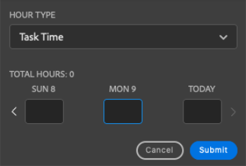

# Temps de connexion à l’aide de la variable [!DNL Adobe Workfront] plugin

Vous pouvez consigner le temps de connexion des projets, tâches et problèmes sur lesquels vous travaillez directement dans l’une des méthodes suivantes : [!DNL Adobe Creative Cloud] applications :

{{cc-app-list}}

## Exigences d’accès

Vous devez disposer des accès suivants pour effectuer les étapes de cet article :

<table style="table-layout:auto"> 
 <col> 
 <col> 
 <tbody> 
  <tr> 
   <!--<td role="rowheader">[!DNL Adobe Workfront] plan*</td> 
   <td> 
[!UICONTROL Pro] or higher
 </td> 
  </tr> 
  <tr data-mc-conditions=""> 
   <td role="rowheader">[!DNL Adobe Workfront] license*</td> 
   <td> 
[!UICONTROL Work] or [!UICONTROL Plan]
 </td> 
  </tr> 
  <tr> 
   <td role="rowheader">Product</td> 
   <td>You must have an [!DNL Adobe Creative Cloud] license in addition to a [!DNL Workfront] license.</td> 
  </tr> -->
  <tr> 
   <td role="rowheader">Paramétrages du niveau d'accès*</td> 
   <td> 
Accès à [!UICONTROL Modifier] à des tâches ou à des problèmes
 
Remarque : Si vous n’avez toujours pas accès à , demandez à votre [!DNL Workfront] s’ils définissent des restrictions supplémentaires au niveau de votre accès. Pour plus d’informations sur la manière dont une [!DNL Workfront] l’administrateur peut modifier votre niveau d’accès, voir <a href="../../administration-and-setup/add-users/configure-and-grant-access/create-modify-access-levels.md" class="MCXref xref">Création ou modification de niveaux d’accès personnalisés</a>.
 </td> 
  </tr> 
  <tr> 
   <td role="rowheader">Autorisations d’objet</td> 
   <td> 
Autorisation [!UICONTROL Heures de journal] pour la tâche ou le problème
 
Pour plus d’informations sur la demande d’accès supplémentaire, voir <a href="../../workfront-basics/grant-and-request-access-to-objects/request-access.md" class="MCXref xref">Demande d’accès aux objets </a>.
 </td> 
  </tr> 
 </tbody> 
</table>

&#42;Pour connaître le plan, le type de licence ou l’accès dont vous disposez, contactez votre [!DNL Workfront] administrateur.

## Conditions préalables

{{cc-install-prereq}}

## Temps de connexion à l’aide du module externe Adobe Workfront

Le [!DNL Workfront] L’administrateur détermine les types d’heures spécifiques au projet disponibles, comme décrit dans la section [Gestion des types d’heures](../../administration-and-setup/set-up-workfront/configure-timesheets-schedules/hour-types.md).

Pour consigner le temps à l’aide du module externe Workfront :

1. Cliquez sur le bouton **[!UICONTROL Menu]** dans le coin supérieur droit, puis sélectionnez **[!UICONTROL Liste de tâches]**. Vous pouvez également utiliser le menu pour accéder aux objets parents.

   

1. Dans la **[!UICONTROL Liste de tâches]**, sélectionnez l’élément de travail auquel vous devez consigner le temps.
1. Cliquez sur **[!UICONTROL Heure]** dans la barre de navigation.

   

1. (Facultatif) Sélectionnez la variable **[!UICONTROL Type d’heure]** dans le menu déroulant.
1. Saisissez l’heure en heures pour le jour dont vous avez besoin.

   

1. Cliquez sur **[!UICONTROL Envoyer]**.
