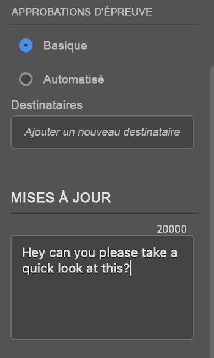

# Charger des épreuves à partir d’[!DNL Photoshop]

Vous pouvez charger certains types de paramètres prédéfinis de document Photoshop en tant qu’épreuves directement vers [!DNL Adobe Workfront] pour une révision et une approbation approfondies.

>[!IMPORTANT]
>
>Le fichier doit être un paramètre prédéfini de document photo, comme décrit dans [Modèles et paramètres prédéfinis dans Photoshop](https://helpx.adobe.com/photoshop/using/create-documents.html).

## Conditions d’accès

+++ Développez pour afficher les exigences d’accès aux fonctionnalités de cet article.

<table style="table-layout:auto"> 
 <col> 
 <col> 
 <tbody> 
  <tr> 
   <td role="rowheader">[!DNL Adobe Workfront] paquet</td> 
   <td> Tous</td> 
  </tr> 
  <tr> 
   <td role="rowheader">[!DNL Adobe Workfront] licence</td> 
   <td> 
   
Standard

   
Travail ou supérieur
 </td> 
  </tr> 
  <tr> 
   <td role="rowheader">Produits supplémentaires</td> 
   <td>Vous devez disposer d’une licence [!DNL Adobe Creative Cloud] en plus d’une licence [!DNL Workfront].</td> 
  </tr> 
  <tr> 
   <td role="rowheader">Profil d'autorisation pour l'épreuve </td> 
   <td>[!UICONTROL Manager] ou version supérieure</td> 
  </tr> 
  <tr> 
   <td role="rowheader">Autorisations d’objet</td> 
   <td> 
Modifier l’accès aux [!UICONTROL Documents]
  </td> 
  </tr> 
 </tbody> 
</table>

Pour plus d’informations, voir [Conditions d’accès requises dans la documentation Workfront](/help/quicksilver/administration-and-setup/add-users/access-levels-and-object-permissions/access-level-requirements-in-documentation.md).

+++

## Conditions préalables

* Vous devez installer [!DNL Adobe Workfront for Photoshop] avant de pouvoir charger des épreuves à partir d’[!DNL Adobe Photoshop].

  Pour plus d’informations, voir [Installer  [!DNL Adobe Workfront for Photoshop]](../../workfront-integrations-and-apps/adobe-workfront-for-creative-cloud/wf-cc-install-ps.md).

## Charger une épreuve de base

1. Cliquez sur l’icône **[!UICONTROL Menu]** dans le coin supérieur droit, puis sélectionnez **[!UICONTROL Liste de travail]**. Vous pouvez également utiliser le menu pour accéder aux objets parents.

   

1. Accédez à l’élément de travail dans lequel vous souhaitez charger une épreuve.
1. Cliquez sur l’icône **[!UICONTROL Document]**  dans la barre de navigation.
1. Cliquez sur **[!UICONTROL Nouveau fichier]** au bas du panneau [!DNL Workfront].
1. Activez le bouton (bascule) **[!UICONTROL Créer une épreuve]**.
1. (Facultatif) Saisissez un nom pour l’épreuve dans la zone de texte **[!UICONTROL Nom de l’épreuve]**.
1. Dans la section **[!UICONTROL Approbations des épreuves]**, sélectionnez **[!UICONTROL De base]**.
1. (Facultatif) Ajoutez des approbateurs et approbatrices.
1. (Facultatif) Saisissez un commentaire dans la zone **[!UICONTROL Mises à jour]**.

   

1. Choisissez le **[!UICONTROL type de ressource]** dans le menu déroulant.

1. (Facultatif) Sélectionnez **[!UICONTROL Ajouter un fichier externe]** pour ajouter un fichier à partir de votre ordinateur.
1. Cliquez sur **[!UICONTROL Charger]**, puis configurez les options d’export souhaitées en fonction du type de fichier sélectionné ci-dessus.

   \
   Le document apparaît dans la zone [!UICONTROL Documents] du panneau [!DNL Workfront] dans [!DNL Photoshop] et dans l’application de bureau [!DNL Workfront].

## Charger une épreuve automatisée

1. Cliquez sur l’icône **[!UICONTROL Menu]** dans le coin supérieur droit, puis sélectionnez **[!UICONTROL Liste de travail]**. Vous pouvez également utiliser le menu pour accéder aux objets parents.

   

1. Accédez à l’élément de travail dans lequel vous souhaitez charger une épreuve.
1. Cliquez sur l’icône **[!UICONTROL Document]**  dans la barre de navigation.

1. Cliquez sur **[!UICONTROL Nouveau fichier]** au bas du panneau [!DNL Workfront].
1. Activez le bouton (bascule) **[!UICONTROL Créer une épreuve]**.
1. (Facultatif) Saisissez un nom pour l’épreuve dans la zone de texte **[!UICONTROL Nom de l’épreuve]**.
1. Dans la section **[!UICONTROL Approbations des épreuves]**, sélectionnez **[!UICONTROL Automatisé]**.
1. (Facultatif) Dans la zone **[!UICONTROL Modèle de workflow]** saisissez le nom d’un modèle de workflow d’épreuve.

{{adjust-proof-settings}}

>[!NOTE]
>
> S’il existe des champs requis vides dans le modèle de workflow, les paramètres d’épreuve automatisés s’ouvrent automatiquement et vous devez renseigner ces champs pour charger l’épreuve.

1. (Facultatif) Saisissez un commentaire dans la zone **[!UICONTROL Mises à jour]**.

   

1. Choisissez le **[!UICONTROL type de ressource]** dans le menu déroulant.
1. (Facultatif) Sélectionnez **[!UICONTROL Ajouter un fichier externe]** pour ajouter un fichier à partir de votre ordinateur.
1. Cliquez sur **[!UICONTROL Charger]**, puis configurez les options d’export souhaitées en fonction du type de ressource choisi ci-dessus.
Le document apparaît dans la zone [!UICONTROL Documents], dans le panneau [!DNL Workfront] de [!DNL Photoshop] et dans l’application de bureau [!DNL Workfront].

## Charger une nouvelle version d’épreuve

Vous pouvez charger une nouvelle version d’une épreuve. Le plug-in conserve en mémoire le workflow de relecture défini sur la version précédente, mais vous pouvez modifier ce paramètre si vous le souhaitez.

1. Cliquez sur l’cône **[!UICONTROL Menu]** dans le coin supérieur droit, puis sélectionnez **[!UICONTROL Liste de travail]**. Vous pouvez également utiliser le menu pour accéder aux objets parents.

   

1. Accédez à l’élément de travail dans lequel vous devez charger un document.
1. Cliquez sur l’icône **[!UICONTROL Document]**  dans la barre de navigation.

1. Cliquez sur **[!UICONTROL Nouvelle version]** en bas du panneau [!DNL Workfront].
1. Activez le bouton (bascule) **[!UICONTROL Créer une épreuve]**.

1. Dans la section *[!UICONTROL *Approbation d’épreuve]&#x200B;**, choisissez &#x200B;** [!UICONTROL De base] **&#x200B; ou &#x200B;** [!UICONTROL Automatique]**.

1. Ajoutez des **[!UICONTROL Réviseurs ou réviseuses]** ou un **[!UICONTROL Modèle de workflow]** en fonction du type d’approbation que vous avez sélectionné lors de l’étape 7.

1. (Facultatif) Saisissez un commentaire dans la zone **[!UICONTROL Mises à jour]**.
1. Choisissez le **[!UICONTROL Type de ressource]** dans le menu déroulant.
1. Cliquez sur **[!UICONTROL Charger]**, puis configurez les options d’export souhaitées en fonction du type de ressource choisi ci-dessus.
Le document apparaît dans la zone [!UICONTROL Documents] dans le panneau [!DNL Workfront] de [!DNL Photoshop] et dans l’application de bureau [!DNL Workfront].
