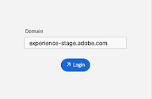

# Installer et ouvrir [!DNL Adobe Workfront for design and video]

Vous pouvez installer [!DNL Adobe Workfront for design and video] à partir d’[!DNL Adobe Marketplace]. Ce plug-in prend en charge les applications Creative Cloud suivantes :

{{cc-plugin-app-list}}

[!DNL Adobe Workfront for design and video] prend en charge les langues suivantes :

* Anglais
* Français
* Allemand
* Italien
* Espagnol
* Japonais
* Portugais
* Chinois simplifié
* Chinois traditionnel
* Coréen

>[!NOTE]
>
>Il existe des instructions d’installation distinctes pour [!DNL Photoshop] et [!DNL XD]. Pour plus d’informations, voir [Installer  [!DNL Adobe Workfront for Photoshop]](/help/quicksilver/workfront-integrations-and-apps/adobe-workfront-for-creative-cloud/wf-cc-install-ps.md) et [Installer  [!DNL Adobe Workfront for XD]](/help/quicksilver/workfront-integrations-and-apps/adobe-workfront-for-creative-cloud/wf-adobe-xd-install.md).

## Conditions d’accès

+++ Développez pour afficher les exigences d’accès aux fonctionnalités de cet article.

<table style="table-layout:auto"> 
 <col> 
 </col> 
 <col> 
 </col> 
 <tbody> 
 <!-- <tr> 
   <td role="rowheader">[!DNL Adobe Workfront] package/td> 
   <td> 
Any
 </td> 
  </tr> 
  <tr data-mc-conditions=""> 
   <td role="rowheader">[!DNL Adobe Workfront] license*</td> 
   <td>
   
Standard

    
Work or higher
 </td> 
  </tr> -->
  <tr> 
   <td role="rowheader">Produits supplémentaires</td> 
   <td>
Vous devez disposer d’une licence [!DNL Adobe Creative Cloud] en plus d’une licence [!DNL Workfront].
</td> 
  </tr> 
 </tbody> 
</table>

Pour plus d’informations, voir [Conditions d’accès requises dans la documentation Workfront](/help/quicksilver/administration-and-setup/add-users/access-levels-and-object-permissions/access-level-requirements-in-documentation.md).

+++

## Conditions préalables

* Vous devez installer l’application [!DNL Creative Cloud] que vous souhaitez utiliser avant d’installer le plug-in Workfront pour cette application.

## Installer [!DNL Workfront for design and video] pour votre entreprise

Si vous êtes un administrateur ou une administratrice [!DNL Adobe Admin Console], vous pouvez inclure [!DNL Adobe Workfront for design and video] dans des packages de déploiement [!DNL Creative Cloud]. Pour plus d’informations, voir [Inclure des plug-ins dans votre package](https://helpx.adobe.com/fr/enterprise/using/manage-extensions.html).

[Voir un tutoriel vidéo ici](https://www.youtube.com/watch?v=zzvXNLIBzrc){target=_blank}.

Les administrateurs et administratrices [!DNL Adobe Admin Console] peuvent également créer des packages de plug-ins seuls à distribuer aux utilisateurs et utilisatrices. Pour plus d’informations, voir [Créer des packages [!UICONTROL [!DNL Adobe Workfront] for [!DNL Creative Cloud]]  pour vos utilisateurs et utilisatrices dans  [!DNL Adobe Admin Console]](/help/quicksilver/administration-and-setup/configure-integrations/create-plugin-only-packages.md).

## Installer [!DNL Workfront for design and video] individuellement

Vous pouvez installer [!DNL Adobe Workfront for design and video] pour vous-même à partir d’[!DNL Adobe Exchange].

1. Accédez à la [page d’installation d’Adobe Workfront pour la conception et la vidéo](https://adobe.com/go/cc_plugins_discover_plugin?pluginId=108938&workflow=share) sur Adobe Exchange.
1. Dans la boîte de dialogue qui apparaît, cliquez sur **Ouvrir l’application de bureau [!DNL Adobe Creative Cloud]**.
1. Lorsque le gestionnaire des plug-ins [!DNL Adobe Creative Cloud] est ouvert, cliquez sur **[!UICONTROL Installer]**.
1. Lisez les informations de la boîte de dialogue, puis cliquez sur **[!UICONTROL OK]**.
1. Une fois [!DNL Workfront for design and video] installé, ouvrez l’application [!DNL Creative Cloud] dont vous avez besoin et recherchez le plug-in [!DNL Workfront] dans le panneau des plug-ins.

1. Passez à la section suivante pour plus d’informations sur l’ouverture de [!DNL Workfront for design and video].

## Ouvrir [!DNL Adobe Workfront for design and video]

1. Ouvrez le plug-in Creative Cloud que vous souhaitez utiliser.

1. Créez un projet ou ouvrez un projet existant.

1. Dans le menu supérieur, cliquez sur **Windows** > **Extensions** > **Menu Adobe Workfront**.

   >[!NOTE]
   >
   >Si vous utilisez Premiere Pro, un projet doit être ouvert pour accéder à ce menu.

   

   >[!TIP]
   >
   >Si vous ne voyez pas [!DNL Adobe Workfront for design and video] après l’avoir ouvert à partir du menu Extensions, il peut se trouver derrière l’application Creative Cloud. Essayez de réduire l’application pour trouver le module.

1. Pour plus d’informations sur la connexion à [!DNL Adobe Workfront for design and video], reportez-vous à la section suivante.

## Se connecter à [!DNL Adobe Workfront for design and video]

1. Dans le menu **[!UICONTROL Plug-ins]** de la partie supérieure de l’écran, sélectionnez **[!UICONTROL Panneau des plug-ins]**.
1. Sélectionnez **[!DNL Adobe Workfront for design and video]**.
1. Saisissez votre domaine, puis cliquez sur **[!UICONTROL Connexion]**. Une page de navigateur s’ouvre.

   >[!TIP]
   >
   >* Pour trouver votre domaine, ouvrez un navigateur, accédez à votre instance [!DNL Workfront] et copiez la première partie de l’URL :
   >
   >
   >
   >* Si votre instance Workfront est intégrée à Experience Cloud et que le domaine commence par `experience.adobe.com`, demandez à votre administrateur de vous fournir le domaine Workfront qui se trouve sous Produit > Workfront dans Admin Console.

1. Dans le navigateur, saisissez vos informations d’identification [!DNL Workfront], puis cliquez sur **[!UICONTROL Connexion]**. Si votre entreprise utilise une authentification unique (SSO), vous accédez à la page de votre fournisseur d’authentification unique pour vous connecter.

   >[!NOTE]
   >
   >Vous n’aurez peut-être pas besoin de saisir vos informations d’identification [!DNL Adobe] si votre connexion est récente.

1. Suivez les invites pour vous connecter à [!DNL Workfront].

   >[!NOTE]
   >
   >* [!DNL Workfront] se connecte à [!DNL Adobe Creative Cloud] en utilisant OAuth 2.0, une norme sécurisée utilisée par la plupart des intégrations web pour l’authentification et l’autorisation des utilisateurs et utilisatrices.

1. Cliquez sur **[!UICONTROL Autoriser l’accès]** pour terminer la connexion.
1. Revenez à [!DNL Adobe Photoshop] pour voir votre travail.

### Dépannage des erreurs de connexion

**’erreur « Un problème est survenu » s’affiche lors de la tentative de connexion**

Vous ne pouvez pas utiliser une URL commençant par `experience.adobe.com` pour vous connecter au plug-in.

 

Pour résoudre ce problème, procédez comme suit :

1. Supprimez le dossier qui stocke le domaine pour le plug-in .

   >[!TIP]
   >
   >Sur un Mac, accédez à Finder, appuyez sur **Commande + Maj + G**, puis accédez à .  `~/Library/Application Support/Workfront`, puis supprimez le dossier **Workfront**.

1. Revenez au plug-in et saisissez votre domaine Workfront. Le domaine doit être `company-name.my.workfront.com` et non `experience.adobe.com`.

   Pour [rechercher votre domaine Workfront](/help/quicksilver/wf-api/tips-tricks-and-troubleshooting/locate-domain-for-api.md) si vous utilisez l’expérience unifiée Adobe, accédez à Configuration, Informations sur le client.
