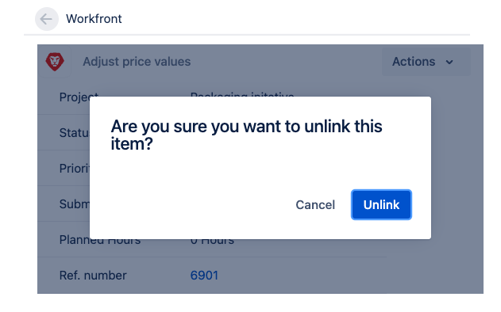

# Lier des éléments entre [!DNL Adobe Workfront] et [!DNL Jira]

Vous pouvez lier [!DNL Jira] problèmes à [!DNL Adobe Workfront] tâches ou problèmes automatiquement ou manuellement.

Un seul élément dans [!DNL Workfront] peut être lié à un élément dans [!DNL Jira]. Vous ne pouvez jamais lier un lien. [!DNL Workfront] élément à plusieurs [!DNL Jira] problèmes, pas un [!DNL Jira] publication sur plusieurs [!DNL Workfront] éléments.

## Exigences d’accès

Vous devez disposer des éléments suivants :

<table style="table-layout:auto"> 
 <col> 
 <col> 
 <tbody> 
  <tr> 
   <td role="rowheader"><a href="https://www.workfront.com/plans" target="_blank">[!DNL [!DNL Adobe Workfront] plan]</a>*</td> 
   <td> 
[!UICONTROL Pro] ou version ultérieure
 </td> 
  </tr> 
  <tr> 
   <td role="rowheader"><a href="../../administration-and-setup/add-users/access-levels-and-object-permissions/wf-licenses.md" class="MCXref xref">Adobe [!DNL Workfront] Présentation des licences</a>*</td> 
   <td> 
Plan
 </td> 
  </tr> 
  <tr> 
   <td role="rowheader">Accès Jira</td> 
   <td> 
Accès administrateur système
 
<b>IMPORTANT</b>

Nous vous recommandons de créer des comptes d’administrateur système distincts dans [!DNL Jira] et [!DNL Workfront] pour dédier à cette intégration, plutôt que d’utiliser des qui peuvent être associés à des utilisateurs existants.
 </td>
</tr> 
  <tr> 
   <td role="rowheader">Paramétrages du niveau d'accès*</td> 
   <td> 
Vous devez être un [!DNL Workfront] administrateur. Pour plus d’informations sur [!DNL Workfront] administrateurs, voir <a href="../../administration-and-setup/add-users/configure-and-grant-access/grant-a-user-full-administrative-access.md" class="MCXref xref">Octroi d’un accès administratif complet à un utilisateur</a>.
 
<b>NOTE</b>

Si vous n’avez toujours pas accès à , demandez à votre [!DNL Workfront] s’ils définissent des restrictions supplémentaires au niveau de votre accès. Pour plus d’informations sur la manière dont une [!DNL Workfront] l’administrateur peut modifier votre niveau d’accès, voir <a href="../../administration-and-setup/add-users/configure-and-grant-access/create-modify-access-levels.md" class="MCXref xref">Création ou modification de niveaux d’accès personnalisés</a>.
 </td>
</tr> 
 </tbody> 
</table>

&#42;Pour connaître le plan, le type de licence ou l’accès dont vous disposez, contactez votre [!DNL Workfront] administrateur.

## Conditions préalables

Avant de pouvoir lier des éléments entre [!DNL Workfront] et [!DNL Jira], vous devez

* Installer [!DNL Workfront] pour [!DNL Jira]

   Pour plus d’informations sur l’installation de Workfront pour Jira, voir [Installation d’Adobe Workfront pour Jira](../../workfront-integrations-and-apps/use-workfront-with-jira/install-workfront-for-jira.md).

* Configurer [!DNL Workfront] pour Jira

   Pour plus d’informations sur la configuration de Workfront pour Jira, voir [Configuration d’Adobe Workfront pour Jira](../../workfront-integrations-and-apps/use-workfront-with-jira/configure-workfront-for-jira.md).

## Lien automatique [!DNL Workfront] éléments à [!DNL Jira] Problèmes

Comme [!DNL Workfront] administrateur, vous pouvez définir des déclencheurs pouvant créer automatiquement un problème dans [!DNL Jira] chaque fois que certaines conditions sont remplies sur une tâche ou un problème dans [!DNL Workfront]. Workfront et [!DNL Jira] les éléments deviennent liés.

Une fois la configuration de [!DNL Workfront] pour Jira, lorsqu’un élément est créé ou mis à jour dans [!DNL Workfront] pour correspondre à vos déclencheurs, un nouvel élément est automatiquement créé dans [!DNL Jira].\
Les utilisateurs de Workfront qui créent et mettent à jour des éléments Workfront n’ont pas besoin d’une [!DNL Jira] pour déclencher la création d’éléments dans [!DNL Jira].

Pour plus d’informations sur la définition de déclencheurs pour la création automatique de problèmes Jira, voir  [Configurer [!DNL Adobe Workfront] pour Jira](../../workfront-integrations-and-apps/use-workfront-with-jira/configure-workfront-for-jira.md).

>[!NOTE]
>
>Vous pouvez créer des [!DNL Jira] éléments automatiquement en joignant un modèle à un projet. Si le modèle contient des tâches avec des affectations qui correspondent à la variable [!DNL Jira] déclencheurs, les nouvelles tâches génèrent de nouvelles [!DNL Jira] problèmes.

Associer automatiquement une [!DNL Workfront] problème à un [!DNL Jira] Ce problème est identique à la liaison automatique d’un [!DNL Workfront] à une tâche [!DNL Jira] problème.

Pour lier automatiquement une [!DNL Workfront] à une tâche [!DNL Jira] Problème :

1. Assurez-vous que la variable [!DNL Jira] l’administrateur système a configuré des déclencheurs pour la création automatique. [!DNL Jira] survient lorsque [!DNL Workfront] des éléments sont affectés, puis connectez-vous à [!DNL Workfront] avec un niveau d’accès qui permet de créer une tâche.

   Pour plus d’informations sur l’accès aux tâches, voir [Accorder l’accès aux tâches](../../administration-and-setup/add-users/configure-and-grant-access/grant-access-tasks.md).

1. Accédez à un projet et sélectionnez **[!UICONTROL Tâches]**  dans le panneau de gauche.

1. Cliquez sur **[!UICONTROL Nouvelle tâche]**

   Ou

   Sélectionnez une tâche existante, puis cliquez sur **Modifier**.

1. Spécifiez ou mettez à jour l’un des champs disponibles pour la tâche.
1. Cliquez sur **[!UICONTROL Affectations]** et affecter la tâche à un utilisateur, un rôle ou une équipe spécifié comme déclencheur dans la variable [!DNL Jira] intégration.

1. Cliquez sur **Enregistrer les modifications**.

   Une nouvelle tâche est créée dans Workfront.

   Dans le **[!UICONTROL Mises à jour]** dans la nouvelle tâche, un commentaire indique qu’un nouveau problème a également été créé dans [!DNL Jira].

   

1. (Facultatif) Cliquez sur le lien vers le problème Jira pour l’ouvrir dans Jira.

   Ou

   Cliquez sur le bouton **[!UICONTROL Aller à Jira]** dans le **[!UICONTROL Intégrations]** de la zone **[!UICONTROL Détails]** pour ouvrir la section [!DNL Jira] problème.

   Votre administrateur système ou groupe doit ajouter la variable [!UICONTROL Intégrations] à votre modèle de mise en page pour l’afficher dans l’en-tête de la tâche ou du problème. Pour plus d’informations, voir [Personnalisation des en-têtes d’objet à l’aide d’un modèle de mise en page](../../administration-and-setup/customize-workfront/use-layout-templates/customize-object-headers.md).

   Quelconque [!DNL Jira] l’utilisateur peut immédiatement commencer à travailler sur des éléments créés automatiquement à partir de [!DNL Workfront] et leurs mises à jour seront transférées vers [!DNL Workfront] sans avoir besoin d’une licence pour [!DNL Workfront] pour ce faire.

   Uniquement les champs que vous souhaitez [!DNL Workfront] administrateur configuré lors de la configuration de la fonction [!DNL Workfront] sont mis à jour.

   Pour plus d’informations sur la synchronisation de champs entre Workfront et Jira, voir la section [Configuration de Workfront pour Jira](../../workfront-integrations-and-apps/use-workfront-with-jira/configure-workfront-for-jira.md#configuring-the-add-on-for-jira) dans  [Configuration d’Adobe Workfront pour Jira](../../workfront-integrations-and-apps/use-workfront-with-jira/configure-workfront-for-jira.md).

   >[!NOTE]
   >
   >Le [!DNL Jira] le problème n’est attribué à personne dans [!DNL Jira] lorsqu’il est automatiquement créé à partir de Workfront.

## Lien manuel [!DNL Jira] problèmes à [!DNL Workfront] items

Une fois les éléments créés dans [!DNL Jira] et [!DNL Workfront], indépendamment l’un de l’autre, vous pouvez lier manuellement une [!DNL Jira] Problème lié à un [!DNL Workfront] tâche ou problème.\
Vous ne pouvez pas lier manuellement une [!DNL Workfront] item from [!DNL Workfront] à un [!DNL Jira] élément .

>[!NOTE]
>
>Si la variable [!DNL Jira] Le problème ne se trouve pas sur un projet qui n’est pas identifié comme déclencheur dans la variable [!DNL Workfront] Intégration, vous ne pouvez pas la lier manuellement à un élément Workfront lors de l’utilisation de l’intégration avec [!DNL Jira] On-Premise.\
>Pour plus d’informations sur la configuration des déclencheurs pour le processus Workfront vers Jira, voir [Lier automatiquement les éléments Workfront aux problèmes Jira](#automatically-link-workfront-items-to-jira-issues).

When [!DNL Workfront] et [!DNL Jira] éléments sont liés, certains champs d’un élément peuvent être automatiquement mis à jour sur l’autre.\
Pour plus d’informations sur la mise à jour des éléments liés, voir [Mise à jour des éléments liés entre Jira et Adobe Workfront](../../workfront-integrations-and-apps/use-workfront-with-jira/update-linked-items-between-jira-wf.md).

Pour lier manuellement [!DNL Jira] problèmes à [!DNL Workfront] items :

1. (Conditionnel) Connectez-vous à [!DNL Workfront] et rechercher un problème ou une tâche à laquelle vous souhaitez créer un lien. [!DNL Jira] problème.
1. (Conditionnel) Dans la barre d’adresse de l’élément, copiez la variable **URL** de l’élément dans Workfront.

   Ou

   Dans la [!UICONTROL Détails] area , copiez la variable **[!UICONTROL Numéro de référence]** de l’élément dans Workfront.

   >[!NOTE]
   >
   >Vous devez disposer d’un [!DNL Workfront] licence pour se connecter à [!DNL Workfront]. Sinon, une [!DNL Workfront] l’utilisateur doit vous fournir ces informations.

1. Dans [!DNL Jira], accédez à un problème que vous souhaitez lier manuellement à la variable [!DNL Workfront] élément .
1. Dans le [!DNL Workfront] panneau droit, collez le **URL** ou le **[!UICONTROL Numéro de référence]** de [!DNL Workfront] que vous souhaitez lui associer.\
   

1. Cliquez sur **[!UICONTROL Lien]**.

   Les deux éléments sont liés et la variable [!DNL Workfront] le panneau de droite contient des informations provenant de [!DNL Workfront] élément .

   Les éléments suivants [!DNL Workfront] sont visibles dans [!DNL Jira], par défaut, dans la variable [!DNL Workfront] panneau droit :

   * Le **[!UICONTROL Nom]** de l’élément : Vous pouvez accéder au [!DNL Workfront] en cliquant sur le nom dans le panneau.
   * **[!UICONTROL Nom du projet]**
   * Le **[!UICONTROL État]** de l’élément
   * Le **[!UICONTROL Priorité]** de l’élément
   * Date à laquelle il a été créé dans [!DNL Workfront]
   * Le **[!UICONTROL Heures planifiées]** de l’élément
   * Le **[!UICONTROL Numéro de référence]**: Vous pouvez accéder au [!DNL Workfront] en cliquant sur l’option [!UICONTROL Numéro de référence] dans le panneau .

Pour plus d’informations sur l’activation de champs supplémentaires à afficher dans le panneau de droite, voir [Configurer la synchronisation des champs entre [!DNL Jira] et [!DNL Workfront] Éléments](../../workfront-integrations-and-apps/use-workfront-with-jira/configure-workfront-for-jira.md#setting-up-field-synchronization) dans [Configurer [!DNL Adobe Workfront for Jira]](../../workfront-integrations-and-apps/use-workfront-with-jira/configure-workfront-for-jira.md). Un commentaire de la [!DNL Workfront] L’administrateur associé à l’intégration est publié dans la variable **[!DNL Workfront]** de l’onglet [!DNL Jira] problème pour confirmer qu’une nouvelle [!DNL Jira] a été créé. Le commentaire contient un lien vers la variable [!DNL Jira] problème.

## Dissocier les éléments entre [!DNL Jira] et [!DNL Workfront]

Éléments liés entre [!DNL Jira] et [!DNL Workfront] peut être dissocié manuellement de [!DNL Jira].\
Vous ne pouvez pas dissocier une [!DNL Workfront] de leur [!DNL Jira] contrepartie dans [!DNL Workfront].

Vous avez besoin de l’accès suivant pour dissocier l’élément lié manuellement :

* Vous êtes l’utilisateur qui a lié manuellement les éléments.
* Vous êtes la [!DNL Jira] administrateur système

Une seule [!DNL Workfront] L’administrateur peut dissocier des éléments qui ont été automatiquement liés.

Pour dissocier une [!DNL Jira] d’un problème [!DNL Workfront] item:

1. Dans [!DNL Jira], accédez à un problème lié à un [!DNL Workfront] tâche ou problème.
1. Accédez au [!DNL Workfront] dans le panneau de droite, puis cliquez sur **[!UICONTROL Dissocier]** puis cliquez sur **[!UICONTROL Dissocier]**.\
   \
   Le lien précédemment lié [!DNL Jira] et [!DNL Workfront] les éléments ne sont désormais plus liés. Les champs, commentaires ou documents qui pourraient être mis à jour individuellement à l’avenir ne sont pas mis à jour sur leur contrepartie précédente dans l’autre application.
