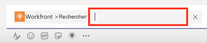
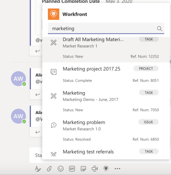

# Rechercher et partager [!DNL Adobe Workfront] éléments dans [!DNL Microsoft Teams]

>[!NOTE]
>
>L’intégration d’Adobe Workfront for Microsoft Teams n’est actuellement prise en charge que pour l’expérience de Microsofts Teams classiques.

Vous pouvez rechercher [!DNL Workfront] éléments dans n’importe quel [!DNL Adobe Workfront] canal dans [!DNL Microsoft Teams] et partager ces éléments avec les membres de vos équipes.

* [Conditions préalables au partage [!DNL Workfront] éléments dans [!DNL Microsoft Teams]](#prerequisites-for-sharing-workfront-items-in-microsoft-teams-prerequisites-for-sharing-workfront-items-in-microsoft-teams)
* [Rechercher et partager [!DNL Workfront] éléments dans [!DNL Microsoft Teams]](#search-for-and-share-adobe-workfront-items-in-microsoft-teams)

## Exigences d’accès

Vous devez disposer des accès suivants pour effectuer les étapes de cet article :

<table style="table-layout:auto"> 
 <col> 
 <col> 
 <tbody> 
  <tr> 
   <td role="rowheader">[!DNL Adobe Workfront] plan*</td> 
   <td> 
Quelconque
 </td> 
  </tr> 
  <tr> 
   <td role="rowheader">[!DNL Adobe Workfront] license*</td> 
   <td> 
[!UICONTROL Work], [!UICONTROL Plan]
 </td> 
  </tr> 
 </tbody> 
</table>

&#42;Pour connaître le plan, le type de licence ou l’accès dont vous disposez, contactez votre [!DNL Workfront] administrateur.

## Conditions préalables au partage [!DNL Workfront] éléments dans [!DNL Microsoft Teams] {#prerequisites-for-sharing-workfront-items-in-microsoft-teams}

Vous pouvez rechercher et partager des [!DNL Workfront] éléments dans [!DNL Microsoft Teams] si les conditions suivantes sont remplies :

* Un propriétaire d’équipe a installé et configuré [!DNL Workfront for Microsoft Teams] pour votre équipe.
* Vous êtes connecté [!DNL Workfront] de [!UICONTROL Microsofts Teams].

Pour plus d’informations sur l’installation [!UICONTROL Workfront pour les Microsofts Teams] et vous connecter à [!UICONTROL Workfront] de [!DNL Microsoft Teams], voir [Installation d’Adobe Workfront for Microsoft Teams](../../workfront-integrations-and-apps/using-workfront-with-microsoft-teams/install-workfront-ms-teams.md).

>[!NOTE]
>
>[!DNL Microsoft Teams] ne prend plus en charge [!DNL Internet Explorer]. Pour utiliser la variable [!DNL Adobe Workfront for Microsoft Teams integration], vous devez utiliser un navigateur web autre que [!DNL Internet Explorer].

## Rechercher et partager [!DNL Workfront] éléments dans [!DNL Microsoft Teams] {#search-for-and-share-workfront-items-in-microsoft-teams}

Vous pouvez rechercher les éléments suivants : [!DNL Workfront] éléments d’une [!DNL Microsoft Teams] channel :

* Projets
* Tâches

  >[!NOTE]
  >
  >Vous ne pouvez pas rechercher des tâches personnelles.

* Problèmes

Une fois les éléments recherchés trouvés, vous pouvez les partager avec d’autres utilisateurs dans [!DNL Microsoft Teams].

Pour rechercher une [!DNL Workfront] item from [!DNL Microsoft Teams] et la partager avec d&#39;autres :

1. Dans [!DNL Microsoft Teams], accédez à n’importe quel canal de conversation et cliquez sur le bouton **[!DNL Workfront]** Icône
1. Recherchez le [!DNL Workfront] en effectuant l’une des opérations suivantes :

   * Cliquez sur le bouton [!DNL Workfront] dans le champ de conversation.\

     \
      Selon vos paramètres, cette icône peut s’afficher sous la variable **[!UICONTROL Plus]** à la place.\
      \
      La variable **[!UICONTROL Rechercher]** apparaît par défaut.

   * Type *@[!DNL Workfront]* sélectionnez Workfront dans n’importe quel canal, puis sélectionnez **[!UICONTROL Rechercher].**

     

1. Dans le [!UICONTROL search] fourni, commencez à saisir le nom ou le numéro de référence d’un projet, d’une tâche ou d’un problème, puis cliquez dessus lorsqu’il apparaît dans la liste.\
   \
   Cela ajoute une carte avec la fonction [!DNL Workfront] dans le champ de conversation. Certaines informations sur l’élément sont incluses sur la carte, y compris le nom de l’élément, l’objet parent, l’état, la priorité, le pourcentage terminé.

1. (Facultatif) Ajoutez un commentaire sous le [!DNL Workfront] carte, puis cliquez sur **[!UICONTROL Envoyer]** ou appuyez sur Entrée.\
   Ce message est envoyé, y compris le [!DNL Workfront] sur votre canal.\
   Tous les membres du canal peuvent voir ce message, y compris les informations sur le [!DNL Workfront] carte.

1. Cliquez sur **[!UICONTROL Afficher dans Workfront]** pour afficher l’élément dans [!DNL Workfront].\
   Uniquement les utilisateurs qui ont une [!DNL Workfront] une licence peut afficher un élément dans [!DNL Workfront].
