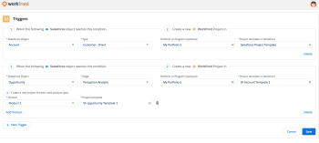

# Créer [!DNL Adobe Workfront] projets à partir de [!DNL Salesforce] objet

Après installation [!DNL Adobe Workfront] pour Salesforce, vous pouvez définir des déclencheurs qui créent [!DNL Workfront] projets lorsque certains critères sont remplis [!DNL Salesforce] [!UICONTROL Opportunités] et [!UICONTROL Comptes].

## Exigences d’accès

Vous devez disposer des accès suivants pour utiliser les fonctionnalités décrites dans cet article :

<table style="table-layout:auto"> 
 <col> 
 <col> 
 <tbody> 
  <tr> 
   <td role="rowheader">[!DNL Adobe Workfront] plan*</td> 
   <td> 
[!UICONTROL Pro] ou version ultérieure
 </td> 
  </tr> 
  <tr> 
   <td role="rowheader">[!DNL Adobe Workfront] license*</td> 
   <td> 
[!UICONTROL Plan]
 </td> 
  </tr> 
 </tbody> 
</table>

&#42;Pour connaître le plan, le type de licence ou l’accès dont vous disposez, contactez votre [!DNL Workfront] administrateur.

## Conditions préalables

Pour envoyer une [!DNL Workfront] d’une [!DNL Salesforce] [!UICONTROL Opportunité] ou Assurez-vous que les éléments suivants sont présents dans votre environnement :

* Votre [!DNL Workfront] L’administrateur a installé [!DNL Workfront for Salesforce].\
   Pour plus d’informations sur l’installation [!DNL Workfront for Salesforce], voir [Installer [!DNL Adobe Workfront for Salesforce]](../../workfront-integrations-and-apps/using-workfront-with-salesforce/install-workfront-for-salesforce.md)

* Votre [!DNL Workfront] L’administrateur a ajouté la variable [!DNL Workfront] à votre [!UICONTROL Opportunité] et Mises en page de compte .\
   Pour plus d’informations sur l’ajout de la variable [!DNL Workfront] à une mise en page, voir [Configurez la variable [!DNL Adobe Workfront] section pour [!DNL Salesforce] utilisateurs](../../workfront-integrations-and-apps/using-workfront-with-salesforce/configure-wf-section-for-salesforce-users.md).

* Vous avez une [!DNL Workfront] et vous pouvez vous y connecter à partir du [!DNL Workfront] dans votre [!UICONTROL Opportunité] ou Compte .

## Configuration de la création de [!DNL Workfront] Projets à partir de [!DNL Salesforce]

* [Présentation de la création automatique de projets](#understanding-the-automatic-creation-of-projects-understanding-the-automatic-creation-of-projects)
* [Configuration des Triggers](#configuring-triggers-configuring-triggers)
* [Présentation des noms de projet](#understanding-project-names-understanding-project-names)

### Présentation de la création automatique de projets {#understanding-the-automatic-creation-of-projects}

Comme la variable [!DNL Salesforce] administrateur système, vous pouvez définir des déclencheurs pouvant créer automatiquement des projets dans [!DNL Workfront] lorsque les événements suivants se produisent dans [!DNL Salesforce]:

* Le [!UICONTROL Évaluation] de [!UICONTROL Opportunité] est mise à jour.
* Le [!UICONTROL Type] d’un compte est mis à jour.

Les déclencheurs ne peuvent être configurés qu’après l’installation de [!DNL Workfront for Salesforce].  \
Pour plus d’informations sur l’installation [!DNL Workfront for Salesforce], voir [Installer [!DNL Adobe Workfront for Salesforce]](../../workfront-integrations-and-apps/using-workfront-with-salesforce/install-workfront-for-salesforce.md).

Tenez compte des points suivants lors de la configuration de déclencheurs pour créer automatiquement [!DNL Workfront] projets lorsque [!DNL Salesforce] les éléments sont créés ou mis à jour :

* Vous devez être un [!DNL Salesforce] et un [!DNL Workfront] administrateur système pour configurer les déclencheurs.
* Une fois que vous avez configuré les déclencheurs, toute personne qui met à jour la variable [!UICONTROL Évaluation] de [!UICONTROL Opportunité] ou le [!UICONTROL Type] d’un compte peut déclencher la création d’un [!DNL Workfront] projet. Cela inclut [!DNL Salesforce] les utilisateurs qui n’ont pas de [!DNL Workfront] compte .
* Le nombre de déclencheurs que vous pouvez avoir n’est pas limité.
* Vous ne pouvez pas créer plusieurs déclencheurs en fonction des mêmes conditions. Les déclencheurs sont uniques par défaut.
* Une fois le projet créé, il est automatiquement lié à l&#39;opportunité ou au compte sur lequel il a été généré. Une fois établi, ce lien ne peut pas être rompu.
* Une opportunité ou un compte peut être lié à plusieurs projets dans [!DNL Workfront] lorsqu’une condition déclenchée a été remplie plusieurs fois au cours de la durée de vie de l’opportunité ou du compte.

   Par exemple, si vous définissez plusieurs puis un [!UICONTROL Évaluation] pour un [!UICONTROL Opportunité] pour déclencher un projet, un projet est créé pour chaque étape définie à laquelle l’opportunité atteint, pour la durée de vie de cette opportunité. En outre, si vous mettez à jour la variable [!UICONTROL Évaluation] de [!UICONTROL Opportunité] d’une étape définie à une autre, puis effectuez une mise à jour vers l’étape définie, un deuxième projet est créé pour la deuxième fois que vous mettez à jour la variable [!UICONTROL Évaluation] à la même étape définie.

* Un projet dans [!DNL Workfront] ne peut être lié qu’à une seule opportunité ou à un seul compte dans [!DNL Salesforce] à un moment donné, mais pas aux deux en même temps.

### Configuration des Triggers {#configuring-triggers}

Une fois que vous avez configuré les déclencheurs, le processus de création [!DNL Workfront] les projets sont activés pour les deux [!UICONTROL Salesforce Classic] ou [!DNL Lightning Experience] frameworks.

Pour configurer des déclencheurs dans [!UICONTROL Salesforce]:

1. Connectez-vous à [!DNL Salesforce] en tant qu’administrateur système.
1. (Conditionnel) Dans [!DNL Salesforce Classic], cliquez sur **[!UICONTROL Configuration]**, et sous **[!UICONTROL Build]** , développez **[!UICONTROL Éclair]**.

   Ou

   Dans [!DNL Salesforce] Expérience d’éclair, cliquez sur **[!UICONTROL Configuration] icon**, puis **[!UICONTROL Configuration]**, et sous **[!UICONTROL OUTILS PLATFORM]** expand **[!UICONTROL Applications]**.

1. Cliquez sur **[!UICONTROL Packages installés]**.

   Notez que la variable **[!DNL Workfront]** package a été installé.

1. Cliquez sur **[!UICONTROL Configurer]** en regard de **[!DNL Workfront]**.

1. Connectez-vous à [!DNL Workfront] en tant qu’administrateur système.

   Le **[!UICONTROL Triggers]** s’affiche.

   

1. Cliquez sur **[!UICONTROL Nouveau déclencheur]**.
1. Dans la **[!UICONTROL [!DNL Salesforce]Objet]** menu déroulant, sélectionnez **[!UICONTROL Opportunité]**.

   Champ obligatoire.

1. (Conditionnel) Indiquez les informations suivantes :

   1. Dans la **[!UICONTROL Évaluation]** , sélectionnez une **[!UICONTROL Évaluation]**.\

      Lorsqu’une opportunité atteint le [!UICONTROL Évaluation] spécifié ici, un projet est créé dans [!DNL Workfront]. Champ obligatoire.

   1. Dans le **[!UICONTROL Portfolio ou programme]** , commencez à saisir le nom d’un Portfolio ou d’un programme dans lequel vous souhaitez placer le projet. [!DNL Workfront], puis sélectionnez-la lorsqu’elle apparaît dans la liste.\

      Si vous ne spécifiez aucun Portfolio ou programme, le nouveau projet est créé et ajouté à la variable [!UICONTROL Projets que je possède] liste de l’utilisateur connecté à [!DNL Workfront] lors de la configuration des déclencheurs. Cet utilisateur est également le propriétaire du projet.

   1. Commencez à saisir le nom d’un modèle que vous souhaitez associer au nouveau [!DNL Workfront] projet, puis sélectionnez-le lorsqu’il apparaît dans la liste.\

      Champ obligatoire.

      >[!NOTE]
      >
      >Si vous avez spécifié un propriétaire de modèle sur le modèle que vous prévoyez d’utiliser pour cette intégration, cela devient le propriétaire du projet du nouveau projet. Les nouveaux projets s’affichent sous le [!UICONTROL Projets que je possède] liste de l’utilisateur propriétaire du nouveau projet, en fonction du modèle.

   1. (Facultatif) Sélectionnez le **[!UICONTROL Créez un projet pour chaque type de produit vendu.] field**, si vous souhaitez créer un projet pour chaque type de produit vendu en une seule occasion.
   1. (Conditionnel) Sélectionnez une **[!UICONTROL Produit]** dans le **[!UICONTROL Produit]** menu déroulant.

      Champ obligatoire.

   1. (Conditionnel) Commencez à saisir le nom d’un **[!UICONTROL Modèle]** que vous souhaitez associer au nouveau [!DNL Workfront] projet si le produit spécifié se trouve sur le [!UICONTROL Opportunité]. Sélectionnez-le lorsqu’il apparaît dans la liste.

      Champ obligatoire.

      Le projet créé lorsqu’un nouveau produit est ajouté à la variable [!DNL Salesforce] l’opportunité est placée dans le même Portfolio ou programme sélectionné pour l’opportunité.

      >[!IMPORTANT]
      >
      >Le projet est créé uniquement lorsque l’environnement intermédiaire est mis à jour sur la page [!UICONTROL Opportunité]. Un projet unique est créé pour chaque produit spécifié lors de la mise à jour du champ d’évaluation, et non au fur et à mesure que les produits sont ajoutés à [!UICONTROL Opportunités].

1. (Facultatif) Cliquez sur **[!UICONTROL Nouveau déclencheur]**.
1. (Facultatif) Dans le **[!UICONTROL [!DNL Salesforce]Objet]** , sélectionnez **Compte **.

   Champ obligatoire.
1. (Conditionnel) Indiquez les informations suivantes :

   1. Sélectionnez une **[!UICONTROL Type]** de la **[!UICONTROL Type]** menu déroulant.

      Lorsqu’un **Compte ** est désigné comme la variable **[!UICONTROL Type]** spécifié ici dans [!DNL Salesforce], un **[!UICONTROL Projet]** est créé dans [!DNL Workfront].

      Champ obligatoire.

   1. (Facultatif) Commencez à saisir le nom d’un **[!UICONTROL Portfolio]** ou **[!UICONTROL Programme]** où vous souhaitez placer le projet dans [!DNL Workfront] dans le **[!UICONTROL Portfolio ou programme]** puis sélectionnez-la lorsqu’elle apparaît dans la liste.

      Si vous ne spécifiez aucun Portfolio ou programme, le nouveau projet est créé et ajouté à la variable **[!UICONTROL Projets que je possède]** liste de l’utilisateur connecté à [!DNL Workfront] de [!DNL Salesforce]. L’utilisateur est également le propriétaire du projet.

   1. Commencez à saisir le nom d’un **[!UICONTROL Modèle]** que vous souhaitez associer au nouveau [!DNL Workfront] , puis sélectionnez-le lorsqu’il apparaît dans la liste.

      Champ obligatoire.

      >[!NOTE]
      >
      >Si vous avez spécifié un propriétaire de modèle sur le modèle que vous prévoyez d’utiliser pour cette intégration, cela devient le propriétaire du projet du nouveau projet. Les nouveaux projets s’affichent sous le **[!UICONTROL Projets que je possède]** liste de l’utilisateur propriétaire du nouveau projet, en fonction du modèle.
   

1. Cliquer sur **[!UICONTROL Enregistrer]**.

   [!DNL Workfront] les projets sont désormais générés chaque fois que l’un des déclencheurs est satisfait.

### Présentation des noms de projet {#understanding-project-names}

Selon le déclencheur qui a généré les projets, les noms des projets dans [!DNL Workfront] peut suivre l’un de ces modèles :

* Si le projet est créé en fonction d’une opportunité ou d’un déclencheur de compte, le nom du projet est : *`<Salesforce object name>`: `<Project template name>` (via [!DNL Salesforce])*.
* Si le projet est créé en fonction d’un déclencheur d’opportunité qui inclut également l’ajout d’un nouveau produit, le nom du projet est : *`<Salesforce object name>`: `<Salesforce product name>` (via [!DNL Salesforce])*.

## Affichage [!DNL Workfront] projects

Si votre [!DNL Workfront] L’administrateur a ajouté le [!DNL Workfront] à votre [!UICONTROL Opportunité] Pour la mise en page Compte , vous pouvez voir les projets créés automatiquement dans le [!UICONTROL Projets] de cette section.\
Pour plus d’informations sur l’ajout de la variable [!DNL Workfront] à la mise en page d’une [!UICONTROL Opportunité] ou Compte , voir [Configurez la variable [!DNL Adobe Workfront] section pour [!DNL Salesforce] utilisateurs](../../workfront-integrations-and-apps/using-workfront-with-salesforce/configure-wf-section-for-salesforce-users.md).

Vous devez disposer d’un [!DNL Workfront] et être connecté à [!DNL Workfront] pour afficher la variable [!UICONTROL Projets] .

Pour afficher les projets créés à partir d’un [!UICONTROL Opportunité] ou Compte :

1. Accédez à un [!UICONTROL Opportunité] ou Compte .
1. Accédez au **[!DNL Workfront]** .

   >[!NOTE]
   >
   >Selon la manière dont votre [!DNL Workfront] l’administrateur a configuré cette section. elle peut porter un nom différent.

1. Sélectionnez la **[!UICONTROL Projets]** .

   Tous les projets créés par des déclencheurs définis sont répertoriés dans cet onglet. N’importe quel utilisateur dans [!DNL Salesforce] qui a également une [!DNL Workfront] et qui peut être autorisé à voir ces projets dans [!DNL Workfront] peut également les voir dans [!DNL Salesforce] pour le [!UICONTROL Opportunité] ou le compte qui les a générés.

   ![[!DNL salesforce_projects_tab_with_projects_listed].png](assets/salesforce-projects-tab-with-projects-listed-350x150.png)

   Vous pouvez afficher les informations suivantes sur les projets créés par l’intégration :

   * Nom du projet
   * Numéro de référence
   * Date d’entrée
   * Nom du propriétaire
   * Statut
   * Condition
   * Date d&#39;achèvement prévue
   * Pourcentage d&#39;achèvement

      Lorsque ces informations sont mises à jour dans [!DNL Workfront], vous pouvez voir les champs mis à jour dans cette liste.

1. (Facultatif) Cliquez sur le nom d’un projet pour l’ouvrir dans Workfront.
1. (Facultatif) Cliquez sur [!UICONTROL **[!UICONTROL Accéder à Salesforce]**] dans le [!UICONTROL Détails du projet] zone ou en-tête de projet pour accéder à la propriété [!UICONTROL Opportunité] ou le compte d’origine du projet. Votre administrateur système ou groupe doit ajouter la variable [!UICONTROL Intégrations] à votre modèle de mise en page pour le trouver dans l’en-tête du projet.

   >[!NOTE]
   >
   >Le [!UICONTROL Accéder à Salesforce] Le lien est visible pour tous [!DNL Workfront] utilisateurs qui peuvent afficher le projet. Vous devez disposer d’un [!DNL Salesforce] pour pouvoir accéder à la variable [!DNL Salesforce] Opportunité ou compte à partir de l’emplacement où le projet a été généré.
