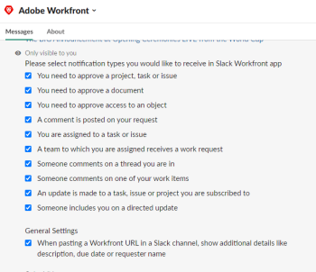

# Accès [!DNL Adobe Workfront] de [!DNL Slack]

Intégration [!DNL Adobe Workfront] avec [!DNL Slack] vous permet d’accéder à [!DNL Workfront] de [!DNL Slack]ou effectuer certaines actions dans [!DNL Workfront] à l’aide d’une commande de barre oblique. L’intégration peut être utilisée à partir de n’importe quel [!DNL Slack] , y compris le [!DNL Slack] application mobile.

Vous ou votre [!DNL Slack] L’administrateur doit installer le [!DNL Workfront] dans votre application [!DNL Slack] avant d’utiliser [!DNL Workfront] de [!DNL Slack]. Pour plus d’informations, voir [Configuration d’Adobe Workfront pour Slack](../../workfront-integrations-and-apps/using-workfront-with-slack/configure-workfront-for-slack.md).

## A propos des commandes de barre oblique {#about-slash-commands}

Lors de l’utilisation de [!DNL Slack], vous saisissez des messages dans un champ de message. Lorsque vous lancez votre message avec une barre oblique, il devient une commande et il se comporte différemment d’un simple message. La commande indique : [!DNL Slack] pour effectuer une action.

Vous pouvez accéder à [!DNL Workfront] instance à partir de [!DNL Slack] en saisissant une commande de barre oblique dans une [!DNL Slack] canal.

Gardez à l’esprit les éléments suivants lorsque vous utilisez une commande de barre oblique dans [!DNL Slack] accès [!DNL Workfront]:

* Les commandes de barre oblique sont sensibles à la casse.
* Les commandes pour [!DNL Workfront] ne sont visibles que par vous, quel que soit le canal dans lequel vous les saisissez.
* La commande doit toujours commencer par `/workfront` ou `/wf`, suivi d’un espace et du nom d’une action que vous souhaitez exécuter dans [!DNL Workfront].

   Cela indique que votre commande est destinée à la fonction [!DNL Workfront] application. Les commandes pour [!DNL Workfront] ne fonctionnent que si vous avez déjà configuré la variable [!DNL Workfront] avec votre application [!DNL Slack] instance.

Pour obtenir la liste de toutes les commandes que vous pouvez exécuter à partir de Slack pour [!DNL Workfront], voir [Accès [!DNL Workfront] à partir d’une barre oblique dans [!DNL Slack]](#access-workfront-from-a-slash-command-in-slack-access-workfront-from-a-slash-command-in-slack).

## Connectez-vous à [!DNL Workfront] de [!DNL Slack] {#log-in-to-workfront-from-slack}

Lorsque vous tapez une commande dans le champ de message de Slack, vous serez invité à vous connecter à [!DNL Workfront] en premier.\
Pour obtenir une liste complète de [!DNL Workfront] Commandes depuis [!DNL Slack], reportez-vous à la section [Accès [!DNL Workfront] à partir d’une barre oblique dans [!DNL Slack]](#access-workfront-from-a-slash-command-in-slack-access-workfront-from-a-slash-command-in-slack) dans cet article.

Pour vous connecter à [!DNL Workfront] de [!DNL Slack]:

1. Connectez-vous à [!DNL Slack] instance.
1. Depuis n’importe quel canal, saisissez l’une des commandes suivantes :\
   `/workfront log in`

   Ou

   `/wf log in`

1. Cliquez sur le bouton [!DNL Workfront] **[!UICONTROL Connexion]** lien affiché dans la réponse.\
   Un nouvel onglet s’ouvre avec des champs pour [!DNL Workfront] informations d’identification.

1. Suivez les invites pour vous connecter à [!DNL Workfront] à l’aide d’une authentification améliorée, d’OAuth 2.0 ou de l’URL SAML (Security Assertion Markup Language).

   >[!NOTE]
   >
   >* Lorsque vous êtes invité à saisir l’hôte de votre [!DNL Workfront] compte, saisissez-le au format suivant : *yourCompany&#39;sDomain.my.workfront.com*. Le domaine de votre société correspond généralement au nom de votre société.
   >* L’authentification améliorée n’est pas disponible tant qu’un [!DNL Workfront] L’administrateur l’active pour cette intégration.

   La page de configuration pour [!DNL Workfront] notifications dans [!DNL Slack] s’ouvre.

1. (Facultatif) Désactivez les [!DNL Workfront] notifications que vous ne souhaitez pas recevoir [!DNL Slack].

   Pour plus d’informations sur la configuration [!DNL Workfront] paramètres pour [!DNL Slack], reportez-vous à la section [Configuration des paramètres](#configure-settings-configure-settings) section de cet article

1. Revenez à la [!DNL Slack] canal.

   Vous êtes connecté à [!DNL Workfront] de votre [!DNL Slack] instance.

## Accès [!DNL Workfront] de [!DNL Slack]

* [A propos des commandes de barre oblique](#about-slash-commands-about-slash-commands)
* [Accès [!DNL Workfront] à partir d’un lien partagé dans [!DNL Slack]](#access-workfront-from-a-shared-link-in-slack-access-workfront-from-a-shared-link-in-slack)

## Accès [!DNL Workfront] à partir d’une barre oblique dans [!DNL Slack] {#access-workfront-from-a-slash-command-in-slack}

1. Connectez-vous à [!DNL Slack] et connectez-vous à [!DNL Workfront] de [!DNL Slack].\
   Pour plus d’informations sur la connexion à [!DNL Workfront] de [!DNL Slack], voir [Connectez-vous à [!DNL Workfront] de [!DNL Slack]](#log-in-to-workfront-from-slack-log-in-to-workfront-from-slack)

1. Depuis n&#39;importe quel canal, commencez à saisir la commande suivante dans le champ de message :

   `/workfront help`

   Ou

   `/wf help`

1. Sélectionnez l’une des commandes suivantes :

   * `/wf home`

      Affiche des boutons à partir desquels vous pouvez accéder aux listes de vos tâches, problèmes et validations. Cliquez sur l’un des boutons pour afficher les 20 premiers éléments de chaque liste dans la [!DNL Slack].

      

      Pour plus d’informations sur la gestion [!DNL Workfront] éléments de travail de [!DNL Slack], voir [Gérez votre travail et vos approbations à partir de [!DNL Slack]](../../workfront-integrations-and-apps/using-workfront-with-slack/manage-your-work-and-approvals-from-slack.md).

   * `/wf add task <TaskName>`

      Inclure le nom de la tâche tel qu’il apparaîtra dans la section [!DNL Workfront] .

      Ajoute une tâche à [!DNL Workfront].

      Pour plus d’informations sur l’ajout de tâches à [!DNL Workfront] depuis Slack, voir &quot;Création de tâches à partir de [!DNL Slack]&quot; dans la section [Création de tâches et de problèmes à partir de [!DNL Slack]](../../workfront-integrations-and-apps/using-workfront-with-slack/create-tasks-and-issues-from-slack.md).

   * `/wf add issue <Issue Name>`

      Inclure le nom du problème tel qu’il apparaîtra dans la section [!DNL Workfront] .

      Ajoute un problème à la variable [!DNL Workfront]

      Pour plus d’informations sur l’ajout de problèmes à [!DNL Workfront] de [!DNL Slack], voir &quot;Création de problèmes à partir de [!DNL Slack]&quot; dans la section [Création de tâches et de problèmes à partir de [!DNL Slack]](../../workfront-integrations-and-apps/using-workfront-with-slack/create-tasks-and-issues-from-slack.md).

   * `/wf favorites`

      Affiche la liste de vos [!DNL Workfront] Favoris.

      Pour plus d’informations sur l’accès à vos Favoris à partir de [!DNL Slack], reportez-vous à la section [Accès à [!UICONTROL Favoris] Liste à partir de [!DNL Slack]](../../workfront-integrations-and-apps/using-workfront-with-slack/access-favorites-and-recent-items-from-slack.md#accessing-favorites) dans la section [Accès à vos favoris et aux éléments récents depuis [!DNL Slack]](../../workfront-integrations-and-apps/using-workfront-with-slack/access-favorites-and-recent-items-from-slack.md) article.

   * `/wf recent`

      Affiche la liste des éléments que vous avez récemment consultés dans [!DNL Workfront].

      Pour plus d’informations sur l’accès à vos éléments récents depuis [!DNL Slack], reportez-vous à la section [Accès à [!UICONTROL Éléments récents] Liste à partir de [!DNL Slack]](../../workfront-integrations-and-apps/using-workfront-with-slack/access-favorites-and-recent-items-from-slack.md#accessing-recent-items) section in the [[!UICONTROL Access your favorites] et [!UICONTROL éléments récents de [!DNL Slack]]](../../workfront-integrations-and-apps/using-workfront-with-slack/access-favorites-and-recent-items-from-slack.md) article.

   * `wf tasks`

      Affiche une liste de vos tâches.

      Pour plus d’informations sur la gestion de vos tâches à partir de [!DNL Slack], voir &quot;Gestion de vos tâches à partir de [!DNL Slack]&quot; dans la section [Gestion de votre travail et approbations à partir de [!DNL Slack]](../../workfront-integrations-and-apps/using-workfront-with-slack/manage-your-work-and-approvals-from-slack.md).

   * `/wf issues`

      Affiche une liste de vos problèmes.

      Pour plus d’informations sur la gestion de vos problèmes à partir de [!DNL Slack], voir &quot;Gestion de vos problèmes à partir de [!DNL Slack]&quot; dans la section [Gestion de votre travail et approbations à partir de [!DNL Slack]](../../workfront-integrations-and-apps/using-workfront-with-slack/manage-your-work-and-approvals-from-slack.md).

   * `/wf approvals` Affiche votre [!DNL Workfront] validations.\

      Pour plus d’informations sur la gestion de vos validations depuis [!DNL Slack], voir &quot;Gestion de vos approbations à partir de [!DNL Slack]&quot; dans la section [Gérez votre travail et vos approbations à partir de [!DNL Slack]](../../workfront-integrations-and-apps/using-workfront-with-slack/manage-your-work-and-approvals-from-slack.md).

   * `/wf search <keyword>`

      Inclure le mot-clé.

      Recherchez un mot-clé spécifique. Vous pouvez rechercher les types d’objets suivants :

      * Projet
      * Tâche
      * Problème
      * Rapport
      * Personnes
      * Modèle
      * Document
      * Portfolio
      * Programme
      * Tableau de bord
      * Entreprise
      * Note  \

         Pour plus d’informations sur la recherche dans [!DNL Slack], voir [Rechercher [!DNL Adobe Workfront] éléments du Slack](../../workfront-integrations-and-apps/using-workfront-with-slack/search-for-wf-items-from-slack.md).
   * `/wf log in`

      Connectez-vous à [!DNL Workfront] de [!DNL Slack].

   * `/wf log out `

      Vous déconnecte de [!DNL Workfront] de [!DNL Slack]. Vous restez connecté à [!DNL Workfront] si vous disposez d’un [!DNL Workfront] s’ouvre dans un autre onglet du navigateur dans une autre application.
   * `/wf settings`

      Permet d’accéder à la configuration de [!DNL Workfront] paramètres dans [!DNL Slack].

      Pour plus d’informations sur la configuration [!DNL Workfront] paramètres dans Slack, voir [Configuration des paramètres](#configure-settings-configure-settings).

   * `/wf help`
Affiche une liste complète des commandes pour [!DNL Workfront].

   * `Visit Workfront Help`: Ouvre la [!UICONTROL Slack] de la section [!DNL Workfront] Site d’aide dans un nouvel onglet du navigateur.

1. (Facultatif) Pour supprimer le message d’une commande, placez le pointeur de la souris dans le coin supérieur droit du message du Slack contenant la commande, puis cliquez sur &#x200B;**[!UICONTROL Afficher les actions de message]**, puis cliquez sur **[!UICONTROL Supprimer le message]**.

1. (Facultatif et conditionnel) Cliquez sur **[!UICONTROL Supprimer]** pour confirmer que vous souhaitez supprimer ce message.

### Accès [!DNL Workfront] à partir d’un lien partagé dans [!DNL Slack] {#access-workfront-from-a-shared-link-in-slack}

Vous pouvez accéder à [!DNL Workfront] d’un lien vers les objets partagés avec vous dans [!DNL Slack].

Pour plus d’informations sur l’accès à [!DNL Workfront] à partir d’un lien partagé, voir [Accès [!DNL Adobe Workfront] objets d’un lien partagé dans [!DNL Slack]](../../workfront-integrations-and-apps/using-workfront-with-slack/access-wf-objects-from-shared-linked-in-slack.md).

## Configuration des paramètres {#configure-settings}

1. Dans une [!DNL Slack] dans le champ message, saisissez la commande suivante :

   `/workfront settings`

   Ou

   `/wf settings`

   

   Tous les paramètres sont activés par défaut.

1. Désélectionnez l’une des options suivantes pour désactiver vos paramètres pour Workfront :

   * Dans le **[!UICONTROL Paramètres généraux]** , désactivez la zone **[!UICONTROL Lorsque vous collez une [!DNL Workfront] URL dans un [!DNL Slack] canal, afficher une description supplémentaire, la date d’échéance ou le nom du demandeur]**&#x200B; paramètre si vous ne le souhaitez pas [!DNL Slack] pour ajouter des informations supplémentaires sur votre [!DNL Workfront] lorsque vous partagez une URL avec l’objet dans [!UICONTROL Slack].

   * Dans le **[!UICONTROL Paramètres des notifications]** , désactivez les notifications que vous souhaitez arrêter de recevoir de Workfront.\

      Pour plus d’informations sur la réception [!DNL Workfront] notifications dans [!DNL Slack], voir [Recevoir [!DNL Adobe Workfront] notifications dans [!DNL Slack]](../../workfront-integrations-and-apps/using-workfront-with-slack/receive-workfront-notifications-in-slack.md).

## Déconnexion de [!DNL Workfront] de [!DNL Slack]

1. Dans une [!DNL Slack] dans le champ message, saisissez la commande suivante :\
   `/workfront log out` Ou\
   `/wf log out`\
   Vous recevez la confirmation que vous avez été déconnecté de [!DNL Workfront].\
   Vous restez connecté à [!DNL Workfront] si vous disposez d’un [!DNL Workfront] s’ouvre dans un autre onglet du navigateur dans une autre application.
