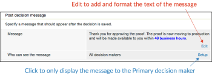

# Configurer les options de décision d’approbation dans [!DNL Workfront Proof]

>[!IMPORTANT]
>
>Cet article fait référence aux fonctionnalités du produit autonome [!DNL Workfront Proof]. Pour plus d’informations sur la relecture dans [!DNL Adobe Workfront], voir [Relecture](../../../review-and-approve-work/proofing/proofing.md).

En tant qu’administrateur ou administratrice [!DNL Workfront Proof] utilisant une formule d’édition Select ou Premium, vous pouvez configurer les options de décision d’approbation de la manière suivante pour toutes les épreuves créées par les utilisateurs et utilisatrices de [!DNL Workfront Proof] dans votre organisation :

* Modifier le nom de la décision
* Modifier l’ordre des décisions affichées dans la visionneuse de relecture
* Décider quelles décisions doivent être affichées

Cet article explique ce qui suit :

## Configurer les paramètres de décision

1. Cliquez sur **[!UICONTROL Paramètres du compte]**.
1. Ouvrez l’onglet **[!UICONTROL Décisions]**.
1. Effectuez l’une des modifications suivantes :

   * Pour masquer une décision, cliquez sur **[!UICONTROL Masquer]** à droite de la décision dont vous n’avez pas besoin.
   * Pour renommer une décision, cliquez sur le nom de la décision, modifiez-le, puis cliquez en dehors de la zone (ou appuyez sur Entrée). [!DNL Workfront Proof] met à jour le nom de la décision sur toutes les épreuves existantes dans votre système.

     >[!IMPORTANT]
     >
     >Conservez la logique d’une décision lorsque vous la renommez. Par exemple, la décision par défaut « Refusée » peut être modifiée en « Nouvelle version requise », mais elle ne doit pas être modifiée en « Envoyer aux imprimantes »).

     Si vous souhaitez revenir aux valeurs par défaut de [!DNL Workfront Proof], vous pouvez cliquer sur Restaurer les décisions par défaut.

>[!NOTE]
>
>* La logique qui sous-tend les décisions est utilisée pour calculer le statut général d’un workflow de relecture s’il y a plusieurs décisions de différents niveaux.
>* Les décisions « Approuvée » et « Approuvée avec des modifications » déclenchent l’étape suivante dans un workflow automatique.
>* Si vous renommez une décision et que vous souhaitez en vérifier la logique, vous pouvez cliquer sur **[!UICONTROL Activité]** dans le panneau de navigation de gauche et consulter votre journal d’activité où les décisions d’origine apparaissent entre parenthèses.
>
>  >

## Créer des motifs de décision

Les motifs de décision sont un bon moyen d’obtenir des informations supplémentaires sur une épreuve.

1. Cliquez sur **[!UICONTROL Paramètres]** > **[!UICONTROL Paramètres du compte]**.

1. Ouvrez l’onglet **[!UICONTROL Décisions]**.
Par défaut, les motifs sont accessibles à l’ensemble des personnes décisionnaires sur vos épreuves, mais vous pouvez les limiter aux principales personnes décisionnaires.
En fonction de vos besoins, vous pouvez autoriser la sélection de plusieurs motifs ou en faire une liste à choix unique. Vous pouvez également rendre les motifs obligatoires, ce qui signifie que les réviseurs et réviseuses devront choisir un motif avant de pouvoir enregistrer leur décision sur une épreuve.
   

1. Dans la section **[!UICONTROL Motifs]**, cliquez sur **[!UICONTROL Nouveau motif]**.
   

1. Saisissez un titre pour la section des motifs dans la zone qui apparaît sous **[!UICONTROL Motif]**.
1. Si vous souhaitez inclure une zone de texte, sélectionnez **[!UICONTROL Inclure une zone de texte]**.
1. Cliquer sur **[!UICONTROL Enregistrer]**.
   
L’étape la plus importante consiste à sélectionner les décisions sur lesquelles les motifs doivent s’afficher. Si vous oubliez de le faire, les motifs n’apparaîtront pas sur vos épreuves.

1. Cochez les cases de la colonne **[!UICONTROL Afficher les motifs]** dans la liste des décisions en haut de la page. Vous pouvez sélectionner une ou plusieurs décisions pour vos motifs.
   

## Créer un message post-décision

Vous pouvez créer un message post-décision qui s’affichera après que le réviseur ou la réviseuse a enregistré sa décision sur l’épreuve.

1. Cliquez sur **[!UICONTROL Paramètres]** > **[!UICONTROL Paramètres du compte]**.

1. Ouvrez l’onglet **[!UICONTROL Décisions]**.
1. Dans la section **[!UICONTROL Message post-décision]**, cliquez sur **[!UICONTROL Modifier]** à la fin de la ligne **[!UICONTROL Message]**.
Vous pouvez également décider d’afficher le message à l’ensemble des personnes décisionnaires ou de le limiter à la principale personne décisionnaire.
   

1. Dans la colonne **[!UICONTROL Afficher le message]**, indiquez les décisions sur lesquelles ce message doit être affiché.
Si vous ne sélectionnez pas au moins une décision, le message n’apparaîtra pas sur vos épreuves. Veillez à cocher au moins une case dans cette colonne.
   
