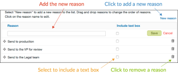

# Configuration des options de décision d’approbation dans [!DNL Workfront Proof]

>[!IMPORTANT]
>
>Cet article fait référence à la fonctionnalité du produit autonome [!DNL Workfront Proof]. Pour plus d&#39;informations sur la vérification à l&#39;intérieur de [!DNL Adobe Workfront], voir [Proofing](../../../review-and-approve-work/proofing/proofing.md).

En tant qu&#39;administrateur [!DNL Workfront Proof] utilisant un plan d&#39;édition Select ou Premium, vous pouvez configurer les options de décision d&#39;approbation comme suit pour tous les bons à tirer créés par les utilisateurs de [!DNL Workfront Proof] de votre entreprise :

* Modifier le nom de la décision
* Modifier l’ordre des décisions affichées dans la visionneuse de vérification
* Déterminer les décisions à afficher

Cet article explique ce qui suit :

## Configuration des paramètres de décision

1. Cliquez sur **[!UICONTROL Paramètres du compte]**.
1. Ouvrez l’onglet **[!UICONTROL Décisions]** .
1. Apportez l’une des modifications suivantes :

   * Pour masquer une décision, cliquez sur **[!UICONTROL Masquer]** à droite de la décision dont vous n’avez pas besoin.
   * Pour renommer une décision, cliquez sur son nom, modifiez-le, puis cliquez en dehors de la zone (ou appuyez sur Entrée). [!DNL Workfront Proof] met à jour le nom de la décision sur tous les bons à tirer existants de votre système.

     >[!IMPORTANT]
     >
     >Conservez la logique de décision lorsque vous la renommez. Par exemple, la décision par défaut &quot;Refusé&quot; peut être remplacée par &quot;Nouvelle version requise&quot;, mais ne doit pas être remplacée par &quot;Envoyer aux imprimantes&quot;).

     Si vous souhaitez revenir aux valeurs par défaut de [!DNL Workfront Proof], vous pouvez cliquer sur Restaurer les décisions par défaut.

>[!NOTE]
>
>* La logique sous-jacente aux décisions est utilisée pour calculer l’état global d’un workflow de BAT s’il existe plusieurs décisions de différents niveaux.
>* Les décisions &quot;Approuvé&quot; et &quot;Approuvé avec modifications&quot; déclenchent l’étape suivante dans un workflow automatique.
>* Si vous renommez une décision et que vous souhaitez vérifier la logique, vous pouvez cliquer sur **[!UICONTROL Activité]** dans le panneau de navigation de gauche et vérifier le journal d’activité où les décisions d’origine s’affichent entre crochets.
>
>  >

## Création de motifs de décision

Les raisons de décision sont un bon moyen de capturer des informations de décision supplémentaires sur un BAT.

1. Cliquez sur **[!UICONTROL Paramètres]** > **[!UICONTROL Paramètres du compte]**.

1. Ouvrez l’onglet **[!UICONTROL Décisions]** .
Par défaut, tous les décideurs disposent de motifs sur vos bons à tirer, mais vous pouvez les limiter uniquement aux décideurs Principal.
Selon vos besoins, vous pouvez sélectionner plusieurs raisons ou en faire une liste à choix unique. Vous pouvez également rendre les raisons obligatoires, ce qui signifie que les réviseurs devront choisir un motif avant d’être autorisés à enregistrer leur décision sur un BAT.
   

1. Dans la section **[!UICONTROL Raisons]** , cliquez sur **[!UICONTROL Nouvelle raison]**.
   

1. Saisissez un titre pour la section Raisons dans la zone qui s’affiche sous **[!UICONTROL Reason]**.
1. Si vous souhaitez inclure une zone de texte, sélectionnez **[!UICONTROL Inclure la zone de texte]**.
1. Cliquer sur **[!UICONTROL Enregistrer]**.
   
L’étape la plus importante consiste à sélectionner les décisions sur lesquelles les motifs doivent s’afficher. Si vous oubliez de le faire, les raisons ne s&#39;afficheront pas sur vos bons à tirer.

1. Cochez les cases de la colonne **[!UICONTROL Afficher les motifs]** dans la liste des décisions en haut de la page. Vous pouvez sélectionner une ou plusieurs décisions pour vos raisons.
   

## Création d’un message de décision Post

Vous pouvez créer un message de décision de publication à afficher après qu’un réviseur a enregistré sa décision sur le BAT.

1. Cliquez sur **[!UICONTROL Paramètres]** > **[!UICONTROL Paramètres du compte]**.

1. Ouvrez l’onglet **[!UICONTROL Décisions]** .
1. Dans la section **[!UICONTROL Message de décision Post]**, cliquez sur **[!UICONTROL Modifier]** à la fin de la ligne **[!UICONTROL Message]**.
Vous pouvez également décider si vous souhaitez que le message s’affiche pour tous les décideurs ou si vous souhaitez le limiter au décideur Principal.
   

1. Dans la colonne **[!UICONTROL Message d&#39;affichage]**, indiquez les décisions sur lesquelles ce message doit s&#39;afficher.
Si vous ne sélectionnez pas au moins une décision, le message ne s’affichera pas sur vos bons à tirer. Veillez à cocher au moins une case dans cette colonne.
   
