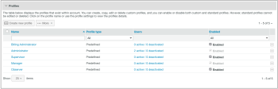

# Configurer des profils personnalisés dans [!DNL Workfront Proof]

>[!IMPORTANT]
>
>Cet article fait référence aux fonctionnalités du produit autonome [!DNL Workfront] Proof. Pour plus d’informations sur la relecture dans [!DNL Adobe Workfront], voir [Relecture](../../../review-and-approve-work/proofing/proofing.md).

En tant qu’administrateur ou administratrice de la facturation de [!DNL Workfront Proof] ou qu’administrateur ou administratrice de [!DNL Workfront Proof], vous pouvez configurer des profils personnalisés pour d’autres utilisateurs et utilisatrices.

Les profils personnalisés vous permettent d’accorder des autorisations granulaires aux utilisateurs et aux utilisatrices de votre compte et de définir leur niveau d’accès et leurs droits sur les éléments de votre compte. Pour plus d’informations sur les profils personnalisés, consultez la section [Créer et gérer des profils personnalisés à l’aide de  [!DNL Workfront Proof]](../../../workfront-proof/wp-mnguserscontacts/users/create-and-manage-custom-profiles.md).

Vous pouvez adapter la disposition de la page pour ne visualiser que les informations qui vous concernent :

* Vous pouvez régler le nombre d’éléments affichés (1).
* Vous pouvez filtrer la liste des profils pour repérer ceux avec lesquels vous souhaitez travailler (2).
* Vous pouvez facilement vérifier le nombre de profils que vous avez dans votre compte (3).\
   

## Onglet Profils

L’onglet [!UICONTROL Profils] vous permet d’ajouter et de gérer facilement des profils personnalisés. À partir de là, vous pouvez effectuer les actions suivantes :

* Ajouter un nouveau profil (1)
* Effectuer des actions en masse sur les profils :
* Supprimer plusieurs profils (2)
* Désactiver plusieurs profils (3)
* Activer plusieurs profils (4)
* Accéder aux détails des profils (5)
* Copier un profil (6)
* Désactiver un profil (7)

Pour plus d’informations sur la personnalisation de l’onglet des profils, consultez la section [Créer et gérer des profils personnalisés à l’aide de  [!DNL Workfront Proof]](../../../workfront-proof/wp-mnguserscontacts/users/create-and-manage-custom-profiles.md).

## Détails du profil

Sur la page des détails du profil, vous pouvez ajuster les autorisations activées pour votre profil personnalisé, le dupliquer, le supprimer et consulter la liste des utilisateurs et des utilisatrices à qui le profil a été affecté.

Pour plus d’informations sur les actions que vous pouvez effectuer sur cette page, consultez la section « [Créer et gérer des profils personnalisés à l’aide de  [!DNL Workfront Proof]](../../../workfront-proof/wp-mnguserscontacts/users/create-and-manage-custom-profiles.md) ».

* [Accéder à la page des détails du profil](#accessing-the-profile-details-page)
* [Afficher la liste des utilisateurs et des utilisatrices à qui un profil a été affecté.](#viewing-the-list-of-users-with-a-profile-assigned)

### Accéder à la page des détails du profil {#accessing-the-profile-details-page}

Pour accéder aux détails du profil :

1. Cliquez sur le nom du profil.
1. 

### Afficher la liste des utilisateurs et des utilisatrices à qui un profil a été affecté. {#viewing-the-list-of-users-with-a-profile-assigned}

Pour afficher la liste des utilisateurs et des utilisatrices à qui un profil spécifique a été affecté, procédez comme suit :

1. Cliquez sur le lien pour voir le nombre total de personnes actives et désactivées qui utilisent ce profil (1).
1. Cette liste peut également être affichée sur la page des détails du profil.
1. 

1. La liste vous indique le nombre total de personnes actives et désactivées de votre compte auxquelles le profil en question a été affecté. Si votre liste est trop longue, vous pouvez ajuster la disposition de la page pour ne visualiser que les informations que vous recherchez.
1. 
