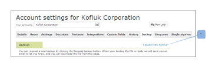

# Demander une nouvelle sauvegarde des données dans [!DNL Workfront Proof]

>[!IMPORTANT]
>
>Cet article fait référence aux fonctionnalités du produit autonome [!DNL Workfront Proof]. Pour plus d’informations sur la relecture dans [!DNL Adobe Workfront], voir [Relecture](../../../review-and-approve-work/proofing/proofing.md).

Après avoir demandé une sauvegarde des données de relecture, vous pouvez demander qu’une nouvelle sauvegarde des données soit créée. Pour plus d’informations sur les sauvegardes de données, consultez la section [Sauvegarder vos données  [!DNL Workfront Proof] &#x200B;](../../../workfront-proof/wp-work-proofsfiles/organize-your-work/back-up-data.md).

1. Dans le coin supérieur droit de la page, cliquez sur **[!UICONTROL Paramètres]**.
1. Cliquez sur **[!UICONTROL Paramètres du compte]** dans le menu déroulant, puis ouvrez l’onglet **[!UICONTROL Sauvegarde]**.

1. Cliquez sur **[!UICONTROL Demander une nouvelle sauvegarde]**.
   
Les données vous sont envoyées sous la forme d’un fichier zip.
